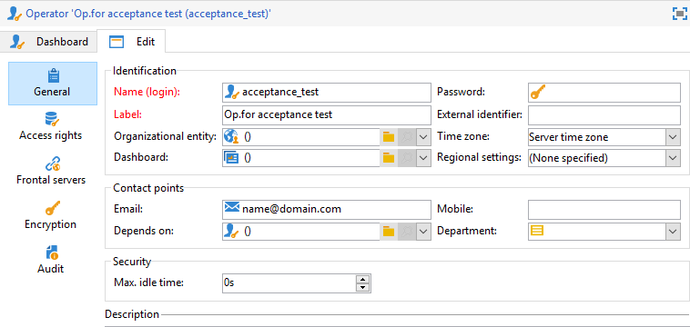

# Server di mid-sourcing{#mid-sourcing-server}


Questa sezione descrive l’installazione e la configurazione di un server di mid-sourcing, nonché la distribuzione di un’istanza che consente a terze parti di inviare messaggi in **mid-sourcing** modalità.

L’architettura &quot;mid-sourcing&quot; è presentata in [Distribuzione mid-sourcing](../../installation/using/mid-sourcing-deployment.md).

L’installazione di un server di mid-sourcing segue lo stesso processo che si segue per l’installazione normale di un server (consulta la configurazione standard). Si tratta di un’istanza indipendente con un proprio database che può essere utilizzato per eseguire le consegne. In breve, contiene una configurazione aggiuntiva per consentire alle istanze remote di eseguire le consegne attraverso di essa in modalità mid-sourcing.

>[!CAUTION]
>
>Una volta configurato il server di mid-sourcing e [sincronizzare i flussi di lavoro](../../workflow/using/about-technical-workflows.md) sono stati eseguiti per la prima volta, assicurati di non aggiornare il nome interno degli account esterni di mid-sourcing.

## Passaggi per installare e configurare un’istanza {#steps-for-installing-and-configuring-an-instance}

### Prerequisiti per l’installazione e la configurazione di un’istanza {#prerequisites-for-installing-and-configuring-an-instance}

* JDK sul server applicazioni.
* Accesso a un server di database nel server applicazioni.
* Firewall configurato per aprire le porte HTTP (80) o HTTPS (443) al server di mid-sourcing.

La procedura seguente descrive una configurazione che utilizza un singolo server di mid-sourcing. È inoltre possibile utilizzare più server. Allo stesso modo è anche possibile inviare determinati messaggi (ad esempio, notifiche del flusso di lavoro) da una configurazione interna.

### Installazione e configurazione del server applicazioni per la distribuzione mid-sourcing {#installing-and-configuring-the-application-server-for-mid-sourcing-deployment}

La procedura di installazione è identica a quella dell&#39;istanza autonoma. Fai riferimento a [Installazione e configurazione (singolo computer)](../../installation/using/standalone-deployment.md#installing-and-configuring--single-machine-).

Tuttavia, è necessario applicare quanto segue:

* Al passaggio **5**, è necessario disattivare **mta** (consegna) e **inMail** (messaggi non recapitati). Il **wfserver** (flusso di lavoro), tuttavia, deve rimanere attivato.

  ```
  <?xml version='1.0'?>
  <serverconf>  
    <shared>    
      <!-- add lang="eng" to dataStore to force English for the instance -->    
      <dataStore hosts="console.campaign.net*">      
        <mapping logical="*" physical="default"/>    
      </dataStore>  </shared>  
      <mta autoStart="false"/>  
      <wfserver autoStart="true"/>  
      <inMail autoStart="false"/>  
      <sms autoStart="false"/>  
      <listProtect autoStart="false"/>
  </serverconf>
  ```

  Per ulteriori informazioni al riguardo, consulta [questa sezione](../../installation/using/configuring-campaign-server.md#enabling-processes).

* Passaggi **6**, **9** e **10** non sono necessarie.
* Durante le fasi **12** e **13**, è necessario indicare la porta 8080 nell’URL della connessione (poiché la console comunica direttamente con Tomcat, non tramite il server Web). L’URL diventa `http://console.campaign.net:8080`. Durante il passaggio **13**, seleziona la **[!UICONTROL Issue towards Mid-sourcing]** e quelli da installare.

  

  >[!CAUTION]
  >
  >Il routing predefinito delle consegne tecniche viene sostituito automaticamente con il routing delle e-mail tramite mid-sourcing.

### Installazione e configurazione del server di mid-sourcing {#installing-and-configuring-the-mid-sourcing-server}

Dalla console del client, individua **Indirizzamento e-mail tramite mid-sourcing** account di mid-sourcing (nel **/Administration/External accounts/** cartella ). Popolare il **URL del server**, **account**, **password** e **URL pagina mirror** impostazioni con le informazioni fornite dal provider del server che ospita il server di mid-sourcing. Verifica la connessione.

>[!NOTE]
>
>Il **mid-sourcingEmitter** l&#39;opzione crea due **Mid-sourcing** flussi di lavoro. Si tratta di un processo che viene eseguito per impostazione predefinita ogni 1 ora e 20 minuti e raccoglie informazioni sulla consegna sul server di mid-sourcing.

## Distribuzione di un server di mid-sourcing {#deploying-a-mid-sourcing-server}

1. Installazione del server applicazioni:

   >[!CAUTION]
   >
   >Se installi il server di mid-sourcing e desideri installare moduli Adobe Campaign aggiuntivi, ti consigliamo di utilizzare il modulo Delivery e non il modulo Campaign.

   Segui la stessa procedura della distribuzione standard, selezionando solo il **[!UICONTROL Mid-sourcing platform]** opzione.

   

1. Configurazione per la ricezione in modalità mid-sourcing

   Impostare la password dell&#39;account di invio: **/Mid-sourcing/Gestione degli accessi/Operatori/** cartella, la **mid** L’operatore viene utilizzato dall’istanza remota per l’invio in modalità mid-sourcing. È necessario impostare una password per questo operatore e assegnarla all&#39;amministratore dell&#39;istanza di invio.

   Il **Piattaforma di mid-sourcing** crea le cartelle predefinite per l’archiviazione delle consegne inviate e l’operatore predefinito che esegue gli invii.

## Multiplexing del server di mid-sourcing {#multiplexing-the-mid-sourcing-server}

>[!CAUTION]
>
>Il multiplexing è supportato solo per gli ambienti on-premise.

È possibile che un’istanza di mid-sourcing sia condivisa da più istanze di invio. Ognuna di queste istanze deve essere associata a un operatore nel database di mid-sourcing. Per creare un secondo account sul server di mid-sourcing:

1. Creare una cartella in **[!UICONTROL Mid-sourcing > Deliveries]** che sarà associato all’account di mid-sourcing predefinito (ad esempio: prod).
1. Creare una cartella in **[!UICONTROL Mid-sourcing > Deliveries]** con lo stesso nome dell’account (ad esempio: accept_test).

   

1. In entrata **[!UICONTROL Mid-sourcing > Access Management > Operators]**, crea un nuovo account.

   

1. In **[!UICONTROL Access rights]** , assegna a questo operatore i diritti del **Invii di mid-sourcing** gruppo. Questo diritto di accesso è disponibile in **[!UICONTROL Mid-sourcing > Access Management > Operator groups]**.

   

1. Seleziona la **[!UICONTROL Restrict to data in the sub-folders of]** e seleziona la cartella consegne per limitare questo operatore alla cartella consegne mid-sourcing.

   

1. Riavviare il modulo Web utilizzando il comando seguente: **nlserver riavvia Web**.

È necessario modificare l&#39;impostazione del server di mid-sourcing nel file serverConf.xml. La riga seguente deve essere aggiunta alla sezione &quot;Gestione delle affinità con gli indirizzi IP&quot;, nella riga esistente:

```
<IPAffinity IPMask="" localDomain="" name=""/>
```

L’attributo &quot;@name&quot; deve rispettare le regole seguenti:

**&#39;marketing_account_operator_name&#39;.&#39;affinity_name&#39;.&#39;gruppo_affinità&#39;**

&quot;marketing_account_operator_name&quot; si riferisce al nome interno dell’account di mid-sourcing dichiarato nell’istanza di mid-sourcing.

&#39;affinity_name&#39; fa riferimento al nome arbitrario assegnato all&#39;affinità. Questo nome deve essere univoco. I caratteri autorizzati sono `[a-z]``[A-Z]``[0-9]`. L&#39;obiettivo è dichiarare un gruppo di indirizzi IP pubblici.

&#39;affinity_group&#39; mette in relazione la sub-affinità dichiarata nella mappatura di destinazione utilizzata in ciascuna consegna. L’ultima parte include &quot;.&quot; viene ignorato se non è presente alcuna sub-affinità. I caratteri autorizzati sono `[a-z]``[A-Z]``[0-9]`.

È necessario arrestare e quindi riavviare il server affinché la modifica possa essere presa in considerazione.

## Configurazione del tracciamento su un server di mid-sourcing {#configuring-tracking-on-a-mid-sourcing-server}

**Configurazione del server di mid-sourcing**

1. Vai a &quot;operatori&quot; e seleziona l’operatore **[!UICONTROL mid]**.
1. In **[!UICONTROL Frontal servers]** , immettere i parametri di connessione al server di tracciamento.

   Per creare un’istanza di tracciamento, immetti l’URL del server di tracciamento, la password dell’account interno del server di tracciamento e il nome dell’istanza, la password e le maschere DNS associate.

   

1. Dopo aver immesso i parametri di connessione, fare clic su **[!UICONTROL Confirm the configuration]**.
1. Se necessario, specifica il percorso in cui devono essere memorizzate le immagini contenute nelle consegne. A questo scopo, seleziona una delle modalità di pubblicazione dall’elenco a discesa.

   

   Se si sceglie **[!UICONTROL Tracking server(s)]** , le immagini verranno copiate sul server di mid-sourcing.

**Configurazione della piattaforma del cliente**

1. Passa all’account di routing di mid-sourcing esterno.
1. In **[!UICONTROL Mid-Sourcing]** , specifica i parametri di connessione al server di mid-sourcing.

   

1. Conferma la configurazione facendo clic su **[!UICONTROL Test the connection]**.
1. Dichiara l’istanza di tracciamento a cui si fa riferimento nel server di mid-sourcing:

   Fai clic sul collegamento **[!UICONTROL Use this platform as a proxy to access the tracking servers]**,

   Specifica il nome dell&#39;istanza di tracciamento, quindi conferma la connessione con il server di tracciamento.

   

Se la consegna dei messaggi deve essere gestita da più server di mid-sourcing, seleziona l’opzione **[!UICONTROL Routing with alternating mid-sourcing accounts]** e specificare i diversi server.


