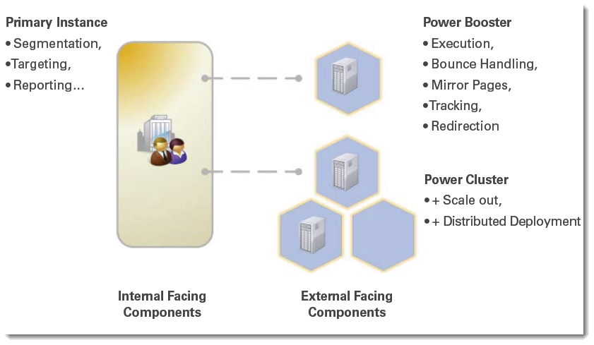

# Power Booster e Power Cluster{#power-booster-and-power-cluster}

## Panoramica {#overview}

Adobe Campaign offre due set di opzioni architetturali preconfigurate per la quotatura della distribuzione:

* **Power Booster**

  Questa opzione fornisce il supporto per una singola istanza di esecuzione aggiuntiva separata dall’istanza dell’applicazione Adobe Campaign principale. Le istanze di esecuzione dedicate possono essere ospitate in remoto o da una terza parte. Quando implementati, l’esecuzione e-mail, il tracciamento, le pagine mirror e i messaggi non recapitati vengono gestiti indipendentemente dalle funzioni centrali dell’applicazione.

* **Power Cluster**

  Questa opzione fornisce il supporto per 2 a N istanze di esecuzione in cluster disaccoppiate dall’istanza dell’applicazione Adobe Campaign principale in relazione a una determinata applicazione. I cluster possono essere ospitati in remoto, in implementazioni distribuite e da terze parti. Oltre ai vantaggi dell&#39;isolamento dei processi, l&#39;opzione Adobe Campaign Power Cluster consente la ridondanza e l&#39;espansione delle strategie utilizzando hardware di base per una più semplice evoluzione degli SLA o delle prestazioni.

## Domande ammissibili {#eligible-applications}

Le opzioni Power Booster e Power Cluster possono essere utilizzate dalle seguenti applicazioni:

* Campaign
* Consegna
* Centro messaggi

## Matrice di consigli per l&#39;architettura {#matrix-of-architectural-recommendations}

<table> 
 <tbody> 
  <tr> 
   <td> </td> 
   <td> <strong>Architettura standard</strong>  </td> 
   <td> <strong>Power Booster</strong>  </td> 
   <td> <strong>Power Cluster</strong>  </td> 
  </tr> 
  <tr> 
   <td> Campagne e interazioni in uscita  </td> 
   <td> Fino a circa 30 milioni di e-mail al mese  </td> 
   <td> Da 30 a 100 milioni di e-mail al mese  </td> 
   <td> Oltre 100 milioni di e-mail al mese  </td> 
  </tr> 
  <tr> 
   <td> Messaggi transazionali  </td> 
   <td> 50.000 all'ora per server di esecuzione  </td> 
   <td> 50.000 all'ora per server di esecuzione  </td> 
   <td> 50.000 all'ora per server di esecuzione  </td> 
  </tr> 
  <tr> 
   <td> Disponibilità  </td> 
   <td> Quello del database primario  </td> 
   <td> 24 ore su 24, 7 giorni su 7, ad eccezione delle finestre di manutenzione e dei tempi di inattività per l’istanza di esecuzione  </td> 
   <td> 24/7/365 servizio possibile  </td> 
  </tr> 
  <tr> 
   <td> Sicurezza  </td> 
   <td> Data mart è potenzialmente accessibile da Internet pubblico  </td> 
   <td> Data mart è isolato da componenti frontali, rivolti a Internet  </td> 
   <td> Data mart è isolato da componenti frontali, rivolti a Internet  </td> 
  </tr> 
  <tr> 
   <td> Modello di distribuzione  </td> 
   <td> Tutto su un sito (può essere on-premise o nel cloud)  </td> 
   <td> Marketing on premise con esecuzione nel cloud possibile  </td> 
   <td> Marketing on-premise con esecuzione nel cloud; esecuzione in aree geografiche diverse possibile  </td> 
  </tr> 
 </tbody> 
</table>

## Raccomandazioni {#recommendations}

* Un’istanza di esecuzione deve essere dedicata a un servizio. Non puoi installare un pacchetto per un servizio al quale non ti sei iscritto. Ad esempio, se ti abboni a **Power Booster** opzione per **Centro messaggi** , è possibile installare solo il **[!UICONTROL Execution of transactional messages]** sull’istanza di esecuzione dedicata. Controlla il contratto di licenza.
* Poiché le istanze dedicate (o cluster) sono istanze di Adobe Campaign, i consigli sono gli stessi di un’istanza principale. Per ulteriori informazioni, consulta [questo documento](../../production/using/foreword.md).
* Per configurare correttamente l’istanza dal punto di vista di un database o di componenti hardware, contatta Adobe Campaign Professional Services.
