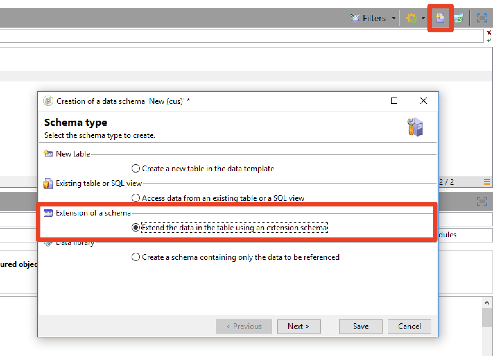

# Privacy {#privacy}


## Richieste sulla privacy

 Adobe Campaign offre una serie di strumenti per aiutarti con la conformità in materia di privacy in relazione a GDPR e CCPA.

Fai riferimento a [questa pagina](../../platform/using/privacy-management.md) per informazioni generali su cosa si intende per gestione della privacy e sui passaggi di implementazione in Adobe Campaign. Troverai inoltre le best practice e una panoramica del processo utente e dei singoli utenti.

## Personalizzazione URL {#url-personalization}

Quando aggiungi collegamenti personalizzati al contenuto, evita sempre di avere alcuna personalizzazione nella parte dell’URL relativa al nome host per evitare potenziali lacune nella sicurezza. Gli esempi seguenti non devono mai essere utilizzati in tutti gli attributi URL &lt;`a href="">` o ``:

* `<%= url >`
* `https://<%= url >`
* `https://<%= domain >/path`
* `https://<%= sub-domain >.domain.tld/path`
* `https://sub.domain<%= main domain %>/path`

### Consiglio

Per convalidare e verificare di non utilizzare quanto sopra, esegui una query sulla tabella URL di tracciamento tramite [Editor query generico di Campaign](../../platform/using/steps-to-create-a-query.md) o creare un flusso di lavoro con i criteri di filtro nella [attività query](../../workflow/using/query.md).

Esempio:

1. Creare un flusso di lavoro e aggiungere un **Query** attività. [Ulteriori informazioni](../../workflow/using/query.md).

1. Apri **Query** e crea un filtro per `nmsTrackingUrl` tabella come segue:

   `source URL starts with http://<% or source URL starts with https://<%`

1. Esegui il flusso di lavoro e controlla se ci sono dei risultati.

1. In tal caso, apri la transizione di output per visualizzare l’elenco degli URL.

   


### Firma URL

Per migliorare la sicurezza, è stato introdotto un meccanismo di firma per il tracciamento dei collegamenti nelle e-mail. È disponibile a partire dalle build 19.1.4 (9032@3a9dc9c) e 20.2. Questa funzione è abilitata per impostazione predefinita.

>[!NOTE]
>
>Quando si fa clic su un URL firmato non valido, viene restituito questo errore: `Requested URL '…' was not found.`

Inoltre, puoi utilizzare un miglioramento per disabilitare gli URL generati nelle build precedenti. Questa funzione è disabilitata per impostazione predefinita. Puoi rivolgerti a [Assistenza clienti](https://helpx.adobe.com/it/enterprise/admin-guide.html/enterprise/using/support-for-experience-cloud.ug.html) per abilitare questa funzione.

Se utilizzi la build 19.1.4, potrebbero verificarsi problemi con le consegne di notifiche push che utilizzano collegamenti di tracciamento o con le consegne che utilizzano tag di ancoraggio. In tal caso, si consiglia di disabilitare la firma URL.

In qualità di cliente ospitato, Cloud Services gestito o ibrido di Campaign, devi contattare [Assistenza clienti](https://helpx.adobe.com/it/enterprise/using/support-for-experience-cloud.html) per disattivare la firma URL.

Se esegui Campaign in un’architettura ibrida, prima di abilitare la firma URL, assicurati che l’istanza di mid-sourcing in hosting sia stata aggiornata come segue:

* Prima l’istanza di marketing on-premise
* Quindi effettua l’aggiornamento alla stessa versione dell’istanza di marketing on-premise o a una versione leggermente superiore

In caso contrario, potrebbero verificarsi alcuni di questi problemi:

* Prima dell’aggiornamento dell’istanza di mid-sourcing , gli URL vengono inviati senza firma tramite questa istanza.
* Dopo l’aggiornamento dell’istanza di mid-sourcing e l’abilitazione della firma URL in entrambe le istanze, gli URL precedentemente inviati senza firma vengono rifiutati. Il motivo è che i file di tracciamento forniti dall’istanza di marketing richiedono una firma.

Per disabilitare gli URL generati nelle build precedenti, segui questi passaggi su tutti i server Campaign allo stesso tempo:

1. Nel file di configurazione del server (`serverConf.xml`), modifica il **blockRedirectForUnsignedTrackingLink** opzione per **true**.
1. Riavvia `nlserver` servizio.
1. Sulla `tracking` server, riavviare `web` server (apache2 su Debian, httpd su CentOS/RedHat, IIS su Windows).

Per abilitare la firma URL, segui questi passaggi su tutti i server Campaign contemporaneamente:

1. Nel file di configurazione del server (`serverConf.xml`), modifica **signEmailLinks** a **true**.
1. Riavvia **nlserver** servizio.
1. Sulla `tracking` server, riavviare `web` server (apache2 su Debian, httpd su CentOS/RedHat, IIS su Windows).

## Restrizione dei dati

È necessario assicurarsi che le password crittografate non siano accessibili da un utente autenticato con privilegi bassi. A questo scopo, limita l’accesso solo ai campi password o all’intera entità (è necessaria una build >= 8770).

Questa limitazione consente di rimuovere i campi password, ma consente all’account esterno di essere accessibile dall’interfaccia per tutti gli utenti. [Ulteriori informazioni](../../configuration/using/restricting-pii-view.md).

Per eseguire questa operazione, effettua le seguenti operazioni:

1. Sfoglia il **[!UICONTROL Administration]** > **[!UICONTROL Configuration]** > **[!UICONTROL Data schemas]** cartella di Campaign explorer.

1. Creare uno schema dati come **[!UICONTROL Extension of a schema]**.

   

1. Scegli **[!UICONTROL External Account]** (extAccount).

1. Nell&#39;ultima schermata della procedura guidata, modifica il nuovo &#39;srcSchema&#39; per limitare l&#39;accesso a tutti i campi password:

   Puoi sostituire l’elemento principale (`<element name="extAccount" ... >`) da:

   ```sql
   <element name="extAccount">
       <attribute accessibleIf="$(loginId) = 0 or $(login) = 'admin'" name="password"/>
       <attribute accessibleIf="$(loginId) = 0 or $(login) = 'admin'" name="clientSecret"/>
   
       <element name="s3Account">
           <attribute accessibleIf="$(loginId) = 0 or $(login) = 'admin'" name="awsSecret"/>
       </element>
       <element name="wapPush">
           <attribute accessibleIf="$(loginId) = 0 or $(login) = 'admin'" name="password"/>
           <attribute accessibleIf="$(loginId) = 0 or $(login) = 'admin'" name="clientSecret"/>
       </element>
       <element name="mms">
           <attribute accessibleIf="$(loginId) = 0 or $(login) = 'admin'" name="password"/>
           <attribute accessibleIf="$(loginId) = 0 or $(login) = 'admin'" name="clientSecret"/>
       </element>
   </element>
   ```

   Il tuo srcSchema esteso può avere un aspetto simile a:

   ```sql
   <srcSchema _cs="External Accounts (cus)" created="2017-05-12 07:53:49.691Z" createdBy-id="0"
               desc="Definition of external accounts (Email, SMS...) used by the modules"
               entitySchema="xtk:srcSchema" extendedSchema="nms:extAccount" img="" label="External Accounts"
               labelSingular="External account" lastModified="2017-05-12 08:33:49.365Z"
               mappingType="sql" md5="E9BB0CD6A4375F500027C86EA854E101" modifiedBy-id="0"
               name="extAccount" namespace="cus" xtkschema="xtk:srcSchema">
       <createdBy _cs="Administrator (admin)"/>
       <modifiedBy _cs="Administrator (admin)"/>
       <element name="extAccount">
           <attribute accessibleIf="$(loginId) = 0 or $(login) = 'admin'" name="password"/>
           <attribute accessibleIf="$(loginId) = 0 or $(login) = 'admin'" name="clientSecret"/>
   
           <element name="s3Account">
               <attribute accessibleIf="$(loginId) = 0 or $(login) = 'admin'" name="awsSecret"/>
           </element>
           <element name="wapPush">
               <attribute accessibleIf="$(loginId) = 0 or $(login) = 'admin'" name="password"/>
               <attribute accessibleIf="$(loginId) = 0 or $(login) = 'admin'" name="clientSecret"/>
           </element>
           <element name="mms">
               <attribute accessibleIf="$(loginId) = 0 or $(login) = 'admin'" name="password"/>
               <attribute accessibleIf="$(loginId) = 0 or $(login) = 'admin'" name="clientSecret"/>
           </element>
       </element>
   </srcSchema>    
   ```

   >[!NOTE]
   >
   >È possibile sostituire `$(loginId) = 0 or $(login) = 'admin'` con `hasNamedRight('admin')` per consentire a tutti gli utenti con diritti di amministratore di visualizzare queste password.

## Pagine Protect con PI

Consigliamo vivamente ai clienti on-premise di proteggere le pagine che potrebbero contenere informazioni personali (PI) come pagine mirror, applicazioni web, ecc.

L&#39;obiettivo di questa procedura è evitare l&#39;indicizzazione di queste pagine, evitando così un potenziale rischio per la sicurezza. Ecco alcuni articoli utili:

* [https://developers.google.com/search/reference/robots_txt](https://developers.google.com/search/reference/robots_txt)
* [https://developers.google.com/search/reference/robots_meta_tag](https://developers.google.com/search/reference/robots_meta_tag)

Per proteggere le pagine, effettua le seguenti operazioni:

1. Aggiungi un `robots.txt` nella directory principale del server web (Apache o IIS). Ecco il contenuto del file:

   ```sql
   # Make changes for all web spiders
   User-agent:
   *Disallow: /
   ```

   Per IIS, consulta [questa pagina](https://docs.microsoft.com/en-us/iis/extensions/iis-search-engine-optimization-toolkit/managing-robotstxt-and-sitemap-files).

   Per Apache, puoi inserire il file in **/var/www/robots.txt** (Debian).

1. A volte è possibile aggiungere un **robots.txt** file non sufficiente in termini di sicurezza. Ad esempio, se un altro sito web contiene un collegamento alla pagina, potrebbe essere visualizzato in un risultato della ricerca.

   Oltre al **robots.txt** è consigliabile aggiungere un **X-Robots-Tag** intestazione. Puoi farlo in Apache o IIS e nella **serverConf.xml** file di configurazione.

   Per ulteriori informazioni, consulta [articolo](https://developers.google.com/search/reference/robots_meta_tag).
