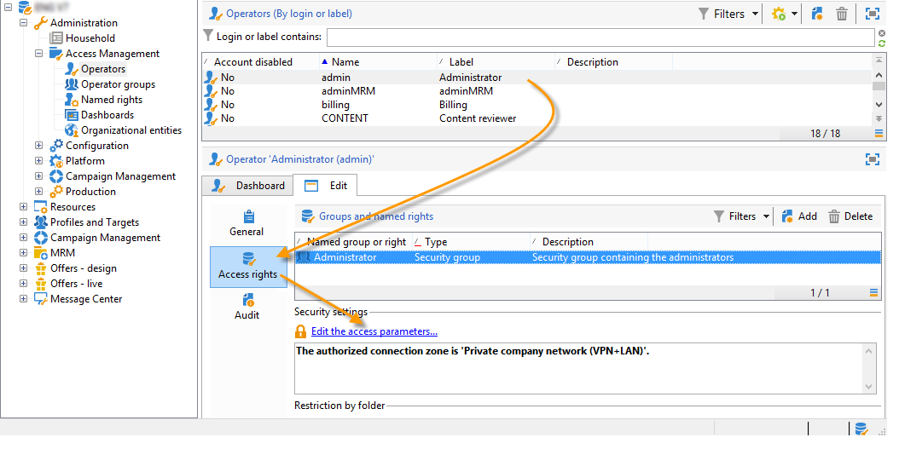

# Definire le aree di sicurezza (on-premise){#defining-security-zones}


Ogni operatore deve essere collegato a una zona per accedere a un&#39;istanza e l&#39;IP dell&#39;operatore deve essere incluso negli indirizzi o nei set di indirizzi definiti nell&#39;area di sicurezza. La configurazione dell’area di sicurezza viene eseguita nel file di configurazione del server Adobe Campaign.

Gli operatori sono collegati a un&#39;area di sicurezza dal relativo profilo nella console, accessibile nel nodo **[!UICONTROL Administration > Access management > Operators]**. [Ulteriori informazioni](#linking-a-security-zone-to-an-operator).

>[!NOTE]
>
>Questa procedura è limitata a **distribuzioni locali**.
>
>In qualità di cliente **hosted**, se puoi accedere a [Pannello di controllo Campaign Campaign](https://experienceleague.adobe.com/docs/control-panel/using/control-panel-home.html?lang=it), puoi utilizzare l&#39;interfaccia self-service dell&#39;area di sicurezza. [Ulteriori informazioni](https://experienceleague.adobe.com/docs/control-panel/using/instances-settings/ip-allow-listing-instance-access.html?lang=it)
>
>Altri clienti **ibridi/ospitati** devono contattare il team di supporto Adobe per aggiungere l&#39;IP al inserisco nell&#39;elenco Consentiti di.
>

## Creare aree di protezione {#creating-security-zones}

Una zona è definita da:

* uno o più intervalli di indirizzi IP (IPv4 e IPv6)
* un nome tecnico associato a ciascun intervallo di indirizzi IP

Le aree di protezione sono interbloccate, il che significa che la definizione di una nuova zona all&#39;interno di un&#39;altra riduce il numero di operatori che possono accedere a tale zona, aumentando al contempo i diritti assegnati a ciascun operatore.

Le zone devono essere definite durante la configurazione del server nel file **serverConf.xml**. Tutti i parametri disponibili in **serverConf.xml** sono elencati in [questa sezione](../../installation/using/the-server-configuration-file.md).

Ogni zona definisce i diritti, ad esempio:

* Connessione HTTP anziché HTTPS
* Visualizzazione degli errori (errori Java, JavaScript, C++, ecc.)
* Anteprima report e WebApp
* Autenticazione tramite login/password
* Modalità di connessione non sicura

>[!NOTE]
>
>**Ogni operatore deve essere collegato a una zona**. Se l’indirizzo IP dell’operatore appartiene all’intervallo definito dalla zona, l’operatore può accedere all’istanza.\
>L&#39;indirizzo IP dell&#39;operatore può essere definito in diverse zone. In questo caso, l&#39;operatore riceve il **set** dei diritti disponibili per ogni zona.

Il file predefinito **serverConf.xml** include tre aree: **public, VPN e LAN**.

>[!NOTE]
>
>**La configurazione predefinita è sicura**. Tuttavia, prima di eseguire la migrazione da una versione precedente di Adobe Campaign, potrebbe essere necessario ridurre temporaneamente la sicurezza per migrare e approvare le nuove regole.

Esempio di come definire una zona nel file **serverConf.xml**:

```
<securityZone allowDebug="false" allowHTTP="false" label="Public Network" name="public">
<subNetwork label="All addresses" mask="*" name="all"/>

<securityZone allowDebug="true" allowHTTP="false" label="Private Network (VPN)"
              name="vpn" showErrors="true">

  <securityZone allowDebug="true" allowEmptyPassword="true" allowHTTP="true"
                allowUserPassword="false" label="Private Network (LAN)" name="lan"
                sessionTokenOnly="true" showErrors="true">
    <subNetwork label="Lan 1" mask="192.168.0.0/16" name="lan1"/>
    <subNetwork label="Lan 2" mask="172.16.0.0/12" name="lan2"/>
    <subNetwork label="Lan 3" mask="10.0.0.0/8" name="lan3"/>
    <subNetwork label="Localhost" mask="127.0.0.1/16" name="locahost"/>
    <subNetwork label="Lan (IPv6)" mask="fc00::/7" name="lan6"/>
    <subNetwork label="Localhost (IPv6)" mask="::1/128" name="localhost6"/>
  </securityZone>

</securityZone>
</securityZone>
```

Tutti i diritti che definiscono una zona sono i seguenti:

* **allowDebug**: consente l&#39;esecuzione di un WebApp in modalità &quot;debug&quot;
* **allowEmptyPassword**: autorizza una connessione a un&#39;istanza senza password
* **allowHTTP**: è possibile creare una sessione senza utilizzare il protocollo HTTPS
* **allowUserPassword**: il token di sessione può avere il seguente formato: &quot;`<login>/<password>`&quot;
* **sessionTokenOnly**: il token di sicurezza non è richiesto nell&#39;URL della connessione
* **showErrors**: gli errori sul lato server vengono inoltrati e visualizzati

>[!IMPORTANT]
>
>In una definizione di zona, ogni attributo con il valore **true** riduce la sicurezza.

Quando si utilizza il Centro messaggi, se sono presenti più istanze di esecuzione, è necessario creare un&#39;area di sicurezza aggiuntiva con l&#39;attributo **sessionTokenOnly** definito come **true**, in cui devono essere aggiunti solo gli indirizzi IP necessari. Per ulteriori informazioni sulla configurazione delle istanze, consulta [questo documento](../../message-center/using/configuring-instances.md).

## Best practice per le aree di protezione {#best-practices-for-security-zones}

Nella definizione dell&#39;area di protezione **lan** è possibile aggiungere una maschera di indirizzo IP che definisca l&#39;accesso tecnico. L’aggiunta consentirà l’accesso a tutte le istanze ospitate sul server.

```
<securityZone allowDebug="true" allowEmptyPassword="false" allowHTTP="true"
                    allowUserPassword="false" label="Private Network (LAN)" name="lan"
                    sessionTokenOnly="true" showErrors="true">
        <subNetwork label="Lan 1" mask="192.168.0.0/16" name="lan1"/>
        <subNetwork label="Lan 2" mask="172.16.0.0/12" name="lan2"/>
        <subNetwork label="Lan 3" mask="10.0.0.0/8" name="lan3"/>
        <subNetwork label="Localhost" mask="127.0.0.1/16" name="locahost"/>
        <subNetwork label="Lan (IPv6)" mask="fc00::/7" name="lan6"/>
        <subNetwork label="Localhost (IPv6)" mask="::1/128" name="localhost6"/>
  
        <!-- Customer internal IPs -->
        <subNetwork id="internalNetwork" mask="a.b.c.d/xx"/>

      </securityZone>
```

Per gli operatori che accedono solo a un’istanza specifica, è consigliabile definire gli intervalli di indirizzi IP direttamente nel file di configurazione dedicato all’istanza.

Nel file **`config-<instance>.xml`**:

```
  <securityZone name="public">
   ...
    <securityZone name="vpn">
      <subNetwork id="cus1" mask="a.b.c.d/xx"/>
```

## Sottoreti e proxy in un&#39;area di sicurezza {#sub-networks-and-proxies-in-a-security-zone}

Il parametro **proxy** può essere utilizzato in un elemento **subNetwork** per specificare l&#39;utilizzo del proxy in un&#39;area di sicurezza.

Quando si fa riferimento a un proxy e una connessione entra tramite questo proxy (visibile tramite l’intestazione HTTP X-Forwarded-For ), la zona verificata è quella dei client del proxy e non quella del proxy.

>[!IMPORTANT]
>
>Se un proxy è configurato ed è possibile sostituirlo (o se non esiste), l’indirizzo IP che verrà testato potrà essere falsificato.
>
>Inoltre, ora vengono generati relè come proxy. È quindi possibile aggiungere l&#39;indirizzo IP 127.0.0.1 all&#39;elenco dei proxy nella configurazione dell&#39;area di sicurezza.
>
>Esempio: &quot; `<subnetwork label="Lan 1" mask="192.168.0.0/16" name="lan1" proxy="127.0.0.1,10.100.2.135" />`&quot;.

Possono verificarsi vari casi:

* Nell’area di sicurezza viene fatto riferimento direttamente a una sottorete e non è configurato alcun proxy: gli utenti della sottorete possono connettersi direttamente al server Adobe Campaign.

  

* È specificato un proxy per una sottorete nell&#39;area di sicurezza: gli utenti di questa sottorete possono accedere al server Adobe Campaign tramite questo proxy.

  

* Un proxy è incluso in una sottorete dell’area di sicurezza: gli utenti che hanno accesso tramite questo proxy, indipendentemente dalla loro origine, possono accedere al server Adobe Campaign.

  

Gli indirizzi IP dei proxy che probabilmente accederanno al server Adobe Campaign devono essere immessi sia nella **`<subnetwork>`** interessata che nella sottorete di primo livello **`<subnetwork name="all"/>`**. Ad esempio, qui per un proxy il cui indirizzo IP è 10.131.146.102:

```
<securityZone allowDebug="false" allowHTTP="false" label="Public Network" 
                      name="public">
    <subNetwork label="All addresses" mask="*" name="all"
                      proxy="10.131.146.102,127.0.0.1, ::1"/>

    <securityZone allowDebug="true" allowHTTP="false" label="Private Network (VPN)" 
                      name="vpn" showErrors="true">
        <securityZone allowDebug="true" allowEmptyPassword="false" allowHTTP="true" 
                      allowUserPassword="false" label="Private Network (LAN)" 
                      name="lan" sessionTokenOnly="true" showErrors="true">
            <subNetwork label="Lan proxy" mask="10.131.193.182" name="lan3" 
                      proxy="10.131.146.102,127.0.0.1, ::1"/>
            <subNetwork label="Lan 1" mask="192.168.0.0/16" name="lan1" 
                      proxy="127.0.0.1, ::1"/>

        </securityZone>
    </securityZone>
</securityZone>
```

## Collegare un’area di sicurezza a un operatore {#linking-a-security-zone-to-an-operator}

Una volta definite le zone, ogni operatore deve essere collegato a uno di essi per poter accedere a un’istanza e l’indirizzo IP dell’operatore deve essere incluso negli indirizzi o nell’intervallo di indirizzi a cui si fa riferimento nella zona.

La configurazione tecnica delle zone viene eseguita nel file di configurazione del server Campaign: **serverConf.xml**.

Prima di ciò, è necessario iniziare configurando l&#39;enumerazione predefinita **[!UICONTROL Security zone]** per collegare un&#39;etichetta al nome interno della zona definita nel file **serverConf.xml**.

Questa configurazione viene eseguita in Esplora campagne:

1. Fare clic sul nodo **[!UICONTROL Administration > Platform > Enumerations]**.
1. Selezionare l&#39;enumerazione di sistema **[!UICONTROL Security zone (securityZone)]**.

   

1. Per ogni area di sicurezza definita nel file di configurazione del server, fare clic sul pulsante **[!UICONTROL Add]**.
1. Nel campo **[!UICONTROL Internal name]** immettere il nome della zona definita nel file **serverConf.xml**. Corrisponde all&#39;attributo **@name** dell&#39;elemento `<securityzone>` Immetti l&#39;etichetta collegata al nome interno nel campo **Etichetta**.

   

1. Fare clic su OK e salvare le modifiche.

Una volta definite le zone e configurata l&#39;enumerazione **[!UICONTROL Security zone]**, è necessario collegare ogni operatore a un&#39;area di sicurezza:

1. Fare clic sul nodo **[!UICONTROL Administration > Access management > Operators]**.
1. Selezionare l&#39;operatore a cui si desidera collegare un&#39;area di protezione e fare clic sulla scheda **[!UICONTROL Edit]**.
1. Passare alla scheda **[!UICONTROL Access rights]** e fare clic sul collegamento **[!UICONTROL Edit access parameters...]**.

   

1. Selezionare una zona dall&#39;elenco a discesa **[!UICONTROL Authorized connection zone]**

   

1. Fare clic su **[!UICONTROL OK]** e salvare le modifiche per applicarle.


## Raccomandazioni

* Verificare che il proxy inverso non sia consentito in subNetwork. In questo caso, **tutto** il traffico verrà rilevato come proveniente da questo IP locale, quindi sarà attendibile.

* Riduci al minimo l’utilizzo di sessionTokenOnly=&quot;true&quot;:

   * Avviso: se questo attributo è impostato su true, l&#39;operatore può essere esposto a un **attacco CRSF**.
   * Inoltre, il cookie sessionToken non è impostato con un flag httpOnly, quindi alcuni codici JavaScript lato client possono leggerlo.
   * Tuttavia il Centro messaggi in più celle di esecuzione richiede sessionTokenOnly: crea una nuova area di sicurezza con sessionTokenOnly impostato su &quot;true&quot; e aggiungi **solo gli IP necessari** in questa area.

* Quando possibile, imposta all allowHTTP, showErrors su false (non per localhost) e selezionali.

   * allowHTTP = &quot;false&quot;: forza gli operatori a utilizzare HTTPS
   * showErrors = &quot;false&quot;: nasconde gli errori tecnici (inclusi quelli SQL). Impedisce la visualizzazione di troppe informazioni, ma riduce la capacità dell’addetto marketing di risolvere gli errori (senza richiedere ulteriori informazioni a un amministratore)

* Imposta allowDebug su true solo per gli IP utilizzati dagli utenti/amministratori di marketing che devono creare (in realtà, visualizzare in anteprima) sondaggi, webApp e rapporti. Questo flag consente a questi IP di visualizzare le regole di inoltro e di eseguirne il debug.

   * Quando allowDebug è impostato su false, l’output è:

     ```
     <redir status='OK' date='...' sourceIP='...'/>
     ```

   * Quando allowDebug è impostato su true, l’output è:

     ```
     <redir status='OK' date='...' build='...' OR version='...' sha1='...' instance='...' sourceIP='...' host='...' localHost='...'/>
     ```

* Non impostare mai allowEmptyPassword, allowUserPassword, allowSQLInjection su true.

   * **allowEmptyPassword** consente agli operatori di disporre di una password vuota. In questo caso, avvisare tutti gli operatori affinché richiedano di impostare una password con una scadenza. Una volta passata questa scadenza, modifica questo attributo in false.

   * **allowUserPassword** consente agli operatori di inviare le credenziali come parametri, in modo che vengano registrati da Apache/IIS/proxy. Questa funzione è stata utilizzata in passato per semplificare l’utilizzo delle API. Puoi verificare nel tuo manuale (o nelle specifiche) se alcune applicazioni di terze parti lo utilizzano. In tal caso, devi avvisarli di modificare il modo in cui utilizzano la nostra API e, non appena possibile, rimuovere questa funzione.

   * **allowSQLInjection** consente all&#39;utente di eseguire SQL injection utilizzando una sintassi precedente. Questo attributo deve essere impostato su false. È possibile utilizzare /nl/jsp/ping.jsp?zone=true per controllare la configurazione dell&#39;area di protezione. In questa pagina viene visualizzato lo stato attivo delle misure di protezione (calcolato con questi flag di protezione) per l&#39;IP corrente.

* Cookie/useSecurityToken HttpOnly: fai riferimento al flag **sessionTokenOnly**.

* Riduci al minimo gli IP aggiunti al inserisco nell&#39;elenco Consentiti di: nelle aree di sicurezza sono stati aggiunti 3 intervalli per le reti private. È improbabile che si utilizzino tutti questi indirizzi IP. Quindi tieni solo quelli di cui hai bisogno.

* Aggiorna l’operatore webApp/interno in modo che sia accessibile solo in localhost.
