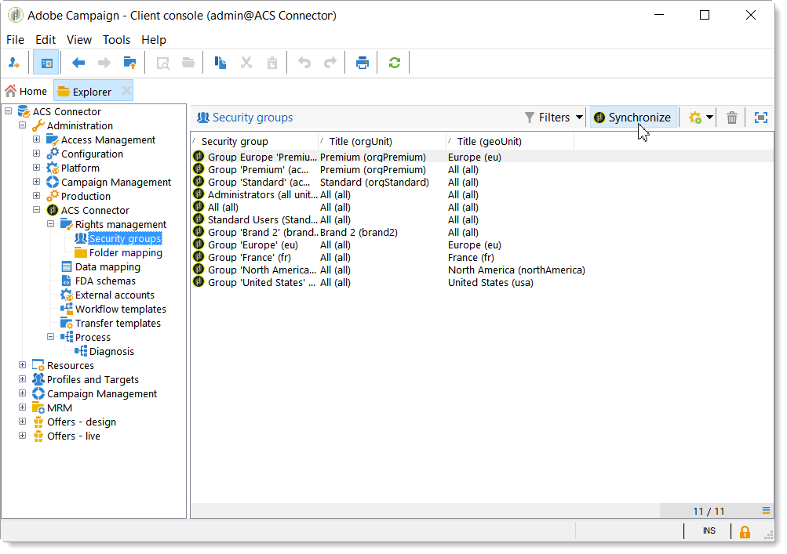

# Introduzione al connettore ACS{#acs-connector-gs}

Il connettore ACS collega Adobe Campaign v7 e Adobe Campaign Standard. Si tratta di una funzione integrata di Campaign v7 che replica automaticamente i dati in Campaign Standard, unendo il meglio di entrambe le applicazioni. Campaign v7 dispone di strumenti avanzati per gestire il database di marketing principale. La replica dei dati da Campaign v7 consente a Campaign Standard di sfruttare i dati avanzati in un ambiente semplice da usare.

Con il connettore ACS, Campaign Standard continua a essere utilizzato dagli esperti di marketing digitale per progettare, eseguire il targeting e eseguire campagne, mentre Campaign v7 è personalizzato per gli utenti orientati ai dati, come gli esperti di marketing nei database.

>[!IMPORTANT]
>
>Il connettore ACS è disponibile solo come parte dell’offerta Adobe Campaign Prime. Per ulteriori informazioni su come ottenere la licenza di Adobe Campaign Prime, contatta il tuo account manager.
>
>Il connettore ACS è disponibile solo per architetture in hosting e ibride. Non è disponibile per installazioni on-premise complete.
>
>Per utilizzare questa funzione, è necessario connettersi a Campaign con un Adobe ID (IMS). Vedi [Connessione tramite un Adobe ID](../../integrations/using/about-adobe-id.md).

Questo documento illustra le funzionalità del connettore ACS. Le sezioni seguenti forniscono informazioni su come la funzione replica i dati e istruzioni su come utilizzare i profili replicati.

* [Processo](#process): panoramica del connettore ACS e gestione della replica dei dati.
* [Implementazione](#implementation): panoramica di come iniziare a utilizzare il connettore ACS e istruzioni su come replicare dati di base e avanzati.
* [Sincronizza profili](../../integrations/using/synchronizing-profiles.md): istruzioni su come replicare i profili e creare consegne con essi.
* [Sincronizza tipi di pubblico](../../integrations/using/synchronizing-audiences.md): istruzioni su come eseguire il targeting di un elenco di destinatari in Campaign v7 e quindi replicare l&#39;elenco in Campaign Standard come pubblico.
* [Sincronizza applicazioni Web](../../integrations/using/synchronizing-web-applications.md): istruzioni su come collegare le applicazioni Web di Campaign v7 a Campaign Standard.
* [Risoluzione dei problemi relativi al connettore ACS](../../integrations/using/troubleshooting-the-acs-connector.md): rivedi le risposte ai problemi comuni.

>[!NOTE]
>
>Il connettore ACS è incluso in Campaign v7 in base al contratto di licenza. Per utilizzare il connettore ACS, accertati di poter passare da Campaign v7 a Campaign Standard. Se non sei sicuro della tua versione e delle sue funzioni, contatta l’amministratore.

## Processo {#process}

### Replica dei dati {#data-replication}

Il connettore ACS replica periodicamente i seguenti elementi da Campaign v7 a Campaign Standard:

* **Destinatari**
* **Iscrizioni**
* **Servizi**
* **Pagine di destinazione**

Per impostazione predefinita, la replica periodica per il connettore ACS viene eseguita una volta ogni 15 minuti. L’intervallo della replica periodica può essere regolato in base alle tue esigenze. Se sono necessarie modifiche, contatta il tuo consulente.

La replica dei dati per destinatari, abbonamenti, servizi e pagine di destinazione è incrementale, il che significa che solo i nuovi destinatari e le modifiche ai destinatari esistenti vengono replicati da Campaign v7 a Campaign Standard. Tuttavia, la replica per un pubblico si verifica in una singola istanza. Puoi creare un pubblico in Campaign v7 e poi replicarlo una sola volta in Campaign Standard. La replica è immediata e non può essere configurata per aggiornamenti regolari. Per istruzioni, consulta [Sincronizzazione dei tipi di pubblico](../../integrations/using/synchronizing-audiences.md).

>[!NOTE]
>
>La replica iniziale di un database di grandi dimensioni può richiedere diverse ore. Tuttavia, le repliche successive sono incrementali e molto più veloci.

Il connettore ACS replica periodicamente i seguenti elementi da Campaign Standard a Campaign v7:

* **[!UICONTROL Delivery IDs]**
* **[!UICONTROL Email broad logs]**
* **[!UICONTROL Email tracking logs]**

La replica degli ID di consegna e dei registri e-mail consente di accedere alla cronologia delle consegne e ai dati di tracciamento per i destinatari v7 da Campaign v7.

>[!IMPORTANT]
>
>Solo i registri di trasmissione e di tracciamento delle e-mail vengono replicati da Campaign Standard a Campaign v7.

### Sincronizzazione dei dati {#data-synchronization}

Il connettore ACS sincronizza le quarantene tra Campaign v7 e Campaign Standard.

Un profilo replicato da Campaign v7 in Campaign Standard, ad esempio, include un indirizzo e-mail. Se l’indirizzo e-mail è messo in quarantena da Campaign Standard, i dati vengono passati a Campaign v7 durante la successiva sincronizzazione. Per ulteriori informazioni sulle quarantene, vedere [Gestione quarantena](../../delivery/using/understanding-quarantine-management.md) e [Quarantene Campaign Standard](https://experienceleague.adobe.com/docs/campaign-standard/using/testing-and-sending/monitoring-messages/understanding-quarantine-management.html?lang=it).

### Utilizzare i profili replicati {#using-replicated-profiles}

I profili replicati possono essere utilizzati da Campaign Standard e Campaign v7 per il targeting dei flussi di lavoro nelle campagne di marketing.

Per istruzioni su come inviare una consegna in Campaign Standard utilizzando profili replicati, vedere [Sincronizzazione dei profili](../../integrations/using/synchronizing-profiles.md). Sono fornite istruzioni aggiuntive per condividere i dati di annullamento dell’abbonamento tra Campaign v7 e Campaign Standard.

### Limitazioni {#limitations}

I profili replicati sono facilmente disponibili per le consegne, ma presentano alcune limitazioni in Campaign Standard. Leggi gli elementi riportati di seguito per scoprire come gestirli al meglio.

* **Profili di sola lettura per Campaign Standard**: i profili replicati sono di sola lettura in Campaign Standard. Tuttavia, puoi modificare i destinatari in Campaign v7 e le modifiche vengono aggiornate automaticamente in Campaign Standard da ACS Connector.
* **Profili creati in Campaign Standard**: il connettore ACS replica i dati dei destinatari in un&#39;unica direzione, da Campaign v7 a Campaign Standard. Pertanto, i profili che hanno origine in Campaign Standard non vengono replicati in Campaign v7.
* **Dati dei destinatari di base per Campaign Standard**: il connettore ACS replica i dati dei destinatari adatti a Campaign Standard. Include i nomi, gli indirizzi, gli indirizzi e-mail, i numeri di telefono cellulare, i numeri di telefono dell’abitazione e altre informazioni di contatto pertinenti. Se ulteriori campi dei destinatari e tabelle di targeting personalizzate disponibili in Campaign v7 sono fondamentali per il flusso di lavoro, contatta il tuo consulente.
* **Importazione di profili messi in quarantena**: è possibile importare in Campaign v7 o Campaign Standard gli elenchi di profili che non desiderano essere contattati come profili messi in quarantena. Lo stato dei profili è incluso nella sincronizzazione della quarantena tra le applicazioni e non verranno utilizzati nelle consegne.
* **Annulla iscrizione a un servizio in Campaign Standard**: la scelta di annullare l&#39;iscrizione a una consegna non è sincronizzata da Campaign Standard a Campaign v7. Tuttavia, puoi configurare una consegna Campaign Standard per indirizzare il relativo collegamento di annullamento all’abbonamento a Campaign v7. Il profilo di un destinatario che fa clic sul collegamento di annullamento dell’abbonamento viene aggiornato in Campaign v7 e i dati vengono replicati in Campaign Standard. Consulta [Modifica il collegamento di annullamento dell&#39;abbonamento](../../integrations/using/synchronizing-profiles.md#changing-the-unsubscription-link).
* Solo i registri di trasmissione e di tracciamento delle e-mail vengono replicati da Campaign Standard a Campaign v7.

### Fatturazione {#billing}

La fatturazione non è influenzata dalla scelta dell’applicazione da utilizzare per l’invio di consegne, Campaign v7 o Campaign Standard. Le informazioni di fatturazione vengono riconciliate tra Campaign v7 e Campaign Standard. Pertanto, se invii consegne allo stesso destinatario utilizzando entrambe le applicazioni, viene comunque conteggiato come un unico profilo attivo.

## Implementazione {#implementation}

Esistono due tipi di implementazione per il connettore ACS. Entrambi vengono sempre eseguiti dal team di consulenza Adobe Campaign.

>[!IMPORTANT]
>
>Questa sezione è destinata esclusivamente agli utenti esperti, per fornire loro una visione globale del processo di implementazione e delle sue fasi principali.
>
>Non cercare in alcun modo di eseguire personalmente nessuna di queste implementazioni. È strettamente riservata ai consulenti Adobe Campaign.

L&#39;**implementazione di base** ti consente di replicare destinatari (campi predefiniti), servizi e abbonamenti, applicazioni web e tipi di pubblico. Si tratta di una replica unidirezionale da Campaign v7 a Campaign Standard.

L&#39;**implementazione avanzata** ti consentirà di eseguire casi d&#39;uso più complessi, ad esempio se disponi di campi dei destinatari aggiuntivi o di tabelle dei destinatari personalizzate (ad esempio la tabella delle transazioni). Consulta [Implementazione avanzata](#advanced-implementation).

### Installare il pacchetto {#installing-the-package}

Per utilizzare la funzionalità, è necessario installare il pacchetto **[!UICONTROL ACS Connector]**. Questa operazione viene sempre eseguita dall’amministratore tecnico o dal consulente Adobe.

Tutti gli elementi tecnici relativi al connettore ACS sono disponibili nel nodo **[!UICONTROL Administration > ACS Connector]** dell&#39;Explorer.

### Flussi di lavoro tecnici e di replica {#technical-and-replication-workflows}

Dopo l&#39;installazione del pacchetto, sono disponibili due flussi di lavoro tecnici in **[!UICONTROL Administration > ACS Connector > Process]**.

>[!IMPORTANT]
>
>Non provare mai a modificare questi flussi di lavoro. Non devono mai essere in errore o messi in pausa. In questo caso, contatta il tuo consulente Adobe Campaign.

* **[!UICONTROL `[ACS] Quarantine synchronization`]** (quarantineSync): questo flusso di lavoro sincronizza tutte le informazioni di quarantena. Tutte le nuove quarantene in Campaign v7 vengono replicate in Campaign Standard. Tutte le nuove quarantene da Campaign Standard vengono replicate in Campaign v7. In questo modo tutte le regole di esclusione vengono sincronizzate tra Campaign v7 e Campaign Standard.
* **[!UICONTROL `[ACS] Security group synchronization`]** (securityGroupSync): questo flusso di lavoro viene utilizzato per la conversione dei diritti. Vedi [Conversione diritti](#rights-conversion).

I seguenti flussi di lavoro di replica sono disponibili come modelli &quot;pronti per l’uso&quot;. Devono essere implementati dal tuo consulente Adobe Campaign.

* **[!UICONTROL `[ACS] Profile replication`]** (newProfileReplication): questo flusso di lavoro incrementale replica i destinatari in Campaign Standard. Per impostazione predefinita, replica tutti i campi dei destinatari predefiniti. Vedi [Campi destinatari predefiniti](#default-recipient-fields).
* **[!UICONTROL `[ACS] Service replication`]** (newServiceReplication): questo flusso di lavoro incrementale replica i servizi scelti in Campaign Standard. Vedi il caso d&#39;uso [Sincronizzazione delle applicazioni web](../../integrations/using/synchronizing-web-applications.md).
* **[!UICONTROL `[ACS] Landing pages replication`]** (newLandingPageReplication): questo flusso di lavoro incrementale replica le applicazioni Web selezionate in Campaign Standard. Le applicazioni web di Campaign v7 verranno visualizzate come pagine di destinazione in Campaign Standard. Vedi il caso d&#39;uso [Sincronizzazione delle applicazioni web](../../integrations/using/synchronizing-web-applications.md).
* **[!UICONTROL `[ACS] New replication`]** (newReplication): questo flusso di lavoro incrementale è un esempio che può essere utilizzato per replicare una tabella personalizzata. Consulta [Implementazione avanzata](#advanced-implementation).
* **[!UICONTROL `[ACS] Delivery-message replication`]** (newDlvMsgQualification): questo flusso di lavoro incrementale replica i messaggi di consegna da Campaign Standard a Campaign v7.
* **[!UICONTROL `[ACS] Profile delivery log replication`]** (newRcpDeliveryLogReplication): questo flusso di lavoro incrementale replica gli ID di consegna, i registri di indirizzi e-mail generali e i registri di tracciamento e-mail da Campaign Standard a Campaign v7. Tiene conto solo delle consegne inviate da Campaign Standard ai profili che fanno parte della tabella nms:recipients di Campaign v7.

  >[!NOTE]
  >
  > Se per inviare e-mail con URL tracciati vengono utilizzate sia le istanze di Campaign Classic che di Campaign Standard, durante la sincronizzazione potrebbe verificarsi un problema relativo agli ID di tag URL duplicati. Per evitare che ciò si verifichi, aggiorna l&#39;attività **Aggiorna URL di tracciamento** (writerTrackingUrls) nel flusso di lavoro e aggiungi il prefisso &quot;ACS&quot; all&#39;espressione di origine @tagId.

* **[!UICONTROL `[ACS] New delivery log replication`]** (newRcpDeliveryLogReplication): questo flusso di lavoro incrementale replica gli ID di consegna, i registri di indirizzi e-mail generali e i registri di tracciamento e-mail da Campaign Standard a Campaign v7. Tiene conto solo delle consegne inviate da Campaign Standard a profili che fanno parte di una tabella specifica (per definire, diversa da nms:recipients) di Campaign v7.

### Campi destinatari predefiniti {#default-recipient-fields}

Se disponi di campi o tabelle personalizzate aggiuntivi (ad esempio, tabella delle transazioni), queste non verranno replicate per impostazione predefinita. È necessario eseguire la configurazione avanzata. Consulta [Implementazione avanzata](#advanced-implementation).

Di seguito è riportato l’elenco dei campi dei destinatari replicati con l’implementazione di base. Di seguito sono riportati i campi predefiniti:

<table> 
 <tbody> 
  <tr> 
   <td> <strong>Etichetta</strong>  </td> 
   <td> <strong>Nome interno</strong>  </td> 
  </tr> 
  <tr> 
   <td> ID Source  </td> 
   <td> @sourceId  </td> 
  </tr> 
  <tr> 
   <td> Data di creazione  </td> 
   <td> @created  </td> 
  </tr> 
  <tr> 
   <td> Data di modifica  </td> 
   <td> @lastModified  </td> 
  </tr> 
  <tr> 
   <td> E-mail  </td> 
   <td> @email  </td> 
  </tr> 
  <tr> 
   <td> Cognome  </td> 
   <td> @lastName  </td> 
  </tr> 
  <tr> 
   <td> Nome  </td> 
   <td> @firstName  </td> 
  </tr> 
  <tr> 
   <td> Secondo nome  </td> 
   <td> @middleName  </td> 
  </tr> 
  <tr> 
   <td> Mobile  </td> 
   <td> @mobilePhone  </td> 
  </tr> 
  <tr> 
   <td> Data di nascita  </td> 
   <td> @birthDate  </td> 
  </tr> 
  <tr> 
   <td> Genere  </td> 
   <td> @gender  </td> 
  </tr> 
  <tr> 
   <td> Saluto  </td> 
   <td> @salutation  </td> 
  </tr> 
  <tr> 
   <td> Non contattare più (tramite alcun canale)  </td> 
   <td> @blackList  </td> 
  </tr> 
  <tr> 
   <td> Non contattare più tramite e-mail  </td> 
   <td> @blackListEmail  </td> 
  </tr> 
  <tr> 
   <td> Non contattare più tramite SMS  </td> 
   <td> @blackListMobile  </td> 
  </tr> 
  <tr> 
   <td> Telefono  </td> 
   <td> @phone  </td> 
  </tr> 
  <tr> 
   <td> Fax  </td> 
   <td> @fax  </td> 
  </tr> 
  <tr> 
   <td> Indirizzo 1 (appartamento)  </td> 
   <td> [percorso/@address1]  </td> 
  </tr> 
  <tr> 
   <td> Indirizzo 2  </td> 
   <td> [percorso/@address2]  </td> 
  </tr> 
  <tr> 
   <td> Indirizzo 3 (numero e via)  </td> 
   <td> [percorso/@address3]  </td> 
  </tr> 
  <tr> 
   <td> Indirizzo 4 (contea)  </td> 
   <td> [percorso/@address4]  </td> 
  </tr> 
  <tr> 
   <td> CAP  </td> 
   <td> [percorso/@zipCode]  </td> 
  </tr> 
  <tr> 
   <td> Città  </td> 
   <td> [percorso/@city]  </td> 
  </tr> 
  <tr> 
   <td> Codice stato/provincia  </td> 
   <td> [percorso/@stateCode]  </td> 
  </tr> 
  <tr> 
   <td> Codice paese  </td> 
   <td> [percorso/@countryCode]  </td> 
  </tr> 
 </tbody> 
</table>

### Conversione dei diritti {#rights-conversion}

I diritti vengono gestiti in modo diverso in Campaign v7 e Campaign Standard. In Campaign v7, la gestione dei diritti è basata su cartelle, mentre in Campaign Standard si basa sull’accesso alle unità (unità organizzative/geografiche). Un utente Campaign Standard appartiene a un gruppo di sicurezza che contiene il contesto di restrizione. Pertanto, il sistema di diritti di Campaign v7 deve essere convertito per corrispondere a quello Campaign Standard. Esistono diversi modi per eseguire la conversione dei diritti. Di seguito trovi un esempio di implementazione.

1. In **[!UICONTROL Administration > ACS Connector > Rights management > Security groups]**, utilizzare il pulsante **[!UICONTROL Synchronize]** per recuperare tutti i gruppi di sicurezza di Campaign Standard. I gruppi di Campaign Standard preconfigurati sono esclusi.

   

1. Se la gestione dei diritti è basata su cartelle, passare a **[!UICONTROL Administration > ACS Connector > Rights management > Folder mapping]** e mappare ogni cartella necessaria con un gruppo di sicurezza.

   

1. I flussi di lavoro di replica utilizzeranno quindi queste informazioni e aggiungeranno le unità organizzative/geografiche corrispondenti a ciascun oggetto da replicare.

### Implementazione avanzata {#advanced-implementation}

Questa sezione descrive alcune delle possibilità in termini di implementazione avanzata.

>[!IMPORTANT]
>
>Queste informazioni possono essere utilizzate solo come linee guida generali. Rivolgiti al tuo consulente Adobe Campaign per l’implementazione.

L’implementazione avanzata aggiungerà flussi di lavoro di replica personalizzati, in base alle esigenze del cliente. Di seguito sono riportati alcuni esempi:

* Replica della consegna
* Replica di Campaign
* Replica del programma
* Replica membri seed
* Replica transazionale
* ecc.

**Replica dei campi estesi sui destinatari**

Con l’implementazione di base, vengono replicati i campi dei destinatari predefiniti. Se desideri replicare i campi personalizzati aggiunti allo schema del destinatario, devi identificarli.

1. In **[!UICONTROL Administration > ACS Connector > Data mapping]** creare un mapping di targeting nella tabella **[!UICONTROL nms:recipient]**.

   

1. Seleziona i campi aggiuntivi da replicare e altre informazioni necessarie (indice, collegamenti, chiavi di identificazione).

   

1. Apri il flusso di lavoro di replica del profilo dedicato (non il modello, ma l’istanza di flusso di lavoro stessa). Modificare le attività **[!UICONTROL Query]** e **[!UICONTROL Update data]** in modo che includano questi campi. Consulta [Flussi di lavoro tecnici e di replica](#technical-and-replication-workflows).

   

   

**Replica di tabelle di profilo personalizzate**

Con l’implementazione di base, viene replicata la tabella dei destinatari predefinita. Se hai aggiunto tabelle dei destinatari personalizzate, ecco come identificarle.

1. In **[!UICONTROL Administration > ACS Connector > Data mapping]**, crea una mappatura di targeting nella tabella del profilo personalizzata.

   

1. Definisci i dati di identificazione, l’indice, i collegamenti e i campi da replicare.

   

1. Se la gestione dei diritti è basata su cartelle, passare a **[!UICONTROL Administration > ACS Connector > Rights management > Folder mapping]** e definire un gruppo di sicurezza per le cartelle collegate alle tabelle personalizzate. Vedi [Conversione diritti](#rights-conversion).
1. Utilizzare il flusso di lavoro **[!UICONTROL New replication]** (non il modello, ma l&#39;istanza del flusso di lavoro stessa) per includere la tabella personalizzata e i campi da replicare. Consulta [Flussi di lavoro tecnici e di replica](#technical-and-replication-workflows).
