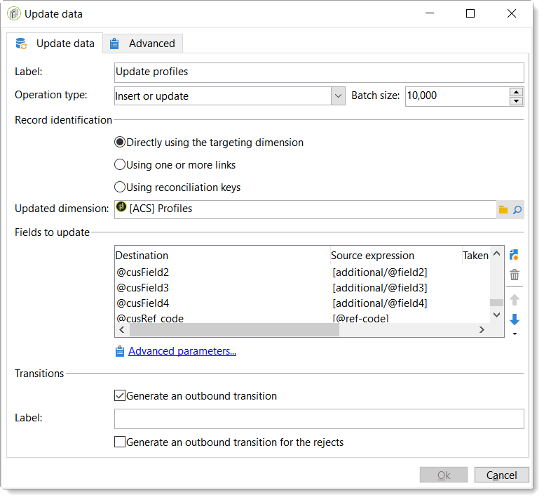

# Introduzione al connettore ACS{#acs-connector-gs}

Il connettore ACS collega Adobe Campaign v7 e Adobe Campaign Standard. Si tratta di una funzione integrata in Campaign v7 che replica automaticamente i dati in Campaign Standard, unendo il meglio di entrambe le applicazioni. Campaign v7 dispone di strumenti avanzati per gestire il database di marketing principale. La replica dei dati da Campaign v7 consente ad Campaign Standard di sfruttare i dati avanzati in un ambiente semplice e intuitivo.

Con il connettore ACS, Campaign Standard continua a essere utilizzato dagli esperti di marketing digitale per progettare, eseguire ed eseguire campagne mentre Campaign v7 è progettato su misura per gli utenti orientati ai dati, come gli esperti di marketing del database.

>[!IMPORTANT]
>
>Il connettore ACS è disponibile solo come parte dell&#39;offerta Adobe Campaign Prime. Per ulteriori informazioni su come concedere la licenza Adobe Campaign Prime, contatta il tuo account manager.
>
>Il connettore ACS è disponibile solo per architetture ospitate e ibride. Non è disponibile per installazioni on-premise complete.
>
>Per utilizzare questa funzione, devi connetterti a Campaign con un Adobe ID (IMS). Vedi [Collegamento tramite un Adobe ID](../../integrations/using/about-adobe-id.md).

Questo documento presenta le funzionalità del connettore ACS. Le sezioni seguenti forniscono informazioni su come la funzione replica i dati e istruzioni su come lavorare con i profili replicati.

* [Processo](#process): Panoramica del connettore ACS e modalità di gestione della replica dei dati.
* [Implementazione](#implementation): Panoramica su come iniziare a utilizzare il connettore ACS e istruzioni su come replicare dati di base e avanzati.
* [Sincronizza profili](../../integrations/using/synchronizing-profiles.md): Istruzioni su come replicare i profili e su come creare consegne con essi.
* [Sincronizzazione dei tipi di pubblico](../../integrations/using/synchronizing-audiences.md): Istruzioni su come eseguire il targeting di un elenco di destinatari in Campaign v7 e quindi replicarlo in Campaign Standard come pubblico.
* [Sincronizzazione delle applicazioni web](../../integrations/using/synchronizing-web-applications.md): Istruzioni su come collegare le applicazioni web Campaign v7 a Campaign Standard.
* [Risoluzione dei problemi del connettore ACS](../../integrations/using/troubleshooting-the-acs-connector.md): Rivedi le risposte ai problemi comuni.

>[!NOTE]
>
>Il connettore ACS è incluso con Campaign v7 in base al contratto di licenza. Per utilizzare il connettore ACS, assicurati di poter passare da Campaign v7 a Campaign Standard. Se non sei sicuro della versione e delle funzioni incluse, contatta l’amministratore.

## Processo {#process}

### Replica dei dati {#data-replication}

Il connettore ACS replica periodicamente i seguenti elementi da Campaign v7 a Campaign Standard:

* **Destinatari**
* **Abbonamenti**
* **Servizi**
* **Pagine di destinazione**

Per impostazione predefinita, la replica periodica per il connettore ACS è una volta ogni 15 minuti. L&#39;estensione della replica periodica può essere regolata in base alle tue esigenze. Contatta il tuo consulente se sono necessarie modifiche.

La replica dei dati per destinatari, abbonamenti, servizi e pagine di destinazione è incrementale, il che significa che solo i nuovi destinatari e le modifiche ai destinatari esistenti vengono replicati da Campaign v7 a Campaign Standard. Tuttavia, la replica per un pubblico si verifica in una singola istanza. Puoi creare un pubblico in Campaign v7 e replicarlo una volta in Campaign Standard. La replica è immediata e non può essere configurata per aggiornamenti regolari. Per istruzioni, consulta [Sincronizzazione dei tipi di pubblico](../../integrations/using/synchronizing-audiences.md).

>[!NOTE]
>
>Si prega di essere pazienti con la replica iniziale di un grande database in quanto può richiedere diverse ore. Tuttavia, le successive repliche sono incrementali e molto più veloci.

Il connettore ACS replica periodicamente i seguenti elementi da Campaign Standard a Campaign v7:

* **[!UICONTROL Delivery IDs]**
* **[!UICONTROL Email broad logs]**
* **[!UICONTROL Email tracking logs]**

La replica degli ID di consegna e dei registri e-mail consente di accedere alla cronologia delle consegne e dei dati di tracciamento per i destinatari v7 da Campaign v7.

>[!IMPORTANT]
>
>Solo i registri di trasmissione e di tracciamento delle e-mail vengono replicati da Campaign Standard a Campaign v7.

### Sincronizzazione dei dati {#data-synchronization}

Il connettore ACS sincronizza la quarantena tra Campaign v7 e Campaign Standard.

Ad esempio, un profilo replicato da Campaign v7 a Campaign Standard include un indirizzo e-mail. Se l’indirizzo e-mail viene messo in quarantena da Campaign Standard, i dati vengono passati a Campaign v7 durante la sincronizzazione successiva. Per ulteriori informazioni sulle quarantena, vedi [Gestione della quarantena](../../delivery/using/understanding-quarantine-management.md) e [Quarantena di Campaign Standard](https://experienceleague.adobe.com/docs/campaign-standard/using/testing-and-sending/monitoring-messages/understanding-quarantine-management.html).

### Utilizzare i profili replicati {#using-replicated-profiles}

I profili replicati possono essere utilizzati da Campaign Standard e Campaign v7 per il targeting dei flussi di lavoro nelle campagne di marketing.

Per istruzioni su come inviare una consegna in Campaign Standard utilizzando i profili replicati, consulta [Sincronizzazione dei profili](../../integrations/using/synchronizing-profiles.md). Sono fornite ulteriori istruzioni per la condivisione dei dati di annullamento dell’abbonamento tra Campaign v7 e Campaign Standard.

### Limitazioni {#limitations}

I profili replicati sono prontamente disponibili per le consegne, ma presentano alcune limitazioni in Campaign Standard. Rivedi gli elementi riportati di seguito per scoprire come gestirli al meglio.

* **Profili di sola lettura per Campaign Standard**: I profili replicati sono di sola lettura in Campaign Standard. Tuttavia, puoi modificare i destinatari in Campaign v7 e le modifiche vengono aggiornate automaticamente in Campaign Standard tramite il connettore ACS.
* **Profili creati in Campaign Standard**: Il connettore ACS replica i dati sui destinatari in una direzione, da Campaign v7 a Campaign Standard. Pertanto, i profili originati in Campaign Standard non vengono replicati in Campaign v7.
* **Dati dei destinatari di base per Campaign Standard**: Il connettore ACS replica i dati dei destinatari adatti ad Campaign Standard. Include i nomi dei destinatari, gli indirizzi e-mail, i numeri di telefono cellulare, i numeri di telefono di casa e altre informazioni di contatto pertinenti. Se ulteriori campi destinatario e tabelle di targeting personalizzate disponibili in Campaign v7 sono fondamentali per il flusso di lavoro, rivolgiti al tuo consulente.
* **Importazione di profili messi in quarantena**: Gli elenchi di profili che non desiderano essere contattati possono essere importati in Campaign v7 o Campaign Standard come profili in quarantena. Lo stato dei profili è incluso nella sincronizzazione di quarantena tra le applicazioni e non verrà utilizzato nelle consegne.
* **Annulla l’abbonamento a un servizio in Campaign Standard**: La scelta di annullare l’iscrizione a una consegna non è sincronizzata da Campaign Standard a Campaign v7. Tuttavia, puoi configurare una consegna Campaign Standard per indirizzare il relativo collegamento di annullamento all’abbonamento a Campaign v7. Il profilo di un destinatario che fa clic sul collegamento di annullamento all’abbonamento viene aggiornato in Campaign v7 e i dati vengono replicati in Campaign Standard. Vedi [Modificare il collegamento di annullamento all’abbonamento](../../integrations/using/synchronizing-profiles.md#changing-the-unsubscription-link).
* Solo i registri di trasmissione e di tracciamento delle e-mail vengono replicati da Campaign Standard a Campaign v7.

### Fatturazione {#billing}

La fatturazione non è influenzata dalla scelta dell’applicazione per l’invio di consegne, Campaign v7 o Campaign Standard. Le informazioni sulla fatturazione vengono riconciliate tra Campaign v7 e Campaign Standard. Pertanto, se invii consegne allo stesso destinatario utilizzando entrambe le applicazioni, viene comunque conteggiato come un unico profilo attivo.

## Implementazione {#implementation}

Esistono due tipi di implementazione per il connettore ACS. Entrambi sono sempre eseguiti dal team di consulenza Adobe Campaign.

>[!IMPORTANT]
>
>Questa sezione è destinata solo agli utenti esperti, per fornire loro una visione globale del processo di implementazione e delle sue fasi principali.
>
>Non cercate, in alcun modo, di eseguire da soli nessuna di queste implementazioni. È strettamente riservato ai consulenti Adobe Campaign.

La **implementazione di base** consente di replicare i destinatari (campi preconfigurati), i servizi e gli abbonamenti, le applicazioni web e i tipi di pubblico. Si tratta di una replica unidirezionale da Campaign v7 a Campaign Standard.

La **implementazione avanzata** ti consentirà di eseguire casi d’uso più complessi, ad esempio se disponi di campi di destinazione aggiuntivi o tabelle di destinatari personalizzate (ad esempio, la tabella delle transazioni). Vedi [Implementazione avanzata](#advanced-implementation).

### Installa il pacchetto {#installing-the-package}

Per utilizzare la funzione, la **[!UICONTROL ACS Connector]** il pacchetto deve essere installato. Questo viene sempre eseguito dall’amministratore tecnico o consulente Adobe.

Tutti gli elementi tecnici relativi al connettore ACS sono disponibili nel **[!UICONTROL Administration > ACS Connector]** nodo dell&#39;esploratore.

### Flussi di lavoro tecnici e di replica {#technical-and-replication-workflows}

Dopo l’installazione del pacchetto, sono disponibili due flussi di lavoro tecnici in **[!UICONTROL Administration > ACS Connector > Process]**.

>[!IMPORTANT]
>
>Non provare mai a modificare questi flussi di lavoro. Non dovrebbero mai essere in errore o in pausa. In questo caso, contatta il tuo consulente Adobe Campaign.

* **[!UICONTROL `[ACS] Quarantine synchronization`]** (quarantenaSync): questo flusso di lavoro sincronizza tutte le informazioni sulla quarantena. Tutte le nuove quarantene in Campaign v7 vengono replicate in Campaign Standard. Tutte le nuove quarantene di Campaign Standard vengono replicate in Campaign v7. Questo garantisce che tutte le regole di esclusione siano sincronizzate tra Campaign v7 e Campaign Standard.
* **[!UICONTROL `[ACS] Security group synchronization`]** (securityGroupSync): questo flusso di lavoro viene utilizzato per la conversione dei diritti. Vedi [Conversione dei diritti](#rights-conversion).

I seguenti flussi di lavoro di replica sono disponibili come modelli &quot;pronti per l’uso&quot;. Devono essere implementati dal tuo consulente Adobe Campaign.

* **[!UICONTROL `[ACS] Profile replication`]** (newProfileReplication): questo flusso di lavoro incrementale replica i destinatari in Campaign Standard. Per impostazione predefinita, replica tutti i campi dei destinatari predefiniti. Vedi [Campi destinatari predefiniti](#default-recipient-fields).
* **[!UICONTROL `[ACS] Service replication`]** (newServiceReplication): questo flusso di lavoro incrementale replica i servizi selezionati in Campaign Standard. Consulta il caso d’uso [Sincronizzazione delle applicazioni web](../../integrations/using/synchronizing-web-applications.md).
* **[!UICONTROL `[ACS] Landing pages replication`]** (newLandingPageReplication): questo flusso di lavoro incrementale replica le applicazioni web scelte in Campaign Standard. Le applicazioni web Campaign v7 verranno visualizzate come pagine di destinazione in Campaign Standard. Consulta il caso d’uso [Sincronizzazione delle applicazioni web](../../integrations/using/synchronizing-web-applications.md).
* **[!UICONTROL `[ACS] New replication`]** (newReplication): questo flusso di lavoro incrementale è un esempio che può essere utilizzato per replicare una tabella personalizzata. Vedi [Implementazione avanzata](#advanced-implementation).
* **[!UICONTROL `[ACS] Delivery-message replication`]** (newDlvMsgQualification): questo flusso di lavoro incrementale replica i messaggi di consegna da Campaign Standard a Campaign v7.
* **[!UICONTROL `[ACS] Profile delivery log replication`]** (newRcpDeliveryLogReplication): questo flusso di lavoro incrementale replica gli ID di consegna, i registri ampi delle e-mail e i registri di tracciamento delle e-mail da Campaign Standard a Campaign v7. Prende in considerazione solo le consegne inviate da Campaign Standard a profili che fanno parte della tabella nms:recipients di Campaign v7.

   >[!NOTE]
   >
   > Nel caso in cui le istanze Campaign Classic e Campaign Standard siano utilizzate per inviare e-mail con URL tracciati, potrebbe verificarsi un problema con tagID URL duplicati durante la sincronizzazione. Per evitare che ciò si verifichi, aggiorna il **Aggiorna gli URL di tracciamento** (writerTrackingUrls) nel flusso di lavoro e aggiungi il prefisso &quot;ACS&quot; all&#39;espressione sorgente @tagId.

* **[!UICONTROL `[ACS] New delivery log replication`]** (newRcpDeliveryLogReplication): questo flusso di lavoro incrementale replica gli ID di consegna, i registri ampi delle e-mail e i registri di tracciamento delle e-mail da Campaign Standard a Campaign v7. Prende in considerazione solo le consegne inviate da Campaign Standard a profili che fanno parte di una tabella specifica (per definire, diversa da nms:recipients) di Campaign v7.

### Campi destinatari predefiniti {#default-recipient-fields}

Se si dispone di campi o tabelle personalizzate aggiuntivi (ad esempio, tabella delle transazioni), questi non verranno replicati per impostazione predefinita. È necessario eseguire la configurazione avanzata. Vedi [Implementazione avanzata](#advanced-implementation).

Di seguito è riportato l’elenco dei campi dei destinatari replicati con l’implementazione di base. Questi sono i campi predefiniti:

<table> 
 <tbody> 
  <tr> 
   <td> <strong>Etichetta</strong>  </td> 
   <td> <strong>Nome interno</strong>  </td> 
  </tr> 
  <tr> 
   <td> ID origine  </td> 
   <td> @sourceId  </td> 
  </tr> 
  <tr> 
   <td> Data di creazione  </td> 
   <td> @created  </td> 
  </tr> 
  <tr> 
   <td> Data di modifica  </td> 
   <td> @lastModified  </td> 
  </tr> 
  <tr> 
   <td> E-mail  </td> 
   <td> @e-mail  </td> 
  </tr> 
  <tr> 
   <td> Cognome  </td> 
   <td> @lastName  </td> 
  </tr> 
  <tr> 
   <td> Nome  </td> 
   <td> @firstName  </td> 
  </tr> 
  <tr> 
   <td> Secondo nome  </td> 
   <td> @middleName  </td> 
  </tr> 
  <tr> 
   <td> Mobile  </td> 
   <td> @mobilePhone  </td> 
  </tr> 
  <tr> 
   <td> Data di nascita  </td> 
   <td> @nascitaDate  </td> 
  </tr> 
  <tr> 
   <td> Genere  </td> 
   <td> @gender  </td> 
  </tr> 
  <tr> 
   <td> Saluto  </td> 
   <td> @formula introduttiva  </td> 
  </tr> 
  <tr> 
   <td> Non desidera più essere contattato (tramite nessun canale)  </td> 
   <td> @blackList  </td> 
  </tr> 
  <tr> 
   <td> Nessun contatto tramite e-mail  </td> 
   <td> @blackListEmail  </td> 
  </tr> 
  <tr> 
   <td> Nessun contatto più tramite SMS  </td> 
   <td> @blackListMobile  </td> 
  </tr> 
  <tr> 
   <td> Telefono  </td> 
   <td> @phone  </td> 
  </tr> 
  <tr> 
   <td> Fax  </td> 
   <td> @fax  </td> 
  </tr> 
  <tr> 
   <td> Indirizzo 1 (appartamento)  </td> 
   <td> [location/@address1]  </td> 
  </tr> 
  <tr> 
   <td> Indirizzo 2  </td> 
   <td> [location/@address2]  </td> 
  </tr> 
  <tr> 
   <td> Indirizzo 3 (numero e via)  </td> 
   <td> [location/@address3]  </td> 
  </tr> 
  <tr> 
   <td> Indirizzo 4 (contea)  </td> 
   <td> [location/@address4]  </td> 
  </tr> 
  <tr> 
   <td> CAP/Codice postale  </td> 
   <td> [location/@zipCode]  </td> 
  </tr> 
  <tr> 
   <td> Città  </td> 
   <td> [location/@city]  </td> 
  </tr> 
  <tr> 
   <td> Codice stato/provincia  </td> 
   <td> [location/@stateCode]  </td> 
  </tr> 
  <tr> 
   <td> Codice paese  </td> 
   <td> [location/@countryCode]  </td> 
  </tr> 
 </tbody> 
</table>

### Conversione dei diritti {#rights-conversion}

I diritti vengono gestiti in modo diverso in Campaign v7 e Campaign Standard. In Campaign v7, la gestione dei diritti è basata su cartelle, mentre in Campaign Standard è basata sull’accesso all’unità (unità organizzative/geografiche). Un utente Campaign Standard appartiene a un gruppo di sicurezza che contiene il contesto di restrizione. Pertanto, il sistema di diritti v7 di Campaign deve essere convertito per corrispondere a quello di Campaign Standard. Esistono diversi modi per eseguire la conversione dei diritti. Di seguito è riportato un esempio di implementazione.

1. Sotto **[!UICONTROL Administration > ACS Connector > Rights management > Security groups]**, utilizza **[!UICONTROL Synchronize]** per recuperare tutti i gruppi di sicurezza Campaign Standard. I gruppi di Campaign Standard predefiniti sono esclusi.

   

1. Se la gestione dei diritti è basata su cartelle, vai a **[!UICONTROL Administration > ACS Connector > Rights management > Folder mapping]** e mappare ogni cartella necessaria con un gruppo di sicurezza.

   

1. I flussi di lavoro di replica utilizzeranno quindi queste informazioni e aggiungeranno le unità organizzative/geografiche corrispondenti a ciascun oggetto da replicare.

### Implementazione avanzata {#advanced-implementation}

Questa sezione descrive alcune delle possibilità in termini di implementazione avanzata.

>[!IMPORTANT]
>
>Queste informazioni possono essere utilizzate solo come linee guida generali. Rivolgiti al tuo consulente Adobe Campaign per l’implementazione.

L’implementazione avanzata aggiunge flussi di lavoro di replica personalizzati, in base alle esigenze del cliente. Di seguito sono riportati alcuni esempi:

* Replica delle consegne
* Replica di Campaign
* Replica del programma
* Replica dei membri di seed
* Replica transazionale
* ecc.

**Replica dei campi estesi sui destinatari**

Con l’implementazione di base, i campi dei destinatari predefiniti vengono replicati. Se desideri replicare i campi personalizzati aggiunti allo schema destinatario, devi identificarli.

1. Sotto **[!UICONTROL Administration > ACS Connector > Data mapping]**, crea una mappatura di targeting sul **[!UICONTROL nms:recipient]** tabella.

   

1. Seleziona i campi aggiuntivi da replicare e altre informazioni necessarie (indice, collegamenti, chiavi di identificazione).

   

1. Apri il flusso di lavoro dedicato per la replica del profilo (non il modello, ma l’istanza del flusso di lavoro stessa). Modifica la **[!UICONTROL Query]** e **[!UICONTROL Update data]** per includere questi campi. Vedi [Flussi di lavoro tecnici e di replica](#technical-and-replication-workflows).

   

   

**Replica di tabelle di profilo personalizzate**

Con l’implementazione di base, la tabella dei destinatari predefinita viene replicata. Se hai aggiunto tabelle dei destinatari personalizzate, ecco come le identifichi.

1. Sotto **[!UICONTROL Administration > ACS Connector > Data mapping]**, crea una mappatura di targeting sulla tabella di profilo personalizzata.

   

1. Definisci i dati di identificazione, l’indice, i collegamenti e i campi che desideri replicare.

   

1. Se la gestione dei diritti è basata su cartelle, passa a **[!UICONTROL Administration > ACS Connector > Rights management > Folder mapping]** e definire un gruppo di sicurezza per le cartelle collegate alle tabelle personalizzate. Vedi [Conversione dei diritti](#rights-conversion).
1. Utilizza la **[!UICONTROL New replication]** flusso di lavoro (non il modello, ma l’istanza del flusso di lavoro stessa) per includere la tabella personalizzata e i campi da replicare. Vedi [Flussi di lavoro tecnici e di replica](#technical-and-replication-workflows).
