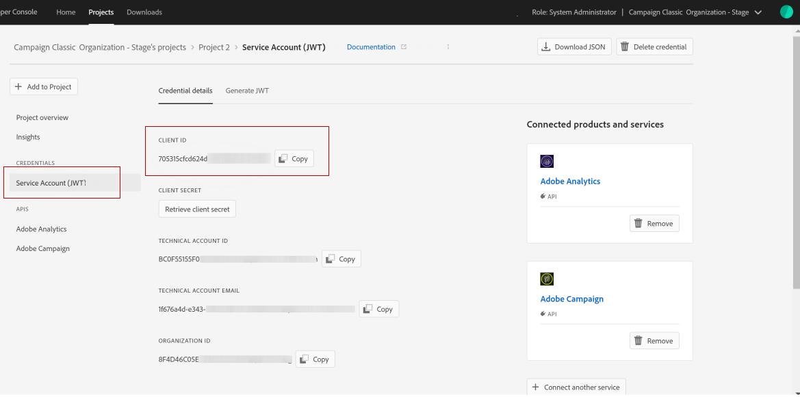

# Configurazione  I/O Adobe per Adobe Experience Cloud Triggers {#configuring-adobe-io}

## Prerequisiti {#adobe-io-prerequisites}

Prima di avviare l&#39;implementazione, verifica di avere:

* una versione recente di  Adobe Campaign: build 19.1.8 o 20.2.1 e versioni successive,
* un IMSOrgID valido: l’identificatore dell’organizzazione  Identity Management System (IMS) è l’identificatore univoco all’interno dell’Adobe Experience Cloud, utilizzato in particolare per il servizio VisitorID e l’SSO (IMS Single-Sign On),
* un accesso sviluppatore all’organizzazione IMS.

>[!NOTE]
>
>Per richiedere i privilegi di amministratore di sistema dell&#39;organizzazione IMS, seguite la procedura descritta [in questa pagina](https://helpx.adobe.com/ca/enterprise/admin-guide.html/ca/enterprise/using/manage-developers.ug.html) per fornire questo accesso a tutti i profili di prodotto.


## Passaggio 1: Crea/aggiorna  progetto I/O Adobe {#creating-adobe-io-project}

1. Accedete  I/O Adobe ed effettuate l&#39;accesso con il diritto di amministratore di sistema per IMSorg.

   >[!NOTE]
   >
   > Assicurati di aver effettuato l’accesso al portale IMSorg corretto.

1. Estrarre l&#39;ID client di integrazione esistente dal file di configurazione dell&#39;istanza ims/authIMSTAClientId. Attributo non esistente o vuoto che indica che l&#39;ID client non è configurato.

   >[!NOTE]
   >
   >Se l&#39;ID cliente è vuoto, puoi **[!UICONTROL Create a New project]** accedere direttamente  I/O Adobe.

1. Identificate il progetto esistente utilizzando l&#39;ID client estratto. Cercate progetti esistenti con lo stesso ID client estratto nel passaggio precedente.

   

1. Selezionate **[!UICONTROL + Add to Project]** e scegliete **[!UICONTROL API]**.

   

1. In the **[!UICONTROL Add an API]** window, select **[!UICONTROL Adobe Analytics]**.

   

1. Scegliere **[!UICONTROL Service Account (JWT)]** come tipo di autenticazione.

   

1. Se l&#39;ID client era vuoto, selezionate **[!UICONTROL Generate a key pair]** per creare una coppia di chiavi Pubblica e Privata.

   

1. Caricate la chiave pubblica e fate clic su **[!UICONTROL Next]**.

   

1. Scegliete il profilo di prodotto denominato **Analytics-&lt; Nome organizzazione >** e fate clic su **[!UICONTROL Save configured API]**.

   

1. Dal progetto, selezionate **[!UICONTROL Service Account (JWT)]** e copiate le seguenti informazioni:
   * **[!UICONTROL Client ID]**
   * **[!UICONTROL Client Secret]**
   * **[!UICONTROL Technical account ID]**
   * **[!UICONTROL Organization ID]**

   

## Passaggio 2: Aggiungere le credenziali del progetto in  Adobe Campaign {#add-credentials-campaign}

Per aggiungere le credenziali di progetto in  Adobe Campaign, eseguite il comando seguente come utente &quot;neolane&quot; su tutti i contenitori dell&#39;istanza Adobe Campaign  per inserire le **[!UICONTROL Technical Account]** credenziali nel file di configurazione dell&#39;istanza.

```
nlserver config -instance:<instance name> -setimsjwtauth:Organization_Id/Client_Id/Technical_Account_ID[/Client_Secret[/Base64_encoded_Private_Key]]
```

>[!NOTE]
>
>È necessario codificare la chiave privata in formato base64 UTF-8. Ricordare di rimuovere la nuova riga dalla chiave prima di codificarla, ad eccezione della chiave privata. La chiave privata deve essere la stessa utilizzata per creare l&#39;integrazione.

## Passaggio 3: Aggiorna tag pipeline {#update-pipelined-tag}

Per aggiornare [!DNL pipelined] il tag, è necessario aggiornare il tipo di autenticazione a  progetto I/O Adobe nel file di configurazione **config-&lt; instance-name >.xml** come segue:

```
<pipelined ... authType="imsJwtToken"  ... />
```

>[!NOTE]
>
>Se utilizzi una versione precedente di Triggers Integration tramite token JWT legacy, devi anche aggiungere l&#39;API I/O  Adobe per [!DNL Adobe Analytics] informazioni dettagliate nel primo passaggio per eseguire automaticamente la migrazione alla nuova autenticazione Triggers.
