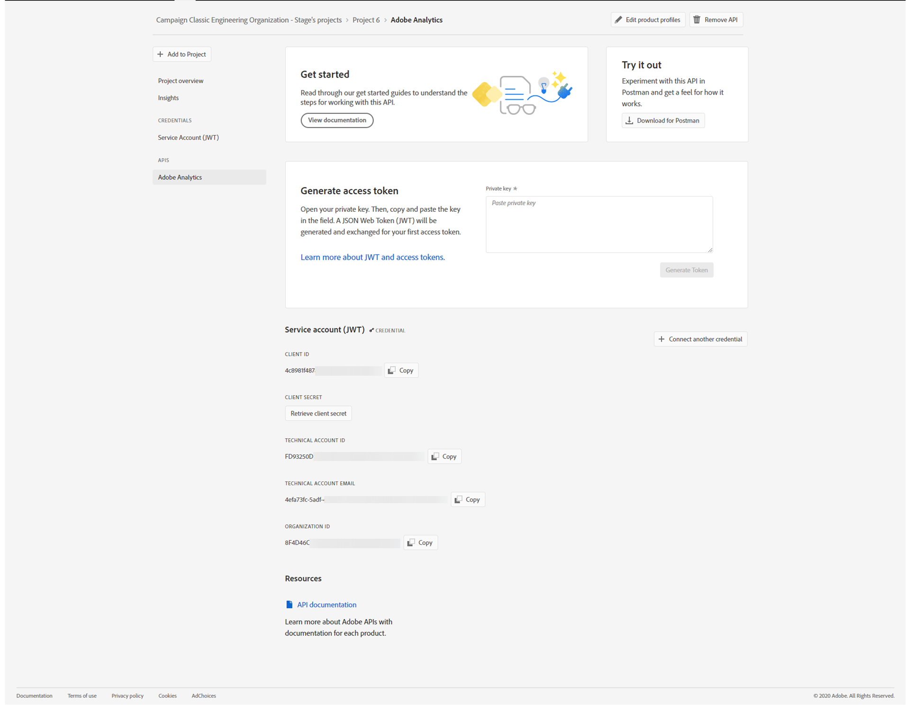

# Configurazione di Adobe I/O per Adobe Experience Cloud Triggers {#configuring-adobe-io}

>[!CAUTION]
>
>Se utilizzi una versione precedente dell’integrazione Triggers tramite autenticazione oAuth, **devi passare ad Adobe I/O come descritto di seguito**.
>Tieni presente che durante questo spostamento a [!DNL Adobe I/O], alcuni trigger in arrivo potrebbero andare persi.
>
>La modalità di autenticazione OAuth legacy con Campaign è stata ritirata il **20 ottobre 2021**. Gli ambienti in hosting usufruiscono di un’estensione fino al **25 maggio 2022**. Se sei un cliente on-premise o ibrido, contatta l’Assistenza clienti Adobe per estendere il supporto a **Maggio 2022**. Devi [fornire l’AppID dell’applicazione OAuth](../../integrations/using/configuring-pipeline.md#step-optional) all&#39;Adobe.

## Prerequisiti {#adobe-io-prerequisites}

Questa integrazione si applica solo a partire dal **Campaign Classic versione 20.2.4 e successive, 19.1.8 e Gold Standard versione 11**.

Prima di iniziare questa implementazione, verifica di disporre di:

* un valore valido **Identificatore organizzazione**: l’ID organizzazione è l’identificatore univoco all’interno di Adobe Experience Cloud, utilizzato ad esempio per il servizio VisitorID e l’accesso Single Sign-On (SSO) di IMS. [Ulteriori informazioni](https://experienceleague.adobe.com/docs/core-services/interface/administration/organizations.html?lang=it)
* a **Accesso per sviluppatori** alla tua organizzazione. L’amministratore di sistema dell’organizzazione deve seguire la procedura **Aggiungere sviluppatori a un singolo profilo di prodotto** procedura dettagliata [in questa pagina](https://helpx.adobe.com/enterprise/using/manage-developers.html) per fornire agli sviluppatori l&#39;accesso per `Analytics - {tenantID}` Profilo prodotto del prodotto Adobe Analytics associato a Triggers.

## Passaggio 1: creare/aggiornare un progetto di Adobe I/O {#creating-adobe-io-project}

>[!AVAILABILITY]
>
> Il codice JWT (JSON Web Tokens) è attualmente in fase di ammortamento e viene sostituito con OAuth. La transizione viene eseguita progressivamente nelle prossime versioni di Campaign e la documentazione verrà aggiornata per riflettere tali aggiornamenti.

1. Accesso [!DNL Adobe I/O] e accedi con l’accesso per sviluppatori della tua organizzazione. Assicurarsi di aver effettuato l&#39;accesso al portale dell&#39;organizzazione corretto.

1. Estrai l’identificatore client di integrazione (ID client) esistente dal file di configurazione dell’istanza ims/authIMSTAClientId. L&#39;attributo non esistente o vuoto indica che l&#39;identificatore client non è configurato.

   >[!NOTE]
   >
   >Se l’identificatore client è vuoto, puoi direttamente **[!UICONTROL Create a New project]** in Adobe I/O.

1. Identifica il progetto esistente utilizzando l’identificatore client estratto. Cerca i progetti esistenti con lo stesso identificatore client di quello estratto nel passaggio precedente.

   

1. Seleziona **[!UICONTROL + Add to Project]** e scegli **[!UICONTROL API]**.

   

1. In **[!UICONTROL Add an API]** finestra, seleziona **[!UICONTROL Adobe Analytics]**.

   

1. Scegli **[!UICONTROL Service Account (JWT)]** come tipo di autenticazione.

   

1. Se l&#39;ID client è vuoto, seleziona **[!UICONTROL Generate a key pair]** per creare una coppia di chiavi pubblica e privata.

   Le chiavi verranno quindi scaricate automaticamente con una data di scadenza predefinita di 365 giorni. Una volta scaduta, dovrai creare una nuova coppia di chiavi e aggiornare l’integrazione nel file di configurazione. Utilizzando l&#39;opzione 2, puoi scegliere di creare e caricare manualmente **[!UICONTROL Public key]** con una data di scadenza più lunga.

   Per una guida dettagliata su come sostituire le coppie di chiavi di certificato in scadenza, consulta [questa pagina](https://developer.adobe.com/developer-console/docs/guides/email-alerts/cert-expiry/#a-step-by-step-guide-to-replacing-expiring-certificate-key-pairs).


   >[!CAUTION]
   >
   >È consigliabile salvare il file config.zip quando viene visualizzato il prompt di download, in quanto non sarà più possibile scaricarlo.

   

1. Fai clic su **[!UICONTROL Next]**.

   

1. Scegli un elemento esistente **[!UICONTROL Product profile]** o creane uno nuovo, se necessario. Non è richiesta alcuna autorizzazione per questo **[!UICONTROL Product profile]**. Per ulteriori informazioni su [!DNL Analytics] **[!UICONTROL Product Profiles]**, fare riferimento a [Documentazione di Adobe Analytics](https://experienceleague.adobe.com/docs/analytics/admin/admin-console/home.html#admin-console).

   Quindi, fai clic su **[!UICONTROL Save configured API]**.

   

1. Dal progetto, seleziona **[!UICONTROL Adobe Analytics]** e copia le seguenti informazioni in **[!UICONTROL Service Account (JWT)]**:

   * **[!UICONTROL Client ID]**
   * **[!UICONTROL Client Secret]**
   * **[!UICONTROL Technical account ID]**
   * **[!UICONTROL Organization ID]**

   

>[!CAUTION]
>
>Il certificato di Adobe I/O scade dopo 12 mesi. Devi generare una nuova coppia di chiavi ogni anno.

## Passaggio 2: aggiungere le credenziali del progetto in Adobe Campaign {#add-credentials-campaign}

>[!NOTE]
>
>Questo passaggio non è necessario se l’identificatore client non è vuoto in [Passaggio 1: creare/aggiornare un progetto di Adobe I/O](#creating-adobe-io-project).

La chiave privata deve essere codificata nel formato base64 UTF-8. Per eseguire questa operazione:

1. Utilizza la chiave privata generata in [Passaggio 1: creare/aggiornare la sezione Progetto di Adobe I/O](#creating-adobe-io-project). La chiave privata deve essere la stessa di quella utilizzata per creare l’integrazione.

1. Codifica la chiave privata utilizzando il comando seguente: `base64 ./private.key > private.key.base64`. Il contenuto base64 verrà salvato in un nuovo file `private.key.base64`.

   >[!NOTE]
   >
   >Talvolta è possibile aggiungere automaticamente righe supplementari quando si copia/incolla la chiave privata. Ricordati di rimuoverlo prima di codificare la chiave privata.

1. Copia il contenuto dal file `private.key.base64`.

1. Accedi tramite SSH a ogni contenitore in cui è installata l’istanza di Adobe Campaign e aggiungi le credenziali del progetto in Adobe Campaign eseguendo il seguente comando come `neolane` utente. Verrà inserito il **[!UICONTROL Technical Account]** credenziali nel file di configurazione dell’istanza.

   ```
   nlserver config -instance:<instance name> -setimsjwtauth:Organization_Id/Client_Id/Technical_Account_ID/<Client_Secret>/<Base64_encoded_Private_Key>
   ```

## Passaggio 3: aggiornare il tag pipeline {#update-pipelined-tag}

>[!NOTE]
>
>Questo passaggio non è necessario se l’identificatore client non è vuoto in [Passaggio 1: creare/aggiornare un progetto di Adobe I/O](#creating-adobe-io-project).

Da aggiornare [!DNL pipelined] , devi aggiornare il tipo di autenticazione a progetto Adobe I/O nel file di configurazione **config-&lt; nome-istanza >.xml** come segue:

```
<pipelined ... authType="imsJwtToken"  ... />
```

Quindi, esegui una `config -reload` e il riavvio del [!DNL pipelined] affinché le modifiche siano prese in considerazione.
