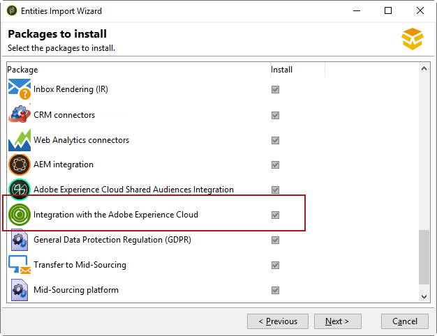

# Configurazione di IMS{#configuring-ims}

>[!IMPORTANT]
>
>In qualità di utente di Campaign hosted o managed services, l’implementazione Adobe IMS è di proprietà di Adobe. I passaggi descritti di seguito si applicano solo ai clienti on-premise e ibridi.
> L’implementazione di Adobe IMS deve essere eseguita solo da amministratori tecnici Adobi. Contatta il rappresentante del tuo Adobe per avviare il processo di implementazione.

## Prerequisiti {#prerequisites}

* È necessario disporre di un nome e di un ID organizzazione Adobe Experience Cloud. Per trovare il tuo ID organizzazione, fai riferimento a [questa pagina](https://experienceleague.adobe.com/docs/core-services/interface/administration/organizations.html?lang=it){_blank}.
* Devi aggiungere degli utenti all’Experience Cloud. Per ulteriori informazioni, consulta [questa pagina](https://experienceleague.adobe.com/docs/core-services/interface/administration/admin-getting-started.html){_blank}.

>[!NOTE]
>
>Assicurati che gli utenti siano collegati ai gruppi di Adobe Experience Cloud che verranno sincronizzati con Adobe Campaign. [Ulteriori informazioni](#configuring-the-external-account).

## Aggiornamento della console {#updating-the-console}

Per utilizzare questa funzionalità, è fondamentale installare la versione più recente della console client.

## Installazione del pacchetto {#installing-the-package}

È necessario installare il pacchetto predefinito **[!UICONTROL Integration with the Adobe Experience Cloud]**. L&#39;installazione di un pacchetto di integrazione equivale all&#39;installazione di un pacchetto standard, descritto in [questa pagina](../../installation/using/installing-campaign-standard-packages.md).

## Configurazione dell’account esterno {#configuring-the-external-account}

Configura l&#39;account esterno **Adobe Experience Cloud** in **[!UICONTROL Administration > Platform > External accounts]**.

Immettere le seguenti informazioni:

* Informazioni di connessione per il server IMS utilizzato (ID e segreto). Queste informazioni sono fornite dal team di assistenza clienti Adobe. Per ulteriori informazioni, consultare le [Domande frequenti per gli amministratori di Adobe Experience Cloud](https://experienceleague.adobe.com/docs/core-services/interface/manage-users-and-products/faq.html).

  L&#39;indirizzo **[!UICONTROL Callback server]** deve essere specificato in **https**. Questo campo corrisponde all’URL di accesso dell’istanza di Adobe Campaign.

* ID organizzazione: per trovare il tuo ID organizzazione, fai riferimento a [questa pagina](https://experienceleague.adobe.com/docs/core-services/interface/administration/organizations.html?lang=it){_blank}.

* Maschera di associazione: questo campo ti consente di definire la sintassi che consentirà la sincronizzazione dei nomi delle configurazioni nel dashboard di Enterprise con i gruppi in Adobe Campaign. Se utilizzi la sintassi &quot;Campaign - tenant_id - (.&#42;)&quot;, il gruppo di sicurezza creato in Adobe Campaign verrà collegato al nome di configurazione &quot;Campaign - tenant_id - internal_name&quot; nel dashboard di Enterprise.

* Informazioni di connessione Adobe Experience Cloud, ovvero il nome del tenant Adobe Experience Cloud.
