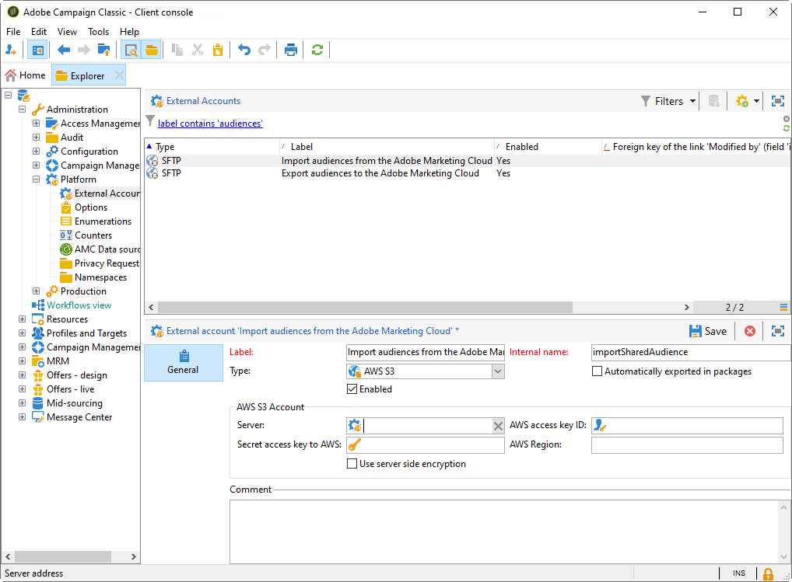

# Configurazione dell’integrazione dei tipi di pubblico condivisi in Adobe Campaign{#configuring-shared-audiences-integration-in-adobe-campaign}


Dopo aver inviato questa richiesta, Adobe procederà al provisioning dell’integrazione per te e ti contatterà per fornire dettagli e informazioni necessari per finalizzare la configurazione:

1. [Passaggio 1: configurare o controllare gli account esterni in Adobe Campaign](#step-1--configure-or-check-the-external-accounts-in-adobe-campaign)
1. [Passaggio 2: configurare Data Source](#step-2--configure-the-data-source)
1. [Passaggio 3: configurare il server di tracciamento campagna](#step-3--configure-campaign-tracking-server)
1. [Passaggio 4: configurare il servizio ID visitatori](#step-4--configure-the-visitor-id-service)

>[!IMPORTANT]
>
>Se utilizzi il dominio demdex e segui la sintassi **ftp-out.demdex.com** per l’account esterno di importazione e **ftp-in.demdex.com** per l’account esterno di esportazione, devi adattare di conseguenza l’implementazione e passare al connettore Amazon Simple Storage Service (S3) per importare o esportare i dati. Per ulteriori informazioni su come configurare gli account esterni con Amazon S3, consulta questa [sezione](../../integrations/using/configuring-shared-audiences-integration-in-adobe-campaign.md#step-1--configure-or-check-the-external-accounts-in-adobe-campaign).

Il diagramma seguente illustra il funzionamento di questa integrazione. Qui AAM sta per Adobe Audience Manager e AC per Adobe Campaign.

{align="center"}

## Passaggio 1: configurare o controllare gli account esterni in Adobe Campaign {#step-1--configure-or-check-the-external-accounts-in-adobe-campaign}

Innanzitutto, devi configurare o controllare gli account esterni in Adobe Campaign come segue:

1. Fare clic sull&#39;icona **[!UICONTROL Explorer]**.
1. Vai a **[!UICONTROL Administration > Platform > External accounts]**. Gli account SFTP menzionati avrebbero dovuto essere configurati da Adobe e le informazioni necessarie avrebbero dovuto essere comunicate all’utente.

   * **[!UICONTROL importSharedAudience]**: account dedicato all&#39;importazione di tipi di pubblico.
   * **[!UICONTROL exportSharedAudience]**: account dedicato all&#39;esportazione dei tipi di pubblico.

   

1. Selezionare l&#39;account esterno **[!UICONTROL Export audiences to the Adobe Marketing Cloud]**.

1. Dall&#39;elenco a discesa **[!UICONTROL Type]**, selezionare **[!UICONTROL AWS S3]**.

1. Fornisci i seguenti dettagli:

   * **[!UICONTROL AWS S3 Account Server]**
URL del server, deve essere compilato come segue:

     ```
     <S3bucket name>.s3.amazonaws.com/<s3object path>
     ```

   * **[!UICONTROL AWS access key ID]**
Per sapere dove trovare l&#39;ID della chiave di accesso AWS, consulta questa [pagina](https://docs.aws.amazon.com/general/latest/gr/aws-sec-cred-types.html#access-keys-and-secret-access-keys) .

   * **[!UICONTROL Secret access key to AWS]**
Per sapere dove trovare la chiave di accesso segreta ad AWS, consulta questa [pagina](https://aws.amazon.com/fr/blogs/security/wheres-my-secret-access-key/).

   * **[!UICONTROL AWS Region]**
Per ulteriori informazioni sull&#39;area geografica di AWS, consulta questa [pagina](https://aws.amazon.com/about-aws/global-infrastructure/regions_az/).

   

1. Fare clic su **[!UICONTROL Save]** e configurare l&#39;account esterno **[!UICONTROL Import audiences from the Adobe Marketing Cloud]** come descritto nei passaggi precedenti.

Gli account esterni sono ora configurati.

## Passaggio 2: configurare Data Source {#step-2--configure-the-data-source}

**Destinatario - ID visitatore** è stato creato all&#39;interno di Audience Manager. Si tratta di un’origine dati predefinita configurata per impostazione predefinita per l’ID visitatore. I segmenti creati da Campaign faranno parte di questa origine dati.

Per configurare l&#39;origine dati **[!UICONTROL Recipient - Visitor ID]**:

1. Dal nodo **[!UICONTROL Explorer]**, selezionare **[!UICONTROL Administration > Platform > AMC Data sources]**.
1. Seleziona **[!UICONTROL Recipient - Visitor ID]**.
1. Immettere **[!UICONTROL Data Source ID]** e **[!UICONTROL AAM Destination ID]** forniti da Adobe.

   

## Passaggio 3: configurare il server di tracciamento campagna {#step-3--configure-campaign-tracking-server}

Per la configurazione dell’integrazione con Audience Manager, è necessario configurare anche il server di tracciamento di Campaign.

Per consentire ai tipi di pubblico condivisi di funzionare con l’ID visitatore, il dominio del server di tracciamento deve essere un sottodominio dell’URL su cui è stato fatto clic o del sito web principale.

>[!IMPORTANT]
>
>Assicurati che il server di tracciamento di Campaign sia registrato nel dominio (CNAME). Ulteriori informazioni sulla delega dei nomi di dominio sono disponibili in [questo articolo](https://experienceleague.adobe.com/docs/control-panel/using/subdomains-and-certificates/setting-up-new-subdomain.html?lang=it).

## Passaggio 4: configurare il servizio ID visitatori {#step-4--configure-the-visitor-id-service}

Nel caso in cui il servizio ID visitatore non sia mai stato configurato nelle proprietà o nei siti Web, consulta il seguente [documento](https://experienceleague.adobe.com/docs/id-service/using/implementation/setup-aam-analytics.html) per scoprire come configurare il servizio o il seguente [video](https://helpx.adobe.com/it/marketing-cloud/how-to/email-marketing.html#step-two).

Sincronizza gli identificatori cliente con ID dichiarato utilizzando la funzione `setCustomerID` nel servizio ID Experience Cloud con il codice di integrazione: `AdobeCampaignID`. `AdobeCampaignID` deve corrispondere al valore della chiave di riconciliazione impostata nel Source dati del destinatario configurato in [Passaggio 2: configurare le origini dati](#step-2--configure-the-data-sources).

La configurazione e il provisioning sono finalizzati, l’integrazione ora può essere utilizzata per importare ed esportare tipi di pubblico o segmenti.
