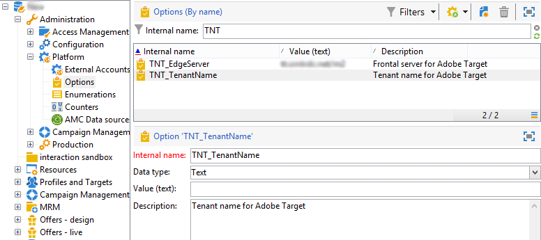

# Configurare l’integrazione con Adobe Target{#configuring-the-integration-with-adobe-target}

>[!CAUTION]
>
> In qualità di cliente in hosting o ibrido, contatta il tuo rappresentante Adobe per configurare questa integrazione. I passaggi seguenti sono applicabili solo ai clienti on-premise.

Questa integrazione richiede:

* Organizzazioni Adobe Experience Cloud e Adobe Target
* Un rawbox Adobe Target specificato per stabilire la connessione con Adobe Campaign

Per configurare questa integrazione in Adobe Campaign, effettua le seguenti operazioni:

1. Installa il pacchetto integrato **[!UICONTROL Integration with the Adobe Experience Cloud]**. [Ulteriori informazioni](../../platform/using/working-with-data-packages.md#importing-packages)

   Questo pacchetto consente di accedere alle risorse condivise tramite Digital Asset Manager.

1. Abilita la connessione tramite IMS (Adobe ID connection service) per utilizzare le immagini condivise tramite Adobe Experience Cloud nelle e-mail. [Ulteriori informazioni](../../integrations/using/about-adobe-id.md)
1. Passa a **[!UICONTROL Administration > Platform > Options]** per configurare le opzioni server e organizzazione (tenant) per Adobe Target:

   

   * **[!UICONTROL TNT_EdgeServer]**: server Adobe Target utilizzato per l&#39;integrazione. Questa opzione è già selezionata per impostazione predefinita. Questo valore corrisponde all&#39;Adobe Target **[!UICONTROL Domain Server]**, seguito dal valore **/m2**. Ad esempio: **tt.omtrdc.net/m2**.
   * **[!UICONTROL TNT_TenantName]**: nome organizzazione Adobe Target. Questo valore corrisponde al nome dell&#39;Adobe Target **[!UICONTROL Client]**.

>[!CAUTION]
>
>Per le architetture ibride e in hosting, queste opzioni devono essere impostate su tutti i server, inclusi il [server di mid-sourcing](../../installation/using/mid-sourcing-server.md) e l&#39;[istanza di esecuzione](../../message-center/using/configuring-instances.md#execution-instance).