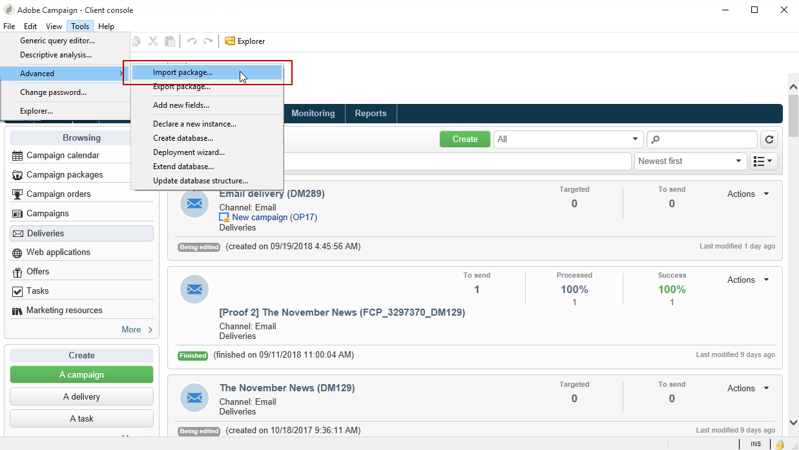

# Configurare l’integrazione Campaign-AEM{#configuring-the-integration}


## Passaggi di configurazione in Adobe Campaign {#configuring-in-adobe-campaign}

Per utilizzare insieme queste due soluzioni, è necessario configurarle per connettersi tra loro.

Per avviare la configurazione in Adobe Campaign, effettua le seguenti operazioni:

1. [Installare il pacchetto di integrazione dell’AEM in Adobe Campaign](#install-the-aem-integration-package-in-adobe-campaign)
1. [Configurare l’account esterno](#configure-the-external-account)
1. [Configurare il filtro delle risorse AEM](#configure-aem-resources-filtering)

Per configurazioni avanzate, ad esempio per gestire campi e blocchi di personalizzazione. Fai riferimento a Adobe Experience Manager [documentazione](https://helpx.adobe.com/experience-manager/6-5/sites/administering/using/campaignonpremise.html).

### Installare il pacchetto di integrazione dell’AEM in Adobe Campaign {#install-the-aem-integration-package-in-adobe-campaign}

È necessario innanzitutto installare **[!UICONTROL AEM integration]** pacchetto.

1. Dall’istanza di Adobe Campaign, seleziona **[!UICONTROL Tools]** dalla barra degli strumenti superiore.
1. Seleziona **[!UICONTROL Tools > Advanced > Import package...]**.

   

1. Seleziona **[!UICONTROL Install a standard package]**.
1. Verifica **[!UICONTROL AEM integration]** quindi fai clic su **[!UICONTROL Next]** pulsante.

   

1. Nella finestra successiva, fai clic su **[!UICONTROL Start]** per avviare l&#39;installazione del pacchetto. Chiudere la finestra al termine dell&#39;installazione.

### Configurare l’area di sicurezza per l’operatore AEM {#configure-the-security-zone-for-aem-operator}

Il **[!UICONTROL AEM integration]** imposta il **[!UICONTROL aemserver]** in Campaign. Questo operatore verrà utilizzato per connettere il server Adobe Experience Manager ad Adobe Campaign.

Devi configurare un’area di sicurezza per consentire a questo operatore di connettersi ad Adobe Campaign tramite Adobe Experience Manager.

>[!CAUTION]
>
>Per evitare problemi di sicurezza, si consiglia vivamente di creare un’area di sicurezza dedicata all’AEM. Per ulteriori informazioni, consulta Installazione di [guida](../../installation/using/security-zones.md).

Se l’istanza di Campaign è ospitata da Adobe, contatta [Assistenza clienti Adobe](https://helpx.adobe.com/it/enterprise/admin-guide.html/enterprise/using/support-for-experience-cloud.ug.html) team. Se utilizzi Campaign on-premise, effettua le seguenti operazioni:

1. Apri **serverConf.xml** file di configurazione.
1. Accedere a **allowUserPassword** attributo dell&#39;area di sicurezza selezionata e impostarlo su **true**.

   Questo consentirà a Adobe Experience Manager di connettere Adobe Campaign tramite login/password.

### Configurare l’account esterno {#configure-the-external-account}

Il **[!UICONTROL AEM integration]** il pacchetto ha creato l’account esterno per Adobe Experience Cloud. Ora devi configurarlo per connettersi all’istanza Adobe Experience Manager.

Per configurare l’account esterno dell’AEM, effettua le seguenti operazioni:

1. Fai clic sul pulsante **[!UICONTROL Explorer]**.

   

1. Seleziona **[!UICONTROL Administration > Platform > External accounts]**.
1. Dalla sezione **[!UICONTROL External account]** elenco, seleziona **[!UICONTROL AEM instance]**.
1. Immetti i parametri per l’istanza di authoring AEM:

   * **[!UICONTROL Server]**
   * **[!UICONTROL Account]**
   * **[!UICONTROL Password]**

   >[!NOTE]
   >
   >Assicurati che il tuo **[!UICONTROL Server]** non termina con una barra finale.

   

1. Controlla la **[!UICONTROL Enabled]** casella.
1. Fai clic sul pulsante **[!UICONTROL Save]**.

### Configurare il filtro delle risorse AEM {#configure-aem-resources-filtering}

Il **AEMResourceTypeFilter** L’opzione viene utilizzata per filtrare i tipi di risorse Experienci Manager che possono essere utilizzate in Adobe Campaign. Questo consente ad Adobe Campaign di recuperare contenuti di Experience Manager progettati specificamente per essere utilizzati solo in Adobe Campaign.

Per verificare se **[!UICONTROL AEMResourceTypeFilter]** l&#39;opzione è configurata:

1. Fai clic sul pulsante **[!UICONTROL Explorer]**.
1. Seleziona **[!UICONTROL Administration > Platform > Options]**.
1. Dalla sezione **[!UICONTROL Options]** elenco, seleziona **[!UICONTROL AEMResourceTypeFilter]**.
1. In **[!UICONTROL Value (text)]** il percorso deve essere il seguente:

   ```
   mcm/campaign/components/newsletter,mcm/campaign/components/campaign_newsletterpage,mcm/neolane/components/newsletter
   ```

   Oppure, in alcuni casi:

   ```
   mcm/campaign/components/newsletter
   ```

   

## Passaggi di configurazione in Adobe Experience Manager {#configuring-in-adobe-experience-manager}

Per avviare la configurazione in Adobe Experience Manager, effettua le seguenti operazioni:

1. Configurare **replica** per eseguire la replica dall’istanza di authoring AEM all’istanza di pubblicazione AEM.

   Per informazioni su come configurare la replica, consulta Adobe Experience Manager [documentazione](https://helpx.adobe.com/experience-manager/6-5/sites/deploying/using/replication.html).

1. Connettere Adobe Experience Manager ad Adobe Campaign configurando un **Cloud Service**.

   Per informazioni su come collegare entrambe le soluzioni tramite Cloud Service, consulta Adobe Experience Manager [documentazione](https://helpx.adobe.com/experience-manager/6-5/sites/administering/using/campaignonpremise.html#ConfiguringAdobeExperienceManager) .

1. Configurare **Servizio esternalizzazione**.

   Per informazioni su come configurarlo, consulta Adobe Experience Manager [documentazione](https://helpx.adobe.com/experience-manager/6-5/sites/developing/using/externalizer.html).
