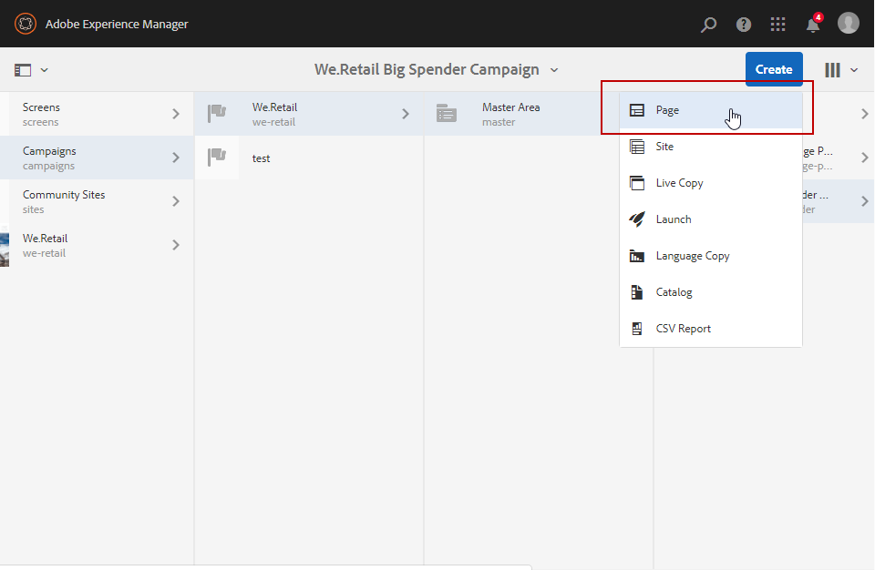
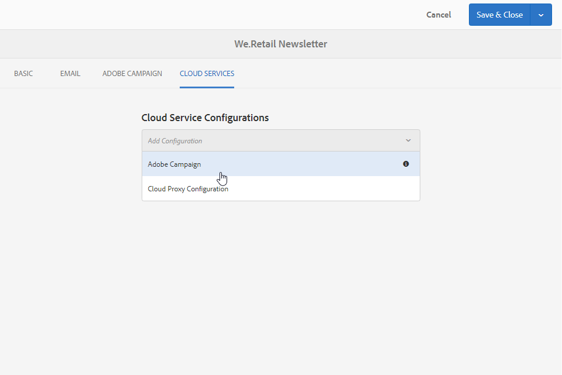
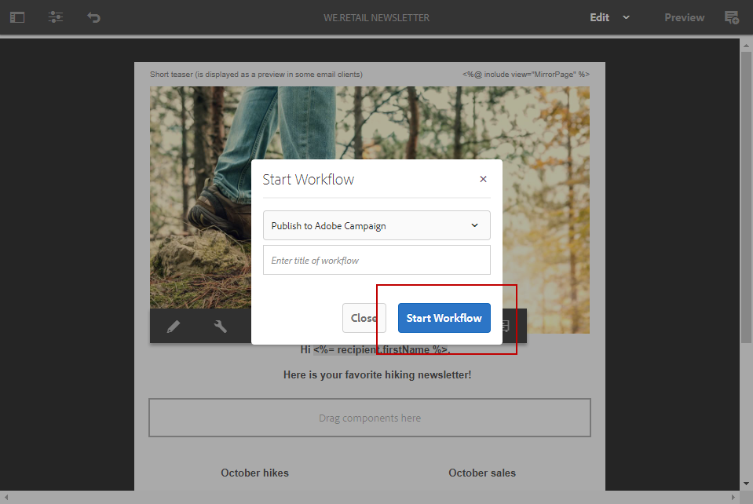
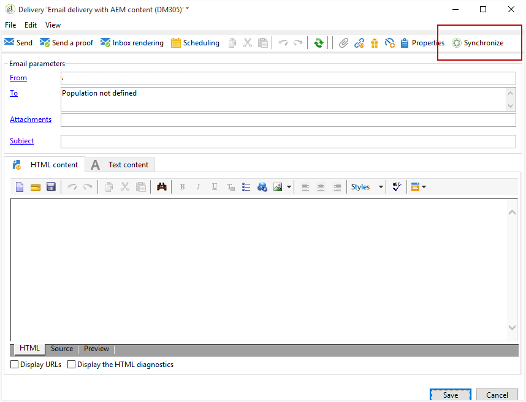

# Creazione di una newsletter Experience Manager{#creating-an-experience-manager-newsletter}

Questa integrazione può essere utilizzata, ad esempio, per creare una newsletter in Adobe Experience Manager che verrà quindi utilizzata in Adobe Campaign come parte di una campagna e-mail.

**Da Adobe Experience Manager:**

1. Nell&#39;istanza Autore AEM, fai clic sul logo **Adobe Experience** in alto a sinistra della pagina e seleziona **[!UICONTROL Sites]**.

   

1. Seleziona **[!UICONTROL Campaigns > Name of your brand (here We.Retail) > Main Area > Email campaigns]**.
1. Fai clic sul pulsante **[!UICONTROL Create]** in alto a destra della pagina, quindi seleziona **[!UICONTROL Page]**.

   

1. Seleziona il modello **[!UICONTROL Adobe Campaign Email (AC 6.1)]** e assegna un nome alla newsletter.
1. Una volta creata la pagina, accedere al menu **[!UICONTROL Page information]** e fare clic su **[!UICONTROL Open Properties]**.

   

1. Nella scheda **[!UICONTROL Cloud Services]**, seleziona **[!UICONTROL Adobe Campaign]** come **[!UICONTROL Cloud service configuration]** e la tua istanza Adobe Campaign nel secondo elenco a discesa.

   

1. Modifica il contenuto delle e-mail aggiungendo componenti, ad esempio campi di personalizzazione da Adobe Campaign.
1. Quando l&#39;e-mail è pronta, accedere al menu **[!UICONTROL Page information]** e fare clic su **[!UICONTROL Start workflow]**.

   

1. Dal primo elenco a discesa, selezionare **[!UICONTROL Publish to Adobe Campaign]** come modello di flusso di lavoro e fare clic su **[!UICONTROL Start workflow]**.

   

1. Quindi, come nel passaggio precedente, avvia il flusso di lavoro **[!UICONTROL Approve for Campaign]**.
1. Nella parte superiore della pagina viene visualizzata una liberatoria. Fare clic su **[!UICONTROL Complete]** per confermare la revisione e fare clic su **[!UICONTROL Ok]**.

   

1. Fare di nuovo clic su **[!UICONTROL Complete]** e selezionare **[!UICONTROL Newsletter approval]** nel menu a discesa **[!UICONTROL Next Step]**.

   

La newsletter è ora pronta e sincronizzata in Adobe Campaign.

**Da Adobe Campaign:**

1. Dalla scheda **[!UICONTROL Campaigns]**, fai clic su **[!UICONTROL Deliveries]** e quindi su **[!UICONTROL Create]**.

   

1. Nel menu a discesa **[!UICONTROL Delivery template]**, selezionare il modello **[!UICONTROL Email delivery with AEM content (mailAEMContent)]**.

   

1. Aggiungi **[!UICONTROL Label]** alla consegna e fai clic su **[!UICONTROL Continue]**.
1. Fai clic sul pulsante **[!UICONTROL Synchronize]**.

   Se questo pulsante non viene visualizzato nell&#39;interfaccia, fare clic sul pulsante **[!UICONTROL Properties]** e selezionare la scheda **[!UICONTROL Advanced]**. Il campo **[!UICONTROL Content editing mode]** deve essere impostato su **[!UICONTROL AEM]** con l&#39;istanza AEM nel campo **[!UICONTROL AEM account]**.

   

1. Selezionare la consegna creata in precedenza in Adobe Experience Manager e fare clic su **[!UICONTROL Ok]**.
1. Fai clic sul pulsante **[!UICONTROL Refresh content]** non appena vengono apportate alcune modifiche alla consegna AEM.

   

L’e-mail è ora pronta per essere inviata al pubblico.
