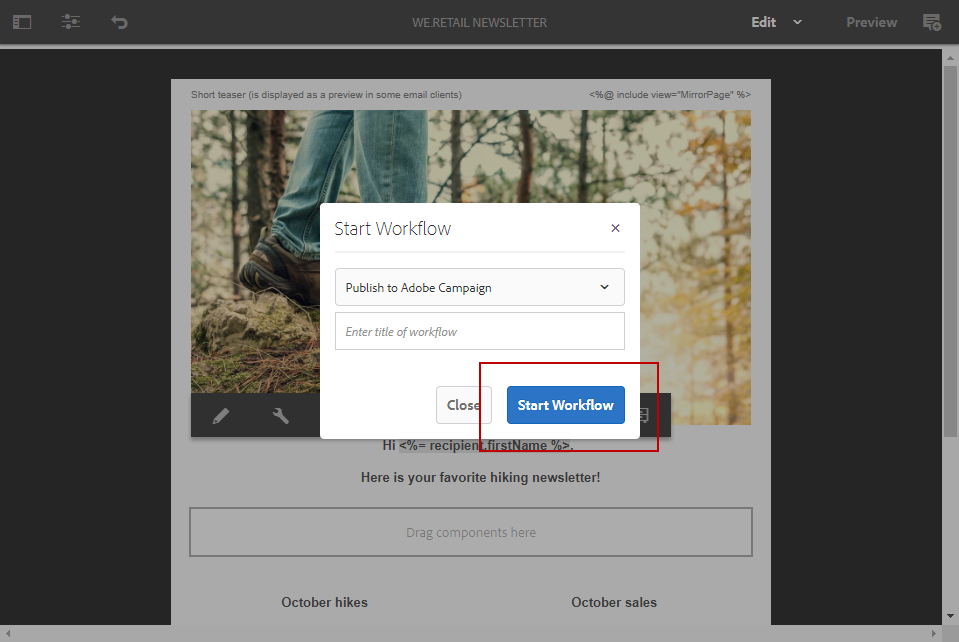

# Creazione di una newsletter di Experience Manager{#creating-an-experience-manager-newsletter}

Questa integrazione può essere utilizzata, ad esempio, per creare una newsletter in Adobe Experience Manager che verrà quindi utilizzata in Adobe Campaign come parte di una campagna e-mail.

**Da Adobe Experience Manager:**

1. Nell’istanza di authoring dell’AEM, fai clic su **Esperienza Adobe** in alto a sinistra della pagina e seleziona **[!UICONTROL Sites]**.

   

1. Seleziona **[!UICONTROL Campaigns > Name of your brand (here We.Retail) > Main Area > Email campaigns]**.
1. Fai clic su **[!UICONTROL Create]** in alto a destra, quindi seleziona **[!UICONTROL Page]**.

   

1. Seleziona la **[!UICONTROL Adobe Campaign Email (AC 6.1)]** crea un modello e assegna un nome alla newsletter.
1. Una volta creata la pagina, accedi a **[!UICONTROL Page information]** e fai clic su **[!UICONTROL Open Properties]**.

   

1. In **[!UICONTROL Cloud Services]** , seleziona **[!UICONTROL Adobe Campaign]** as **[!UICONTROL Cloud service configuration]** e la tua istanza di Adobe Campaign nel secondo elenco a discesa.

   

1. Modifica il contenuto delle e-mail aggiungendo componenti, ad esempio campi di personalizzazione da Adobe Campaign.
1. Quando l’e-mail è pronta, accedi al **[!UICONTROL Page information]** e fai clic su **[!UICONTROL Start workflow]**.

   

1. Dal primo elenco a discesa, seleziona **[!UICONTROL Publish to Adobe Campaign]** come modello di flusso di lavoro e fai clic su **[!UICONTROL Start workflow]**.

   

1. Quindi, come nel passaggio precedente, avvia **[!UICONTROL Approve for Campaign]** flusso di lavoro.
1. Nella parte superiore della pagina viene visualizzata una liberatoria. Clic **[!UICONTROL Complete]** per confermare la revisione e fare clic su **[!UICONTROL Ok]**.

   

1. Fai di nuovo clic su **[!UICONTROL Complete]** e seleziona **[!UICONTROL Newsletter approval]** nel **[!UICONTROL Next Step]** a discesa.

   

La newsletter è ora pronta e sincronizzata in Adobe Campaign.

**Da Adobe Campaign:**

1. Dalla sezione **[!UICONTROL Campaigns]** , fare clic su **[!UICONTROL Deliveries]** allora **[!UICONTROL Create]**.

   

1. In **[!UICONTROL Delivery template]** a discesa, seleziona la **[!UICONTROL Email delivery with AEM content (mailAEMContent)]** modello.

   

1. Aggiungi un **[!UICONTROL Label]** alla consegna e fai clic su **[!UICONTROL Continue]**.
1. Fai clic sul pulsante **[!UICONTROL Synchronize]**.

   Se questo pulsante non viene visualizzato nell&#39;interfaccia, fare clic sul pulsante **[!UICONTROL Properties]** e selezionare il pulsante **[!UICONTROL Advanced]** scheda. Il **[!UICONTROL Content editing mode]** deve essere impostato su **[!UICONTROL AEM]** con l’istanza di AEM nel **[!UICONTROL AEM account]** campo.

   

1. Seleziona la consegna creata in precedenza in Adobe Experience Manager e fai clic su **[!UICONTROL Ok]**.
1. Fai clic su **[!UICONTROL Refresh content]** non appena vengono apportate alcune modifiche alla consegna dell’AEM.

   

L’e-mail è ora pronta per essere inviata al pubblico.
