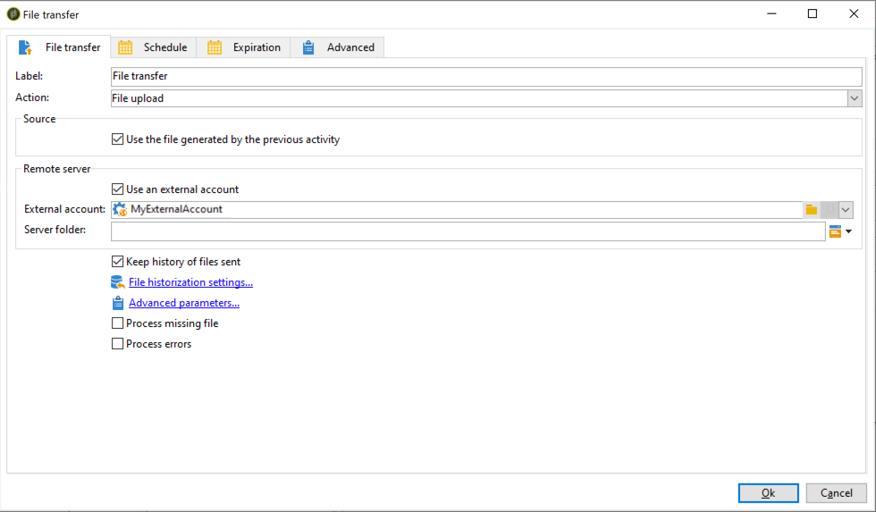

# Inserire segmenti Adobe Experience Platform in Campaign {#destinations}

Per acquisire Adobe Experience Platform in Campaign e utilizzarli nei flussi di lavoro, è innanzitutto necessario collegare Adobe Campaign as a Adobe Experience Platform **Destination** e configurarlo con il segmento da esportare.

Una volta configurata la destinazione, i dati verranno esportati nel percorso di archiviazione e dovrai creare un flusso di lavoro dedicato in Campaign Classic per acquisirli.

## Collegare Adobe Campaign come destinazione

In Adobe Experience Platform, configura una connessione con Adobe Campaign selezionando un percorso di archiviazione per i segmenti esportati. Questa procedura consente inoltre di selezionare i segmenti da esportare e specificare campi XDM aggiuntivi da includere.

Per ulteriori informazioni, consulta la [documentazione sulle destinazioni](https://experienceleague.adobe.com/docs/experience-platform/destinations/catalog/email-marketing/adobe-campaign.html).

Una volta configurata la destinazione, Adobe Experience Platform crea un file .txt o .csv delimitato da tabulazioni nel percorso di archiviazione fornito. Questa operazione è pianificata ed eseguita una volta ogni 24 ore.

Ora puoi configurare un flusso di lavoro Campaign Classic per l’acquisizione del segmento in Campaign.

## Creare un flusso di lavoro di importazione in Campaign Classic

Una volta configurato Campaign Classic come destinazione, è necessario creare un flusso di lavoro dedicato per importare il file esportato da Adobe Experience Platform.

A questo scopo, devi aggiungere e configurare un’attività **[!UICONTROL File transfer]** . Per ulteriori informazioni su come configurare questa attività, consulta [questa sezione](../../workflow/using/file-transfer.md).

Puoi quindi creare il flusso di lavoro in base alle tue esigenze (aggiorna il database utilizzando i dati del segmento, invia consegne cross-channel al segmento, ecc.)

Ad esempio, il flusso di lavoro seguente scarica il file dalla posizione di archiviazione su base giornaliera, quindi aggiorna il database Campaign con i dati del segmento.

