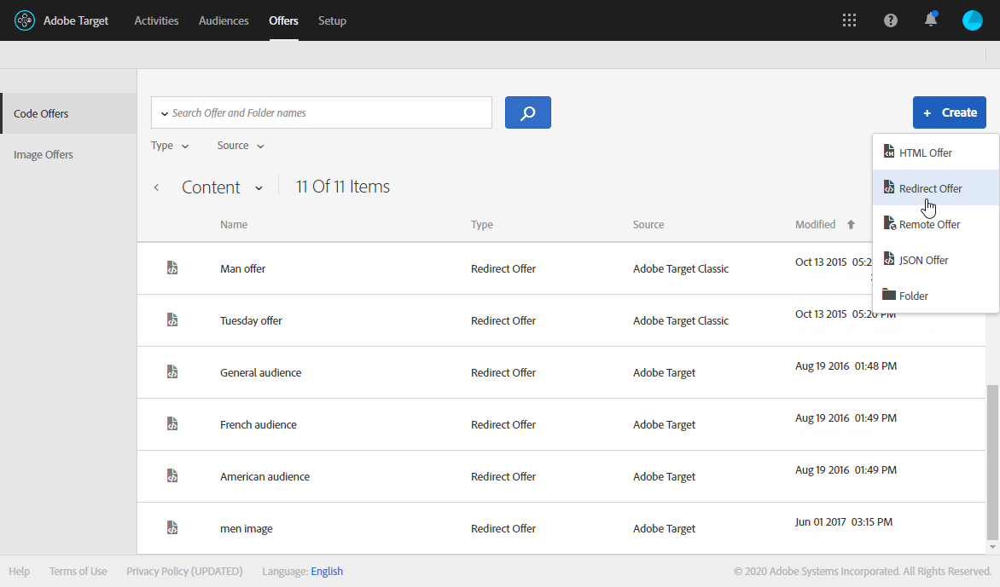

# Inserimento di contenuto dinamico Target {#inserting-a-dynamic-image}

In questa guida verrà illustrato come integrare un&#39;offerta dinamica da Target in un&#39;e-mail in  Adobe Campaign.

Vogliamo creare una consegna che includa un blocco immagine che verrà modificato dinamicamente in base al paese del destinatario. I dati vengono inviati con ciascuna richiesta mbox e dipendono dall&#39;indirizzo IP del visitatore.

In questo messaggio e-mail, desideriamo che una delle immagini possa variare dinamicamente in base alle seguenti esperienze utente:

* L&#39;e-mail viene aperta in Francia.
* L&#39;e-mail viene aperta negli Stati Uniti.
* Se non si applica nessuna di queste condizioni, viene visualizzata un&#39;immagine predefinita.

A tal fine, è necessario eseguire i seguenti passaggi sia in  Adobe Campaign che in Target:

1. [Inserimento dell’offerta dinamica in un messaggio e-mail](../../integrations/using/inserting-a-dynamic-image.md#inserting-dynamic-offer)
1. [Creazione di offerte di reindirizzamento](../../integrations/using/inserting-a-dynamic-image.md#create-redirect-offers)
1. [Creazione di tipi di pubblico](../../integrations/using/inserting-a-dynamic-image.md#audiences-target)
1. [Creazione di un&#39;attività Experience Targeting](../../integrations/using/inserting-a-dynamic-image.md#creating-targeting-activity)
1. [Anteprima e invio del messaggio e-mail](../../integrations/using/inserting-a-dynamic-image.md#preview-send-email)

## Inserimento dell&#39;offerta dinamica in un&#39;e-mail {#inserting-dynamic-offer}

In  Adobe Campaign, dopo aver definito la destinazione e il contenuto dell&#39;e-mail, potete inserire un&#39;immagine dinamica da Target.

A questo scopo, specificate l&#39;URL dell&#39;immagine predefinita, il nome della posizione e i campi che desiderate trasferire a Target.

In  Adobe Campaign, esistono due modi per inserire un&#39;immagine dinamica da Target in un messaggio e-mail:

* Se utilizzate l&#39;editor del contenuto digitale, scegliete un&#39;immagine esistente e selezionate **[!UICONTROL Insert]** > **[!UICONTROL Dynamic image served by Adobe Target]** dalla barra degli strumenti.

   

* Se utilizzate l&#39;editor standard, posizionate il cursore nel punto in cui desiderate inserire l&#39;immagine e selezionate **[!UICONTROL Include]** > **[!UICONTROL Dynamic image served by Adobe Target...]** dal menu a discesa Personalizzazione.

   

### Definizione dei parametri dell&#39;immagine {#defining-image-parameters}

* L&#39;URL di **[!UICONTROL Default image]**: Immagine che verrà visualizzata quando nessuna delle condizioni è soddisfatta. Puoi anche selezionare un’immagine dalla libreria Risorse.
* Il **[!UICONTROL Target location]**: Immettete un nome per la posizione dell&#39;offerta dinamica. Dovrai selezionare questa posizione nell&#39;attività Target.
* Il **[!UICONTROL Landing Page]**: Se si desidera che l&#39;immagine predefinita venga reindirizzata a una pagina di destinazione predefinita. Questo URL è solo per i casi in cui l’immagine predefinita viene visualizzata nell’e-mail finale ed è facoltativa.
* Il **[!UICONTROL Additional decision parameters]**: Specificate la mappatura tra i campi definiti nei segmenti Adobe Target  e i campi Adobe Campaign . I campi Adobe Campaign  utilizzati devono essere stati specificati nella rawbox. Nel nostro esempio, abbiamo aggiunto il campo Paese.

Se utilizzate le autorizzazioni Enterprise nelle impostazioni in  Adobe Target, aggiungete la proprietà corrispondente in questo campo. Ulteriori informazioni sulle autorizzazioni di Target Enterprise in [questa pagina](https://docs.adobe.com/content/help/en/target/using/administer/manage-users/enterprise/properties-overview.html).

## Creazione di offerte di reindirizzamento {#create-redirect-offers}

In Target potete creare diverse versioni dell&#39;offerta. A seconda dell’esperienza utente, è possibile creare un’offerta di reindirizzamento e specificare l’immagine da visualizzare.

Nel nostro caso, abbiamo bisogno di due offerte di reindirizzamento, la terza (quella predefinita) deve essere definita in  Adobe Campaign.

1. Per creare una nuova offerta di reindirizzamento in Target Standard, nella scheda **[!UICONTROL Content]** fate clic su **[!UICONTROL Code offers]**.

1. Fai clic su **[!UICONTROL Create]**, quindi su **[!UICONTROL Redirect Offer]**.

   

1. Immettete un nome per l’offerta e l’URL dell’immagine.

   

1. Seguite la stessa procedura per l&#39;offerta di reindirizzamento rimanente. Per ulteriori informazioni, consulta questa [pagina](https://docs.adobe.com/help/en/target/using/experiences/offers/offer-redirect.html).

## Creazione di tipi di pubblico {#audiences-target}

In Target, è necessario creare i due tipi di pubblico in cui le persone che visiteranno l&#39;offerta saranno classificate per i diversi contenuti da distribuire. Per ogni audience, aggiungete una regola per definire chi sarà in grado di visualizzare l&#39;offerta.

1. Per creare una nuova audience in Target, dalla scheda **[!UICONTROL Audiences]**, fai clic su **[!UICONTROL Create Audience]**.

   

1. Aggiungi un nome al pubblico.

   

1. Fare clic su **[!UICONTROL Add a rule]** e selezionare una categoria. La regola utilizza criteri specifici per eseguire il targeting dei visitatori. È possibile definire le regole aggiungendo condizioni o creando nuove regole in altre categorie.

1. Seguite la stessa procedura per i tipi di pubblico rimanenti.

## Creazione di un&#39;attività Experience Targeting {#creating-targeting-activity}

In Target, dobbiamo creare un&#39;attività Experience Targeting (Targeting delle esperienze), definire le diverse esperienze e associarle alle offerte corrispondenti.

### Definizione dell&#39;audience {#defining-the-audience}

1. Per creare un&#39;attività Experience Targeting, dalla scheda **[!UICONTROL Activities]** fai clic su **[!UICONTROL Create Activity]**, quindi su **[!UICONTROL Experience Targeting]**.

   

1. Selezionare **[!UICONTROL Form]** come **[!UICONTROL Experience Composer]**.

1. Scegliete un&#39;audience facendo clic sul pulsante **[!UICONTROL Change audience]**.

   

1. Selezionate l&#39;audience creata nei passaggi precedenti.

   

1. Create un&#39;altra esperienza facendo clic su **[!UICONTROL Add Experience Targeting]**.

### Definizione della posizione e del contenuto {#defining-location-content}

Aggiungete un contenuto per ogni audience:

1. Selezionate il nome della posizione scelta al momento dell’inserimento dell’offerta dinamica in  Adobe Campaign.

   

1. Fare clic sul pulsante a discesa e selezionare **[!UICONTROL Change Redirect Offer]**.

   

1. Selezionate l’offerta di reindirizzamento precedentemente creata.

   

1. Seguite gli stessi passaggi per la seconda esperienza.

### Definizione dell&#39;attività {#defining-activity}

La finestra **[!UICONTROL Target]** riepiloga l&#39;attività. Se necessario, potete aggiungere altre esperienze.

La finestra **[!UICONTROL Goal & Settings]** consente di personalizzare l&#39;attività impostando una priorità, un obiettivo o una durata.

La sezione **[!UICONTROL Reporting Settings]** consente di selezionare un&#39;azione e di modificare i parametri che determinano quando viene raggiunto l&#39;obiettivo.

## Anteprima e invio del messaggio e-mail in Campaign Classic {#preview-send-email}

In  Adobe Campaign, ora potete visualizzare l’anteprima dell’e-mail e verificarne il rendering su diversi destinatari. Noterete che l&#39;immagine cambia in base alle diverse esperienze create. Per ulteriori informazioni sulla creazione di e-mail, fare riferimento a questa [pagina](../../delivery/using/defining-the-email-content.md).

Ora è possibile inviare l&#39;e-mail con un&#39;offerta dinamica da Target.

