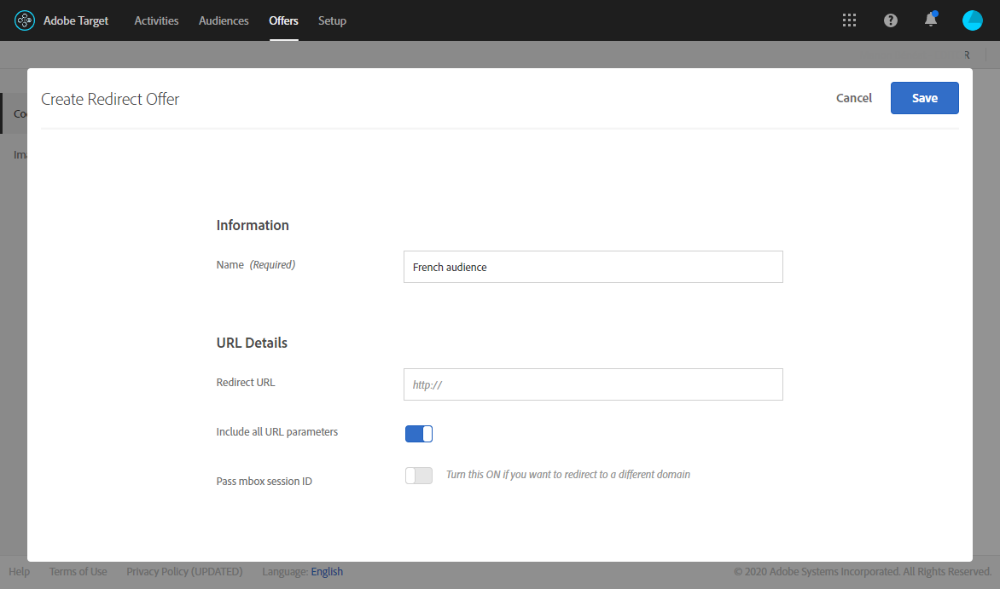

# Inserisci contenuto dinamico Target {#inserting-a-dynamic-image}

In questa pagina, scopri come integrare un’offerta dinamica da Adobe Target in un’e-mail in Adobe Campaign.

L’obiettivo è quello di creare una consegna con un blocco di immagine che cambia dinamicamente in base al paese del destinatario: i dati vengono inviati con ogni richiesta mbox e dipendono dall’indirizzo IP del destinatario.

In questo messaggio, le immagini possono variare dinamicamente in base alle seguenti esperienze utente:

* L’e-mail è stata aperta in Francia.
* L’e-mail viene aperta negli Stati Uniti.
* Se nessuna di queste condizioni è applicabile, viene visualizzata un&#39;immagine predefinita.

Per eseguire questa operazione, attieniti alla seguente procedura:

1. [Inserire l’offerta dinamica in un messaggio e-mail](../../integrations/using/inserting-a-dynamic-image.md#inserting-dynamic-offer)
1. [Creare offerte di reindirizzamento](../../integrations/using/inserting-a-dynamic-image.md#create-redirect-offers)
1. [Creare tipi di pubblico](../../integrations/using/inserting-a-dynamic-image.md#audiences-target)
1. [Creare un’attività Targeting esperienze](../../integrations/using/inserting-a-dynamic-image.md#creating-targeting-activity)
1. [Anteprima e invio dell’e-mail](../../integrations/using/inserting-a-dynamic-image.md#preview-send-email)

## Inserire l’offerta dinamica in un messaggio e-mail {#inserting-dynamic-offer}

In Adobe Campaign, una volta definiti il target e il contenuto dell’e-mail, puoi inserire un’immagine dinamica da Target.

A questo scopo, specifica l’URL dell’immagine predefinita, il nome della posizione e i campi da trasferire in Target.

In Adobe Campaign, esistono due modi per inserire un’immagine dinamica da Target in un messaggio e-mail:

* Se utilizzi l&#39;editor di contenuti digitali, scegli un&#39;immagine esistente e seleziona **[!UICONTROL Insert]** > **[!UICONTROL Dynamic image served by Adobe Target]** dalla barra degli strumenti.

  

* Se si utilizza l&#39;editor standard, posizionare il cursore nel punto in cui si desidera inserire l&#39;immagine e selezionare **[!UICONTROL Include]** > **[!UICONTROL Dynamic image served by Adobe Target...]** dal menu a discesa di personalizzazione.

  

### Definire i parametri dell&#39;immagine {#defining-image-parameters}

* URL di **[!UICONTROL Default image]**: immagine che verrà visualizzata quando non viene soddisfatta alcuna delle condizioni. Puoi anche selezionare un’immagine dalla libreria Assets.
* **[!UICONTROL Target location]**: immetti un nome per la posizione dell&#39;offerta dinamica. Dovrai selezionare questa posizione nell’attività di Target.
* **[!UICONTROL Landing Page]**: se desideri che l&#39;immagine predefinita venga reindirizzata a una pagina di destinazione predefinita. Questo URL si riferisce solo ai casi in cui l’immagine predefinita viene visualizzata nell’e-mail finale ed è facoltativa.
* **[!UICONTROL Additional decision parameters]**: specifica il mapping tra i campi definiti nei segmenti Adobe Target e i campi Adobe Campaign. I campi Adobe Campaign utilizzati devono essere stati specificati nella rawbox. Nel nostro esempio, abbiamo aggiunto il campo Paese.

Se utilizzi le autorizzazioni Enterprise nelle impostazioni di Adobe Target, aggiungi la proprietà corrispondente in questo campo. Ulteriori informazioni sulle autorizzazioni di Target Enterprise in [questa pagina](https://experienceleague.adobe.com/docs/target/using/administer/manage-users/enterprise/properties-overview.html).

## Creare offerte di reindirizzamento {#create-redirect-offers}

In Target puoi creare diverse versioni dell’offerta. A seconda di ogni esperienza utente, è possibile creare un’offerta di reindirizzamento e specificare l’immagine da visualizzare.

Nel nostro caso, abbiamo bisogno di due offerte di reindirizzamento, la terza (quella predefinita) deve essere definita in Adobe Campaign.

1. Per creare una nuova offerta di reindirizzamento in Target Standard, dalla scheda **[!UICONTROL Content]**, fare clic su **[!UICONTROL Code offers]**.

1. Fai clic su **[!UICONTROL Create]**, quindi su **[!UICONTROL Redirect Offer]**.

   

1. Immetti un nome per l’offerta e l’URL dell’immagine.

   

1. Segui la stessa procedura per l’offerta di reindirizzamento rimanente. Per ulteriori informazioni, consulta questa [pagina](https://experienceleague.adobe.com/docs/target/using/experiences/offers/offer-redirect.html).

## Creare tipi di pubblico {#audiences-target}

In Target, devi creare i due tipi di pubblico in cui le persone che visitano la tua offerta verranno categorizzate per i diversi contenuti da distribuire. Per ogni pubblico, aggiungi una regola per definire chi sarà in grado di visualizzare l’offerta.

1. Per creare un nuovo pubblico in Target, dalla scheda **[!UICONTROL Audiences]**, fai clic su **[!UICONTROL Create Audience]**.

   

1. Aggiungi un nome al pubblico.

   

1. Fare clic su **[!UICONTROL Add a rule]** e selezionare una categoria. La regola utilizza criteri specifici per eseguire il targeting dei visitatori. Puoi perfezionare le regole aggiungendo condizioni o creando nuove regole in altre categorie.

1. Segui la stessa procedura per i tipi di pubblico rimanenti.

## Creare un’attività Targeting esperienze {#creating-targeting-activity}

In Target, dobbiamo creare un’attività Targeting esperienza, definire le diverse esperienze e associarle alle offerte corrispondenti.

### Definire il pubblico {#defining-the-audience}

1. Per creare un&#39;attività Targeting esperienze, dalla scheda **[!UICONTROL Activities]**, fai clic su **[!UICONTROL Create Activity]** e quindi su **[!UICONTROL Experience Targeting]**.

   

1. Seleziona **[!UICONTROL Form]** come **[!UICONTROL Experience Composer]**.

1. Scegliere un pubblico facendo clic sul pulsante **[!UICONTROL Change audience]**.

   

1. Seleziona il pubblico creato nei passaggi precedenti.

   

1. Creare un&#39;altra esperienza facendo clic su **[!UICONTROL Add Experience Targeting]**.

### Definire la posizione e il contenuto {#defining-location-content}

Aggiungi un contenuto per ogni pubblico:

1. Seleziona il nome della posizione scelto al momento dell’inserimento dell’offerta dinamica in Adobe Campaign.

   

1. Fare clic sul pulsante a discesa e selezionare **[!UICONTROL Change Redirect Offer]**.

   

1. Seleziona l’offerta di reindirizzamento creata in precedenza.

   

1. Segui gli stessi passaggi per la seconda esperienza.

### Definire l’attività {#defining-activity}

La finestra **[!UICONTROL Target]** riepiloga l&#39;attività. Se necessario, puoi aggiungere altre esperienze.

La finestra **[!UICONTROL Goal & Settings]** consente di personalizzare l&#39;attività impostando una priorità, un obiettivo o una durata.

La sezione **[!UICONTROL Reporting Settings]** consente di selezionare un&#39;azione e modificare i parametri che determineranno quando l&#39;obiettivo verrà raggiunto.

## Anteprima e invio dell’e-mail {#preview-send-email}

In Adobe Campaign, ora puoi visualizzare in anteprima il messaggio e-mail e testarne il rendering su destinatari diversi. Noterai che l’immagine cambia in base alle diverse esperienze create. Per ulteriori informazioni sulla creazione di e-mail, consulta la [documentazione di Campaign v8](https://experienceleague.adobe.com/docs/campaign/campaign-v8/send/emails/defining-the-email-content.html){target="_blank"}.

Ora puoi inviare la tua e-mail contenente un’offerta dinamica di Target.

