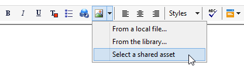
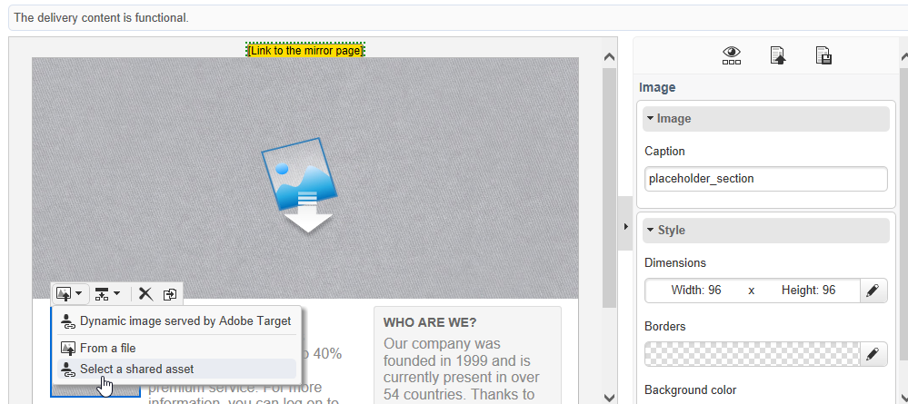
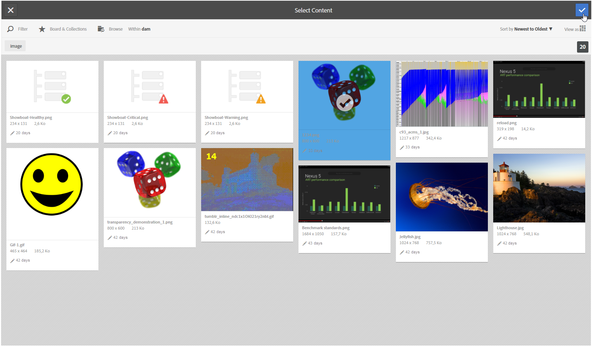

# Inserimento di una risorsa condivisa{#inserting-a-shared-asset}

Le risorse condivise da Adobe Experience Cloud possono essere utilizzate nelle e-mail e nelle pagine di destinazione come segue:

1. Crea una nuova e-mail o una nuova pagina di destinazione.

   Se utilizzi risorse dalla libreria delle risorse di Adobe Experience Manager, utilizza un modello di consegna creato quando [configurazione dell’integrazione](../../integrations/using/configuring-access-to-assets.md#integrating-with-aem-assets).

   Se non disponi di questo modello specifico, assicurati che nella consegna **Proprietà**, il **[!UICONTROL Content editing mode]** (**[!UICONTROL Advanced]** ) è impostato su **DCE** e che venga fornito l’account esterno dell’AEM che desideri utilizzare per accedere alla libreria delle risorse di AEM Assets.

1. Nella finestra di modifica, seleziona l’opzione per aggiungere un’immagine:

   * Se utilizzi il [modalità di modifica standard](../../delivery/using/defining-the-email-content.md#adding-images), seleziona **[!UICONTROL Image]** > **[!UICONTROL Select a shared asset]**.

     

   * Se utilizzi il [modalità di modifica avanzata](../../web/using/about-campaign-html-editor.md) (DCE), vai a un blocco di immagine, quindi tramite il menu contestuale, seleziona **[!UICONTROL Select a shared asset]**.

     

     >[!NOTE]
     >
     >Impossibile inserire immagini condivise da Adobe Campaign in [accesso web](../../platform/using/adobe-campaign-workspace.md#console-and-web-access) quando si utilizza il DCE.

1. Nella finestra di selezione visualizzata, seleziona un’immagine, quindi conferma.

   Le immagini disponibili provengono dalla libreria Adobe Experience Cloud o dalla libreria AEM Assets, a seconda di come è configurata la tua istanza di Adobe Campaign. Consulta la sezione [Configurazione dell’accesso alle risorse](../../integrations/using/configuring-access-to-assets.md) sezione.

   

>[!NOTE]
>
>Se utilizzi l’integrazione con Adobe Target, puoi utilizzare un’immagine condivisa come immagine predefinita. Consulta [questa pagina](../../integrations/using/integrating-with-adobe-target.md).
