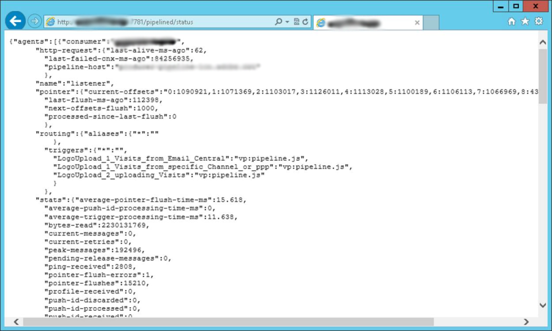

# Monitoraggio della pipeline {#pipeline-monitoring}

Il servizio Web di stato [!DNL pipelined] fornisce informazioni sullo stato del processo [!DNL pipelined].

È accessibile manualmente tramite un browser o automaticamente con un&#39;applicazione di monitoraggio.

È in formato REST, come descritto di seguito.

## Indicatori {#indicators}

In questa sezione sono elencati gli indicatori nel servizio Web di stato.

Vengono evidenziati gli indicatori consigliati per il monitoraggio.

* Consumer: nome del client che richiama i trigger. Configurato nell’opzione pipeline.
* richiesta http
   * last-alive-ms-ago: ora in ms da quando è stato eseguito un controllo della connessione.
   * last-failed-cnx-ms-ago: ora in ms dall&#39;ultima verifica della connessione non riuscita.
   * pipeline-host: nome dell’host da cui vengono estratti i dati della pipeline.
* puntatore
   * current-offsets: valore del puntatore nella pipeline, per thread figlio.
   * last-flush-ms-ago: ora in ms da quando è stato recuperato un batch di trigger.
   * next-offsets-flush: tempo di attesa del batch successivo al termine.
   * processed-Since-last-flush: numero di trigger elaborati nell&#39;ultimo batch.
* indirizzamento
   * trigger: elenco di trigger recuperati. Configurato nell&#39;opzione [!DNL pipelined].
* statistiche
   * average-pointer-flush-time-ms: tempo medio di elaborazione per un batch di trigger.
   * average-trigger-processing-time-ms: tempo medio impiegato per l’analisi dei dati dei trigger.
   * byte letti: numero di byte letti dalla coda dall&#39;avvio del processo.
   * current-messages: numero corrente di messaggi in sospeso che sono stati estratti dalla coda e sono in attesa di elaborazione. **Questo indicatore deve essere vicino a zero**.
   * current-retries: numero corrente di messaggi la cui elaborazione non è riuscita e che sono in attesa di un nuovo tentativo.
   * messaggi di picco: numero massimo di messaggi in sospeso gestiti dal processo dall&#39;avvio.
   * scaricamenti del puntatore: numero di batch di messaggi elaborati dall&#39;inizio.
   * routing-JS-custom: numero di messaggi elaborati dal JS personalizzato.
   * trigger-discarded: numero di messaggi che sono stati scartati dopo troppi tentativi a causa di errori di elaborazione.
   * trigger-processed: numero di messaggi elaborati senza errori.
   * trigger-received: numero di messaggi ricevuti dalla coda.

Queste statistiche vengono visualizzate per thread di elaborazione.

* average-trigger-processing-time-ms: tempo medio impiegato per l’analisi dei dati dei trigger.
* is-JS-processor: valore &quot;1&quot; se questo thread utilizza il file JS personalizzato.
* trigger-discarded: numero di messaggi che sono stati scartati dopo troppi tentativi a causa di errori di elaborazione. **Questo indicatore deve essere zero**.
* trigger-failures: numero di errori di elaborazione in JS. **Questo indicatore deve essere zero**.
* trigger-received: numero di messaggi ricevuti dalla coda.

* Impostazioni: vengono impostate nei file di configurazione.
   * flush-pointer-msg-count: numero di messaggi in un batch.
   * flush-pointer-period-ms: tempo tra due batch, in millisecondi.
   * processing-threads-JS: numero di thread di elaborazione che eseguono il file JS personalizzato.
   * retry-period-ms: tempo tra due tentativi quando si verifica un errore di elaborazione.
   * retry-validation-duration-ms: durata dal momento in cui l’elaborazione viene ritentata fino a quando il messaggio non viene eliminato.
   * Rapporto sui messaggi della pipeline

## Rapporto sui messaggi della pipeline {#pipeline-report}

Questo rapporto visualizza il numero di messaggi all’ora negli ultimi cinque giorni.

