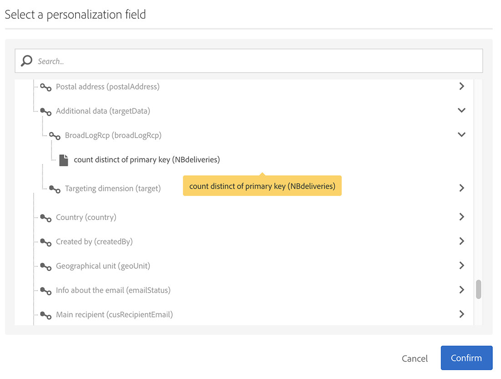

# Sincronizzare i tipi di pubblico{#synchronizing-audiences}

Puoi creare un elenco sofisticato utilizzando le funzioni avanzate di Campaign v7 e condividere questo elenco come pubblico direttamente e in tempo reale con Campaign Standard (inclusi i dati aggiuntivi) in modo semplice. L’utente Campaign Standard può quindi utilizzare il pubblico in Adobe Campaign Standard.

Il targeting complesso che coinvolge dati aggiuntivi non replicati in Campaign Standard può essere ottenuto solo utilizzando Campaign v7.

Puoi anche semplicemente condividere elenchi di destinatari o dati provenienti da un connettore come Microsoft Dynamics con Campaign Standard.

Questo caso d’uso mostra come preparare il target della consegna in Campaign v7 e come riutilizzare tale target e i relativi dati aggiuntivi in una consegna creata e inviata con Adobe Campaign Standard.

>[!NOTE]
>
>Puoi anche arricchire i dati utilizzando aggregati e raccolte in Adobe Campaign Standard, se tutti i dati necessari sono già replicati.

## Prerequisiti {#prerequisites}

Per ottenere questo risultato, è necessario:

* Destinatari memorizzati nel database di Campaign v7 e sincronizzati con Campaign Standard. Consulta la sezione [Sincronizzazione dei profili](../../integrations/using/synchronizing-profiles.md) sezione.
* Dati aggiuntivi come sottoscrizioni o transazioni memorizzate in tabelle correlate a nms:recipients nel database di Campaign v7. Questi dati possono provenire da schemi OOB o tabelle personalizzate di Campaign v7. Per impostazione predefinita, non sono disponibili in Campaign Standard in quanto non sono sincronizzati.
* Diritto di eseguire flussi di lavoro in Campaign v7 e Campaign Standard.
* Diritto di creare ed eseguire una consegna in Campaign Standard.

## Creare un flusso di lavoro di targeting con dati aggiuntivi in Campaign v7 {#create-a-targeting-workflow-with-additional-data-in-campaign-v7}

Il targeting complesso che coinvolge dati aggiuntivi non replicati in Campaign Standard può essere ottenuto solo utilizzando Campaign v7.

Una volta definiti il target e i relativi dati aggiuntivi, è possibile salvarlo come elenco che può essere condiviso con Campaign Standard.

>[!NOTE]
>
>Questo è un esempio. A seconda delle tue esigenze, puoi semplicemente eseguire una query su un elenco di destinatari e condividerlo con ACS senza ulteriori elaborazioni. Puoi anche utilizzare altre attività di gestione dati per preparare il target finale.

Per ottenere il pubblico finale e i relativi dati aggiuntivi:

1. Crea un nuovo flusso di lavoro da **[!UICONTROL Profiles and Targets]** > **[!UICONTROL Jobs]** > **[!UICONTROL Targeting workflows]**.
1. Aggiungi un **[!UICONTROL Query]** e selezionare i destinatari a cui si desidera inviare l’e-mail finale. Ad esempio, tutti i destinatari tra i 18 e i 30 anni che vivono in Francia.

   

1. Aggiungi dati aggiuntivi dall’interno della query. Per ulteriori informazioni, consulta [Aggiunta di dati](../../workflow/using/query.md#adding-data) sezione.

   Questo esempio mostra come aggiungere un aggregato per contare quante consegne ha ricevuto un destinatario in un anno.

   In **[!UICONTROL Query]**, seleziona **[!UICONTROL Add data...]**.

   

1. Seleziona **[!UICONTROL Data linked to the filtering dimension]** e fai clic su **[!UICONTROL Next]**.

   

1. Scegli **[!UICONTROL Data linked to the filtering dimension]** e quindi selezionare **[!UICONTROL Recipient delivery logs]** e fai clic su **[!UICONTROL Next]**.

   

1. Seleziona **[!UICONTROL Aggregates]** nel **[!UICONTROL Data collected]** e fai clic su **[!UICONTROL Next]**.

   

1. Aggiungi una condizione di filtro per tenere conto solo dei registri creati negli ultimi 365 giorni e fai clic su **[!UICONTROL Next]**.

   

1. Definisci le colonne di output. In questo caso, l’unica colonna necessaria è quella che conta il numero di consegne. Per eseguire questa operazione:

   * Seleziona **[!UICONTROL Add]** sulla destra della finestra.
   * Dalla sezione **[!UICONTROL Select field]** finestra, fai clic su **[!UICONTROL Advanced selection]**.
   * Seleziona **[!UICONTROL Aggregate]**, quindi **[!UICONTROL Count]**. Controlla la **[!UICONTROL Distinct]** e fai clic su **[!UICONTROL Next]**.
   * Nell’elenco dei campi, seleziona il campo utilizzato per il campo **Conteggio** funzione. Scegli un campo che verrà sempre compilato, ad esempio il campo **[!UICONTROL Primary key]** e fai clic su **[!UICONTROL Finish]**.
   * Modificare l’espressione in **[!UICONTROL Alias]** colonna. Questo alias ti consentirà di recuperare facilmente la colonna aggiunta nella consegna finale. Ad esempio **Consegne NB**.
   * Clic **[!UICONTROL Finish]** e salva **[!UICONTROL Query]** configurazione attività.

   

1. Salva il flusso di lavoro. La sezione successiva mostra come condividere la popolazione con ACS.

## Condividere la destinazione con Campaign Standard {#share-the-target-with-campaign-standard}

Una volta definita la popolazione target, puoi condividerla con ACS tramite un **[!UICONTROL List update]** attività.

1. Nel flusso di lavoro creato in precedenza, aggiungi **[!UICONTROL List update]** e specificare l&#39;elenco da aggiornare o creare.

   Specifica la cartella in cui desideri salvare l’elenco in Campaign v7. Gli elenchi sono soggetti alla mappatura delle cartelle definita durante l’implementazione, che può avere un impatto sulla loro visibilità una volta condivisi in Campaign Standard. Consulta la sezione [Conversione dei diritti](../../integrations/using/acs-connector-principles-and-data-cycle.md#rights-conversion) sezione.

1. Assicurati che le **[!UICONTROL Share with ACS]** è selezionata. È selezionata per impostazione predefinita.

   

1. Salva ed esegui il flusso di lavoro.

   Il target e i relativi dati aggiuntivi vengono salvati in un elenco in Campaign v7 e condivisi immediatamente come pubblico di elenco in Campaign Standard. Solo i profili replicati vengono condivisi con ACS.

Se si verifica un errore in **[!UICONTROL List update]** significa che la sincronizzazione con Campaign Standard potrebbe non essere riuscita. Per visualizzare ulteriori dettagli su ciò che è andato storto, vai a **[!UICONTROL Administration]** > **[!UICONTROL ACS Connector]** > **[!UICONTROL Process]** > **[!UICONTROL Diagnosis]**. Questa cartella contiene flussi di lavoro di sincronizzazione attivati da **[!UICONTROL List update]** esecuzione dell’attività. Consulta la sezione [Risoluzione dei problemi del connettore ACS](../../integrations/using/troubleshooting-the-acs-connector.md) sezione.

## Recuperare i dati in Campaign Standard e utilizzarli in una consegna {#retrieve-the-data-in-campaign-standard-and-use-it-in-a-delivery}

Una volta eseguito il flusso di lavoro di targeting in Campaign v7, puoi trovare il pubblico dell’elenco in modalità di sola lettura da **[!UICONTROL Audiences]** menu di Campaign Standard.

Creando un flusso di lavoro di consegna in Campaign Standard, è quindi possibile utilizzare questo pubblico e i dati aggiuntivi in essa contenuti in una consegna.

1. Crea un nuovo flusso di lavoro da **[!UICONTROL Marketing activities]** menu.
1. Aggiungi un **[!UICONTROL Read audience]** e selezionare il pubblico condiviso in precedenza da Campaign v7.

   Questa attività viene utilizzata per recuperare i dati del pubblico selezionato. Puoi anche applicare un’ulteriore **[!UICONTROL Source Filtering]** se necessario, utilizzando la scheda corrispondente di questa attività.

1. Aggiungi un **[!UICONTROL Email delivery]** e configurarlo come qualsiasi altro [attività di consegna e-mail](https://experienceleague.adobe.com/docs/campaign-standard/using/managing-processes-and-data/channel-activities/email-delivery.html).
1. Apri il contenuto della consegna.
1. Aggiungi un campo di personalizzazione. Dalla finestra a comparsa, individua **[!UICONTROL Additional data (targetData)]** nodo. Questo nodo contiene i dati aggiuntivi del pubblico calcolati nel flusso di lavoro di targeting iniziale. Puoi utilizzarli come qualsiasi altro campo di personalizzazione.

   Per questo esempio, i dati aggiuntivi provenienti dal flusso di lavoro di targeting originale corrispondono al numero di consegne inviate a ciascun destinatario negli ultimi 365 giorni. L’alias NBdeliveries specificato nel flusso di lavoro di targeting è visibile qui.

   

1. Salva la consegna e il flusso di lavoro.

   Il flusso di lavoro è ora pronto per essere eseguito. La consegna verrà analizzata e pronta per essere inviata.

   

## Inviare e monitorare la consegna {#send-and-monitor-your-delivery}

Una volta che la consegna e il relativo contenuto sono pronti, invia la consegna:

1. Esegui il flusso di lavoro di consegna. Questo passaggio prepara l’e-mail per l’invio.
1. Dal dashboard di consegna, conferma manualmente che la consegna può essere inviata.
1. Monitora i rapporti e i registri della consegna:

   * **In Campaign Standard**: accesso [rapporti](https://experienceleague.adobe.com/docs/campaign-standard/using/reporting/about-reporting/about-dynamic-reports.html) e [registri](https://experienceleague.adobe.com/docs/campaign-standard/using/testing-and-sending/monitoring-messages/monitoring-a-delivery.html) relative alla consegna come per qualsiasi consegna.
   * **in Campaign v7 e Campaign Standard**: gli ID di consegna, i registri e-mail generali e i registri di tracciamento e-mail sono sincronizzati con Campaign v7. Potrai quindi ottenere una visualizzazione a 360° delle campagne di marketing da Campaign v7.

     Le quarantene vengono sincronizzate automaticamente con Campaign v7. Ciò consente di tenere conto delle informazioni non consegnabili per il targeting successivo eseguito in Campaign v7.

     Ulteriori informazioni sulla gestione della quarantena in Campaign Standard sono disponibili in [questa sezione](https://experienceleague.adobe.com/docs/campaign-standard/using/testing-and-sending/monitoring-messages/understanding-quarantine-management.html).
