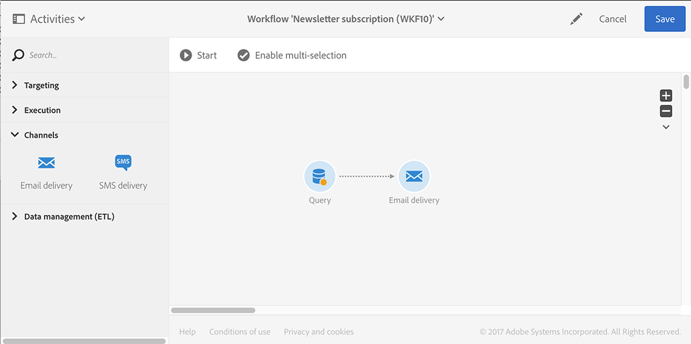
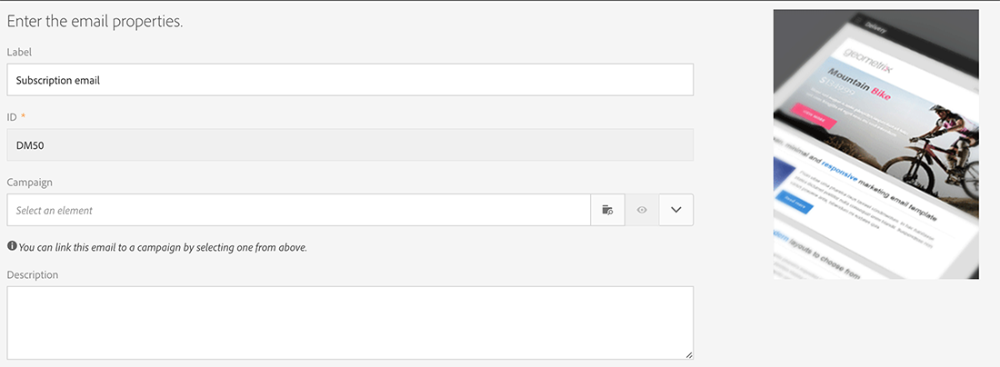
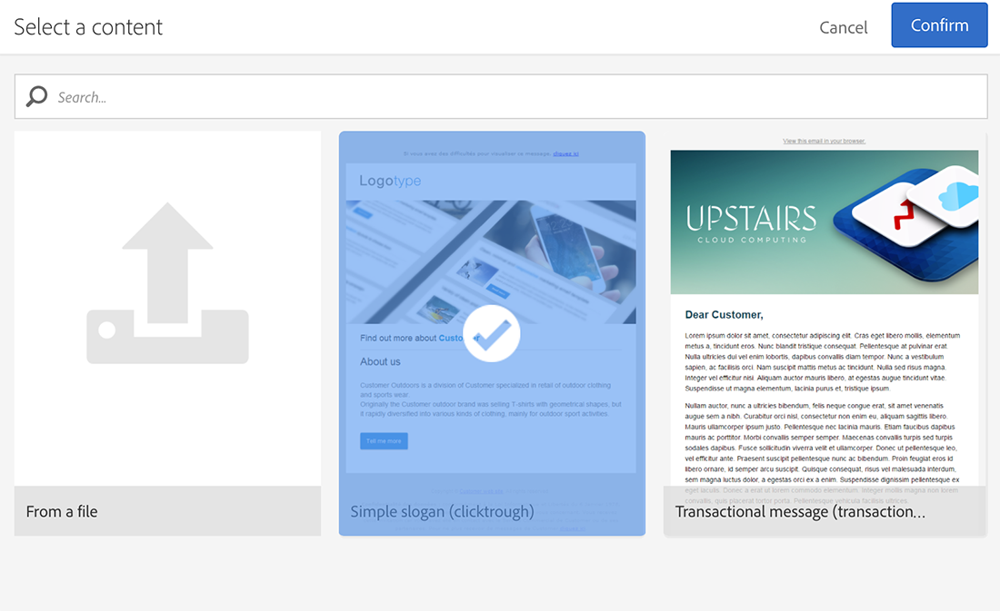
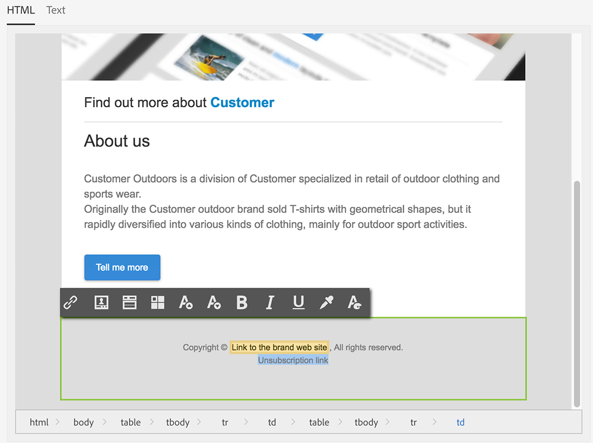
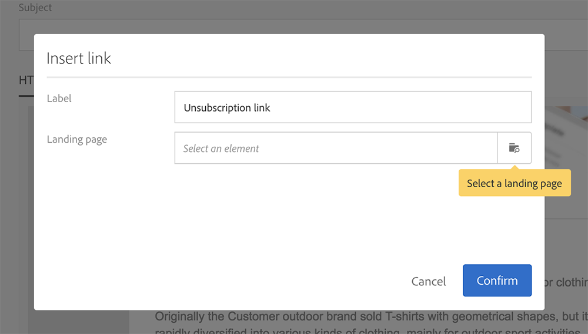
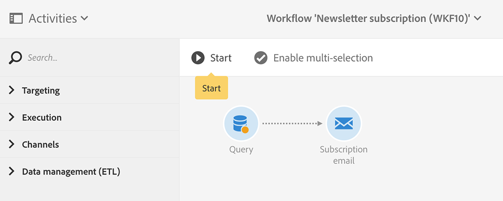

# Sincronizzare i profili{#synchronizing-profiles}

Il connettore ACS replica i dati da Campaign v7 a Campaign Standard. I dati ricevuti da Campaign v7 possono essere utilizzati in Campaign Standard per creare consegne. Puoi vedere come vengono sincronizzati i profili eseguendo le operazioni elencate di seguito.

* **Aggiungi nuovi destinatari**: crea un nuovo destinatario in Campaign v7 e verifica che un profilo corrispondente sia stato replicato in Campaign Standard. Vedi [Crea un nuovo destinatario](#creating-a-new-recipient).
* **Aggiorna destinatari**: modifica un nuovo destinatario in Campaign v7 e visualizza il profilo corrispondente in Campaign Standard per confermare che l&#39;aggiornamento è stato replicato. Vedi [Modificare un destinatario](#editing-a-recipient).
* **Crea un flusso di lavoro in Campaign Standard**: crea un flusso di lavoro in Campaign Standard che includa una query con uno o più profili replicati da Campaign v7. Consulta [Creare un flusso di lavoro](#creating-a-workflow).
* **Crea una consegna in Campaign Standard**: segui il flusso di lavoro fino al completamento per inviare una consegna. Consulta [Creare una consegna](#creating-a-delivery).
* **Verificare il collegamento di annullamento dell&#39;abbonamento**: utilizzare un&#39;applicazione Web Campaign v7 per assicurarsi che la scelta del destinatario di annullare l&#39;abbonamento a un servizio venga inviata al database Campaign v7. L’opzione per interrompere la ricezione del servizio viene replicata in Campaign Standard. Consulta [Modifica il collegamento di annullamento dell&#39;abbonamento](#changing-the-unsubscription-link).

## Prerequisiti {#prerequisites}

Le sezioni seguenti descrivono come il connettore ACS consente di aggiungere e modificare i destinatari in Campaign v7 e quindi utilizzarli in una consegna Campaign Standard. Il connettore ACS richiede quanto segue:

* I destinatari di Campaign v7 sono stati replicati in Campaign Standard.
* Diritti utente per eseguire flussi di lavoro in Campaign v7 e Campaign Standard.
* Diritti utente per creare ed eseguire una consegna in Campaign Standard.

## Modificare il collegamento di annullamento dell’abbonamento {#changing-the-unsubscription-link}

Quando un destinatario fa clic sul collegamento di annullamento dell’abbonamento in un’e-mail inviata da Campaign Standard, il profilo corrispondente in Campaign Standard viene aggiornato. Per fare in modo che un profilo replicato includa la scelta di un utente di annullare l’abbonamento a un servizio, le informazioni devono essere inviate a Campaign v7 anziché a Campaign Standard. Per eseguire la modifica, il servizio di annullamento dell’abbonamento è collegato a un’applicazione web Campaign v7 anziché a Campaign Standard.

>[!NOTE]
>
>Chiedi al tuo consulente di configurare l’applicazione web per il servizio di annullamento dell’abbonamento prima di seguire questi passaggi.

## Crea un nuovo destinatario {#creating-a-new-recipient}

1. Crea un nuovo destinatario in Campaign v7 per la replica in Campaign Standard. Inserisci quante più informazioni possibili, tra cui il cognome, il nome, l’indirizzo e-mail e l’indirizzo postale del destinatario. Tuttavia, non scegliere un **[!UICONTROL Salutation]** poiché verrà aggiunto nella sezione successiva, [Modifica un destinatario](#editing-a-recipient).

   

1. Verifica che il nuovo destinatario sia stato aggiunto a Campaign Standard. Durante la revisione del profilo, accertati che i dati immessi in Campaign v7 siano disponibili anche in Campaign Standard. Per sapere dove trovare i profili in Campaign Standard, consulta [Nozioni di base sulla navigazione](https://experienceleague.adobe.com/docs/campaign-standard/using/getting-started/discovering-the-interface/interface-description.html?lang=it).

   

   Per impostazione predefinita, la replica periodica per il connettore ACS viene eseguita una volta ogni 15 minuti. Per ulteriori informazioni, vedere [Replica dei dati](../../integrations/using/acs-connector-principles-and-data-cycle.md#data-replication).

## Modificare un destinatario {#editing-a-recipient}

I passaggi seguenti per la modifica di un singolo punto di dati offrono un semplice esempio di come Campaign v7 diventi il database principale per Campaign Standard quando si utilizza la replica dei dati. La modifica o l’eliminazione dei dati replicati in Campaign v7 ha lo stesso effetto sui dati corrispondenti in Campaign Standard.

1. Scegli il destinatario appena creato da [Crea un nuovo destinatario](#creating-a-new-recipient) e modifica il suo nome. Scegliere ad esempio **[!UICONTROL Salutation]** per il destinatario (ad esempio Sig. o Sig.ra).

   

1. Verifica che il nome del destinatario sia stato aggiornato in Campaign Standard. Per sapere dove trovare i profili in Campaign Standard, consulta [Nozioni di base sulla navigazione](https://experienceleague.adobe.com/docs/campaign-standard/using/getting-started/discovering-the-interface/interface-description.html?lang=it).

   

   Per impostazione predefinita, la replica periodica per il connettore ACS viene eseguita una volta ogni 15 minuti. Per ulteriori informazioni, vedere [Replica dei dati](../../integrations/using/acs-connector-principles-and-data-cycle.md#data-replication).

## Creare un flusso di lavoro {#creating-a-workflow}

I profili e i servizi replicati da Campaign v7 sono disponibili per gli esperti di marketing digitale e consentono di sfruttare i dati avanzati in Campaign Standard. Le istruzioni riportate di seguito illustrano come aggiungere una query a un flusso di lavoro di Campaign Standard e quindi utilizzarla con il database replicato.

Per ulteriori informazioni e istruzioni complete sui flussi di lavoro di Campaign Standard, vedi [Flussi di lavoro](../../workflow/using/about-workflows.md).

1. Passare a Campaign Standard e fare clic su **[!UICONTROL Marketing Activities]**.
1. Fai clic su **[!UICONTROL Create]** in alto a destra.
1. Fai clic su **[!UICONTROL Workflow]**.
1. Fare clic su **[!UICONTROL New workflow]** e **[!UICONTROL Next]**.
1. Immettere un nome per il flusso di lavoro nel campo **[!UICONTROL Label]** e ulteriori informazioni, se necessario. Fai clic su **[!UICONTROL Next]**.
1. Da **[!UICONTROL Targeting]** a sinistra, trascinare una destinazione **[!UICONTROL Query]** nell&#39;area di lavoro.

   

1. Fare doppio clic sull&#39;attività **[!UICONTROL Query]** e scegliere un parametro che possa essere utilizzato con il database replicato. Ad esempio, puoi:

   * Trascina **[!UICONTROL Profiles]** nell&#39;area di lavoro. Utilizza il menu a discesa del campo per scegliere **[!UICONTROL Is external resource]** per trovare i profili replicati da Campaign v7.
   * Trascina altri parametri di query per eseguire ulteriormente il targeting dei profili replicati.

## Creare una consegna {#creating-a-delivery}

>[!NOTE]
>
>Le istruzioni per la creazione della consegna continuano il flusso di lavoro avviato con [Crea un flusso di lavoro](#creating-a-workflow).

Gli esperti di marketing digitale possono sfruttare un’applicazione web Campaign v7 per assicurarsi che la scelta di un destinatario di annullare l’abbonamento a un servizio venga inviata al database Campaign v7. Dopo che il destinatario ha fatto clic sul collegamento di annullamento dell’abbonamento, l’opzione per interrompere la ricezione del servizio viene replicata da Campaign v7 a Campaign Standard. Per ulteriori dettagli, vedere [Modificare il collegamento di annullamento dell&#39;abbonamento](#changing-the-unsubscription-link).

Segui i passaggi seguenti per aggiungere una consegna e-mail a un flusso di lavoro esistente con il servizio di annullamento dell’abbonamento creato in Campaign v7. Per ulteriori informazioni e istruzioni complete sui flussi di lavoro di Campaign Standard, consulta questo [documento](../../workflow/using/about-workflows.md).

>[!NOTE]
>
>Chiedi al tuo consulente di configurare l’applicazione web per il servizio di annullamento dell’abbonamento prima di seguire questi passaggi.

1. Fare clic su **[!UICONTROL Channels]** a sinistra.
1. Trascina **[!UICONTROL Email delivery]** nel flusso di lavoro esistente nell&#39;area di lavoro.

   

1. Fare doppio clic sull&#39;attività **[!UICONTROL Email delivery]** e scegliere **[!UICONTROL Single send email]** o **[!UICONTROL Recurring email]**. Selezionare le opzioni e fare clic su **[!UICONTROL Next]**.
1. Fare clic su **[!UICONTROL Send via email]** e su **[!UICONTROL Next]**.

   

1. Immettere un nome per la consegna nel campo **[!UICONTROL Label]** e ulteriori informazioni, se necessario. Fai clic su **[!UICONTROL Next]**.

   

1. Nel campo **[!UICONTROL Subject]**, immettere l&#39;oggetto che verrà visualizzato nella casella in entrata e-mail del destinatario.
1. Fare clic su **[!UICONTROL Change content]** per aggiungere un modello di HTML.

   

1. Scegli il contenuto che include il collegamento per annullare l’abbonamento al servizio. Fai clic su **[!UICONTROL Confirm]**.

   

1. Il collegamento di annullamento dell’abbonamento corrente deve essere sostituito da uno nuovo che utilizza l’applicazione web creata dal consulente. Individua il collegamento di annullamento dell’abbonamento nella parte inferiore del contenuto dell’e-mail e fai clic su di esso una volta. Fai clic sull’icona cestino per eliminare il collegamento.

   

1. Fare clic all&#39;interno della stessa area di contenuto e digitare **Collegamento per annullare l&#39;abbonamento**.

   

1. Evidenziare il testo con il cursore e fare clic sull&#39;icona della catena.
1. Fai clic su **[!UICONTROL Link to a landing page]**.

   

1. Fai clic sull’icona della cartella per scegliere la pagina di destinazione.

   

1. Scegliere l&#39;applicazione Web creata dal consulente e fare clic su **[!UICONTROL Confirm]**.

   

1. Fai clic su **[!UICONTROL Create]**.
1. Torna al flusso di lavoro facendo clic sul nome della consegna.

   

1. Fare clic su **[!UICONTROL Start]** per inviare la consegna. L’icona di consegna e-mail lampeggia per indicare che è in corso la preparazione per la consegna.

   

1. Fare doppio clic sul canale **[!UICONTROL Email delivery]** e scegliere **[!UICONTROL Confirm]** per inviare l&#39;e-mail. Fare clic su **[!UICONTROL OK]** per inviare i messaggi.

   

## Verificare il servizio di annullamento dell’abbonamento {#verifying-the-unsubscription-service}

Segui le istruzioni in [Creare un flusso di lavoro](#creating-a-workflow) e [Creare una consegna](#creating-a-delivery) prima di passare ai passaggi seguenti.

1. Il destinatario fa clic sul collegamento di annullamento dell’abbonamento nella consegna e-mail.

   

1. Il destinatario conferma l’annullamento dell’abbonamento.

   

1. I dati dei destinatari in Campaign v7 vengono aggiornati per riflettere l’annullamento dell’abbonamento da parte dell’utente. Verificare che la casella **[!UICONTROL No longer contact (by any channel)]** sia selezionata per il destinatario.

   

1. Vai a Campaign Standard e apri i dettagli del profilo del destinatario. Verificare che accanto a **[!UICONTROL No longer contact (by any channel)]** venga visualizzata una casella di controllo. Per sapere dove trovare i profili in Campaign Standard, consulta [Nozioni di base sulla navigazione](https://experienceleague.adobe.com/docs/campaign-standard/using/getting-started/discovering-the-interface/interface-description.html?lang=it).

   
