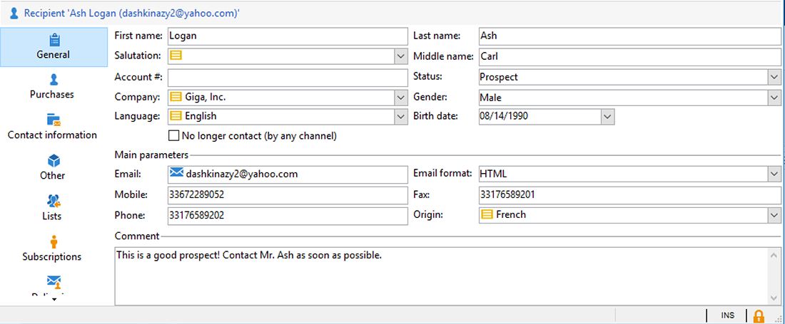

# Sincronizzazione dei profili{#synchronizing-profiles}

Il connettore ACS replica i dati da Campaign v7 a Campaign Standard. I dati ricevuti da Campaign v7 possono essere utilizzati in Campaign Standard per creare consegne. Potete vedere come i profili vengono sincronizzati eseguendo le operazioni elencate di seguito.

* **Aggiungi nuovi destinatari**: Crea un nuovo destinatario in Campaign v7 e conferma che un profilo corrispondente è stato replicato in Campaign Standard. Vedere [Creazione di un nuovo destinatario](#creating-a-new-recipient).
* **Aggiorna destinatari**: Modificate un nuovo destinatario in Campaign v7 e visualizzate il profilo corrispondente in Campaign Standard per confermare che l&#39;aggiornamento è stato replicato. Vedere [Modifica di un destinatario](#editing-a-recipient).
* **Crea un flusso di lavoro in Campaign Standard**: Create un flusso di lavoro in Campaign Standard che includa una query con un&#39;audience o con profili replicati da Campaign v7. Vedere [Creazione di un flusso di lavoro](#creating-a-workflow).
* **Crea una consegna in Campaign Standard**: Segui il flusso di lavoro per completare l’invio. Vedere [Creazione di una consegna](#creating-a-delivery).
* **Verificare il collegamento** di annullamento della sottoscrizione: Utilizzate un&#39;applicazione Web Campaign v7 per essere certi che la scelta del destinatario di annullare l&#39;iscrizione a un servizio venga inviata al database Campaign v7. L&#39;opzione per interrompere la ricezione del servizio viene replicata in Campaign Standard. Vedere [Modifica del collegamento di annullamento dell&#39;iscrizione](#changing-the-unsubscription-link).

## Prerequisiti {#prerequisites}

Nelle sezioni seguenti viene descritto come ACS Connector consente di aggiungere e modificare i destinatari in Campaign v7 e di utilizzarli in una distribuzione di Campaign Standard. Il connettore ACS richiede quanto segue:

* I destinatari in Campaign v7 vengono replicati in Campaign Standard.
* Diritti degli utenti per l&#39;esecuzione di flussi di lavoro sia in Campaign v7 che in Campaign Standard.
* Diritti utente per creare ed eseguire una consegna in Campaign Standard.

## Modifica del collegamento di annullamento della sottoscrizione {#changing-the-unsubscription-link}

Quando un destinatario fa clic sul collegamento di annullamento dell&#39;iscrizione in un&#39;e-mail inviata da un Campaign Standard, il profilo corrispondente in Campaign Standard viene aggiornato. Per essere certi che un profilo replicato includa la scelta dell&#39;utente di annullare l&#39;iscrizione a un servizio, le informazioni devono essere inviate a Campaign v7 invece che a Campaign Standard. Per eseguire la modifica, il servizio di annullamento dell&#39;iscrizione è collegato a un&#39;applicazione Web Campaign v7 anziché a un Campaign Standard.

>[!NOTE]
>
>Chiedete al vostro consulente di configurare l&#39;applicazione Web per il servizio di annullamento dell&#39;iscrizione prima di seguire i passaggi indicati di seguito.

## Creazione di un nuovo destinatario {#creating-a-new-recipient}

1. Crea un nuovo destinatario in Campaign v7 per la replica in Campaign Standard. Inserite il maggior numero possibile di informazioni, inclusi cognome, nome, indirizzo e-mail e indirizzo postale del destinatario. Tuttavia, non scegliere un **[!UICONTROL Salutation]** poiché verrà aggiunto nella sezione successiva, [Modifica di un destinatario](#editing-a-recipient). Per ulteriori informazioni, vedere [Aggiunta di destinatari](../../platform/using/adding-profiles.md).

   

1. Conferma che il nuovo destinatario sia stato aggiunto al Campaign Standard. Quando rivedete il profilo, accertatevi che i dati immessi in Campaign v7 siano disponibili anche in Campaign Standard. Per scoprire dove trovare i profili in Campaign Standard, vedere [Nozioni di base sulla navigazione](https://docs.adobe.com/content/help/it-IT/campaign-standard/using/getting-started/discovering-the-interface/interface-description.html).

   

   Per impostazione predefinita, la replica periodica per il connettore ACS è una volta ogni 15 minuti. Per ulteriori informazioni, vedere [Replica dati](../../integrations/using/acs-connector-principles-and-data-cycle.md#data-replication).

## Modifica di un destinatario {#editing-a-recipient}

La procedura seguente per modificare un singolo punto di dati offre un semplice esempio di come Campaign v7 diventa il database principale per i Campaign Standard quando si utilizza la replica dei dati. La modifica o l&#39;eliminazione dei dati replicati in Campaign v7 ha lo stesso effetto sui dati corrispondenti in Campaign Standard.

1. Scegli il destinatario appena creato da [Creazione di un nuovo destinatario](#creating-a-new-recipient) e modifica il nome del destinatario. Ad esempio, scegliete un **[!UICONTROL Salutation]** per il destinatario (ad esempio, Sig. o Sig.). Per ulteriori informazioni, vedere [Modifica di un profilo](../../platform/using/editing-a-profile.md).

   

1. Conferma che il nome del destinatario sia stato aggiornato in Campaign Standard. Per scoprire dove trovare i profili in Campaign Standard, vedere [Nozioni di base sulla navigazione](https://docs.adobe.com/content/help/en/campaign-standard/using/getting-started/discovering-the-interface/interface-description.html).

   

   Per impostazione predefinita, la replica periodica per il connettore ACS è una volta ogni 15 minuti. Per ulteriori informazioni, vedere [Replica dati](../../integrations/using/acs-connector-principles-and-data-cycle.md#data-replication).

## Creazione di un flusso di lavoro {#creating-a-workflow}

I profili e i servizi replicati da Campaign v7 sono disponibili agli esperti di marketing digitale per sfruttare i dati avanzati in Campaign Standard. Le istruzioni riportate di seguito illustrano come aggiungere una query a un flusso di lavoro Campaign Standard e utilizzarla con il database replicato.

Per ulteriori informazioni e istruzioni complete sui flussi di lavoro Campaign Standard, vedere [Flussi di lavoro](../../workflow/using/about-workflows.md).

1. Vai al Campaign Standard e fai clic su **[!UICONTROL Marketing Activities]**.
1. Fare clic su **[!UICONTROL Create]** in alto a destra.
1. Fai clic su **[!UICONTROL Workflow]**.
1. Fare clic su **[!UICONTROL New workflow]** e **[!UICONTROL Next]**.
1. Immettete un nome per il flusso di lavoro nel campo **[!UICONTROL Label]** e, se necessario, ulteriori informazioni. Fai clic su **[!UICONTROL Next]**.
1. Da **[!UICONTROL Targeting]** a sinistra, trascinate una destinazione **[!UICONTROL Query]** nell&#39;area di lavoro.

   

1. Fate doppio clic sull&#39;attività **[!UICONTROL Query]** e scegliete un parametro che possa essere utilizzato con il database replicato. Ad esempio, potete:

   * Trascinare **[!UICONTROL Profiles]** nell&#39;area di lavoro. Utilizzate il menu a discesa del campo per scegliere **[!UICONTROL Is external resource]** per trovare i profili replicati da Campaign v7.
   * Trascinate altri parametri di query per eseguire un ulteriore targeting dei profili replicati.

## Creazione di una consegna {#creating-a-delivery}

>[!NOTE]
>
>Le istruzioni per la creazione della consegna proseguono il flusso di lavoro avviato con [Creazione di un flusso di lavoro](#creating-a-workflow).

Gli esperti di marketing digitale possono utilizzare un&#39;applicazione Web Campaign v7 per assicurarsi che la scelta del destinatario di annullare la sottoscrizione a un servizio venga inviata al database Campaign v7. Dopo che il destinatario fa clic sul collegamento di annullamento dell&#39;iscrizione, l&#39;opzione per interrompere la ricezione del servizio viene replicata da Campaign v7 a Campaign Standard. Per ulteriori dettagli, vedere [Modifica del collegamento per l&#39;annullamento della sottoscrizione](#changing-the-unsubscription-link).

Seguite i passaggi riportati di seguito per aggiungere una consegna e-mail a un flusso di lavoro esistente con il servizio di annullamento dell&#39;iscrizione creato in Campaign v7. Per ulteriori informazioni e istruzioni complete sui flussi di lavoro Campaign Standard, vedere questo [documento](../../workflow/using/about-workflows.md).

>[!NOTE]
>
>Chiedete al vostro consulente di configurare l&#39;applicazione Web per il servizio di annullamento dell&#39;iscrizione prima di seguire i passaggi indicati di seguito.

1. Fare clic su **[!UICONTROL Channels]** a sinistra.
1. Trascinare **[!UICONTROL Email delivery]** nel flusso di lavoro esistente nell&#39;area di lavoro.

   

1. Fare doppio clic sull&#39;attività **[!UICONTROL Email delivery]** e scegliere **[!UICONTROL Single send email]** o **[!UICONTROL Recurring email]**. Selezionate le opzioni e fate clic su **[!UICONTROL Next]**.
1. Fare clic su **[!UICONTROL Send via email]** e fare clic su **[!UICONTROL Next]**.

   

1. Immettete un nome per la consegna nel campo **[!UICONTROL Label]** e, se necessario, ulteriori informazioni. Fai clic su **[!UICONTROL Next]**.

   

1. Nel campo **[!UICONTROL Subject]**, immettere l&#39;oggetto che verrà visualizzato nella casella in entrata del destinatario.
1. Fate clic su **[!UICONTROL Change content]** per aggiungere un modello HTML.

   

1. Scegliete il contenuto che include il collegamento per annullare l’iscrizione al servizio. Fai clic su **[!UICONTROL Confirm]**.

   

1. Il collegamento di annullamento dell&#39;iscrizione corrente deve essere sostituito da un nuovo collegamento che utilizza l&#39;applicazione Web creata dal consulente. Individuate il collegamento di annullamento dell’iscrizione nella parte inferiore del contenuto dell’e-mail e fate clic su di esso una volta. Fai clic sull’icona del cestino per eliminare il collegamento.

   

1. Fare clic all&#39;interno della stessa area di contenuto e digitare **Annulla sottoscrizione link**.

   

1. Evidenzia il testo con il cursore e fai clic sull’icona della catena.
1. Fai clic su **[!UICONTROL Link to a landing page]**.

   

1. Fate clic sull’icona della cartella per scegliere la pagina di destinazione.

   

1. Scegliete l&#39;applicazione Web creata dal consulente e fate clic su **[!UICONTROL Confirm]**.

   

1. Fai clic su **[!UICONTROL Create]**.
1. Tornate al flusso di lavoro facendo clic sul nome della consegna.

   

1. Fare clic su **[!UICONTROL Start]** per inviare la consegna. L&#39;icona di consegna dell&#39;e-mail lampeggia per indicare che è in corso la preparazione per la consegna.

   

1. Fare doppio clic sul canale **[!UICONTROL Email delivery]** e scegliere **[!UICONTROL Confirm]** per inviare l&#39;e-mail. Fare clic su **[!UICONTROL OK]** per inviare i messaggi.

   

## Verifica del servizio di annullamento della sottoscrizione {#verifying-the-unsubscription-service}

Seguire le istruzioni riportate in [Creazione di un flusso di lavoro](#creating-a-workflow) e [Creazione di una consegna](#creating-a-delivery) prima di passare ai passaggi descritti di seguito.

1. Il destinatario fa clic sul collegamento di annullamento dell’iscrizione nella consegna del messaggio e-mail.

   

1. Il destinatario conferma l’annullamento della sottoscrizione.

   

1. I dati del destinatario in Campaign v7 vengono aggiornati per indicare che l&#39;utente ha annullato la sottoscrizione. Verificare che la casella **[!UICONTROL No longer contact (by any channel)]** sia selezionata per il destinatario. Per informazioni su come visualizzare un destinatario in Campaign v7, vedi [Modifica di un profilo](../../platform/using/editing-a-profile.md).

   

1. Vai al Campaign Standard e apri i dettagli del profilo per il destinatario. Verificate che accanto a **[!UICONTROL No longer contact (by any channel)]** sia visualizzata una casella di controllo. Per scoprire dove trovare i profili in Campaign Standard, vedere [Nozioni di base sulla navigazione](https://docs.adobe.com/content/help/en/campaign-standard/using/getting-started/discovering-the-interface/interface-description.html).

   

