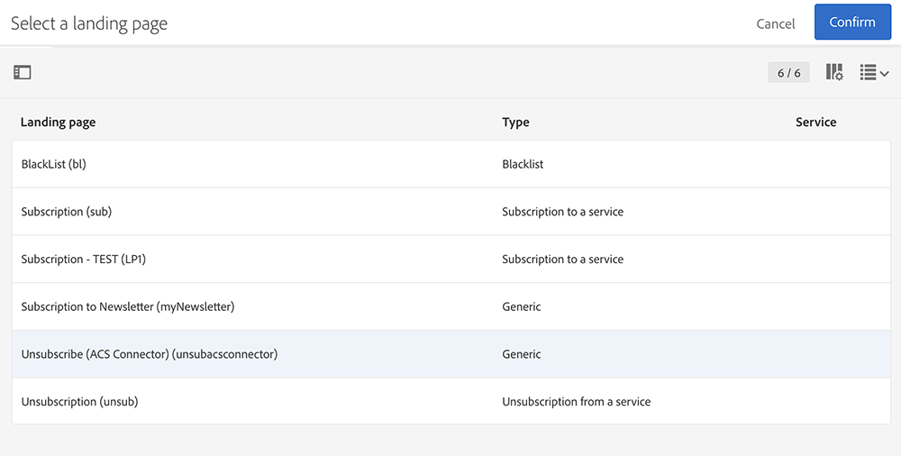
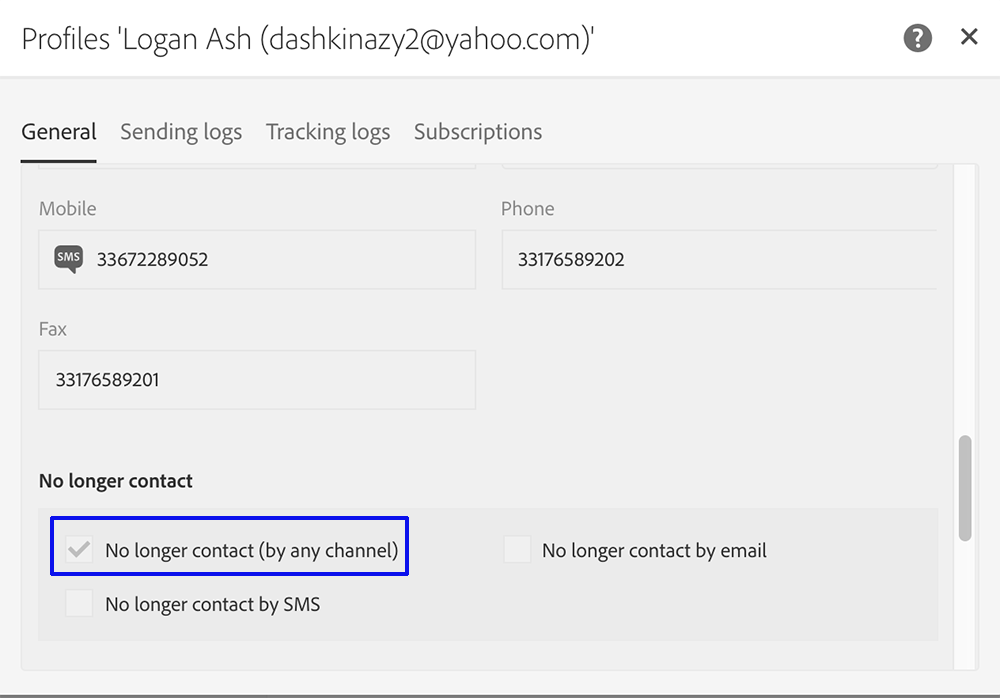

# Sincronizzare i profili{#synchronizing-profiles}

Il connettore ACS replica i dati da Campaign v7 a Campaign Standard. I dati ricevuti da Campaign v7 possono essere utilizzati in Campaign Standard per creare consegne. Puoi vedere come i profili vengono sincronizzati eseguendo le operazioni elencate di seguito.

* **Aggiungi nuovi destinatari**: Crea un nuovo destinatario in Campaign v7 e conferma che un profilo corrispondente è stato replicato in Campaign Standard. Vedi [Crea un nuovo destinatario](#creating-a-new-recipient).
* **Aggiornare i destinatari**: Modifica un nuovo destinatario in Campaign v7 e visualizza il profilo corrispondente in Campaign Standard per confermare che l’aggiornamento è stato replicato. Vedi [Modificare un destinatario](#editing-a-recipient).
* **Creare un flusso di lavoro in Campaign Standard**: Crea un flusso di lavoro in Campaign Standard che include una query con un pubblico o con profili replicati da Campaign v7. Vedi [Creare un flusso di lavoro](#creating-a-workflow).
* **Creare una consegna in Campaign Standard**: Per inviare una consegna, segui il flusso di lavoro per completare l’operazione. Vedi [Creare una consegna](#creating-a-delivery).
* **Verifica il collegamento di annullamento dell’abbonamento**: Utilizza un’applicazione web Campaign v7 per assicurarti che la scelta del destinatario di annullare l’iscrizione a un servizio sia inviata al database Campaign v7. L’opzione per interrompere la ricezione del servizio viene replicata in Campaign Standard. Vedi [Modificare il collegamento di annullamento all’abbonamento](#changing-the-unsubscription-link).

## Prerequisiti {#prerequisites}

Nelle sezioni seguenti viene descritto come ACS Connector consente di aggiungere e modificare i destinatari in Campaign v7 e quindi di utilizzarli in una consegna Campaign Standard. Il connettore ACS richiede quanto segue:

* Destinatari in Campaign v7 replicati in Campaign Standard.
* Diritti degli utenti per l’esecuzione di flussi di lavoro sia in Campaign v7 che in Campaign Standard.
* Diritti dell’utente per creare ed eseguire una consegna in Campaign Standard.

## Modificare il collegamento di annullamento all’abbonamento {#changing-the-unsubscription-link}

Quando un destinatario fa clic sul collegamento di annullamento dell’abbonamento in un’e-mail inviata da Campaign Standard, il profilo corrispondente in Campaign Standard viene aggiornato. Per assicurarsi che un profilo replicato includa la scelta dell’utente di annullare l’iscrizione a un servizio, le informazioni devono essere inviate a Campaign v7 anziché a Campaign Standard. Per eseguire la modifica, il servizio di annullamento dell’abbonamento è collegato a un’applicazione web Campaign v7 anziché ad Campaign Standard.

>[!NOTE]
>
>Chiedi al tuo consulente di configurare l&#39;applicazione web per il servizio di annullamento dell&#39;abbonamento prima di seguire i passaggi seguenti.

## Crea un nuovo destinatario {#creating-a-new-recipient}

1. Crea un nuovo destinatario in Campaign v7 per la replica in Campaign Standard. Immetti tutte le informazioni possibili, compresi il cognome, il nome, l’indirizzo e-mail e l’indirizzo postale del destinatario. Tuttavia, non scegliere un **[!UICONTROL Salutation]** poiché verrà aggiunto nella sezione successiva, [Modificare un destinatario](#editing-a-recipient). Per ulteriori informazioni, consulta [Aggiungi destinatari](../../platform/using/adding-profiles.md).

   

1. Conferma che il nuovo destinatario sia stato aggiunto a Campaign Standard. Durante la revisione del profilo, assicurati che i dati immessi in Campaign v7 siano disponibili anche in Campaign Standard. Per scoprire dove trovare i profili in Campaign Standard, consulta [Nozioni di base sulla navigazione](https://experienceleague.adobe.com/docs/campaign-standard/using/getting-started/discovering-the-interface/interface-description.html?lang=it).

   

   Per impostazione predefinita, la replica periodica per il connettore ACS è una volta ogni 15 minuti. Per ulteriori informazioni, consulta [Replica dati](../../integrations/using/acs-connector-principles-and-data-cycle.md#data-replication).

## Modificare un destinatario {#editing-a-recipient}

I passaggi seguenti per modificare un singolo punto di dati offrono un esempio semplice di come Campaign v7 diventa il database principale per Campaign Standard quando si utilizza la replica dei dati. La modifica o l’eliminazione dei dati replicati in Campaign v7 ha lo stesso effetto sui dati corrispondenti in Campaign Standard.

1. Scegli il destinatario appena creato da [Crea un nuovo destinatario](#creating-a-new-recipient) e modifica il nome del destinatario. Ad esempio, scegli una **[!UICONTROL Salutation]** per il beneficiario (ad esempio, sig. o sig.ra). Per ulteriori informazioni, consulta [Modificare un profilo](../../platform/using/editing-a-profile.md).

   

1. Conferma che il nome del destinatario sia stato aggiornato in Campaign Standard. Per scoprire dove trovare i profili in Campaign Standard, consulta [Nozioni di base sulla navigazione](https://experienceleague.adobe.com/docs/campaign-standard/using/getting-started/discovering-the-interface/interface-description.html?lang=it).

   

   Per impostazione predefinita, la replica periodica per il connettore ACS è una volta ogni 15 minuti. Per ulteriori informazioni, consulta [Replica dati](../../integrations/using/acs-connector-principles-and-data-cycle.md#data-replication).

## Creare un flusso di lavoro {#creating-a-workflow}

I profili e i servizi replicati da Campaign v7 sono disponibili per gli esperti di marketing digitale per sfruttare i dati avanzati in Campaign Standard. Le istruzioni seguenti illustrano come aggiungere una query a un flusso di lavoro di Campaign Standard e utilizzarla con il database replicato.

Per ulteriori informazioni e istruzioni complete sui flussi di lavoro Campaign Standard, consulta [Flussi di lavoro](../../workflow/using/about-workflows.md).

1. Vai a Campaign Standard e fai clic su **[!UICONTROL Marketing Activities]**.
1. Fai clic su **[!UICONTROL Create]** in alto a destra.
1. Fai clic su **[!UICONTROL Workflow]**.
1. Fai clic su **[!UICONTROL New workflow]** e **[!UICONTROL Next]**.
1. Immetti un nome per il flusso di lavoro nel **[!UICONTROL Label]** e informazioni aggiuntive, se necessario. Fai clic su **[!UICONTROL Next]**.
1. Da **[!UICONTROL Targeting]** a sinistra, trascina un **[!UICONTROL Query]** di destinazione per l’area di lavoro.

   

1. Fai doppio clic sul pulsante **[!UICONTROL Query]** e scegli un parametro che può essere utilizzato con il database replicato. Ad esempio, puoi:

   * Trascina **[!UICONTROL Profiles]** nell&#39;area di lavoro. Usa il menu a discesa del campo per scegliere **[!UICONTROL Is external resource]** per trovare i profili replicati da Campaign v7.
   * Trascina altri parametri di query per eseguire il targeting ulteriore dei profili replicati.

## Creare una consegna {#creating-a-delivery}

>[!NOTE]
>
>Le istruzioni per la creazione della consegna proseguono il flusso di lavoro avviato con [Creare un flusso di lavoro](#creating-a-workflow).

Gli esperti di marketing digitale possono utilizzare un’applicazione web Campaign v7 per assicurarsi che la scelta di un destinatario di annullare l’iscrizione a un servizio venga inviata al database Campaign v7. Dopo che il destinatario fa clic sul collegamento di annullamento dell’abbonamento, l’opzione per interrompere la ricezione del servizio viene replicata da Campaign v7 a Campaign Standard. Per ulteriori dettagli, consulta [Modificare il collegamento di annullamento all’abbonamento](#changing-the-unsubscription-link).

Segui i passaggi seguenti per aggiungere una consegna e-mail a un flusso di lavoro esistente con il servizio di annullamento dell’abbonamento creato in Campaign v7. Per ulteriori informazioni e istruzioni complete sui flussi di lavoro Campaign Standard, consulta questo articolo [documento](../../workflow/using/about-workflows.md).

>[!NOTE]
>
>Chiedi al tuo consulente di configurare l&#39;applicazione web per il servizio di annullamento dell&#39;abbonamento prima di seguire i passaggi seguenti.

1. Fai clic su **[!UICONTROL Channels]** a sinistra.
1. Trascina **[!UICONTROL Email delivery]** al flusso di lavoro esistente nell’area di lavoro.

   

1. Fai doppio clic sul pulsante **[!UICONTROL Email delivery]** attività e scegli **[!UICONTROL Single send email]** o **[!UICONTROL Recurring email]**. Seleziona le opzioni e fai clic su **[!UICONTROL Next]**.
1. Fai clic su **[!UICONTROL Send via email]** e fai clic su **[!UICONTROL Next]**.

   

1. Immetti un nome per la consegna nel **[!UICONTROL Label]** e informazioni aggiuntive, se necessario. Fai clic su **[!UICONTROL Next]**.

   

1. In **[!UICONTROL Subject]** campo , immetti l’oggetto che verrà visualizzato nella casella in entrata e-mail del destinatario.
1. Fai clic su **[!UICONTROL Change content]** per aggiungere un modello HTML.

   

1. Scegli il contenuto che include il collegamento per annullare l’iscrizione al servizio. Fai clic su **[!UICONTROL Confirm]**.

   

1. Il collegamento di annullamento dell’abbonamento corrente deve essere sostituito da un nuovo collegamento che utilizza l’applicazione web creata dal tuo consulente. Individua il collegamento di annullamento dell’abbonamento nella parte inferiore del contenuto dell’e-mail e fai clic su di esso una volta. Fai clic sull’icona del cestino per eliminare il collegamento.

   

1. Fare clic all’interno della stessa area di contenuto e digitare **Collegamento di annullamento dell’abbonamento**.

   

1. Evidenzia il testo con il cursore e fai clic sull’icona a forma di catena.
1. Fai clic su **[!UICONTROL Link to a landing page]**.

   

1. Fai clic sull’icona della cartella per scegliere la pagina di destinazione.

   

1. Scegli l&#39;applicazione web creata dal consulente e fai clic su **[!UICONTROL Confirm]**.

   

1. Fai clic su **[!UICONTROL Create]**.
1. Torna al flusso di lavoro facendo clic sul nome della consegna.

   

1. Fai clic su **[!UICONTROL Start]** per inviare la consegna. L’icona di consegna e-mail lampeggia per indicare che è in preparazione per la consegna.

   

1. Fai doppio clic sul pulsante **[!UICONTROL Email delivery]** canale e scegli **[!UICONTROL Confirm]** per inviare l’e-mail. Fai clic su **[!UICONTROL OK]** per inviare i messaggi.

   

## Verifica del servizio di annullamento dell’abbonamento {#verifying-the-unsubscription-service}

Segui le istruzioni in [Creare un flusso di lavoro](#creating-a-workflow) e [Creare una consegna](#creating-a-delivery) prima di passare ai passaggi seguenti.

1. Il destinatario fa clic sul collegamento di annullamento dell’abbonamento nella consegna e-mail.

   

1. Il destinatario conferma l’annullamento dell’abbonamento.

   

1. I dati dei destinatari in Campaign v7 vengono aggiornati per indicare che l’utente ha annullato l’abbonamento. Conferma che la casella **[!UICONTROL No longer contact (by any channel)]** viene controllato per il destinatario. Per scoprire come visualizzare un destinatario in Campaign v7, consulta [Modifica di un profilo](../../platform/using/editing-a-profile.md).

   

1. Vai a Campaign Standard e apri i dettagli del profilo del destinatario. Conferma che venga visualizzata una casella di controllo accanto a **[!UICONTROL No longer contact (by any channel)]**. Per scoprire dove trovare i profili in Campaign Standard, consulta [Nozioni di base sulla navigazione](https://experienceleague.adobe.com/docs/campaign-standard/using/getting-started/discovering-the-interface/interface-description.html?lang=it).

   
