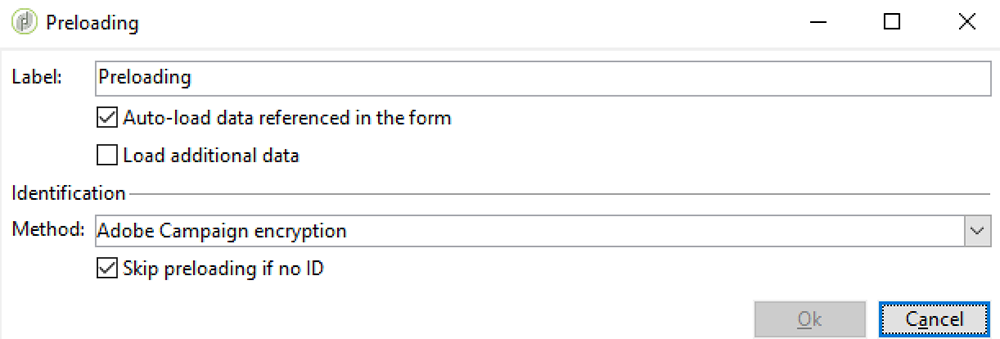

# Sincronizzare le applicazioni web{#synchronizing-web-applications}

In questo caso d’uso, invieremo una comunicazione, utilizzando Campaign Standard, che include un collegamento a un’applicazione web Campaign v7. Quando il destinatario fa clic sul collegamento nell’e-mail, l’applicazione web visualizza un modulo contenente diversi campi precaricati con i dati del destinatario e un collegamento di abbonamento a una newsletter. Il destinatario può aggiornare i suoi dati e abbonarsi al servizio. Il suo profilo verrà aggiornato in Campaign v7 e le informazioni verranno replicate in Campaign Standard.

Se disponi di molti servizi e applicazioni web in Campaign v7, puoi scegliere di non ricrearli tutti in Campaign Standard. Il connettore ACS consente di utilizzare tutte le applicazioni web e i servizi esistenti di Campaign v7 e di collegarli a una consegna inviata da Campaign Standard.

## Prerequisiti {#prerequisites}

Per ottenere questo risultato, è necessario:

* Destinatari memorizzati nel database di Campaign v7 e sincronizzati con Campaign Standard. Consulta la sezione [Sincronizzare i profili](../../integrations/using/synchronizing-profiles.md).
* un servizio e un’applicazione web creati e pubblicati in Campaign v7.
* l&#39;applicazione web deve contenere un&#39;attività **[!UICONTROL Pre-loading]** utilizzando il metodo di identificazione **[!UICONTROL Adobe Campaign encryption]**.

## Creare l’applicazione web e il servizio {#creating-the-web-application-and-service}

In Campaign v7, puoi creare applicazioni web che consentono ai destinatari di abbonarsi a un servizio. L’applicazione web e il servizio sono progettati e memorizzati in Campaign v7 e puoi aggiornare questo servizio tramite una comunicazione Campaign Standard. Per ulteriori informazioni sulle applicazioni Web in Campaign v7, consulta [questa sezione](../../web/using/adding-fields-to-a-web-form.md#subscription-checkboxes).

In Campaign v7, sono stati creati i seguenti oggetti:

* un servizio newsletter
* applicazione web contenente un&#39;attività **[!UICONTROL Pre-loading]**, **[!UICONTROL Page]** e **[!UICONTROL Storage]**.

1. Passare a **[!UICONTROL Resources > Online > Web applications]** e selezionare un&#39;applicazione Web esistente.

   

1. Modifica l&#39;attività **[!UICONTROL Preloading]**. La casella **[!UICONTROL Auto-load data referenced in the form]** è selezionata e il metodo di identificazione **[!UICONTROL Adobe Campaign encryption]** è selezionato. In questo modo l’applicazione web potrà precaricare i campi del modulo con i dati memorizzati nel database di Adobe Campaign. Vedi [questo documento](../../web/using/publishing-a-web-form.md#pre-loading-the-form-data).

   

1. Modifica **[!UICONTROL Page]**. Sono stati inclusi tre campi (Nome, E-mail e Telefono), nonché una casella di controllo per invitare il destinatario a iscriversi a una newsletter (**[!UICONTROL Newsletter]** servizio).

   

1. Vai a **[!UICONTROL Profiles and Target > Services and subscriptions]** e apri il servizio **[!UICONTROL Newsletter]**. Questo è il servizio che verrà aggiornato dalla comunicazione Campaign Standard. Puoi vedere che nessun destinatario si è ancora iscritto a questo servizio.

   

1. Vai a **[!UICONTROL Profiles and Targets > Recipient]** e seleziona un destinatario. Puoi vedere che questo profilo non si è ancora iscritto al servizio.

   

## Replica dei dati {#replicating-the-data}

Per replicare i dati necessari tra Campaign v7 e Campaign Standard, sono disponibili diversi modelli di flusso di lavoro di replica. Il flusso di lavoro **[!UICONTROL Profiles replication]** replica automaticamente in Campaign Standard tutti i destinatari di Campaign v7. Consulta [Flussi di lavoro tecnici e di replica](../../integrations/using/acs-connector-principles-and-data-cycle.md#technical-and-replication-workflows). Il flusso di lavoro **[!UICONTROL Landing pages replication]** abilita la replica delle applicazioni Web che si desidera utilizzare in Campaign Standard.

Per verificare che i dati siano stati replicati correttamente, effettua le seguenti operazioni in Campaign Standard:

1. Dalla schermata iniziale, fare clic su **[!UICONTROL Customer profiles]**.

   

1. Cerca il destinatario di Campaign v7 e controlla che sia visualizzato in Campaign Standard.

   

1. Dalla barra superiore, fai clic su **[!UICONTROL Marketing activities]** e cerca l’applicazione web Campaign v7. Viene visualizzata come pagina di destinazione in Campaign Standard.

   

1. Fai clic sul logo **[!UICONTROL Adobe Campaign]** nell&#39;angolo in alto a sinistra, quindi seleziona **Profili e pubblico > Servizi** e verifica che sia presente anche il servizio newsletter.

   

## Progettare e inviare l’e-mail {#designing-and-sending-the-email}

In questa parte verrà illustrato come includere un collegamento, in un messaggio e-mail di Campaign Standard, alla pagina di destinazione replicata da un’applicazione web Campaign v7.

I passaggi per creare, progettare e inviare l’e-mail sono gli stessi di un’e-mail classica. Consulta la documentazione di [Adobe Campaign Standard](https://experienceleague.adobe.com/docs/campaign-standard/using/campaign-standard-home.html?lang=it).

1. Crea una nuova e-mail e scegli uno o più profili replicati come pubblico.
1. Modifica il contenuto e inserisci **[!UICONTROL Link to a landing page]**.

   

1. Seleziona la pagina di destinazione replicata dall’applicazione web Campaign v7.

   

1. Prepara l’e-mail, invia le bozze e invia l’e-mail finale.
1. Uno dei destinatari apre l’e-mail e fa clic sul collegamento all’abbonamento alla newsletter.

   

1. Questo destinatario aggiunge un numero di telefono e controlla la casella di abbonamento alla newsletter.

   

## Recupero delle informazioni aggiornate {#retrieving-the-updated-information}

Quando il destinatario aggiorna i propri dati da tramite l’applicazione web, Adobe Campaign v7 recupera in modo sincrono le informazioni aggiornate. Viene quindi replicato da Campaign v7 a Campaign Standard.

1. In Campaign v7, vai a **[!UICONTROL Profiles and Target > Services and subscriptions]** e apri il servizio **[!UICONTROL Newsletter]**. Ora il destinatario viene visualizzato nell’elenco degli abbonati.

   

1. Vai a **[!UICONTROL Profiles and Targets > Recipient]** e seleziona il destinatario. Il numero di telefono è ora memorizzato.

   

1. Nella scheda **[!UICONTROL Subscriptions]**, è inoltre possibile vedere che il destinatario si è abbonato al servizio newsletter.

   

1. Attendi alcuni minuti per l’esecuzione del flusso di lavoro di replica del profilo.
1. In Campaign Standard, accedi al tuo profilo destinatario per verificare che i dati aggiornati siano stati replicati correttamente da Campaign v7.

   

1. Modifica il profilo. Puoi vedere che il numero di telefono è stato aggiornato.

   

1. Fare clic sulla scheda **[!UICONTROL Subscriptions]**. Viene visualizzato il servizio newsletter.

   
