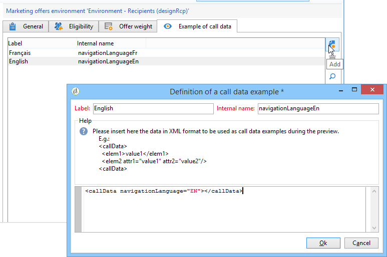

# Dati aggiuntivi{#additional-data}


Durante una chiamata al motore di interazione, puoi trasferire informazioni contestuali aggiuntive. Questi dati possono provenire dai dati di destinazione memorizzati nella tabella di lavoro di un flusso di lavoro (canale in uscita) o dai dati della chiamata inviati dal sito web durante la chiamata (canale in entrata). Puoi utilizzare questi dati aggiuntivi nelle regole di idoneità, nella personalizzazione delle offerte, e anche memorizzarli in una tabella di proposta.

Per il canale in entrata, può essere utile recuperare informazioni quali, ad esempio, la lingua del browser delle persone che consultano l’offerta o il nome dell’agente del call center. Puoi quindi utilizzare i dati di questa chiamata nelle regole di idoneità per presentare un’offerta solo alle persone che visualizzano la pagina web in francese o inglese.

In un flusso di lavoro di targeting (canale in uscita), puoi utilizzare i dati di destinazione durante una chiamata al motore. Ad esempio, puoi arricchire il target con i dati di una transazione collegata al destinatario o di un database esterno tramite FDA.

## Configurazione dati aggiuntiva {#additional-data-configuration}

È necessario estendere **nms:interazione** schema collegato all’ambiente e dichiarare l’elenco di campi aggiuntivi che verranno utilizzati durante una chiamata al motore di interazione. Quando crei la regola di idoneità o personalizzi un’offerta, questi campi diventano accessibili dalla sezione **Interazione** nodo (fare riferimento a [Utilizzo di dati aggiuntivi](#using-additional-data)).

Per il canale in entrata, devi aggiungere i campi dati della chiamata nel **Interazione** nodo.

```
<element label="Interactions" labelSingular="Interaction" name="interaction">
  <attribute label="Navigation language" name="navigationLanguage" type="string"/>
</element>
```

>[!NOTE]
>
>Le raccolte Xml sono supportate sul canale in entrata, ma non i collegamenti ad altri schemi.

Per il canale in uscita, devi aggiungere una **targetData** contenente i campi aggiuntivi nel **Interazione** nodo.

```
<element label="Interactions" labelSingular="Interaction" name="interaction">
  <element name="targetData">
    <attribute label="Date of last transaction" name="lastTransactionDate" type="datetime"/>
  </element>
</element>
```

>[!NOTE]
>
>Le raccolte non sono supportate per il canale in uscita. Tuttavia, puoi creare collegamenti ad altri schemi.

Se desideri memorizzare questi dati nella tabella della proposta, devi estendere anche il **nms:propositionRcp** e dichiarare questi campi.

```
<element label="Recipient offer propositions" labelSingular="Recipient offer proposition" name="propositionRcp">
  <attribute label="Last transaction date" name="lastTransactionDate" type="datetime"/>
  <attribute label="Navigation language" name="navigationLanguage" type="string"/>
</element>
```

## Implementazione di dati aggiuntivi {#additional-data-implementation}

### Canale di input (pagina Web) {#input-channel--web-page-}

Per trasferire dati aggiuntivi quando si chiama il motore, è necessario aggiungere il **interfaceGlobalCtx** nel codice JavaScript della pagina web. Inserisci il **Interazione** contenente i dati della chiamata in questa variabile. È necessario rispettare la stessa struttura xml presente in **nms:interazione** schema. Consulta: [Configurazione dati aggiuntiva](#additional-data-configuration).

```
interactionGlobalCtx = "<interaction navigationLanguage='"+myLanguage+"'/>";
```

### Canale di uscita {#output-channel}

È necessario creare un flusso di lavoro di targeting per caricare dati aggiuntivi nella tabella di lavoro rispettando la stessa struttura xml e gli stessi nomi interni della **nms:interazione** schema. Consulta: [Configurazione dati aggiuntiva](#additional-data-configuration).

## Utilizzo di dati aggiuntivi {#using-additional-data}

### Regole di idoneità {#eligibility-rules}

Puoi utilizzare i dati aggiuntivi nelle regole di idoneità per offerte, categorie e pesi.

Ad esempio, puoi scegliere di fare in modo che l’offerta venga presentata solo alle persone che visualizzano la pagina in inglese.


>[!NOTE]
>
>È necessario limitare la regola sui canali per i quali sono definiti i dati. Nel nostro esempio, stiamo limitando la regola sul canale web in entrata (**[!UICONTROL Taken into account if]** ).

### Personalizzazione {#personalization}

Puoi anche utilizzare questi dati aggiuntivi durante la personalizzazione di un’offerta. Ad esempio, puoi aggiungere una condizione per la lingua di navigazione


>[!NOTE]
>
>Devi limitare la personalizzazione ai canali per i quali sono definiti i dati. Nel nostro esempio, stiamo limitando la regola sul canale web in entrata.

Se hai personalizzato un’offerta utilizzando dati aggiuntivi, per impostazione predefinita questi dati non vengono visualizzati nell’anteprima perché non sono disponibili nel database. Nel campo dell&#39;ambiente **[!UICONTROL Example of call data]** , è necessario aggiungere esempi di valori da utilizzare nell’anteprima. Rispetta la stessa struttura xml presente in **nms:interazione** estensione dello schema. Per ulteriori informazioni, consulta [Configurazione dati aggiuntiva](#additional-data-configuration).



In anteprima, fai clic su **[!UICONTROL Content personalization options for the preview]** e selezionare un valore in **[!UICONTROL Call data]** campo.


### Archiviazione {#storage}

Durante una chiamata al motore, puoi memorizzare dati aggiuntivi nella tabella della proposta per arricchire il database. Questi dati possono essere utilizzati, ad esempio, nei rapporti, nei calcoli del ROI o per processi successivi.

>[!NOTE]
>
>È necessario aver esteso il **nms:propositionRcp** e ha dichiarato i campi che conterranno i dati da archiviare. Per ulteriori informazioni: [Configurazione dati aggiuntiva](#additional-data-configuration).

Nello spazio dell’offerta, vai al **[!UICONTROL Storage]** e fai clic sul pulsante **[!UICONTROL Add]** pulsante.

In **[!UICONTROL Storage path]** , seleziona il campo di archiviazione nella tabella della proposta. In **[!UICONTROL Expression]** , selezionare il campo aggiuntivo nella colonna **[!UICONTROL Interaction]** nodo.

Puoi recuperare i dati della chiamata quando la proposta viene generata o accettata (quando la persona fa clic sull’offerta).


