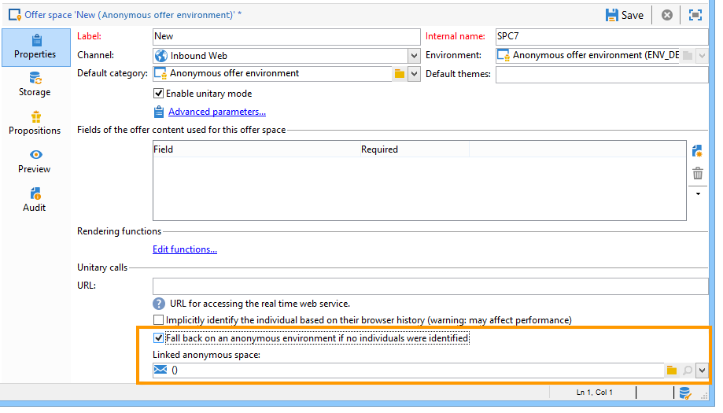

# Interazioni anonime{#anonymous-interactions}

 Guarda questo   video per avere una panoramica su come le offerte vengono consegnate a destinazioni identificate e anonime.

## Targeting e archiviazione di un ambiente per interazioni anonime {#targeting-and-storing-an-environment-for-anonymous-interactions}

Per impostazione predefinita, l’interazione viene fornita con un ambiente preconfigurato per eseguire il targeting della tabella dei destinatari (offerte identificate). Se desideri eseguire il targeting di un’altra tabella (tabella dei visitatori per offerte anonime o tabella dei destinatari specifica), devi utilizzare la procedura guidata di mappatura di destinazione per creare l’ambiente. Per ulteriori informazioni, consulta [Creazione di un ambiente di offerta](../../interaction/using/live-design-environments.md#creating-an-offer-environment).

Quando crei un ambiente anonimo tramite la procedura guidata di creazione della mappatura, la casella **[!UICONTROL Environment dedicated to incoming anonymous interactions]** viene selezionata automaticamente nella scheda **[!UICONTROL General]** dell’ambiente.

Il **[!UICONTROL Targeting dimension]** viene completato automaticamente. Per impostazione predefinita, si collega alla tabella dei visitatori.

Viene visualizzato il campo **[!UICONTROL Visitor folder]** . Viene completato automaticamente il collegamento alla cartella **[!UICONTROL Visitors]**. Questo campo ti consente di scegliere dove memorizzare i profili dei visitatori.

>[!NOTE]
>
>Se desideri filtrare diversi tipi di visitatori, ad esempio nel caso di offerte anonime presentate per uno o più marchi, devi creare un ambiente per ogni marchio e una cartella di tipo **[!UICONTROL Visitors]** per ogni ambiente.

## Catalogo delle offerte per interazioni anonime {#offer-catalog-for-anonymous-interactions}

Proprio come le interazioni in uscita, le interazioni in entrata sono organizzate in un catalogo di offerte composto da categorie e offerte.

Per creare categorie e spazi, applica lo stesso processo applicato ai visitatori identificati (consulta [Creazione di categorie di offerta](../../interaction/using/creating-offer-categories.md) e [Creazione di un ambiente di offerta](../../interaction/using/live-design-environments.md#creating-an-offer-environment)).

## Visitatori anonimi {#anonymous-visitors}

I visitatori anonimi possono essere sottoposti a un processo di identificazione dei cookie al momento della connessione. Questo riconoscimento implicito si basa sulla cronologia del browser del visitatore.

Durante questo passaggio viene effettuato un confronto tra i dati recuperati dai cookie e quelli presenti nel database. In alcuni casi, i visitatori vengono riconosciuti (sono quindi identificati implicitamente), in altri casi non vengono riconosciuti (e quindi rimangono anonimi).

Per eseguire questa analisi, per lo spazio dell’offerta, seleziona l’opzione **[!UICONTROL Implicitly identify the individual based on their browser history]** .

## Elaborazione di visitatori anonimi non identificati {#processing-unidentified-anonymous-visitors}

Dopo l’analisi, se un visitatore anonimo non è identificato, puoi memorizzare i suoi dati in uno spazio specifico. Questo ti consente di suggerire offerte specificamente mirate a questo tipo di visitatore, che corrispondono alle regole di tipologia specificate.

Se non esiste un elemento che ti consenta di identificare un contatto, o se non desideri suggerire un&#39;offerta identificata a un contatto che possa essere identificato implicitamente, puoi scegliere di eseguire un fallback su un ambiente anonimo.

A questo scopo, controlla **[!UICONTROL Fall back on an anonymous environment if no individuals were identified]**, quindi specifica l’ambiente dedicato a questi visitatori non identificati nel **[!UICONTROL Linked anonymous space]** quando specifichi uno spazio di offerta.

