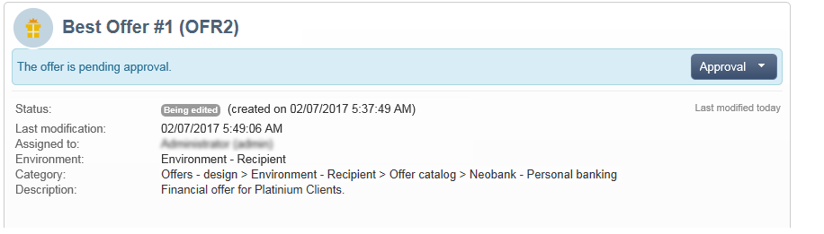

# Approvazione e attivazione di un’offerta{#approving-and-activating-an-offer}

Una volta completato il contenuto dell’offerta, devi approvarlo affinché possa essere duplicato nell’ambiente live e consegnato. L’approvazione riguarda il contenuto dell’offerta e la sua idoneità.

Il banner nel dashboard dell’offerta indica se l’offerta deve passare attraverso il ciclo di approvazione o meno.

## Approvazione del contenuto dell’offerta {#approving-offer-content}

Per approvare il contenuto dell’offerta è necessario selezionare le rappresentazioni da rendere disponibili nell’ambiente live.

Il contenuto di un’offerta dispone di una rappresentazione per spazio. Poiché ogni spazio di offerta ha una propria struttura e le proprie funzioni di rendering, la rappresentazione dell’offerta può variare.

Puoi scegliere di approvare il contenuto dell’offerta su alcuni spazi disponibili e rifiutarlo su altri.

>[!IMPORTANT]
>
>Una volta approvati il contenuto e l’idoneità di un’offerta, il flusso di lavoro di pubblicazione (notifica di offerta) viene eseguito automaticamente e l’offerta viene resa attiva e disponibile su tutti gli spazi attivati.

Per approvare il contenuto dell’offerta, esegui i seguenti passaggi:

1. Fai clic sul pulsante **[!UICONTROL Approval]** e seleziona **[!UICONTROL Approve content]** a comparsa.

   

1. Dall’elenco a discesa, seleziona le rappresentazioni da modificare o quelle da pubblicare nell’ambiente live, quindi fai clic su **[!UICONTROL Content approval]**.

   

   Una volta approvato il contenuto dell’offerta, le informazioni vengono aggiornate nella tabella del dashboard dell’offerta.

   

   >[!NOTE]
   >
   >La **[!UICONTROL Content approved]** la menzione non significa che tutte le rappresentazioni dell’offerta sono state abilitate e approvate. Indica che il processo di approvazione del contenuto è stato completato, indipendentemente dal fatto che tutte le offerte siano state abilitate/approvate o meno.

## Approvazione dell’idoneità delle offerte {#approving-offer-eligibility}

Per approvare l’idoneità dell’offerta si intende l’accettazione o il rifiuto dei pesi dell’offerta e delle regole di idoneità configurate nell’offerta o ereditate dalle regole create nella categoria principale.

>[!IMPORTANT]
>
>Una volta approvati il contenuto e l’idoneità di un’offerta, il flusso di lavoro di pubblicazione (notifica di offerta) viene eseguito automaticamente e l’offerta viene resa attiva e disponibile su tutti gli spazi attivati.

* Per visualizzare l’elenco completo delle regole, fai clic su **[!UICONTROL Schedule and eligibility rules]**.

   

* Per modificare le regole di idoneità, fare clic su **[!UICONTROL Reject]**, quindi fai clic su **[!UICONTROL Eligibility approval]**.

   

   I vari stati vengono aggiornati nel dashboard delle offerte.

   

* Per accettare l’idoneità dell’offerta, fai clic su **[!UICONTROL Approve eligibility]**.

   

   Approva idoneità, aggiungi un commento se necessario, quindi fai clic su **[!UICONTROL Eligibility approval]**.

   

   I vari stati vengono aggiornati nel dashboard delle offerte.

   

## Tracking di approvazione {#approval-tracking}

Il tracciamento dell’approvazione è disponibile nel dashboard delle offerte. Fai clic su **[!UICONTROL Hide/display logs]** per accedervi.

>[!NOTE]
>
>Il tracciamento è disponibile anche nel **[!UICONTROL Audit]** scheda dell’offerta, con i dettagli dei commenti dei revisori.

## Riavvia l&#39;approvazione {#restart-the-approval}

Una volta avviata l’approvazione, questa può essere riavviata. A questo scopo, segui queste istruzioni:

1. Fai clic su **[!UICONTROL Content approved]** nel dashboard delle offerte.
1. In **[!UICONTROL Edit]** finestra visualizzata, selezionare l&#39;approvazione da riavviare, quindi fare clic su **[!UICONTROL Re-initialize approval to submit it again]**.
1. Conferma facendo clic su **[!UICONTROL Ok]**.

## Pubblicazione dell’offerta {#publishing-the-offer}

Una volta approvati sia il contenuto che l’idoneità di un’offerta, l’offerta viene pubblicata da un flusso di lavoro che viene eseguito automaticamente per ogni offerta il cui ciclo di approvazione è terminato. La **[!UICONTROL Offer notification]** il flusso di lavoro viene eseguito anche ogni ora per sincronizzare (se necessario) gli spazi e le categorie contenuti nel catalogo delle offerte dall’ambiente di progettazione all’ambiente live.

Il dashboard dell’offerta disponibile nell’ambiente di progettazione contiene informazioni sulla pubblicazione, compreso il nome dell’offerta corrispondente nell’ambiente live.

Per visualizzare l’offerta disponibile nell’ambiente live, fai clic sull’etichetta dell’offerta: l’offerta live dispone di un dashboard contenente tutte le informazioni pertinenti.

## Disabilitazione di un’offerta {#disabling-an-offer}

Una volta approvata l’offerta, puoi disabilitarla.

A questo scopo, accedi al dashboard per un&#39;offerta online o un&#39;offerta in attesa di essere online, quindi fai clic su **[!UICONTROL Disable offer]**.

Puoi anche disattivare direttamente una categoria andando al **[!UICONTROL Eligibility]** e controlla la **[!UICONTROL Enabled]** scatola.

>[!NOTE]
>
>Quando un’offerta viene eliminata in un ambiente di progettazione, viene automaticamente disattivata nell’ambiente online collegato. Dopo un periodo di conservazione delle proposte, le offerte disattivate vengono eliminate dall’ambiente online.

