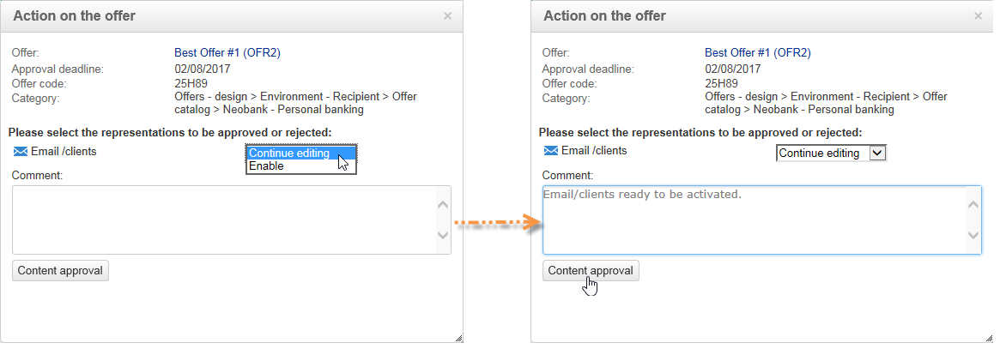

# Approvazione e attivazione di un’offerta{#approving-and-activating-an-offer}

Una volta completato il contenuto dell&#39;offerta, è necessario approvarlo per poterlo duplicare nell&#39;ambiente live e distribuirlo. L&#39;approvazione riguarda il contenuto dell&#39;offerta e la sua ammissibilità.

Il banner nel dashboard delle offerte indica se l’offerta deve o meno attraversare il ciclo di approvazione.

## Approvazione del contenuto delle offerte {#approving-offer-content}

Per approvare i contenuti delle offerte, selezionate le rappresentazioni da rendere disponibili nell&#39;ambiente live.

Il contenuto di un&#39;offerta ha una rappresentazione per spazio. Poiché ciascuno spazio delle offerte ha una propria struttura e le proprie funzioni di rendering, la rappresentazione dell&#39;offerta può variare.

Potete scegliere di approvare il contenuto dell&#39;offerta su alcuni spazi disponibili e rifiutarlo su altri.

>[!IMPORTANT]
>
>Una volta approvati il contenuto e l&#39;idoneità di un&#39;offerta, il flusso di lavoro di pubblicazione (notifica dell&#39;offerta) viene eseguito automaticamente e l&#39;offerta viene resa live e disponibile su tutti gli spazi attivati.

Per approvare il contenuto dell&#39;offerta, eseguite i seguenti passaggi:

1. Fate clic sul **[!UICONTROL Approval]** pulsante e selezionate **[!UICONTROL Approve content]** a comparsa.

   

1. Dall&#39;elenco a discesa, selezionate le rappresentazioni da modificare o quelle da pubblicare nell&#39;ambiente live, quindi fate clic su **[!UICONTROL Content approval]**.

   

   Una volta approvato il contenuto dell&#39;offerta, le informazioni vengono aggiornate nella tabella del dashboard dell&#39;offerta.

   

   >[!NOTE]
   >
   >La **[!UICONTROL Content approved]** menzione non significa che tutte le rappresentazioni delle offerte siano state abilitate e approvate. Indica che il processo di approvazione del contenuto è stato completato, indipendentemente dal fatto che tutte le offerte siano state abilitate/approvate o meno.

## Approvazione dell&#39;idoneità delle offerte {#approving-offer-eligibility}

Per approvare l&#39;idoneità dell&#39;offerta si intendono accettare o rifiutare i pesi dell&#39;offerta e le regole di idoneità configurate anche nell&#39;offerta o ereditate dalle regole create nella categoria principale.

>[!IMPORTANT]
>
>Una volta approvati il contenuto e l&#39;idoneità di un&#39;offerta, il flusso di lavoro di pubblicazione (notifica dell&#39;offerta) viene eseguito automaticamente e l&#39;offerta viene resa live e disponibile su tutti gli spazi attivati.

* Per visualizzare l&#39;elenco completo delle regole, fai clic su **[!UICONTROL Schedule and eligibility rules]**.

   

* Per modificare le regole di idoneità, fare clic su **[!UICONTROL Reject]**, quindi su **[!UICONTROL Eligibility approval]**.

   

   I vari stati vengono aggiornati nel dashboard delle offerte.

   

* Per accettare l&#39;idoneità dell&#39;offerta, fate clic su **[!UICONTROL Approve eligibility]**.

   

   Approva idoneità, aggiungi un commento se necessario, quindi fai clic su **[!UICONTROL Eligibility approval]**.

   

   I vari stati vengono aggiornati nel dashboard delle offerte.

   

## Tracciamento approvazione {#approval-tracking}

Il tracciamento dell&#39;approvazione è disponibile nella dashboard delle offerte. Fate clic **[!UICONTROL Hide/display logs]** per accedervi.

>[!NOTE]
>
>Il tracciamento è disponibile anche nella **[!UICONTROL Audit]** scheda dell&#39;offerta, con i dettagli dei commenti dei revisori.

## Riavvia l&#39;approvazione {#restart-the-approval}

Una volta avviata l&#39;approvazione, questa può essere riavviata. A questo scopo, attenetevi alle seguenti istruzioni:

1. Fate clic **[!UICONTROL Content approved]** sul dashboard delle offerte.
1. Nella **[!UICONTROL Edit]** finestra visualizzata, selezionare l&#39;approvazione da riavviare, quindi fare clic su **[!UICONTROL Re-initialize approval to submit it again]**.
1. Conferma facendo clic su **[!UICONTROL Ok]**.

## Pubblicazione dell’offerta {#publishing-the-offer}

Una volta approvati il contenuto e l&#39;idoneità di un&#39;offerta, l&#39;offerta viene pubblicata tramite un flusso di lavoro che viene eseguito automaticamente per ogni offerta il cui ciclo di approvazione è terminato. Il **[!UICONTROL Offer notification]** flusso di lavoro viene eseguito anche ogni ora per sincronizzare (se necessario) gli spazi e le categorie contenuti nel catalogo delle offerte dall&#39;ambiente di progettazione all&#39;ambiente live.

Il dashboard dell&#39;offerta disponibile nell&#39;ambiente di progettazione contiene informazioni sulla pubblicazione, incluso il nome dell&#39;offerta corrispondente nell&#39;ambiente live.

Per visualizzare l&#39;offerta disponibile nell&#39;ambiente live, fai clic sull&#39;etichetta dell&#39;offerta: l&#39;offerta live dispone di un dashboard che contiene tutte le informazioni pertinenti.

## Disattivazione di un&#39;offerta {#disabling-an-offer}

Una volta approvata l&#39;offerta, potete disattivarla.

A questo scopo, accedete al dashboard per un&#39;offerta online o un&#39;offerta in attesa di essere online, quindi fate clic **[!UICONTROL Disable offer]**.

È inoltre possibile disattivare direttamente una categoria andando alla **[!UICONTROL Eligibility]** scheda e selezionando la **[!UICONTROL Enabled]** casella.

>[!NOTE]
>
>Quando un&#39;offerta viene eliminata in un ambiente di progettazione, viene automaticamente disattivata nell&#39;ambiente online collegato. Dopo un periodo di conservazione delle proposte, le offerte disattivate vengono eliminate dall&#39;ambiente online.

