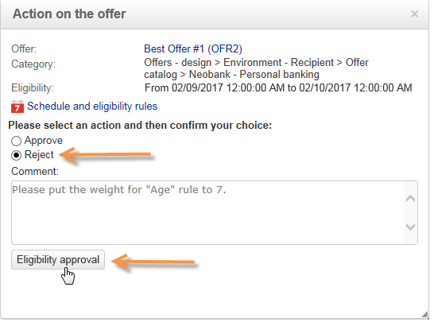

# Approvazione e attivazione di un’offerta{#approving-and-activating-an-offer}

Una volta completato il contenuto dell’offerta, devi approvarlo affinché possa essere duplicato nell’ambiente live e consegnato. L’approvazione riguarda il contenuto dell’offerta e la sua idoneità.

Il banner sul dashboard delle offerte indica se l’offerta deve o meno superare il ciclo di approvazione.

## Approvazione del contenuto delle offerte {#approving-offer-content}

Approvando il contenuto dell’offerta si selezionano le rappresentazioni da rendere disponibili nell’ambiente live.

Il contenuto di un’offerta ha una rappresentazione per spazio. Poiché ogni spazio dell’offerta ha la propria struttura e le proprie funzioni di rendering, la rappresentazione dell’offerta può variare.

Puoi scegliere di approvare il contenuto dell’offerta in alcuni spazi disponibili e rifiutarlo in altri.

>[!IMPORTANT]
>
>Una volta approvati il contenuto e l’idoneità di un’offerta, il flusso di lavoro di pubblicazione (notifica di offerta) viene eseguito automaticamente e l’offerta viene resa live e disponibile su tutti gli spazi attivati.

Per approvare il contenuto dell’offerta, effettua le seguenti operazioni:

1. Fare clic sul pulsante **[!UICONTROL Approval]** e selezionare **[!UICONTROL Approve content]** nel popup.

   

1. Utilizzando l&#39;elenco a discesa, selezionare le rappresentazioni che si desidera continuare a modificare o quelle che si desidera pubblicare nell&#39;ambiente live, quindi fare clic su **[!UICONTROL Content approval]**.

   

   Una volta approvato il contenuto dell’offerta, le informazioni vengono aggiornate nella tabella del dashboard delle offerte.

   

   >[!NOTE]
   >
   >La menzione **[!UICONTROL Content approved]** non significa che tutte le rappresentazioni dell&#39;offerta sono state abilitate e approvate. Indica che il processo di approvazione del contenuto è stato completato, indipendentemente dal fatto che tutte le offerte siano state abilitate/approvate o meno.

## Approvazione idoneità offerta {#approving-offer-eligibility}

L’approvazione dell’idoneità per l’offerta comporta l’accettazione o il rifiuto dei pesi dell’offerta e delle regole di idoneità configurate anche nell’offerta o ereditate dalle regole create nella categoria principale.

>[!IMPORTANT]
>
>Una volta approvati il contenuto e l’idoneità di un’offerta, il flusso di lavoro di pubblicazione (notifica di offerta) viene eseguito automaticamente e l’offerta viene resa live e disponibile su tutti gli spazi attivati.

* Per visualizzare l&#39;elenco completo delle regole, fare clic su **[!UICONTROL Schedule and eligibility rules]**.

  

* Per modificare le regole di idoneità, fare clic su **[!UICONTROL Reject]**, quindi su **[!UICONTROL Eligibility approval]**.

  

  I vari stati vengono aggiornati nel dashboard delle offerte.

  

* Per accettare l&#39;idoneità dell&#39;offerta, fare clic su **[!UICONTROL Approve eligibility]**.

  

  Approva l&#39;idoneità, aggiungi un commento se necessario, quindi fai clic su **[!UICONTROL Eligibility approval]**.

  

  I vari stati vengono aggiornati nel dashboard delle offerte.

  

## Tracciamento approvazione {#approval-tracking}

Il tracciamento delle approvazioni è disponibile nel dashboard delle offerte. Fare clic su **[!UICONTROL Hide/display logs]** per accedervi.

>[!NOTE]
>
>Il tracciamento è disponibile anche nella scheda **[!UICONTROL Audit]** dell&#39;offerta, con i dettagli dei commenti dei revisori.

## Riavvia l’approvazione {#restart-the-approval}

Una volta avviata, l’approvazione può essere riavviata. A questo scopo, segui queste istruzioni:

1. Fare clic su **[!UICONTROL Content approved]** nel dashboard delle offerte.
1. Nella finestra **[!UICONTROL Edit]** visualizzata, selezionare l&#39;approvazione da riavviare, quindi fare clic su **[!UICONTROL Re-initialize approval to submit it again]**.
1. Confermare facendo clic su **[!UICONTROL Ok]**.

## Pubblicazione dell’offerta {#publishing-the-offer}

Dopo aver approvato sia il contenuto che l’idoneità di un’offerta, l’offerta viene pubblicata da un flusso di lavoro che viene eseguito automaticamente per ogni offerta il cui ciclo di approvazione è stato completato. Il flusso di lavoro **[!UICONTROL Offer notification]** viene inoltre eseguito ogni ora per sincronizzare (se necessario) gli spazi e le categorie contenuti nel catalogo delle offerte dall&#39;ambiente di progettazione all&#39;ambiente live.

Il dashboard dell’offerta disponibile nell’ambiente di progettazione contiene informazioni relative alla pubblicazione, tra cui il nome dell’offerta corrispondente nell’ambiente live.

Per visualizzare l’offerta disponibile nell’ambiente live, fai clic sull’etichetta dell’offerta: l’offerta live presenta una dashboard contenente tutte le informazioni rilevanti.

## Disabilitazione di un’offerta {#disabling-an-offer}

Una volta approvata l’offerta, puoi disattivarla.

A questo scopo, vai al dashboard per un&#39;offerta online o un&#39;offerta in attesa di passare online, quindi fai clic su **[!UICONTROL Disable offer]**.

È inoltre possibile disabilitare direttamente una categoria accedendo alla scheda **[!UICONTROL Eligibility]** e selezionando la casella **[!UICONTROL Enabled]**.

>[!NOTE]
>
>Quando un’offerta viene eliminata in un ambiente di progettazione, viene disattivata automaticamente nell’ambiente online collegato. Dopo un periodo di conservazione della proposta, le offerte disattivate vengono eliminate dall’ambiente online.

