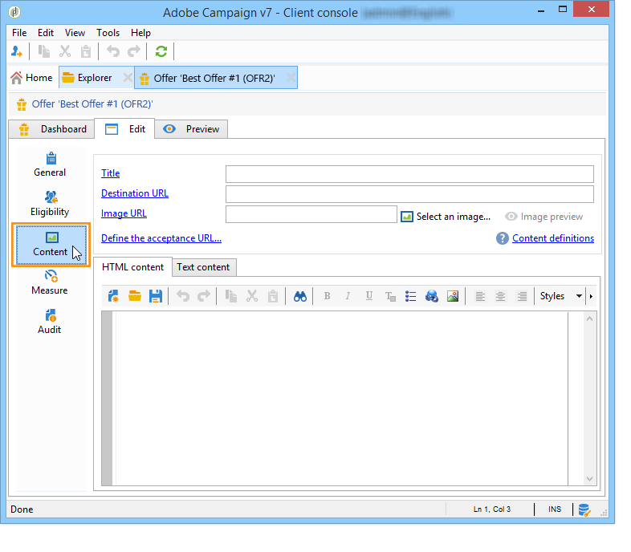

# Creazione di un’offerta{#creating-an-offer}


## Creazione dell’offerta {#creating-the-offer}

Per creare un’offerta, effettua le seguenti operazioni:

1. Vai a **[!UICONTROL Campaigns]** e fai clic sul pulsante **[!UICONTROL Offers]** collegamento.

   

1. Fai clic sul pulsante **[!UICONTROL Create]**.

   

1. Modifica l’etichetta e seleziona la categoria a cui deve appartenere l’offerta.

   

1. Clic **[!UICONTROL Save]** per creare l’offerta.

   

   L’offerta è disponibile nella piattaforma e è possibile configurarne il contenuto.

   

## Configurazione dell’idoneità per l’offerta {#configuring-offer-eligibility}

In **[!UICONTROL Eligibility]** , definisci il periodo per il quale l’offerta sarà valida e che può essere presentata, i filtri da applicare al target e il peso dell’offerta.

### Definizione del periodo di idoneità di un’offerta {#defining-the-eligibility-period-of-an-offer}

Per definire il periodo di idoneità dell’offerta, utilizza gli elenchi a discesa e seleziona una data di inizio e una data di fine nel calendario.


Al di fuori di queste date, l’offerta non verrà selezionata dal motore di interazione. Se hai configurato anche le date di idoneità per la categoria dell’offerta, verrà applicato il periodo più restrittivo.

### Filtri sul target {#filters-on-the-target}

Puoi applicare filtri al target dell’offerta.

A questo scopo, fai clic su **[!UICONTROL Edit query]** e seleziona il filtro da applicare. (Fare riferimento a [questa sezione](../../platform/using/steps-to-create-a-query.md#step-4---filter-data)).


Se sono già stati creati filtri predefiniti, puoi selezionarli dall’elenco dei filtri utente. Per ulteriori informazioni, consulta [Creazione di filtri predefiniti](../../interaction/using/creating-predefined-filters.md).


### Peso offerta {#offer-weight}

Per consentire al motore di decidere tra diverse offerte per le quali il target è idoneo, devi assegnare uno o più pesi all’offerta. Se necessario, puoi anche applicare dei filtri al target o limitare lo spazio dell’offerta a cui verrà applicato il peso. Un’offerta con un peso più significativo sarà preferita rispetto a un’offerta con meno peso.

Puoi configurare più pesi per la stessa offerta, ad esempio per distinguere periodi superiori, target specifici o persino uno spazio dell’offerta.

Ad esempio, un’offerta può avere un peso di A per i contatti di età compresa tra i 18 e i 25 anni e un peso di B per i contatti al di sopra di tale intervallo. Se un’offerta è idonea per tutta l’estate, può anche avere un peso di A in luglio e un peso di B in agosto.

>[!NOTE]
>
>Il peso assegnato può essere modificato temporaneamente in base ai parametri della categoria a cui appartiene l’offerta. Per ulteriori informazioni, consulta [Creazione di categorie di offerta](../../interaction/using/creating-offer-categories.md).

Per creare un peso in un’offerta, effettua le seguenti operazioni:

1. Fai clic su **[!UICONTROL Add]**.

   

1. Modifica l’etichetta e assegna un peso. Per impostazione predefinita, è 1.

   

   >[!IMPORTANT]
   >
   >Se non viene inserito alcun peso (0), il target non sarà considerato idoneo per l&#39;offerta.

1. Se si desidera applicare il fattore di ponderazione per un determinato periodo, definire le date di idoneità.

   

1. Se necessario, limita il peso a uno spazio dell’offerta specifico.

   

1. Applicare un filtro a una destinazione.

   

1. Clic **[!UICONTROL OK]** per risparmiare lo spessore.

   

   >[!NOTE]
   >
   >Se un target è idoneo per più pesi per un’offerta selezionata, il motore mantiene il peso migliore (il più alto). Quando si richiama il motore di offerta, viene selezionata un’offerta al massimo una volta per contatto.

### Riepilogo delle regole di idoneità dell’offerta {#a-summary-of-offer-eligibility-rules}

Al termine della configurazione, nel dashboard delle offerte sarà disponibile un riepilogo delle regole di idoneità.

Per visualizzarlo, fai clic su **[!UICONTROL Schedule and eligibility rules]** collegamento.


## Creazione del contenuto dell’offerta {#creating-the-offer-content}

1. Fai clic su **[!UICONTROL Edit]** , quindi fare clic sulla scheda **[!UICONTROL Content]** scheda.

   

1. Completa i vari campi del contenuto dell’offerta.

   * **[!UICONTROL Title]** : specifica il titolo da visualizzare nell’offerta. Avvertenza: questo non si riferisce all’etichetta dell’offerta, definita nella **[!UICONTROL General]** scheda.
   * **[!UICONTROL Destination URL]** : specifica l’URL dell’offerta. Per essere elaborato correttamente, deve iniziare con &quot;http://&quot; o &quot;https://&quot;.
   * **[!UICONTROL Image URL]** : specifica un URL o un percorso di accesso all’immagine dell’offerta.
   * **[!UICONTROL HTML content]** / **[!UICONTROL Text content]** : inserisci il corpo dell’offerta nella scheda desiderata. Per generare il tracciamento, **[!UICONTROL HTML content]** deve essere composto da elementi HTML che possono essere racchiusi in un `<div>` elemento type. Ad esempio, il risultato di un `<table>` nella pagina HTML sarà il seguente:

   ```
      <div> 
       <table>
        <tr>
         <th>Month</th>
         <th>Savings</th>   
        </tr>   
        <tr>    
         <td>January</td>
         <td>$100</td>   
        </tr> 
       </table> 
      </div>
   ```

   La definizione dell’URL di accettazione viene presentata nella [Configurazione dello stato quando la proposta viene accettata](../../interaction/using/creating-offer-spaces.md#configuring-the-status-when-the-proposition-is-accepted) sezione.

   

   Per trovare i campi obbligatori definiti durante la configurazione dello spazio dell’offerta, fai clic sul pulsante **[!UICONTROL Content definitions]** per visualizzare l&#39;elenco. Per ulteriori informazioni, consulta [Creazione di spazi dell’offerta](../../interaction/using/creating-offer-spaces.md).

   

   In questo esempio, l’offerta deve includere un titolo, un’immagine, un contenuto HTML e un URL di destinazione.

## Anteprima dell’offerta {#previewing-the-offer}

Non appena il contenuto dell’offerta è configurato, puoi visualizzare l’anteprima dell’offerta così come verrà visualizzata per il destinatario. Per eseguire questa operazione:

1. Fai clic su **[!UICONTROL Preview]** scheda.

   

1. Seleziona la rappresentazione dell’offerta da visualizzare.

   

1. Se hai personalizzato il contenuto dell’offerta, seleziona il target dell’offerta per visualizzare la personalizzazione.

   

## Creazione di un’ipotesi su un’offerta {#creating-a-hypothesis-on-an-offer}

Puoi creare ipotesi sulle proposte di offerta. Questo consente di determinare l’impatto delle offerte sugli acquisti effettuati per il prodotto in questione.

>[!NOTE]
>
>Queste ipotesi vengono eseguite tramite Response Manager. Controlla il contratto di licenza.

Le ipotesi effettuate su una proposta di offerta sono indicate nella relativa **[!UICONTROL Measure]** scheda.

La creazione di ipotesi è descritta in [questa pagina](../../response/using/about-response-manager.md).


