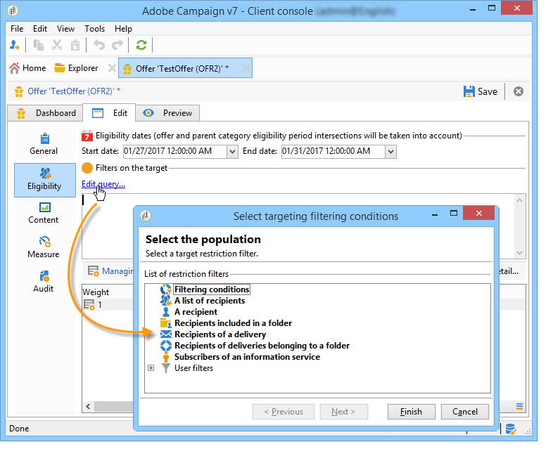
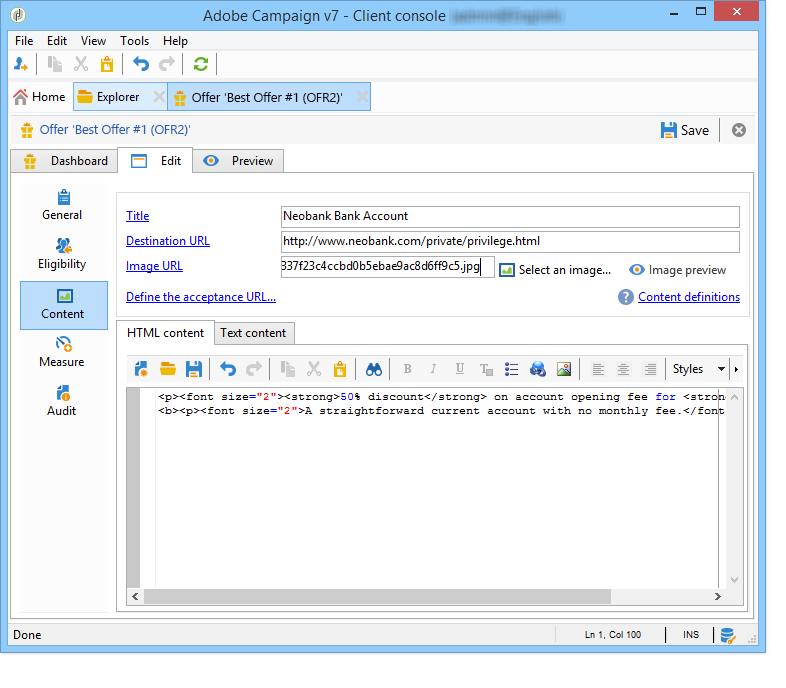

# Creazione di un’offerta{#creating-an-offer}

## Creazione dell’offerta {#creating-the-offer}

Per creare un&#39;offerta, effettuate le seguenti operazioni:

1. Vai all&#39; **[!UICONTROL Campaigns]** universo e fai clic sul **[!UICONTROL Offers]** collegamento.

   

1. Fai clic sul pulsante **[!UICONTROL Create]**.

   

1. Modificate l&#39;etichetta e selezionate la categoria a cui deve appartenere l&#39;offerta.

   

1. Fate clic **[!UICONTROL Save]** per creare l&#39;offerta.

   

   L&#39;offerta è disponibile nella piattaforma e il suo contenuto può essere configurato.

   

## Configurazione dell&#39;idoneità delle offerte {#configuring-offer-eligibility}

Nella **[!UICONTROL Eligibility]** scheda, definite il periodo per il quale l&#39;offerta sarà valida e può essere presentata, i filtri da applicare alla destinazione e lo spessore dell&#39;offerta.

### Definizione del periodo di idoneità di un&#39;offerta {#defining-the-eligibility-period-of-an-offer}

Per definire il periodo di idoneità dell&#39;offerta, utilizzate gli elenchi a discesa e selezionate una data di inizio e una data di fine nel calendario.


Al di fuori di queste date, l&#39;offerta non sarà selezionata dal motore di interazione. Se avete anche configurato le date di idoneità per la categoria di offerta, verrà applicato il periodo più restrittivo.

### Filtri sulla destinazione {#filters-on-the-target}

Potete applicare filtri alla destinazione dell’offerta.

A questo scopo, fate clic sul **[!UICONTROL Edit query]** collegamento e selezionate il filtro da applicare. (Fai riferimento a [questa sezione](../../platform/using/steps-to-create-a-query.md#step-4---filter-data)).



Se sono già stati creati filtri predefiniti, potete selezionarli dall&#39;elenco dei filtri utente. Per ulteriori informazioni, vedere [Creazione di filtri](../../interaction/using/creating-predefined-filters.md)predefiniti.


### Peso dell&#39;offerta {#offer-weight}

Per consentire al motore di scegliere tra diverse offerte per le quali il target è idoneo, è necessario assegnare uno o più pesi all&#39;offerta. Potete anche applicare dei filtri alla destinazione, se necessario, o limitare lo spazio di offerta a cui verrà applicato lo spessore. Un&#39;offerta con un peso più significativo sarà preferita rispetto a un&#39;offerta con meno peso.

Potete configurare più pesi per la stessa offerta, ad esempio per distinguere periodi secondari, target specifici o persino uno spazio dell&#39;offerta.

Ad esempio, un&#39;offerta può avere un peso di A per i contatti tra i 18 e i 25 anni e un peso di B per i contatti al di sopra di tale intervallo. Se un&#39;offerta è valida per tutta l&#39;estate, può avere anche un peso A in luglio e un peso B in agosto.

>[!NOTE]
>
>Lo spessore assegnato può essere temporaneamente modificato in base ai parametri della categoria a cui appartiene l&#39;offerta. Per ulteriori informazioni, consultate [Creazione di categorie](../../interaction/using/creating-offer-categories.md)di offerte.

Per creare un fattore di ponderazione in un’offerta, effettuate le seguenti operazioni:

1. Fai clic su **[!UICONTROL Add]**.

   

1. Modificare l’etichetta e assegnare uno spessore. Per impostazione predefinita, è 1.

   

   >[!IMPORTANT]
   >
   >Se non viene inserito alcun fattore di ponderazione (0), l&#39;obiettivo non sarà considerato idoneo per l&#39;offerta.

1. Se si desidera applicare lo spessore per un determinato periodo, definire le date di idoneità.

   

1. Se necessario, limitate il peso a uno spazio di offerta specifico.

   

1. Applicate un filtro a una destinazione.

   

1. Click **[!UICONTROL OK]** to save the weight.

   

   >[!NOTE]
   >
   >Se una destinazione è idonea per più pesi per un&#39;offerta selezionata, il motore mantiene il peso massimo (massimo). Quando si richiama il motore delle offerte, viene selezionata un&#39;offerta al massimo una volta per ogni contatto.

### Riepilogo delle regole di idoneità per le offerte {#a-summary-of-offer-eligibility-rules}

Una volta completata la configurazione, un riepilogo delle regole di idoneità sarà disponibile nel dashboard delle offerte.

Per visualizzarlo, fare clic sul **[!UICONTROL Schedule and eligibility rules]** collegamento.


## Creazione del contenuto dell’offerta {#creating-the-offer-content}

1. Fare clic sulla **[!UICONTROL Edit]** scheda, quindi sulla **[!UICONTROL Content]** scheda.

   

1. Completate i vari campi del contenuto dell&#39;offerta.

   * **[!UICONTROL Title]** : Specificate il titolo da visualizzare nell’offerta. Avviso: non si riferisce all&#39;etichetta dell&#39;offerta, definita nella **[!UICONTROL General]** scheda.
   * **[!UICONTROL Destination URL]** : specificate l&#39;URL dell&#39;offerta. Per essere elaborata correttamente, deve iniziare con &quot;http://&quot; o &quot;https://&quot;.
   * **[!UICONTROL Image URL]** : specificate un URL o un percorso di accesso all’immagine dell’offerta.
   * **[!UICONTROL HTML content]** / **[!UICONTROL Text content]** : inserite il corpo dell’offerta nella scheda desiderata. Per generare il tracciamento, **[!UICONTROL HTML content]** deve essere composto da elementi HTML che possono essere racchiusi in un elemento di `<div>` tipo. Ad esempio, il risultato di un `<table>` elemento nella pagina HTML sarà il seguente:

   ```
      <div> 
       <table>
        <tr>
         <th>Month</th>
         <th>Savings</th>   
        </tr>   
        <tr>    
         <td>January</td>
         <td>$100</td>   
        </tr> 
       </table> 
      </div>
   ```

   La definizione dell&#39;URL di accettazione viene presentata nella sezione [Configurazione dello stato quando la proposta viene accettata](../../interaction/using/creating-offer-spaces.md#configuring-the-status-when-the-proposition-is-accepted) .

   

   Per trovare i campi obbligatori così come sono stati definiti durante la configurazione dello spazio delle offerte, fate clic sul **[!UICONTROL Content definitions]** collegamento per visualizzare l’elenco. Per ulteriori informazioni, consultate [Creazione di spazi](../../interaction/using/creating-offer-spaces.md)per le offerte.

   

   In questo esempio, l&#39;offerta deve includere un titolo, un&#39;immagine, contenuto HTML e un URL di destinazione.

## Anteprima dell’offerta {#previewing-the-offer}

Non appena il contenuto dell&#39;offerta è configurato, potete visualizzare l&#39;anteprima dell&#39;offerta così come apparirà per il destinatario. Per eseguire questa operazione:

1. Fate clic sulla **[!UICONTROL Preview]** scheda.

   

1. Selezionate la rappresentazione dell’offerta da visualizzare.

   

1. Se avete personalizzato il contenuto dell&#39;offerta, selezionate la destinazione dell&#39;offerta per visualizzare la personalizzazione.

   

## Creazione di un&#39;ipotesi su un&#39;offerta {#creating-a-hypothesis-on-an-offer}

Potete creare ipotesi sulle proposte di offerta. Questo consente di determinare l&#39;impatto delle offerte sugli acquisti effettuati per il prodotto in esame.

>[!NOTE]
>
>Queste ipotesi vengono eseguite tramite Response Manager. Controlla il contratto di licenza.

Le ipotesi eseguite su una proposta di offerta sono indicate nella relativa **[!UICONTROL Measure]** scheda.

La creazione di ipotesi è dettagliata in [questa pagina](../../campaign/using/about-response-manager.md).


