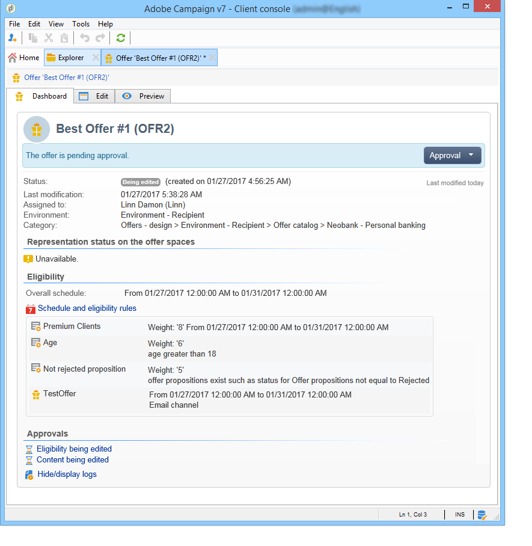

# Creazione di un’offerta{#creating-an-offer}

## Creazione dell’offerta {#creating-the-offer}

Per creare un’offerta, esegui i seguenti passaggi:

1. Vai alla scheda **[!UICONTROL Campaigns]** e fai clic sul collegamento **[!UICONTROL Offers]** .

   

1. Fai clic sul pulsante **[!UICONTROL Create]**.

   

1. Modifica l’etichetta e seleziona la categoria a cui deve appartenere l’offerta.

   

1. Fai clic su **[!UICONTROL Save]** per creare l’offerta.

   

   L’offerta è disponibile nella piattaforma e il relativo contenuto può essere configurato.

   

## Configurazione dell’idoneità delle offerte {#configuring-offer-eligibility}

Nella scheda **[!UICONTROL Eligibility]** , definisci il periodo in cui l’offerta sarà valida e può essere presentata, i filtri da applicare al target e il peso dell’offerta.

### Definizione del periodo di idoneità di un’offerta {#defining-the-eligibility-period-of-an-offer}

Per definire il periodo di idoneità dell’offerta, utilizza gli elenchi a discesa e seleziona una data di inizio e una data di fine nel calendario.


Al di fuori di queste date, l’offerta non verrà selezionata dal motore di interazione. Se hai configurato anche le date di idoneità per la categoria di offerta, verrà applicato il periodo più restrittivo.

### Filtri sulla destinazione {#filters-on-the-target}

Puoi applicare filtri alla destinazione dell’offerta.

A questo scopo, fai clic sul collegamento **[!UICONTROL Edit query]** e seleziona il filtro da applicare. (Fai riferimento a [questa sezione](../../platform/using/steps-to-create-a-query.md#step-4---filter-data)).


Se sono già stati creati filtri predefiniti, puoi selezionarli dall’elenco dei filtri utente. Per ulteriori informazioni, consulta [Creazione di filtri predefiniti](../../interaction/using/creating-predefined-filters.md).


### Peso dell&#39;offerta {#offer-weight}

Per consentire al motore di decidere tra diverse offerte per le quali il target è idoneo, devi assegnare uno o più pesi all’offerta. Puoi anche applicare filtri al target se necessario o limitare lo spazio di offerta a cui verrà applicato il peso. Un&#39;offerta con un peso più significativo sarà preferita rispetto a un&#39;offerta con meno peso.

Puoi configurare più pesi per la stessa offerta, ad esempio per distinguere periodi secondari, target specifici o persino uno spazio di offerta.

Ad esempio, un&#39;offerta può avere un peso di A per i contatti di età compresa tra i 18 e i 25 anni e un peso di B per i contatti al di sopra di tale intervallo. Se un’offerta è idonea per tutta l’estate, può anche avere un peso di A in luglio e un peso di B in agosto.

>[!NOTE]
>
>Il peso assegnato può essere temporaneamente modificato in base ai parametri della categoria a cui appartiene l’offerta. Per ulteriori informazioni, consulta [Creazione di categorie di offerta](../../interaction/using/creating-offer-categories.md).

Per creare un peso in un’offerta, esegui i seguenti passaggi:

1. Fai clic su **[!UICONTROL Add]**.

   

1. Modificare l’etichetta e assegnare un peso. Per impostazione predefinita, è 1.

   

   >[!IMPORTANT]
   >
   >Se non viene inserito alcun peso (0), il target non sarà considerato idoneo per l’offerta.

1. Se si desidera applicare il peso per un determinato periodo, definire le date di idoneità.

   

1. Se necessario, limita il peso a uno spazio di offerta specifico.

   

1. Applicare un filtro a una destinazione.

   

1. Fare clic su **[!UICONTROL OK]** per salvare il peso.

   

   >[!NOTE]
   >
   >Se un target è idoneo per più pesi per un’offerta selezionata, il motore mantiene il peso migliore (massimo). Quando si richiama il motore di offerta, un’offerta viene selezionata al massimo una volta per contatto.

### Riepilogo delle regole di idoneità dell&#39;offerta {#a-summary-of-offer-eligibility-rules}

Al termine della configurazione, un riepilogo delle regole di idoneità sarà disponibile sul dashboard delle offerte.

Per visualizzarlo, fai clic sul collegamento **[!UICONTROL Schedule and eligibility rules]** .



## Creazione del contenuto dell’offerta {#creating-the-offer-content}

1. Fai clic sulla scheda **[!UICONTROL Edit]** , quindi fai clic sulla scheda **[!UICONTROL Content]** .

   

1. Compila i vari campi del contenuto dell’offerta.

   * **[!UICONTROL Title]** : Specifica il titolo da visualizzare nell’offerta. Avviso: questo non fa riferimento all’etichetta dell’offerta, definita nella scheda **[!UICONTROL General]** .
   * **[!UICONTROL Destination URL]** : specifica l’URL dell’offerta. Per essere elaborato correttamente, deve iniziare con &quot;http://&quot; o &quot;https://&quot;.
   * **[!UICONTROL Image URL]** : specifica un URL o un percorso di accesso all’immagine dell’offerta.
   * **[!UICONTROL HTML content]** /  **[!UICONTROL Text content]** : inserisci il corpo dell’offerta nella scheda desiderata. Per generare il tracciamento, il **[!UICONTROL HTML content]** deve essere composto da elementi HTML che possono essere racchiusi in un elemento di tipo `<div>`. Ad esempio, il risultato di un elemento `<table>` nella pagina HTML sarà il seguente:

   ```
      <div> 
       <table>
        <tr>
         <th>Month</th>
         <th>Savings</th>   
        </tr>   
        <tr>    
         <td>January</td>
         <td>$100</td>   
        </tr> 
       </table> 
      </div>
   ```

   La definizione dell’URL di accettazione viene presentata nella sezione [Configurazione dello stato quando la proposta viene accettata](../../interaction/using/creating-offer-spaces.md#configuring-the-status-when-the-proposition-is-accepted) .

   

   Per trovare i campi obbligatori così come sono stati definiti durante la configurazione dello spazio di offerta, fai clic sul collegamento **[!UICONTROL Content definitions]** per visualizzare l’elenco. Per ulteriori informazioni, consulta [Creazione di spazi di offerta](../../interaction/using/creating-offer-spaces.md).

   

   In questo esempio, l’offerta deve includere un titolo, un’immagine, un contenuto HTML e un URL di destinazione.

## Anteprima dell’offerta {#previewing-the-offer}

Non appena è configurato il contenuto dell’offerta, puoi visualizzarlo in anteprima per il destinatario. Per eseguire questa operazione:

1. Fai clic sulla scheda **[!UICONTROL Preview]** .

   

1. Seleziona la rappresentazione dell’offerta da visualizzare.

   

1. Se hai personalizzato il contenuto dell’offerta, seleziona la destinazione dell’offerta per visualizzare la personalizzazione.

   

## Creazione di un&#39;ipotesi su un&#39;offerta {#creating-a-hypothesis-on-an-offer}

Puoi creare ipotesi sulle proposte di offerta. Ciò consente di determinare l’impatto delle offerte sugli acquisti effettuati per il prodotto in esame.

>[!NOTE]
>
>Queste ipotesi vengono eseguite tramite Response Manager. Controlla il contratto di licenza.

Le ipotesi eseguite su una proposta di offerta sono riportate nella relativa scheda **[!UICONTROL Measure]** .

La creazione di ipotesi è descritta in [questa pagina](../../campaign/using/about-response-manager.md).


