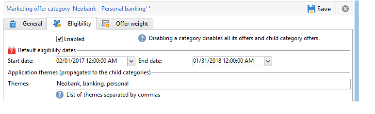

# Creazione di categorie di offerta{#creating-offer-categories}

La creazione di categorie di offerta può avvenire solo nel **[!UICONTROL Design]** ambiente. Vengono distribuiti automaticamente in **[!UICONTROL Live]** ambiente (ovvero reso disponibile) quando le offerte create/modificate che contengono vengono approvate. Per impostazione predefinita, il **[!UICONTROL Design]** L’ambiente contiene una categoria per ricevere tutte le offerte. È possibile creare sottocategorie per aggiungere una gerarchia alle offerte di catalogo.

Per ogni categoria, puoi definire le date di idoneità, ovvero un periodo oltre il quale le offerte contenute nella categoria non possono più essere presentate al relativo target. Se desideri che le offerte di una categoria specifica vengano selezionate come priorità dal motore delle offerte, ad esempio per esporre meglio un prodotto, puoi aumentarne il peso per un determinato periodo aggiungendo un peso moltiplicatore alla categoria.

Per creare una categoria aggiuntiva, attieniti alla seguente procedura:

1. Vai a **[!UICONTROL Offer catalog]** cartella.

   

1. Fai clic con il pulsante destro del mouse e seleziona (Copia negli Appunti) **[!UICONTROL Create a new "Offer category" folder]** dall’elenco a discesa.

   

1. Rinomina la categoria. Puoi modificare l’etichetta in un secondo momento utilizzando **[!UICONTROL General]** scheda.

   

   >[!NOTE]
   >
   >Ripeti questi passaggi per creare tutte le categorie necessarie.

   In seguito, se necessario, è possibile:

   * Assegna date di idoneità da **[!UICONTROL Eligibility]** scheda.

     

   * Immetti le parole chiave da utilizzare per selezionare le offerte all’interno di questa categoria, utilizzando **[!UICONTROL Themes]** campo.

     

     >[!NOTE]
     >
     >Quando si richiama il motore di offerta, viene selezionata solo la parte del catalogo in cui i temi o le categorie corrispondono ai parametri.

   * &quot;aumentare&quot; temporaneamente il peso dell’offerta di una categoria per un determinato periodo tramite **[!UICONTROL Multiplier weight]** campo.

     

Nel dashboard delle offerte incluse nella categoria è disponibile un riepilogo delle regole di idoneità. Per visualizzarli, fai clic su **[!UICONTROL Schedule and eligibility rules of the offer]** collegamento.

