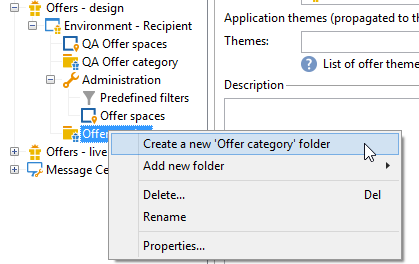

# Creazione di categorie di offerta{#creating-offer-categories}

La creazione di categorie di offerte può avvenire solo nell’ambiente **[!UICONTROL Design]** . Vengono distribuiti automaticamente nell’ambiente **[!UICONTROL Live]** (ovvero reso disponibile) quando vengono approvate le offerte create/modificate che contengono. Per impostazione predefinita, l’ambiente **[!UICONTROL Design]** contiene una categoria per la ricezione di tutte le offerte. È possibile creare sottocategorie per aggiungere una gerarchia alle offerte del catalogo.

Per ogni categoria, è possibile definire le date di idoneità, ovvero un periodo oltre il quale le offerte contenute nella categoria potrebbero non essere più presentate al target. Se desideri che le offerte di una categoria specifica siano selezionate come priorità dal motore di offerta, per esporre meglio un prodotto, ad esempio, puoi aumentarne il peso per un dato periodo aggiungendo un peso moltiplicatore alla categoria.

Per creare una categoria aggiuntiva, effettua le seguenti operazioni:

1. Vai alla cartella **[!UICONTROL Offer catalog]** .

   

1. Fai clic con il pulsante destro del mouse e seleziona **[!UICONTROL Create a new "Offer category" folder]** dall’elenco a discesa.

   

1. Rinomina la categoria. Puoi modificare l’etichetta in un secondo momento utilizzando la scheda **[!UICONTROL General]** .

   

   >[!NOTE]
   >
   >Ripeti questi passaggi per creare tutte le categorie necessarie.

   Quindi, in base alle esigenze, puoi:

   * Assegna le date di idoneità dalla scheda **[!UICONTROL Eligibility]** .

      

   * Immetti le parole chiave che possono essere utilizzate per selezionare le offerte all’interno di questa categoria, utilizzando il campo **[!UICONTROL Themes]** .

      

      >[!NOTE]
      >
      >Quando si richiama il motore di offerta, viene selezionata solo la parte del catalogo in cui i temi o le categorie corrispondono ai parametri.

   * Aumenta temporaneamente il peso dell’offerta di una categoria per un dato periodo tramite il campo **[!UICONTROL Multiplier weight]** .

      

Nel dashboard delle offerte incluse nella categoria è disponibile un riepilogo delle regole di idoneità. Per visualizzarli, fai clic sul collegamento **[!UICONTROL Schedule and eligibility rules of the offer]** .

