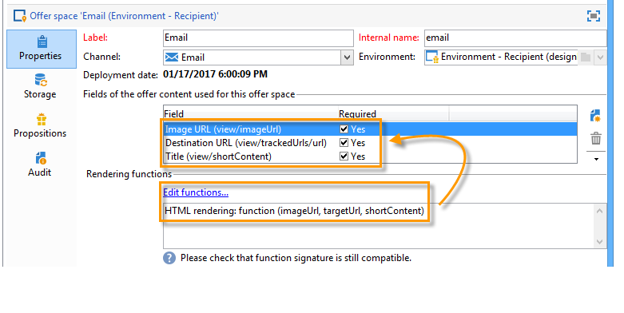

# Creazione di spazi di offerta{#creating-offer-spaces}

La creazione dello spazio dell&#39;offerta può essere effettuata solo da un **amministratore tecnico** con accesso alla sottocartella dello spazio dell&#39;offerta. Gli spazi di offerta possono essere creati solo nell&#39;ambiente di progettazione e vengono automaticamente duplicati nell&#39;ambiente live durante l&#39;approvazione dell&#39;offerta.

Il contenuto delle offerte del catalogo è configurato negli spazi delle offerte. Per impostazione predefinita, il contenuto può includere i campi seguenti: **[!UICONTROL Title]**, **[!UICONTROL Destination URL]**, **[!UICONTROL Image URL]**, **[!UICONTROL HTML content]** e **[!UICONTROL Text content]**. La sequenza di campi è configurata nello spazio delle offerte.

I parametri avanzati consentono di specificare una chiave di identificazione del contatto (che può essere composta da vari elementi, ad esempio il nome e il campo e-mail allo stesso tempo). Per ulteriori informazioni, consultare la sezione [Presentazione di un&#39;offerta identificata](../../interaction/using/integration-via-javascript--client-side-.md#presenting-an-identified-offer).

Il rendering HTML o XML viene creato tramite una funzione di rendering. La sequenza dei campi definiti nella funzione di rendering deve essere identica alla sequenza configurata nel contenuto.



Per creare un nuovo spazio per le offerte, effettuate le seguenti operazioni:

1. Andate all&#39;elenco degli spazi di offerta e fate clic su **[!UICONTROL New]**.

   

1. Selezionate il canale da usare e modificate l’etichetta dello spazio dell’offerta.

   

1. Selezionare la casella **[!UICONTROL Enable unitary mode]** se si applica uno dei seguenti casi:

   * Stai utilizzando Interazione con Centro messaggi
   * Si sta utilizzando la modalità unitaria di Interaction (interazioni in ingresso)

1. Passare alla finestra **[!UICONTROL Content field]** e fare clic su **[!UICONTROL Add]**.

   

1. Andate al nodo **[!UICONTROL Content]** e selezionate i campi nel seguente ordine: **[!UICONTROL Title]**, quindi **[!UICONTROL Image URL]**, poi **[!UICONTROL HTML content]**, quindi **[!UICONTROL Destination URL]**.

   

1. Selezionare la casella **[!UICONTROL Required]** per rendere ogni campo obbligatorio.

   >[!NOTE]
   >
   >Questa configurazione viene utilizzata nell&#39;anteprima e rende gli spazi di offerta non validi durante la pubblicazione se uno degli elementi obbligatori non è presente nell&#39;offerta in questione. Tuttavia, se un&#39;offerta è già attiva in uno spazio di offerta, questi criteri non vengono presi in considerazione.

   

1. Fare clic su **[!UICONTROL Edit functions]** per creare una funzione di rendering.

   Queste funzioni vengono utilizzate per generare rappresentazioni delle offerte in uno spazio delle offerte. Esistono diversi formati possibili: HTML o testo per le interazioni in uscita e XML per le interazioni in ingresso.

   

1. Fare clic sulla scheda **[!UICONTROL HTML rendering]** e selezionare **[!UICONTROL Overload the HTML rendering function]**.
1. Inserire la funzione di rendering.

   

Se necessario, potete sovraccaricare le funzioni di rendering XML per le interazioni in entrata. Potete inoltre sovraccaricare le funzioni di rendering HTML e testo per le interazioni in uscita. Per ulteriori informazioni, vedere [Informazioni sui canali in ingresso](../../interaction/using/about-inbound-channels.md).

## Stato delle proposte di offerta {#offer-proposition-statuses}

Una proposta di offerta può avere vari stati a seconda delle interazioni con la popolazione di destinazione. L&#39;interazione viene fornita con un insieme di valori che possono essere applicati alla proposta di offerta per tutto il suo ciclo di vita. Tuttavia, dovrete configurare la piattaforma in modo che lo stato cambi al momento della creazione e accettazione della proposta di offerta.

>[!NOTE]
>
>Lo stato della proposta di offerta non viene aggiornato immediatamente. Viene eseguito dal flusso di lavoro di tracciamento attivato ogni ora.

### Elenco di stato {#status-list}

L&#39;interazione viene fornita con i seguenti valori che possono essere utilizzati per qualificare lo stato di una proposta di offerta:

* **[!UICONTROL Accepted]**.
* **[!UICONTROL Scheduled]**.
* **[!UICONTROL Generated]**.
* **[!UICONTROL Interested]**.
* **[!UICONTROL Presented]**.
* **[!UICONTROL Rejected]**.

Questi valori non vengono applicati per impostazione predefinita: devono essere configurate.

>[!NOTE]
>
>Lo stato di una proposta di offerta viene automaticamente cambiato in &quot;Presentato&quot; se l&#39;offerta è collegata a una consegna con lo stato &quot;Inviato&quot;.

### Configurazione dello stato durante la creazione della proposta {#configuring-the-status-when-the-proposition-is-created}

Quando una proposta di offerta viene creata dal motore di interazione, il suo stato viene modificato, sia che si tratti di un&#39;interazione in entrata che in uscita. La scelta tra questi due valori dipende dalla configurazione degli spazi di offerta nell&#39;ambiente **[!UICONTROL Design]**

Per ogni spazio, potete configurare lo stato da applicare al momento della creazione di una proposta, a seconda delle informazioni che desiderate visualizzare nei rapporti sulle offerte.

A tal fine, attenersi alla procedura seguente:

1. Passate alla scheda **[!UICONTROL Storage]** dello spazio desiderato.
1. Selezionare lo stato che si desidera applicare alla proposta al momento della creazione.

   

### Configurazione dello stato quando la proposta viene accettata {#configuring-the-status-when-the-proposition-is-accepted}

Una volta accettata la proposta di offerta, potete utilizzare uno dei valori forniti per impostazione predefinita per configurare il nuovo stato della proposta. L&#39;aggiornamento è efficace quando un destinatario fa clic su un collegamento nell&#39;offerta, che richiama il motore di interazione.

A tal fine, attenersi alla procedura seguente:

1. Passate alla scheda **[!UICONTROL Storage]** dello spazio desiderato.
1. Selezionare lo stato che si desidera applicare alla proposta quando viene accettata.

   

**Interazione in entrata**

La scheda **[!UICONTROL Storage]** consente di definire gli stati solo per le proposte di offerta **proposte** e **accettate**. Per l&#39;interazione in entrata, lo stato delle proposte di offerta deve essere specificato direttamente nell&#39;URL per la chiamata al motore di offerta, anziché tramite l&#39;interfaccia. In questo modo, potrete specificare quale stato applicare in altri casi, ad esempio se una proposta di offerta viene rifiutata.

```
<BASE_URL>?a=UpdateStatus&p=<PRIMARY_KEY_OF_THE_PROPOSITION>&st=<NEW_STATUS_OF_THE_PROPOSITION>&r=<REDIRECT_URL>
```

Ad esempio, la proposta (identificatore **40004**) che corrisponde all&#39;offerta **Home Insurance** visualizzata sul sito **Neobank** contiene il seguente URL:

```
<BASE_URL>?a=UpdateStatus&p=<40004>&st=<3>&r=<"http://www.neobank.com/insurance/subscribe.html">
```

Non appena un visitatore fa clic sull&#39;offerta, e quindi l&#39;URL, lo stato **[!UICONTROL Accepted]** (valore **3**) viene applicato alla proposta e il visitatore viene reindirizzato a una nuova pagina del sito **Neobank** per sottoscrivere il contratto assicurativo.

>[!NOTE]
>
>Se desiderate specificare un altro stato nell’url (ad esempio, se una proposta di offerta viene rifiutata), utilizzate il valore corrispondente allo stato desiderato. Esempio: **[!UICONTROL Rejected]** = &quot;5&quot;, **[!UICONTROL Presented]** = &quot;1&quot; e così via.
>
>Gli stati e i relativi valori possono essere recuperati nello schema di dati **[!UICONTROL Offer propositions (nms)]**. Per ulteriori informazioni, consulta [questa pagina](../../configuration/using/data-schemas.md).

**Interazione in uscita**

In caso di interazione in uscita, potete applicare automaticamente lo stato **[!UICONTROL Interested]** a una proposta di offerta quando la consegna contiene un collegamento. È sufficiente aggiungere al collegamento il valore **_urlType=&quot;11&quot;**:

```
<a _urlType="11" href="<DEST_URL>">Link inserted into the delivery</a>
```

## Anteprima offerta per spazio {#offer-preview-per-space}

In questa scheda, puoi visualizzare le offerte per le quali il destinatario è idoneo tramite un metodo scelto. Nell&#39;esempio seguente, il destinatario può ricevere tre proposte di offerta per posta elettronica.


Se un destinatario non è idoneo per alcuna offerta, questa viene visualizzata nell&#39;anteprima.


L’anteprima può ignorare i contesti che sono limitati a uno spazio. Ciò si verifica quando lo schema di interazione è stato esteso per aggiungere campi a cui si fa riferimento in uno spazio utilizzando un canale in entrata (per ulteriori informazioni, fare riferimento a [Esempio di estensione](../../interaction/using/extension-example.md)).
