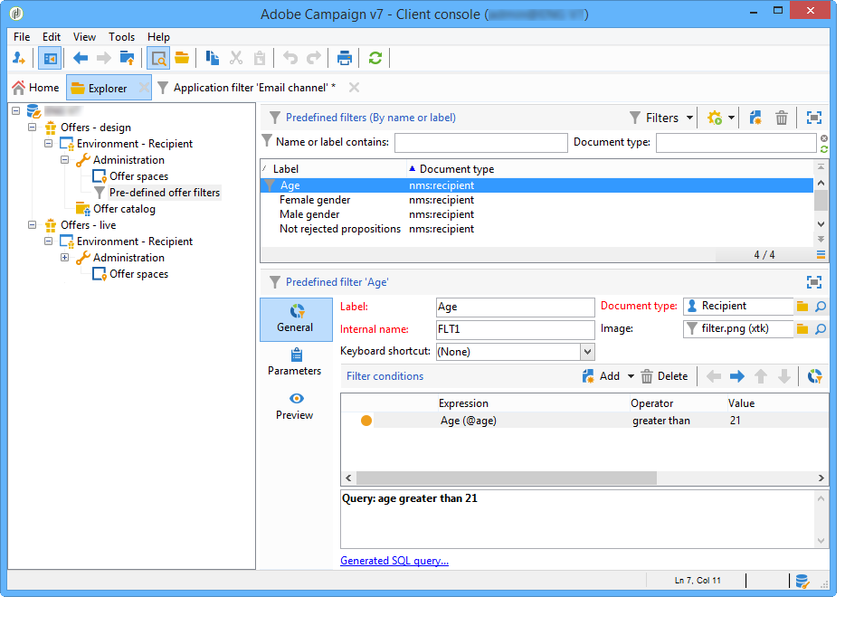

# Creazione di filtri predefiniti{#creating-predefined-filters}

I filtri predefiniti ti consentono di creare regole di idoneità per la popolazione target che possono essere facilmente riutilizzate durante la creazione dell’offerta. Sono specifici per ogni ambiente e tengono conto dei parametri dell’offerta.

Per creare un filtro, applica il seguente processo:

1. Passare alla cartella **[!UICONTROL Administration]** e selezionare **[!UICONTROL Pre-defined offer filters]**.

   

1. Fai clic su **[!UICONTROL New]**.

   

1. Modifica l’etichetta per poter identificare il filtro in un secondo momento.

   

1. Seleziona il campo che verrà interessato dalla condizione di filtro.

   

1. Seleziona un operatore e un valore, se necessario, quindi salva la query.

   

1. Fare clic su **[!UICONTROL Preview]** per visualizzare il risultato del filtro.

   
