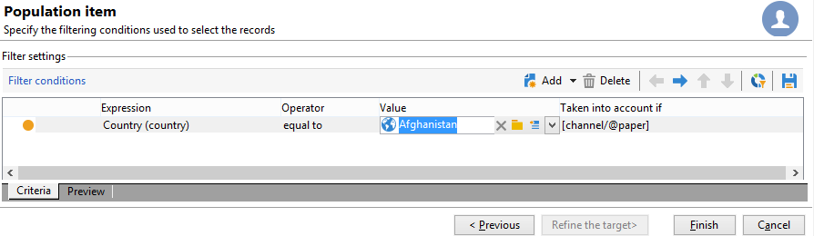

# Architetture distribuite{#distributed-architectures}


## Principio {#principle}

Per supportare la scalabilità e fornire un servizio 24 ore su 24, 7 giorni su 7 sul canale in entrata, puoi utilizzare l’interazione con un’architettura distribuita. Questo tipo di architettura è già in uso con il Centro messaggi ed è costituito da diverse istanze:

* una o più istanze di controllo dedicate al canale in uscita e contenenti la base di progettazione di marketing e ambiente
* una o più istanze di esecuzione dedicate al canale in entrata


>[!NOTE]
>
>Le istanze di controllo sono dedicate al canale in entrata e contengono la versione online del catalogo. Ogni istanza di esecuzione è indipendente e dedicata a un segmento di contatto (ad esempio, un’istanza di esecuzione per paese). Le chiamate al motore di offerta devono essere eseguite direttamente all’esecuzione (un URL specifico per ogni istanza di esecuzione). Poiché la sincronizzazione tra le istanze non è automatica, le interazioni dello stesso contatto devono essere inviate tramite la stessa istanza.

## Sincronizzazione delle proposte {#proposition-synchronization}

La sincronizzazione delle offerte viene eseguita tramite pacchetti. Nelle istanze di esecuzione, tutti gli oggetti catalogo sono preceduti dal nome dell’account esterno. Ciò significa che diverse istanze di controllo (ad esempio istanze di sviluppo e produzione) possono essere supportate sulla stessa istanza di esecuzione.

>[!IMPORTANT]
>
>È consigliabile utilizzare nomi interni brevi ed espliciti.

Le offerte vengono distribuite automaticamente e quindi pubblicate nelle istanze di esecuzione e controllo.

Le offerte eliminate nell’ambiente di progettazione vengono disabilitate su tutte le istanze online. Le proposte e le offerte obsolete vengono eliminate automaticamente in tutte le istanze dopo il periodo di eliminazione (specificato nella procedura guidata di distribuzione di ogni istanza) e il periodo scorrevole (specificato nelle regole di tipologia delle proposte in arrivo).


Per ogni ambiente e account esterno viene creato un flusso di lavoro per la sincronizzazione della proposta. La frequenza di sincronizzazione può essere regolata per ogni ambiente e account esterno.

## Limitazioni {#limitations}

* Se utilizzi la funzione di fallback da un ambiente anonimo a un ambiente identificato, questi due ambienti devono trovarsi nella stessa istanza di esecuzione.
* La sincronizzazione tra più istanze di esecuzione non viene eseguita in tempo reale. Le interazioni dello stesso contatto devono essere inviate alla stessa istanza. L’istanza di controllo deve essere dedicata al canale in uscita (non in tempo reale).
* Il database di marketing non viene sincronizzato automaticamente. I dati di marketing utilizzati nelle ponderazioni e nelle regole di idoneità devono essere duplicati nelle istanze di esecuzione. Questo processo non è standard, è necessario svilupparlo durante il periodo di integrazione.
* La sincronizzazione delle proposte viene eseguita esclusivamente dalla connessione FDA.
* Se utilizzi Interaction e Message Center (Centro messaggi) sulla stessa istanza, in entrambi i casi la sincronizzazione verrà eseguita tramite il protocollo FDA.

## Configurazione pacchetti {#packages-configuration}

Qualsiasi estensione dello schema collegata direttamente a **Interaction** (offerte, proposte, destinatari, ecc.) deve essere distribuito sulle istanze di esecuzione.

Il pacchetto di interazione deve essere installato su tutte le istanze (controllo ed esecuzione). Sono disponibili due pacchetti aggiuntivi: un pacchetto da installare sulle istanze di controllo e un altro da installare su ogni istanza di esecuzione.

>[!NOTE]
>
>Durante l&#39;installazione del pacchetto, i campi di tipo **long** della tabella **nms:proposition**, ad esempio l&#39;ID della proposta, diventano campi di tipo **int64**. Questo tipo di dati è descritto in [questa sezione](../../configuration/using/schema-structure.md#mapping-the-types-of-adobe-campaign-dbms-data).

La durata di conservazione dei dati deve essere configurata in ogni istanza (tramite la finestra **[!UICONTROL Data purge]** nella procedura guidata di distribuzione). Nelle istanze di esecuzione, questo periodo deve corrispondere alla profondità storica necessaria per le regole di tipologia (periodo scorrevole) e le regole di idoneità da calcolare.

Sulle istanze di controllo:

1. Crea un account esterno tramite istanza di esecuzione:

   

   * Completa l’etichetta e aggiungi un nome interno breve ed esplicito.
   * Seleziona **[!UICONTROL Execution instance]**.
   * Seleziona l’opzione **[!UICONTROL Enabled]**.
   * Completa i parametri di connessione per l’istanza di esecuzione.
   * Ogni istanza di esecuzione deve essere collegata a un ID. Questo ID viene assegnato quando si fa clic sul pulsante **[!UICONTROL Initialize connection]**.
   * Controllare il tipo di applicazione utilizzato: **[!UICONTROL Message Center]**, **[!UICONTROL Interaction]** o entrambi.
   * Immettere l&#39;account FDA utilizzato. Un operatore deve essere creato nelle istanze di esecuzione e deve disporre dei seguenti diritti di lettura e scrittura sul database dell’istanza in questione:

     ```
     grant SELECT ON nmspropositionrcp, nmsoffer, nmsofferspace, xtkoption, xtkfolder TO user;
     grant DELETE, INSERT, UPDATE ON nmspropositionrcp TO user;
     ```

   >[!NOTE]
   >
   >L&#39;indirizzo IP dell&#39;istanza di controllo deve essere autorizzato nelle istanze di esecuzione.

1. Configurare l’ambiente:

   

   * Aggiungi l’elenco delle istanze di esecuzione.
   * Per ciascuno, specifica il periodo di sincronizzazione e i criteri di filtro (ad esempio, per paese).

     >[!NOTE]
     >
     >Se riscontri un errore, puoi consultare i flussi di lavoro di sincronizzazione e le notifiche delle offerte. Questi si trovano nei flussi di lavoro tecnici dell’applicazione.

Se, per motivi di ottimizzazione, nelle istanze di esecuzione viene duplicata solo una parte del database di marketing, puoi specificare uno schema con restrizioni collegato all’ambiente per consentire agli utenti di utilizzare solo i dati disponibili nelle istanze di esecuzione. Puoi creare un’offerta utilizzando dati non disponibili nelle istanze di esecuzione. A tale scopo, è necessario disattivare la regola sugli altri canali limitandola sul canale in uscita (campo **[!UICONTROL Taken into account if]**).



## Opzioni di manutenzione {#maintenance-options}

Elenco delle opzioni di manutenzione disponibili nell’istanza di controllo:

>[!IMPORTANT]
>
>Queste opzioni devono essere utilizzate solo per casi di manutenzione specifici.

* **`NmsInteraction_LastOfferEnvSynch_<offerEnvId>_<executionInstanceId>`**: data dell&#39;ultima sincronizzazione di un ambiente in una determinata istanza.
* **`NmsInteraction_LastPropositionSynch_<propositionSchema>_<executionInstanceIdSource>_<executionInstanceIdTarget>`**: ultima data in cui le proposte da un dato schema sono state sincronizzate da un&#39;istanza all&#39;altra.
* **`NmsInteraction_MapWorkflowId`**: opzione contenente l&#39;elenco di tutti i flussi di lavoro di sincronizzazione generati.

Nelle istanze di esecuzione è disponibile la seguente opzione:

**NmsExecutionInstanceId**: opzione contenente l&#39;ID istanza.

## Installazione dei pacchetti {#packages-installation}

Se in precedenza l’istanza non disponeva del pacchetto Interaction, non è necessaria alcuna migrazione. Per impostazione predefinita, la tabella della proposta è a 64 bit dopo l’installazione dei pacchetti.

>[!IMPORTANT]
>
>A seconda del volume di proposte esistenti nell’istanza, questa operazione potrebbe richiedere del tempo.

* Se l’istanza ha poche proposte o non le ha, non è necessaria alcuna modifica manuale della tabella delle proposte. La modifica verrà eseguita al momento dell&#39;installazione dei pacchetti.
* Se l’istanza dispone di numerose proposte, è meglio modificare la struttura della tabella delle proposte prima di installare i pacchetti di controllo ed eseguirli. È consigliabile eseguire le query durante un periodo di bassa attività.

>[!NOTE]
>
>Se hai eseguito configurazioni specifiche nella tabella della proposta, adatta di conseguenza le query.

### PostgreSQL {#postgresql}

Esistono due metodi. Il primo (utilizzando una tabella di lavoro) è leggermente più veloce.

**Tabella di lavoro**

```
CREATE TABLE NmsPropositionRcp_tmp AS SELECT * FROM nmspropositionrcp WHERE 0=1;
ALTER TABLE nmspropositionrcp_tmp
  ALTER COLUMN ipropositionid TYPE bigint,
  ALTER COLUMN iinteractionid TYPE bigint;
INSERT INTO nmspropositionrcp_tmp SELECT * FROM nmspropositionrcp;
DROP TABLE nmspropositionrcp;
CREATE INDEX proposition_id ON NmsPropositionRcp (ipropositionid);
CREATE INDEX nmspropositionrcp_deliveryid ON NmsPropositionRcp (ideliveryid);
CREATE INDEX nmspropositionrcp_lastmodified ON NmsPropositionRcp (tslastmodified);
CREATE INDEX nmspropositionrcp_offerid ON NmsPropositionRcp (iofferid);
CREATE INDEX nmspropositionrcp_offerspaceid ON NmsPropositionRcp (iofferspaceid);
CREATE INDEX nmspropositionrcp_recipientidid ON NmsPropositionRcp (irecipientid);
ALTER TABLE nmspropositionrcp_tmp RENAME TO nmspropositionrcp;
```

**Modifica tabella**

```
ALTER TABLE nmspropositionrcp
  ALTER COLUMN ipropositionid TYPE bigint,
  ALTER COLUMN iinteractionid TYPE bigint;
```

### Oracle {#oracle}

La modifica della dimensione di un tipo **Number** non comporta la riscrittura di valori o indici. È quindi immediato.

La query da eseguire è la seguente:

```
ALTER TABLE nmspropositionrcp MODIFY (
ipropositionid NUMBER(19, 0),
iinteractionid NUMBER(19, 0)
);
```

### MSSQL {#mssql}

Le query da eseguire sono le seguenti:

```
SELECT * INTO NmsPropositionRcp_tmp FROM NmsPropositionRcp WHERE 1 = 0;
GO
ALTER TABLE NmsPropositionRcp_tmp ALTER COLUMN ipropositionid BIGINT;
GO
ALTER TABLE NmsPropositionRcp_tmp ALTER COLUMN iinteractionid BIGINT;
GO
INSERT INTO NmsPropositionRcp_tmp SELECT * FROM NmsPropositionRcp;
GO
DROP TABLE NmsPropositionRcp;
GO
sp_rename 'NmsPropositionRcp_tmp', NmsPropositionRcp
GO
ALTER TABLE NmsPropositionRcp ADD DEFAULT ((0)) FOR dWeight
GO
ALTER TABLE NmsPropositionRcp ADD DEFAULT ((0)) FOR iDeliveryId
GO
ALTER TABLE NmsPropositionRcp ADD DEFAULT ((0)) FOR iEngineType
GO
ALTER TABLE NmsPropositionRcp ADD DEFAULT ((0)) FOR iInteractionId
GO
ALTER TABLE NmsPropositionRcp ADD DEFAULT ((0)) FOR iOfferId
GO
ALTER TABLE NmsPropositionRcp ADD DEFAULT ((0)) FOR iOfferSpaceId
GO
ALTER TABLE NmsPropositionRcp ADD DEFAULT ((0)) FOR iPropositionId
GO
ALTER TABLE NmsPropositionRcp ADD DEFAULT ((0)) FOR iRank
GO
ALTER TABLE NmsPropositionRcp ADD DEFAULT ((0)) FOR iRecipientId
GO
ALTER TABLE NmsPropositionRcp ADD DEFAULT ((0)) FOR iStatus
GO
CREATE NONCLUSTERED INDEX NmsPropositionRcp_deliveryId ON NmsPropositionRcp (iDeliveryId)
GO
CREATE NONCLUSTERED INDEX NmsPropositionRcp_eventDate ON NmsPropositionRcp (tsEvent)
GO
CREATE UNIQUE NONCLUSTERED INDEX NmsPropositionRcp_id ON NmsPropositionRcp (iPropositionId)
GO
CREATE NONCLUSTERED INDEX NmsPropositionRcp_lastModified ON NmsPropositionRcp (tsLastModified)
GO
CREATE NONCLUSTERED INDEX NmsPropositionRcp_offerId ON NmsPropositionRcp (iOfferId)
GO
CREATE NONCLUSTERED INDEX NmsPropositionRcp_offerSpaceI ON NmsPropositionRcp (iOfferSpaceId)
GO
CREATE NONCLUSTERED INDEX NmsPropositionRcp_recipientId ON NmsPropositionRcp (iRecipientId)
GO
```
