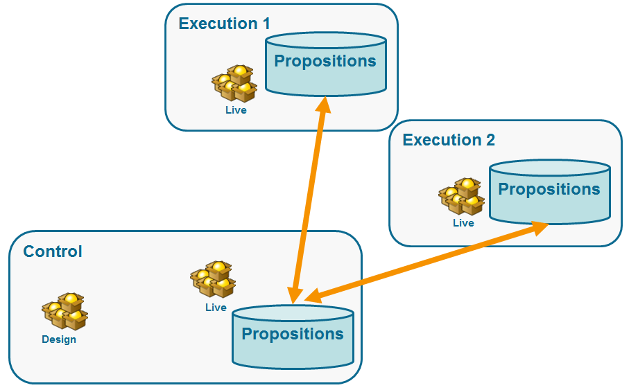

# Architetture distribuite{#distributed-architectures}

## Principio {#principle}

Per supportare la scalabilità e fornire un servizio 24 ore su 24, 7 giorni su 7 sul canale in ingresso, è possibile utilizzare Interaction con un&#39;architettura distribuita. Questo tipo di architettura è già utilizzata con Centro messaggi ed è composta da diverse istanze:

* una o più istanze di controllo dedicate al canale in uscita e contenenti la base di progettazione del marketing e dell&#39;ambiente
* una o più istanze di esecuzione dedicate al canale in ingresso


>[!NOTE]
>
>Le istanze di controllo sono dedicate al canale in ingresso e contengono la versione online del catalogo. Ogni istanza di esecuzione è indipendente e dedicata a un segmento di contatto (ad esempio, un&#39;istanza di esecuzione per paese). Le chiamate al motore di offerta devono essere eseguite direttamente sull&#39;esecuzione (un URL specifico per istanza di esecuzione). Poiché la sincronizzazione tra le istanze non è automatica, le interazioni dello stesso contatto devono essere inviate attraverso la stessa istanza.

## Sincronizzazione proposta {#proposition-synchronization}

La sincronizzazione dell&#39;offerta viene eseguita tramite pacchetti. Nelle istanze di esecuzione, tutti gli oggetti catalogo hanno il prefisso del nome account esterno. Ciò significa che diverse istanze di controllo (ad esempio, istanze di sviluppo e produzione) possono essere supportate in una stessa istanza di esecuzione.

>[!CAUTION]
>
>È consigliabile utilizzare nomi interni brevi ed espliciti.

Le offerte vengono distribuite automaticamente e quindi pubblicate sulle istanze di esecuzione e controllo.

Le offerte eliminate nell&#39;ambiente di progettazione vengono disattivate in tutte le istanze online. Le proposte e le offerte obsolete vengono eliminate automaticamente su tutte le istanze dopo il periodo di eliminazione (specificato nell&#39;assistente di distribuzione di ciascuna istanza) e il periodo di scorrimento (specificato nelle regole di tipologia delle proposizioni in arrivo).



Viene creato un flusso di lavoro per ciascun ambiente e account esterno per la sincronizzazione delle proposte. La frequenza di sincronizzazione può essere regolata per ogni ambiente e account esterno.

## Limitazioni {#limitations}

* Se si utilizza la funzione fall back da un ambiente anonimo a un ambiente identificato, questi due ambienti devono trovarsi nella stessa istanza di esecuzione.
* La sincronizzazione tra più istanze di esecuzione non viene eseguita in tempo reale. Le interazioni dello stesso contatto devono essere inviate alla stessa istanza. L&#39;istanza di controllo deve essere dedicata al canale in uscita (nessun tempo reale).
* Il database di marketing non viene sincronizzato automaticamente. I dati di marketing utilizzati nei pesi e nelle regole di idoneità devono essere duplicati nelle istanze di esecuzione. Questo processo non è standard, è necessario svilupparlo durante il periodo di integrazione.
* La sincronizzazione della proposta viene eseguita esclusivamente dalla connessione FDA.
* Se utilizzate Interaction e Message Center nella stessa istanza, la sincronizzazione avverrà tramite il protocollo FDA in entrambi i casi.

## Configurazione pacchetti {#packages-configuration}

Eventuali estensioni dello schema direttamente collegate all&#39; **interazione** (offerte, proposte, destinatari ecc.) deve essere distribuito sulle istanze di esecuzione.

Il pacchetto Interaction deve essere installato in tutte le istanze (controllo ed esecuzione). Sono disponibili due pacchetti aggiuntivi: un pacchetto da installare nelle istanze di controllo e un altro da installare in ogni istanza di esecuzione.

>[!NOTE]
>
>Durante l&#39;installazione del pacchetto, i campi di tipo **esteso** della tabella **nms:proposition** , ad esempio l&#39;ID proposta, diventano campi di tipo **int64** . Questo tipo di dati è dettagliato in [questa sezione](../../configuration/using/schema-structure.md#mapping-the-types-of-adobe-campaign-dbms-data).

La durata di conservazione dei dati deve essere configurata su ogni istanza (tramite la **[!UICONTROL Data purge]** finestra nella procedura guidata di distribuzione). Per le istanze di esecuzione, questo periodo deve corrispondere alla profondità storica necessaria per il calcolo delle regole di tipologia (periodo di scorrimento) e delle regole di idoneità.

Sulle istanze di controllo:

1. Create un account esterno tramite istanza di esecuzione:

   

   * Completate l’etichetta e aggiungete un nome interno breve ed esplicito.
   * Seleziona **[!UICONTROL Execution instance]**.
   * Seleziona l’opzione **[!UICONTROL Enabled]**.
   * Completate i parametri di connessione per l&#39;istanza di esecuzione.
   * Ogni istanza di esecuzione deve essere collegata a un ID. Questo ID viene assegnato quando si fa clic sul **[!UICONTROL Initialize connection]** pulsante.
   * Verificare il tipo di applicazione utilizzata: **[!UICONTROL Message Center]**, **[!UICONTROL Interaction]** o entrambi.
   * Immettere l&#39;account FDA utilizzato. Un operatore deve essere creato sulle istanze di esecuzione e deve avere i seguenti diritti di lettura e scrittura sul database dell&#39;istanza in questione:

      ```
      grant SELECT ON nmspropositionrcp, nmsoffer, nmsofferspace, xtkoption, xtkfolder TO user;
      grant DELETE, INSERT, UPDATE ON nmspropositionrcp TO user;
      ```
   >[!NOTE]
   >
   >L&#39;indirizzo IP dell&#39;istanza di controllo deve essere autorizzato sulle istanze di esecuzione.

1. Configurare l&#39;ambiente:

   

   * Aggiungete l&#39;elenco delle istanze di esecuzione.
   * Per ciascuno di essi, specificate il periodo di sincronizzazione e i criteri del filtro (ad esempio, per paese).

      >[!NOTE]
      >
      >Se si verifica un errore, potete consultare i flussi di lavoro di sincronizzazione e le notifiche delle offerte. Questi sono reperibili nei flussi di lavoro tecnici dell&#39;applicazione.

Se, per motivi di ottimizzazione, solo una parte del database di marketing viene duplicata nelle istanze di esecuzione, è possibile specificare uno schema limitato collegato all&#39;ambiente per consentire agli utenti di utilizzare solo i dati disponibili nelle istanze di esecuzione. Potete creare un&#39;offerta utilizzando dati non disponibili per le istanze di esecuzione. A tal fine, è necessario disattivare la regola sugli altri canali limitando questa regola sul canale in uscita (**[!UICONTROL Taken into account if]** campo).


## Opzioni di manutenzione {#maintenance-options}

Elenco delle opzioni di manutenzione disponibili nell’istanza di controllo:

>[!CAUTION]
>
>Queste opzioni devono essere utilizzate solo per casi di manutenzione specifici.

* **`NmsInteraction_LastOfferEnvSynch_<offerEnvId>_<executionInstanceId>`**: ultima data in cui un ambiente è stato sincronizzato in una determinata istanza.
* **`NmsInteraction_LastPropositionSynch_<propositionSchema>_<executionInstanceIdSource>_<executionInstanceIdTarget>`**: ultima data in cui le proposizioni da uno schema specificato sono state sincronizzate da un&#39;istanza all&#39;altra.
* **`NmsInteraction_MapWorkflowId`**: un&#39;opzione contenente l&#39;elenco di tutti i flussi di lavoro di sincronizzazione generati.

L&#39;opzione seguente è disponibile per le istanze di esecuzione:

**NmsExecutionInstanceId**: contenente l’ID dell’istanza.

## Installazione pacchetti {#packages-installation}

Se l’istanza non aveva in precedenza il pacchetto Interaction, non è necessaria alcuna migrazione. Per impostazione predefinita, la tabella delle proposte sarà in 64 bit dopo l&#39;installazione dei pacchetti.

>[!CAUTION]
>
>A seconda del volume di proposizioni esistenti nell’istanza, questa operazione potrebbe richiedere del tempo.

* Se l&#39;istanza ha poche o nessuna proposta, non è necessaria alcuna modifica manuale della tabella di proposta. La modifica viene eseguita quando vengono installati i pacchetti.
* Se l&#39;istanza ha molte proposte, è meglio modificare la struttura della tabella delle proposte prima di installare i pacchetti di controllo e di eseguirli. È consigliabile eseguire le query durante un periodo di bassa attività.

>[!NOTE]
>
>Se avete eseguito configurazioni specifiche nella tabella delle proposte, adattate le query di conseguenza.

### PostgreSQL {#postgresql}

Ci sono due metodi. Il primo (che utilizza una tabella di lavoro) è leggermente più veloce.

**Tabella di lavoro**

```
CREATE TABLE NmsPropositionRcp_tmp AS SELECT * FROM nmspropositionrcp WHERE 0=1;
ALTER TABLE nmspropositionrcp_tmp
  ALTER COLUMN ipropositionid TYPE bigint,
  ALTER COLUMN iinteractionid TYPE bigint;
INSERT INTO nmspropositionrcp_tmp SELECT * FROM nmspropositionrcp;
DROP TABLE nmspropositionrcp;
CREATE INDEX proposition_id ON NmsPropositionRcp (ipropositionid);
CREATE INDEX nmspropositionrcp_deliveryid ON NmsPropositionRcp (ideliveryid);
CREATE INDEX nmspropositionrcp_lastmodified ON NmsPropositionRcp (tslastmodified);
CREATE INDEX nmspropositionrcp_offerid ON NmsPropositionRcp (iofferid);
CREATE INDEX nmspropositionrcp_offerspaceid ON NmsPropositionRcp (iofferspaceid);
CREATE INDEX nmspropositionrcp_recipientidid ON NmsPropositionRcp (irecipientid);
ALTER TABLE nmspropositionrcp_tmp RENAME TO nmspropositionrcp;
```

**Modifica tabella**

```
ALTER TABLE nmspropositionrcp
  ALTER COLUMN ipropositionid TYPE bigint,
  ALTER COLUMN iinteractionid TYPE bigint;
```

### Oracle {#oracle}

La modifica delle dimensioni di un tipo **Number** non comporta la riscrittura di valori o indice. È quindi immediata.

La query da eseguire è la seguente:

```
ALTER TABLE nmspropositionrcp MODIFY (
ipropositionid NUMBER(19, 0),
iinteractionid NUMBER(19, 0)
);
```

### MSSQL {#mssql}

Le query da eseguire sono le seguenti:

```
SELECT * INTO NmsPropositionRcp_tmp FROM NmsPropositionRcp WHERE 1 = 0;
GO
ALTER TABLE NmsPropositionRcp_tmp ALTER COLUMN ipropositionid BIGINT;
GO
ALTER TABLE NmsPropositionRcp_tmp ALTER COLUMN iinteractionid BIGINT;
GO
INSERT INTO NmsPropositionRcp_tmp SELECT * FROM NmsPropositionRcp;
GO
DROP TABLE NmsPropositionRcp;
GO
sp_rename 'NmsPropositionRcp_tmp', NmsPropositionRcp
GO
ALTER TABLE NmsPropositionRcp ADD DEFAULT ((0)) FOR dWeight
GO
ALTER TABLE NmsPropositionRcp ADD DEFAULT ((0)) FOR iDeliveryId
GO
ALTER TABLE NmsPropositionRcp ADD DEFAULT ((0)) FOR iEngineType
GO
ALTER TABLE NmsPropositionRcp ADD DEFAULT ((0)) FOR iInteractionId
GO
ALTER TABLE NmsPropositionRcp ADD DEFAULT ((0)) FOR iOfferId
GO
ALTER TABLE NmsPropositionRcp ADD DEFAULT ((0)) FOR iOfferSpaceId
GO
ALTER TABLE NmsPropositionRcp ADD DEFAULT ((0)) FOR iPropositionId
GO
ALTER TABLE NmsPropositionRcp ADD DEFAULT ((0)) FOR iRank
GO
ALTER TABLE NmsPropositionRcp ADD DEFAULT ((0)) FOR iRecipientId
GO
ALTER TABLE NmsPropositionRcp ADD DEFAULT ((0)) FOR iStatus
GO
CREATE NONCLUSTERED INDEX NmsPropositionRcp_deliveryId ON NmsPropositionRcp (iDeliveryId)
GO
CREATE NONCLUSTERED INDEX NmsPropositionRcp_eventDate ON NmsPropositionRcp (tsEvent)
GO
CREATE UNIQUE NONCLUSTERED INDEX NmsPropositionRcp_id ON NmsPropositionRcp (iPropositionId)
GO
CREATE NONCLUSTERED INDEX NmsPropositionRcp_lastModified ON NmsPropositionRcp (tsLastModified)
GO
CREATE NONCLUSTERED INDEX NmsPropositionRcp_offerId ON NmsPropositionRcp (iOfferId)
GO
CREATE NONCLUSTERED INDEX NmsPropositionRcp_offerSpaceI ON NmsPropositionRcp (iOfferSpaceId)
GO
CREATE NONCLUSTERED INDEX NmsPropositionRcp_recipientId ON NmsPropositionRcp (iRecipientId)
GO
```

