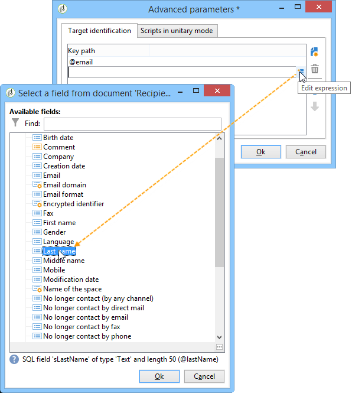
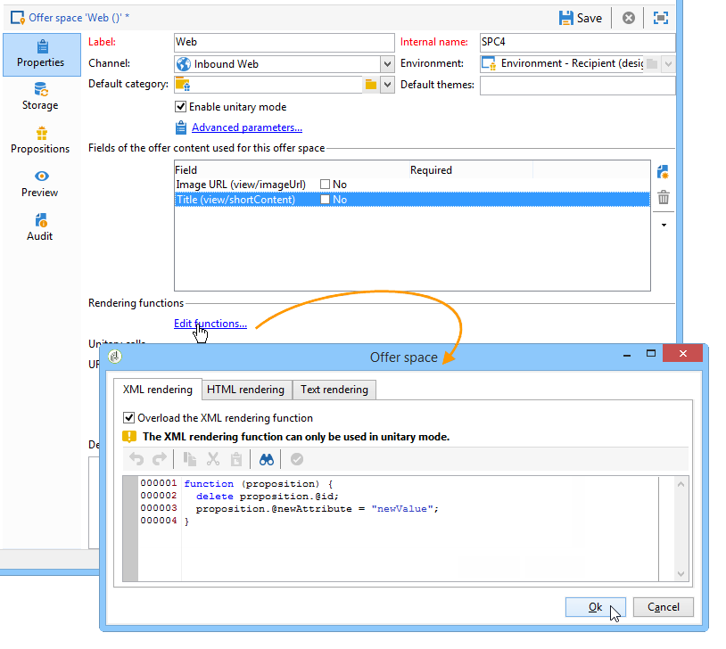

# Integrazione tramite JavaScript (lato client){#integration-via-javascript-client-side}


Per chiamare il motore di interazione in una pagina web, inserisci una chiamata a un codice JavaScript direttamente nella pagina. Questa chiamata restituisce il contenuto dell’offerta in una destinazione

elemento.

L’Adobe consiglia di utilizzare il metodo di integrazione JavaScript.

L’URL di chiamata dello script si presenta così:

```
<script id="interactionProposalScript" src="https://<SERVER_URL>/nl/interactionProposal.js?env=" type="text/javascript"></script>
```

La &quot;**env** Il parametro &quot; riceve il nome interno dell’ambiente live dedicato alle interazioni anonime.

Per presentare un’offerta, è necessario creare un ambiente e uno spazio delle offerte in Adobe Campaign, quindi configurare la pagina HTML.

I seguenti casi d’uso descrivono nel dettaglio le opzioni possibili per l’integrazione delle offerte tramite JavaScript.

## Modalità HTML {#html-mode}

### Presentazione di un’offerta anonima {#presenting-an-anonymous-offer}

1. **Preparazione del motore di interazione**

   Apri l’interfaccia di Adobe Campaign e prepara un ambiente anonimo.

   Crea uno spazio delle offerte collegato all’ambiente anonimo.

   Crea un’offerta e la relativa rappresentazione collegata allo spazio dell’offerta.

1. **Contenuto della pagina HTML**

   La pagina HTML deve includere

   con un attributo @id con il valore del nome interno dello spazio dell&#39;offerta creato (&quot;i_internal name space&quot;). L’offerta verrà inserita in questo elemento dall’interazione.

   Nel nostro esempio, l’attributo @id riceve il valore &quot;i_SPC12&quot;, dove &quot;SPC12&quot; è il nome interno dello spazio dell’offerta creato in precedenza:

   ```
   <div id="i_SPC12"></div>
   ```

   Nel nostro esempio, l’URL per la chiamata dello script è il seguente (&quot;OE3&quot; è il nome interno dell’ambiente live):

   ```
   <script id="interactionProposalScript" src="https://instance.adobe.org:8080/nl/interactionProposal.js?env=OE3" type="text/javascript"></script>
   ```

   >[!IMPORTANT]
   >
   >Il `<script>` il tag non deve essere a chiusura automatica.

   Questa chiamata statica genera automaticamente una chiamata dinamica contenente tutti i parametri necessari per il motore di interazione.

   Questo comportamento consente di utilizzare diversi spazi di offerta sulla stessa pagina, da gestire tramite una singola chiamata al motore.

1. **Risultati nella pagina HTML**

   Il contenuto della rappresentazione dell’offerta viene restituito alla pagina HTML dal motore di interazione:

   ```
   <div id="banner_header">
     <div id="i_SPC12">
       <table>
         <tbody>
           <tr>
             <td><h3>Fly to Japan!</h3></td>
           </tr>
           <tr>
             <td></td>
             <td>
               <p>Discover Japan for 2 weeks at an unbelievable price!!</p>
               <p><b>2345 Dollars - All inclusive</b></p>
             </td>
           </tr>
         </tbody>
       </table>
     </div>
     <script src="https://instance.adobe.org:8080/nl/interactionProposal.js?env=OE3" id="interactionProposalScript" type="text/javascript"></script>
   </div>
   ```

### Presentazione di un’offerta identificata {#presenting-an-identified-offer}

Per presentare un’offerta a un contatto identificato, il processo è simile a quello descritto qui: [Presentazione di un’offerta anonima](#presenting-an-anonymous-offer). Nel contenuto della pagina web, devi aggiungere il seguente script che identificherà il contatto durante la chiamata al motore:

```
<script type="text/javascript">
  interactionTarget = <contact_identifier>;
</script>
```

1. Vai allo spazio dell’offerta che verrà richiamato dalla pagina web, fai clic su **[!UICONTROL Advanced parameters]** e aggiungi una o più chiavi di identificazione.

   

   In questo esempio, la chiave di identificazione è composita perché si basa sia sull’e-mail che sul nome del destinatario.

1. Durante la visualizzazione della pagina web, la valutazione dello script ti consente di trasmettere l’ID destinatario al motore di offerta. Se l’ID è composito, i tasti vengono visualizzati nella stessa sequenza utilizzata nelle impostazioni avanzate e sono separati da un simbolo |.

   Nell’esempio seguente, il contatto ha effettuato l’accesso al sito web ed è stato riconosciuto durante la chiamata al motore di interazione grazie alla sua e-mail e al suo nome.

   ```
   <script type="text/javascript">
     interactionTarget = myEmail|myName;
   </script>
   ```

### Utilizzo di una funzione di rendering HTML {#using-an-html-rendering-function}

Per generare automaticamente la rappresentazione dell’offerta HTML, puoi utilizzare una funzione di rendering.

1. Vai allo spazio dell’offerta e fai clic su **[!UICONTROL Edit functions]** collegamento.
1. Seleziona **[!UICONTROL Overload the HTML rendering function]**.
1. Vai a **[!UICONTROL HTML rendering]** e inserisci le variabili che corrispondono ai campi definiti per il contenuto dell’offerta nello spazio dell’offerta.

   

   In questo esempio, l’offerta viene visualizzata sotto forma di banner in una pagina web ed è composta da un’immagine cliccabile e da un titolo che corrisponde ai campi definiti nel contenuto dell’offerta.

## Modalità XML {#xml-mode}

### Presentazione di un’offerta {#presenting-an-offer}

L’interazione ti consente di restituire un nodo XML alla pagina HTML che chiama il motore di offerta. Questo nodo XML può essere elaborato da funzioni da sviluppare sul lato cliente.

La chiamata al motore di interazione si presenta così:

```
<script type="text/javascript" id="interactionProposalScript" src="https://<SERVER_URL>/nl/interactionProposal.js?env=&cb="></script>
```

La &quot;**env** Il parametro &quot; riceve il nome interno dell’ambiente live.

La &quot;**cb** Il parametro &quot; riceve il nome della funzione che leggerà il nodo XML restituito dal motore contenente le proposte (callback). Questo parametro è facoltativo.

La &quot;**t** Il parametro &quot; riceve il valore del target, solo per un’interazione identificata. Questo parametro può essere trasmesso anche con **interfaceTarget** variabile. Questo parametro è facoltativo.

La &quot;**c** Il parametro &quot; riceve l’elenco dei nomi interni delle categorie. Questo parametro è facoltativo.

La &quot;**th** Il parametro &quot; riceve l’elenco dei temi. Questo parametro è facoltativo.

La &quot;**gctx** Il parametro &quot; riceve i dati globali della chiamata (contesto) all’intera pagina. Questo parametro è facoltativo.

Il nodo XML restituito è simile al seguente:

```
<propositions>
 <proposition id="" offer-id="" weight="" rank="" space="" div=""> //proposition identifiers
   ...XML content defined in Adobe Campaign...
 </proposition>
 ...
</propositions>
```

Il seguente caso d’uso descrive le configurazioni da eseguire in Adobe Campaign per abilitare la modalità XML e quindi mostra il risultato della chiamata al motore nella pagina HTML.

1. **Creazione di un ambiente e di uno spazio dell’offerta**

   Per ulteriori informazioni sulla creazione di un ambiente, consulta [Ambienti di progettazione/live](../../interaction/using/live-design-environments.md).

   Per ulteriori informazioni sulla creazione di uno spazio dell’offerta, consulta [Creazione di spazi dell’offerta](../../interaction/using/creating-offer-spaces.md).

1. **Estensione dello schema di offerta per aggiungere nuovi campi**

   Questo schema definirà i seguenti campi: Titolo numero 2 e prezzo.

   Il nome dello schema nell’esempio è **cus:offer**

   ```
   <srcSchema _cs="Marketing offers (cus)" created="2013-01-18 17:14:20.762Z" createdBy-id="0"
              desc="" entitySchema="xtk:srcSchema" extendedSchema="nms:offer" img="nms:offer.png"
              label="Marketing offers" labelSingular="Marketing offers" lastModified="2013-01-18 15:20:18.373Z"
              mappingType="sql" md5="F14A7AA009AE1FCE31B0611E72866AC3" modifiedBy-id="0"
              name="offer" namespace="cus" xtkschema="xtk:srcSchema">
     <createdBy _cs="Administrator (admin)"/>
     <modifiedBy _cs="Administrator (admin)"/>
     <element img="nms:offer.png" label="Marketing offers" labelSingular="Marketing offer"
              name="offer">
       <element label="Content" name="view">
         <element label="Price" name="price" type="long" xml="true"/>
         <element label="Title 2" name="title2" type="string" xml="true"/>
   
         <element advanced="true" desc="Price calculation script." label="Script price"
                  name="price_jst" type="CDATA" xml="true"/>
         <element advanced="true" desc="Title calculation script." label="Script title"
                  name="title2_jst" type="CDATA" xml="true"/>
       </element>
     </element>
   </srcSchema>
   ```

   >[!IMPORTANT]
   >
   >Ogni elemento deve essere definito due volte. Gli elementi di tipo CDATA (&quot;_jst&quot;) possono contenere campi di personalizzazione.
   >
   >Aggiornare la struttura del database. Per ulteriori informazioni al riguardo, consulta [questa sezione](../../configuration/using/updating-the-database-structure.md).

   >[!NOTE]
   >
   >Puoi estendere lo schema dell’offerta per aggiungere nuovi campi sia in modalità batch che unitaria e in qualsiasi formato (testo, HTML e XML).

1. **Estensione della formula dell’offerta per modificare nuovi campi e modificare un campo esistente**

   Modifica il **Offerta (nsm)** modulo di input.

   Nella sezione &quot;Viste&quot;, inserisci i due nuovi campi con il seguente contenuto:

   ```
   <input label="Title 2" margin-right="5" prebuildSubForm="false" type="subFormLink"
                        xpath="title2_jst">
                   <form label="Edit title 2" name="editForm" nothingToSave="true">
                     <input nolabel="true" toolbarAlign="horizontal" type="jstEdit"
                            xpath="." xpathInsert="/ignored/customizeTitle2">
                       <container>
                         <input menuId="viewMenuBuilder" options="inbound" type="customizeBtn"
                                xpath="/ignored/customizeTitle2"/>
                       </container>
                     </input>
                   </form>
                 </input>
                 <input nolabel="true" type="edit" xpath="title2_jst"/>
   
                 <input label="Price" margin-right="5" prebuildSubForm="false" type="subFormLink"
                        xpath="price_jst">
                   <form label="Edit price" name="editForm" nothingToSave="true">
                     <input nolabel="true" toolbarAlign="horizontal" type="jstEdit"
                            xpath="." xpathInsert="/ignored/customizePrice">
                       <container>
                         <input menuId="viewMenuBuilder" options="inbound" type="customizeBtn"
                                xpath="/ignored/customizePrice"/>
                       </container>
                     </input>
                   </form>
                 </input>
                 <input colspan="2" label="Prix" nolabel="true" type="number" xpath="price_jst"/>
   ```

   Commenta il campo URL di destinazione:

   

   >[!IMPORTANT]
   >
   >I campi della sezione ( `<input>`) deve puntare agli elementi di tipo CDATA definiti nello schema creato.

   Il rendering nel modulo delle rappresentazioni di offerta è simile al seguente:

   

   Il **[!UICONTROL Title 2]** e **[!UICONTROL Price]** sono stati aggiunti e il **[!UICONTROL Destination URL]** non viene più visualizzato.

1. **Creazione di un’offerta**

   Per ulteriori informazioni sulla creazione delle offerte, consulta [Creazione di un’offerta](../../interaction/using/creating-an-offer.md).

   Nel seguente caso d’uso, l’offerta viene immessa come segue:

   

1. Approva un’offerta o falla approvare da qualcun altro, quindi attivala nell’area delle offerte creata nell’ultimo passaggio, in modo che sia disponibile nell’ambiente live collegato.
1. **Chiamate del motore e risultato sulla pagina HTML**

   La chiamata al motore di interazione nella pagina HTML si presenta così:

   ```
   <script id="interactionProposalScript" src="https://<SERVER_URL>/nl/interactionProposal.js?env=OE7&cb=alert" type="text/javascript">
   ```

   Il valore di &quot;**env** Il parametro &quot; è il nome interno dell’ambiente live.

   Il valore di &quot;**cb**&quot; parametro è il nome della funzione che deve interpretare il nodo XML restituito dal motore. Nel nostro esempio, la funzione richiamata apre una finestra modale (funzione alert()).

   Il nodo XML restituito dal motore di interazione è simile al seguente:

   ```
   <propositions>
    <proposition id="a28002" offer-id="10322005" weight="1" rank="1" space="SPC14" div="i_SPC14">
     <xmlOfferView>
      <title>Travel to Russia</title>
      <price>3456</price>
      <description>Discover this vacation package!INCLUDES 10 nights. FEATURES buffet breakfast daily. BONUS 5th night free.</description>
      <image>
       <path>https://myinstance.com/res/Track/ae1d2113ed732d58a3beb441084e5960.jpg</path>
       <alt>Travel to Russia</alt>
      </image>
     </xmlOfferView>
    </proposition>
   </propositions>
   ```

### Utilizzo di una funzione di rendering {#using-a-rendering-function-}

È possibile utilizzare una funzione di rendering XML per creare una presentazione di offerta. Questa funzione modificherà il nodo XML restituito alla pagina HTML durante la chiamata al motore.

1. Vai allo spazio dell’offerta e fai clic su **[!UICONTROL Edit functions]** collegamento.
1. Seleziona **[!UICONTROL Overload the XML rendering function]**.
1. Vai a **[!UICONTROL XML rendering]** e inserire la funzione desiderata.

   La funzione può essere simile alla seguente:

   ```
   function (proposition) {
     delete proposition.@id;
     proposition.@newAttribute = "newValue";
   } 
   ```


