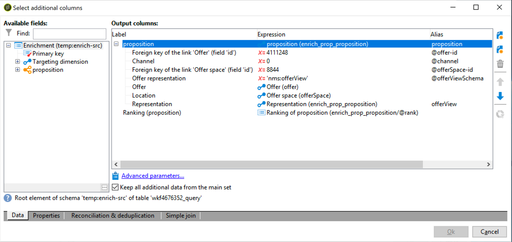

# Best practice di interazione{#interaction-best-practices}

## Raccomandazioni generali {#general-recommendations}

In questa sezione viene illustrato l&#39;approccio migliore per gestire il modulo Interazione in Adobe Campaign Classic, incluse le regole di idoneità, i filtri predefiniti, le attività del flusso di lavoro e le opzioni del database.

L&#39;interazione in  Adobe Campaign richiede un&#39;attenta gestione per funzionare in modo efficiente. È necessario trovare un equilibrio tra il numero di contatti e il numero di categorie e offerte. Se tali fattori non vengono trattati con attenzione, l&#39;istanza di Adobe Campaign  potrebbe incontrare problemi.

### Implementazione {#implementation}

Di seguito sono elencati gli elementi importanti da tenere presenti durante l&#39;implementazione e la configurazione delle interazioni.

* Per il motore batch (generalmente utilizzato in comunicazioni in uscita come l&#39;e-mail), il throughput è il problema principale, in quanto più contatti possono essere gestiti contemporaneamente. Il collo di bottiglia tipico è rappresentato dalle prestazioni del database.
* Il vincolo principale per il motore unitario (generalmente utilizzato nelle comunicazioni in ingresso come un banner in un sito Web) è la latenza, in quanto qualcuno si aspetta una risposta. Il collo di bottiglia tipico è rappresentato dalle prestazioni della CPU.
* Il design del catalogo delle offerte ha un enorme impatto sulle prestazioni di Adobe Campaign Classic.
* Quando ci sono molte offerte, dividetele in diversi cataloghi di offerte.

### Regole di idoneità {#eligibility-rules}

Di seguito sono elencate alcune best practice relative alle regole di idoneità.

* Semplificate le regole. La complessità delle regole influisce sulle prestazioni man mano che estende la ricerca. Una regola complessa è qualsiasi regola con più di cinque condizioni.
* Per migliorare le prestazioni, le regole possono essere suddivise in filtri predefiniti distinti, condivisi tra più offerte.
* Inserite le regole di categoria di offerta più restrittive nella posizione più alta possibile nell&#39;albero. In questo modo, filtreranno prima il maggior numero di contatti, riducendo il numero di target e impedendo loro di essere elaborati da ulteriori regole.
* Mettere le regole più costose in termini di tempo o di elaborazione in fondo all&#39;albero. A tal fine, queste regole saranno eseguite solo sul pubblico di destinazione rimanente.
* Iniziate da una categoria specifica per evitare di eseguire la scansione dell&#39;intero albero.
* Per risparmiare tempo di elaborazione, precalcolare gli aggregati invece di creare regole complesse con join. A tal fine, provare a memorizzare i dati dei clienti in una tabella di riferimento che può essere cercata all&#39;interno delle regole di idoneità.
* Utilizzate un numero minimo di pesi per limitare il numero di query.
* Si consiglia di avere un numero limitato di offerte per spazio di offerta. Questo consente di recuperare più rapidamente le offerte in qualsiasi spazio.
* Utilizzare indici, in particolare sulle colonne di ricerca usate di frequente.

### Tabella delle proposte {#proposition-table}

Di seguito sono elencate alcune best practice relative alla tabella delle proposte.

* Utilizzate un numero minimo di regole per velocizzare al massimo l&#39;elaborazione.
* Limita il numero di record nella tabella di proposta: conservare solo i record necessari per tenere traccia dell&#39;aggiornamento dello stato e di ciò che è necessario dalle regole, quindi archiviarli in un altro sistema.
* Eseguite una manutenzione intensiva del database nella tabella delle proposte, ad esempio ricreare indici o ricreare la tabella.
* Limitare il numero di proposizioni richieste per target. Non impostare più di quanto sarà effettivamente utilizzato.
* Evitate di partecipare il più possibile ai criteri delle regole.

## Suggerimenti e trucchi per gestire le offerte {#tips-managing-offers}

Questa sezione contiene consigli più dettagliati sulla gestione delle offerte e sull&#39;utilizzo del modulo Interaction in Adobe Campaign Classic.

### Utilizzo di più spazi di offerta in una distribuzione di posta elettronica {#multiple-offer-spaces}

Quando si includono le offerte nelle consegne, le offerte vengono generalmente selezionate a monte nel flusso di lavoro Campaign tramite un&#39;attività di arricchimento (o un&#39;altra attività simile).

Quando selezionate le offerte in un&#39;attività di arricchimento, potete scegliere lo spazio da utilizzare. Tuttavia, indipendentemente dallo spazio di offerta selezionato, il menu di personalizzazione della distribuzione dipende dallo spazio di offerta impostato nella consegna.

Nell&#39;esempio seguente, lo spazio di offerta selezionato nella consegna è **[!UICONTROL Email (Environment - Recipient)]**:


Se lo spazio di offerta selezionato nella consegna non dispone di una funzione di rendering HTML impostata, non verrà visualizzato nel menu di consegna e non sarà disponibile per la selezione. Anche in questo caso, questo è indipendente dallo spazio di offerta selezionato nell&#39;attività di arricchimento.

Nell&#39;esempio seguente, la funzione di rendering HTML è disponibile nell&#39;elenco a discesa perché lo spazio di offerta selezionato nella consegna ha una funzione di rendering:


Questa funzione inserisce codice come: `<%@ include proposition="targetData.proposition" view="rendering/html" %>`.

Quando si seleziona la proposta, il valore dell&#39;attributo **[!UICONTROL view]** è il seguente:
* &quot;rendering/html&quot;: rendering html. Utilizza la funzione di rendering HTML.
* &quot;offer/view/html&quot;: contenuto html. Non utilizza la funzione di rendering HTML. Include solo il campo HTML.

Quando includete più spazi di offerta in un&#39;unica e-mail di consegna e se alcuni di essi dispongono di funzioni di rendering e altri no, dovete ricordare quali offerte utilizzano quali spazi di offerta e quali spazi offrono funzioni di rendering.

Di conseguenza, per evitare qualsiasi problema, si consiglia di impostare una funzione di rendering HTML per tutti gli spazi di offerta, anche se lo spazio di offerta richiede solo contenuto HTML.

### Impostazione della classificazione nella tabella del registro delle proposte {#rank-proposition-log-table}

Gli spazi di offerta hanno la capacità di memorizzare i dati nella tabella di presentazione quando le proposizioni vengono generate o accettate:


Tuttavia, questo vale solo per le interazioni in entrata.

È inoltre possibile memorizzare dati aggiuntivi nella tabella delle proposte quando si utilizzano le interazioni in uscita, e anche quando si utilizzano offerte in uscita senza il modulo Interaction.

Tutti i campi della tabella temporanea del flusso di lavoro il cui nome corrisponde al nome di un campo nella tabella delle proposte vengono copiati nello stesso campo nella tabella delle proposte.

Ad esempio, quando si seleziona un&#39;offerta manualmente (senza interazione) in un arricchimento, i campi standard sono definiti come segue:


È possibile aggiungere altri campi, ad esempio un campo @rank:



Poiché nella tabella delle proposte è presente un campo denominato @rank, il valore nella tabella temporanea del flusso di lavoro verrà copiato.

Per ulteriori informazioni sulla memorizzazione di campi aggiuntivi nella tabella delle proposte, consultate [Integrazione di un&#39;offerta tramite un flusso di lavoro](../../interaction/using/integrating-an-offer-via-a-workflow.md#storing-offer-rankings-and-weights).

Per le offerte in uscita con Interazione, questo è utile quando sono selezionate diverse offerte e si desidera registrare l&#39;ordine in cui verranno visualizzate in un messaggio e-mail.

Potete inoltre memorizzare metadati aggiuntivi direttamente nella tabella delle proposte, ad esempio il livello di spesa corrente, per conservare i record storici relativi alla spesa al momento della generazione delle offerte.

Quando si utilizza l&#39;interazione in uscita, è possibile aggiungere il campo @rank, come nell&#39;esempio precedente, ma il suo valore viene impostato automaticamente in base all&#39;ordine restituito da Interaction. Ad esempio, se utilizzate Interazione per selezionare tre offerte, nel campo @rank verranno restituiti i valori 1, 2 e 3.

Quando si utilizza Interazione e si selezionano manualmente le offerte, l&#39;utente può combinare entrambi gli approcci. Ad esempio, l&#39;utente può impostare manualmente il campo @rank su 1 per l&#39;offerta selezionata manualmente e utilizzare un&#39;espressione come &quot;1 + @rank&quot; per le offerte restituite da Interaction. Presupponendo che Interaction selezioni tre offerte, le offerte restituite da entrambi gli approcci saranno classificati 1-4:


### Estensione dello schema nms:offer {#extending-nms-offer-schema}

Quando estendete lo schema nms:offer, accertatevi di seguire la struttura out-of-the-box già impostata:
* Definite qualsiasi nuovo campo per la memorizzazione del contenuto in `<element name="view">`.
* Ogni nuovo campo deve essere definito due volte. Una volta come campo XML normale e una volta come campo CDATA XML con l&#39;aggiunta di &quot;_jst&quot; al nome. Ad esempio:

   ```
   <element label="Price" name="price" type="long" xml="true"/>
   <element advanced="true" label="Script price" name="price_jst" type="CDATA" xml="true"/>
   ```

* Tutti i campi che contengono URL da tracciare devono essere inseriti in `<element name="trackedUrls">` che si trova in `<element name="view" >`.