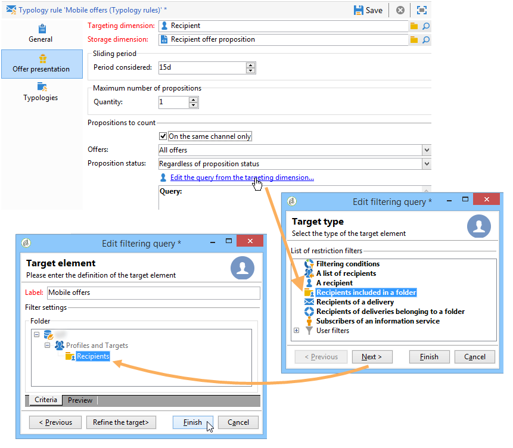

# Gestione della presentazione delle offerte{#managing-offer-presentation}

## Panoramica delle regole di presentazione {#presentation-rules-overview}

L’interazione ti consente di controllare il flusso delle proposte di offerta utilizzando le regole di presentazione. Queste regole, specifiche per l’interazione, sono regole di tipologia. Ti consentono di escludere le offerte basate sulla cronologia delle proposte già effettuate a un destinatario. Nell’ambiente vi si fa riferimento

## Creazione e riferimento a una regola di presentazione dell’offerta {#creating-and-referencing-an-offer-presentation-rule}

1. Vai al nodo **[!UICONTROL Administration]** > **[!UICONTROL Campaign management]** > **[!UICONTROL Typology management]** > **[!UICONTROL Typology rules]**.
1. Creare una regola di tipologia e scegliere il tipo **[!UICONTROL Offer presentation]**.

   

1. Specifica il canale a cui applicare la regola.

   

1. Configura i criteri di applicazione della regola. Per ulteriori informazioni, consulta [Impostazioni regola di presentazione](#presentation-rule-settings).
1. Vai al nodo **[!UICONTROL Administration]** > **[!UICONTROL Campaign execution]** > **[!UICONTROL Typology management]** > **[!UICONTROL Typologies]** e crea una tipologia che raggrupperà tutte le regole di tipo **[!UICONTROL Offer presentation]**.

   

1. Una volta creata la tipologia, posiziona il cursore sulle regole di tipologia e raggruppatele nella tipologia appena creata.

   

1. Nell’ambiente dell’offerta, fai riferimento alla tipologia utilizzando l’elenco a discesa.

   

## Impostazioni delle regole di presentazione {#presentation-rule-settings}

### Criteri di applicazione {#application-criteria-}

I criteri di applicazione disponibili nella scheda **[!UICONTROL General]** consentono di specificare le offerte a cui verrà applicata la regola di presentazione. A questo scopo, devi creare una query e scegliere le offerte interessate, come descritto di seguito.

1. Nella regola di tipologia, fai clic sul collegamento **[!UICONTROL Edit the rule application conditions...]** per creare la query.

   

1. Nella finestra della query puoi applicare un filtro alle offerte a cui desideri applicare una regola di tipologia.

   Ad esempio, puoi selezionare una categoria di offerta.

   

### Dimensioni dell’offerta {#offer-dimensions}

Nella scheda **[!UICONTROL Offer presentation]** è necessario specificare per la regola di presentazione le stesse dimensioni configurate nell&#39;ambiente.

**[!UICONTROL Targeting dimension]** coincide con la tabella dei destinatari (per impostazione predefinita: `nms:recipients`) che riceveranno le proposte di offerta. **[!UICONTROL Storage dimension]** coincide con la tabella che contiene la cronologia delle proposte collegata alla dimensione di targeting (per impostazione predefinita: `nms:propositionRcp`).

>[!NOTE]
>
>È inoltre possibile utilizzare tabelle non standard. Se desideri utilizzare una dimensione di targeting specifica, dovrai creare tabelle e un ambiente dedicato utilizzando la mappatura di destinazione. Per ulteriori informazioni, consulta [Creazione di un ambiente di offerta](../../interaction/using/live-design-environments.md#creating-an-offer-environment).

### Periodo {#period}

Si tratta di un periodo scorrevole che inizia nella data di presentazione dell’offerta. Stabilisce un termine per la validità delle proposte di offerta. La regola non si applica alle proposte di offerta effettuate oltre questo periodo.

Il periodo inizia **n** giorni prima della data della proposta e termina **n** giorni dopo, dove **n** corrisponde al numero immesso nel campo **[!UICONTROL Period considered]**:

* Per gli spazi in entrata, la data della proposta è la data di presentazione dell’offerta.
* Per gli spazi in uscita, la data della proposta è la data di contatto della consegna (ad esempio la data di consegna inserita in un flusso di lavoro di targeting).

Utilizzare le frecce per modificare il numero di giorni o immettere direttamente un punto (&quot;2d 6h&quot;, ad esempio).

### Numero di proposte {#number-of-propositions}

È possibile impostare il numero più elevato di proposte che possono essere fatte prima che l’offerta o le offerte in questione siano escluse.

Utilizza le frecce per modificare il numero di proposte di offerta.

## Definizione di proposte e destinatari {#defining-propositions-and-recipients}

La sezione **[!UICONTROL Propositions to count]** ti consente di specificare sia i destinatari che le proposte che porteranno all&#39;esclusione delle offerte definite nella scheda **[!UICONTROL General]**, se compaiono un certo numero di volte nella cronologia delle proposte.

### Filtrare le proposte {#filtering-propositions}

Puoi selezionare i criteri di filtro per escludere le proposte in base al canale, alle offerte interessate o allo stato delle proposte assegnate in precedenza.

Questi criteri rappresentano le applicazioni più frequenti delle regole di presentazione. Per utilizzare altri criteri, è possibile creare una query utilizzando il collegamento **[!UICONTROL Limit propositions...]**. Per ulteriori informazioni, consulta la sezione [Creazione di una query sulle proposte](#creating-a-query-on-propositions).

* **Filtro sul canale**

  **[!UICONTROL On the same channel only]** : ti consente di escludere le proposte di offerta sul canale specificato nella scheda **[!UICONTROL General]**.

  Ad esempio, il canale specificato per la regola nella scheda **[!UICONTROL General]** è e-mail. Se le offerte a cui si applica la regola sono state finora offerte solo sul canale web, il motore di interazione può presentare le offerte in una consegna e-mail. Tuttavia, una volta che le offerte sono state presentate tramite e-mail, il motore di interazione sceglierà un canale diverso per presentarle.

  >[!NOTE]
  >
  >Stiamo parlando del canale e non dello spazio. Se la regola deve escludere un’offerta sul canale web, l’offerta destinata a essere presentata su un sito web in due spazi (ad esempio, in un banner e nel corpo della pagina) non verrà visualizzata sul sito se è già stata presentata in precedenza.
  >
  >Per un flusso di lavoro che prevede la presentazione di offerte, le regole vengono prese in considerazione correttamente solo se configurate in **[!UICONTROL All channels]**.

* **Filtro sull&#39;offerta**

  Questo filtro consente di limitare il conteggio delle proposte di offerta a specifici set di offerte.

  **[!UICONTROL All offers]** : valore predefinito. Alle offerte non viene applicato alcun filtro.

  **[!UICONTROL Offer being presented]** : l&#39;offerta specificata nella scheda **[!UICONTROL General]** è esclusa se è già stata presentata.

  **[!UICONTROL Offers from the same category]**: un&#39;offerta è esclusa se è già stata presentata un&#39;offerta della stessa categoria.

  **[!UICONTROL The offers which the rule applies to]** : quando nella scheda **[!UICONTROL General]** sono definite più offerte, ogni proposta di offerta di questo set di offerte viene presa in considerazione e termina con l&#39;esclusione di tutte le offerte se viene raggiunta la soglia della proposta.

  Ad esempio, le offerte 2, 3 e 5 sono definite nella scheda **[!UICONTROL General]**. Il numero massimo di proposte è impostato su 2. Se le offerte 2 e 5 vengono presentate una volta, il numero di proposte conteggiate sarà 2. Di conseguenza, l’offerta 3 non verrà mai presentata.

* **Filtro in base allo stato della proposta**

  Questo filtro consente di scegliere gli stati più frequenti per le proposte di offerta da prendere in considerazione nella cronologia delle proposte.

  **[!UICONTROL Regardless of the proposition status]** : valore predefinito. Nessun filtro applicato allo stato della proposta.

  **[!UICONTROL Accepted or rejected propositions]** : ti consente di escludere le offerte presentate in precedenza che sono state accettate o rifiutate.

  **[!UICONTROL Accepted propositions]** : ti consente di escludere le offerte precedentemente presentate che sono state accettate.

  **[!UICONTROL Rejected propositions]** : ti consente di escludere le offerte precedentemente presentate che sono state rifiutate.

### Definizione dei destinatari {#defining-recipients}

Per specificare i destinatari, fare clic sul collegamento **[!UICONTROL Edit the query from the targeting dimension...]** e selezionare i destinatari interessati dalla regola.

### Creazione di una query sulle proposte {#creating-a-query-on-propositions}

Per specificare le proposte da conteggiare tramite una query, fai clic sul collegamento **[!UICONTROL Limit propositions...]** e specifica i criteri da considerare.

Nell&#39;esempio seguente, le proposte da conteggiare dopo due presentazioni sono quelle della categoria **Offerte speciali**, per lo spazio **Call center**, con un peso inferiore a **20**.

