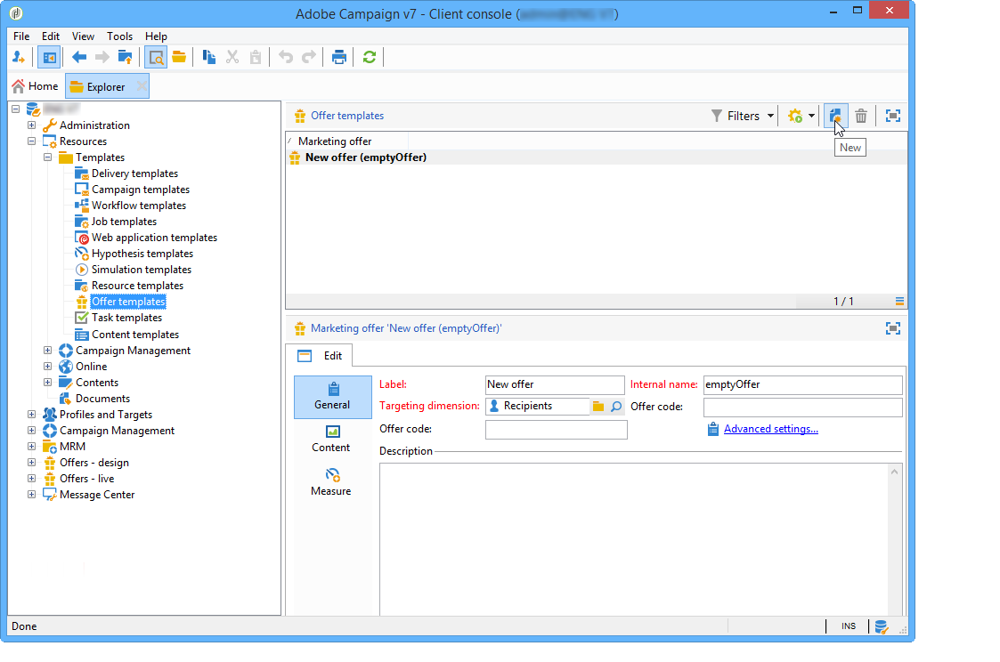
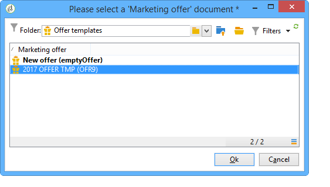

# Gestione dei modelli di offerta{#managing-offer-templates}

I modelli di offerta sono forniti come predefiniti in Adobe Campaign. Puoi utilizzarli dopo aver creato le offerte, averle duplicate o adattato la loro configurazione alle tue esigenze. Puoi anche creare modelli personalizzati. Le offerte di modelli sono archiviate nella cartella **Risorse** > **Modelli** > **Modelli di offerta**.

## Creazione di un modello di offerta {#creating-an-offer-template}

Per creare un’offerta modello, effettua le seguenti operazioni:

1. Vai a **Risorse** > **Modelli** > **Modelli di offerta**.
1. Fai clic sull&#39;icona **Nuovo**.

   

1. Configura il modello applicando lo stesso processo di un&#39;offerta normale, quindi salvala facendo clic su **Salva**.

## Duplicare un modello esistente {#duplicate-an-existing-template}

Per duplicare un modello di offerta (preconfigurato o meno), effettua le seguenti operazioni:

1. Vai a **Risorse > Modelli > Modelli di offerta**.
1. Con il mouse, fai clic con il pulsante destro del mouse sul modello da duplicare e seleziona **Duplica** dal menu a discesa.

   

1. Se necessario, configurare le impostazioni da visualizzare nel modello, quindi salvare il modello facendo clic su **Salva**.

Questo modello verrà ora offerto al momento della creazione di un’offerta.

