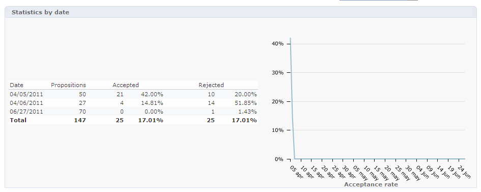

# Rapporto di analisi delle offerte{#offer-analysis-report}

Il rapporto **[!UICONTROL Offer analysis]** fornisce una panoramica del numero di proposte accettate o rifiutate.

>[!NOTE]
>
>Questa funzionalità è visibile solo online e solo per il gestore consegne.

Le statistiche sono ordinate in base a tre criteri:

* Per data:

   

* Per spazio:

   

* Per consegne:

   

I dati possono essere filtrati in base ai vari criteri disponibili nella sezione superiore del rapporto. Dopo aver selezionato i criteri desiderati, fai clic sul collegamento **[!UICONTROL Refresh]** per applicarli al rapporto.

