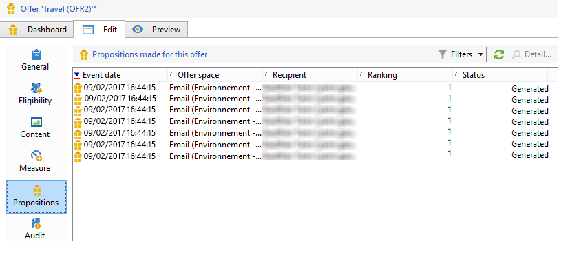
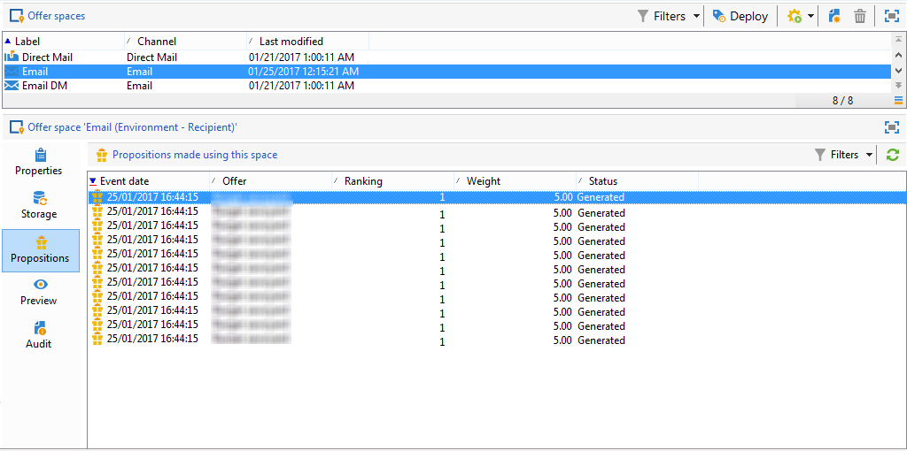

# Cronologia delle proposte di offerta{#offer-proposition-history}

Una volta create le proposte di offerta, puoi visualizzare la cronologia delle presentazioni.

>[!NOTE]
>
>Questa funzionalità è visibile solo online e solo al responsabile della consegna.

* A livello di offerta, nella scheda **[!UICONTROL Edit]**, fare clic su **[!UICONTROL Propositions]**.

  

* Dal profilo di un destinatario, fare clic sulla scheda **[!UICONTROL Propositions]**.

  

* A livello di spazio dell&#39;offerta, fare clic sulla scheda **[!UICONTROL Propositions]**.

  
