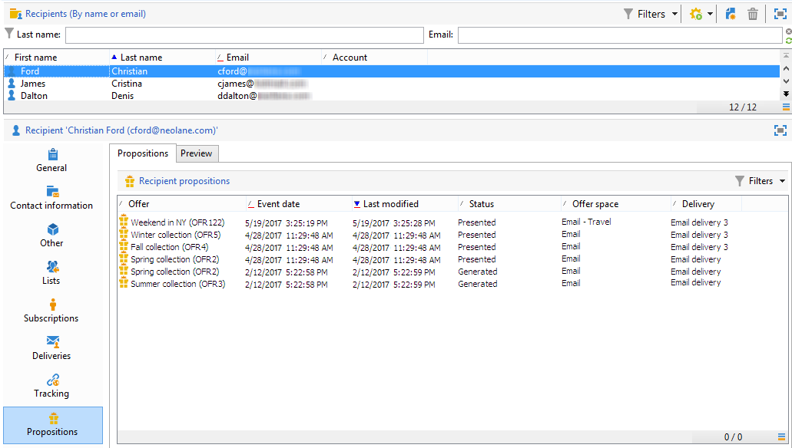

# Cronologia delle proposte di offerta{#offer-proposition-history}

Una volta create le proposte di offerta, puoi visualizzare la cronologia delle presentazioni.

>[!NOTE]
>
>Questa funzionalità è visibile solo online e solo al responsabile della consegna.

* A livello di offerta, nella **[!UICONTROL Edit]** , fare clic su **[!UICONTROL Propositions]**.

  

* Dal profilo di un destinatario, fai clic sul pulsante **[!UICONTROL Propositions]** scheda.

  

* A livello di spazio dell’offerta, fai clic su **[!UICONTROL Propositions]** scheda.

  
