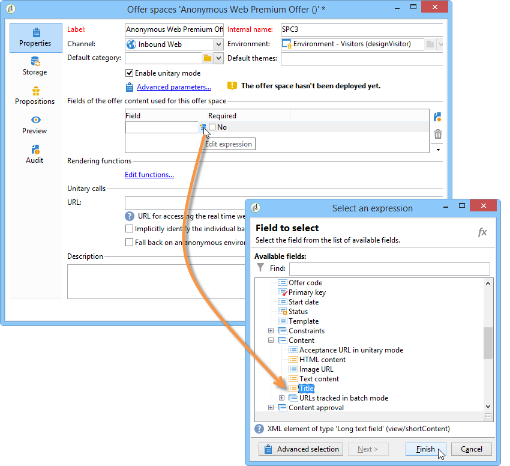

# Offerte su un canale in entrata{#offers-on-an-inbound-channel}


## Presentare un’offerta a un visitatore anonimo {#presenting-an-offer-to-an-anonymous-visitor}

Il sito Neobank vuole presentare un&#39;offerta sul proprio sito web rivolta ai visitatori non identificati che navigano nella pagina.

Per impostare questa interazione, eseguiremo le seguenti operazioni:

1. [Creare un ambiente anonimo](#creating-an-anonymous-environment)
1. [Creare spazi di offerta anonimi](#creating-anonymous-offer-spaces)
1. [Creare una categoria di offerta e un tema](#creating-an-offer-category-and-a-theme)
1. [Creare offerte anonime.](#creating-anonymous-offers)
1. [Configurare gli spazi di offerta web sul sito web](#configure-the-web-offer-space-on-the-website)

### Creazione di un ambiente anonimo {#creating-an-anonymous-environment}

Segui la procedura descritta in [Creazione di un ambiente di offerta](../../interaction/using/live-design-environments.md#creating-an-offer-environment) per creare un ambiente anonimo in base alle dimensioni **Visitatori**.

Verrà visualizzata una struttura ad albero contenente il nuovo ambiente:


### Creazione di spazi di offerta anonimi {#creating-anonymous-offer-spaces}

1. Nel tuo ambiente anonimo (**Visitatori**) vai al nodo **[!UICONTROL Administration]** > **[!UICONTROL Spaces]** .
1. Fai clic su **[!UICONTROL New]** per creare canali di chiamata.

   

   >[!NOTE]
   >
   >Lo spazio viene automaticamente collegato all&#39;ambiente anonimo.

1. Modifica l’etichetta e seleziona il canale **[!UICONTROL Inbound Web]** . È inoltre necessario selezionare la casella **[!UICONTROL Enable unitary mode]**.

   

1. Seleziona i campi del contenuto dell’offerta utilizzati per lo spazio e specificali come richiesto selezionando la casella corrispondente.

   In questo modo, tutte le offerte mancanti con uno dei seguenti elementi non saranno idonee per questo spazio:

   * Titolo
   * Contenuto HTML
   * URL immagine
   * URL di destinazione

   

1. Modificate la funzione di rendering HTML, ad esempio come segue:

   ```
   function (imageUrl, targetUrl, shortContent, htmlSource){
         var html = "<p><b>" + shortContent + "</b></p>";
         html += "<p>" + htmlSource + "</p>";
         html += "<a _urlType='11' href='" + targetUrl + "'></a>";
         return html;
       }   
   ```

   >[!IMPORTANT]
   >
   >La funzione di rendering deve denominare i campi utilizzati per lo spazio nell’ordine in cui erano stati precedentemente selezionati in modo che le offerte vengano visualizzate correttamente.

   

1. Salva lo spazio dell’offerta.

### Creazione di una categoria di offerta e di un tema {#creating-an-offer-category-and-a-theme}

1. Passa al nodo **[!UICONTROL Offer catalog]** nell’ambiente appena creato.
1. Fai clic con il pulsante destro del mouse sul nodo **[!UICONTROL Offer catalog]** e seleziona **[!UICONTROL Create a new 'Offer category' folder]**.

   Denomina la nuova categoria, ad esempio **Prodotti finanziari**.

1. Vai alla scheda **[!UICONTROL Eligibility]** della categoria e immetti **finance** come tema, quindi salva le modifiche.

   

### Creazione di offerte anonime {#creating-anonymous-offers}

1. Passa alla categoria appena creata.
1. Fai clic su **[!UICONTROL New]**.

   

1. Seleziona il modello di offerta anonima predefinito o un modello creato in precedenza.

   

1. Modifica l’etichetta e salva l’offerta.

   

1. Vai alla scheda **[!UICONTROL Eligibility]** e specifica il peso delle offerte in base ai relativi contesti di applicazione.

   In questo esempio, l’offerta è configurata per essere visualizzata sulla home page del sito come priorità fino alla fine dell’anno.

   

1. Vai alla scheda **[!UICONTROL Content]** e definisci il contenuto dell’offerta.

   >[!NOTE]
   >
   >È possibile selezionare **[!UICONTROL Content definitions]** per visualizzare l’elenco degli elementi necessari per lo spazio web.

   

1. Crea una seconda offerta.

   

1. Vai alla scheda **[!UICONTROL Eligibility]** e applica lo stesso peso della prima offerta.
1. Esegui il ciclo di approvazione per ogni offerta al fine di renderle disponibili nell’ambiente online, così come i relativi spazi di offerta approvati.

### Configurare lo spazio di offerta web sul sito web {#configure-the-web-offer-space-on-the-website}

Per rendere visibili le offerte appena configurate sul sito web, inserisci un codice JavaScript nella pagina HTML del sito per richiamare il motore di interazione (per ulteriori informazioni, consulta [Informazioni sui canali in entrata](../../interaction/using/about-inbound-channels.md)).

1. Vai alla pagina HTML e inserisci un attributo @id con un valore corrispondente al nome interno dello spazio di offerta anonimo creato in precedenza (consulta [Creazione di spazi di offerta anonimi](#creating-anonymous-offer-spaces)), preceduto da **i_**.

   

1. Inserisci l’URL della chiamata.

   

   Le caselle blu URL sopra corrispondono al nome dell&#39;istanza, al nome interno dell&#39;ambiente (consulta [Creazione di un ambiente anonimo](#creating-an-anonymous-environment)) e al tema collegato alla categoria ([Creazione di una categoria di offerta e di un tema](#creating-an-offer-category-and-a-theme)). Quest&#39;ultimo è facoltativo.

Quando un visitatore accede alla home page del sito web, le offerte con il tema **finance** vengono visualizzate come configurate nella pagina HTML.


Un utente che visita la pagina più volte visualizzerà una o le altre offerte nella categoria, in quanto a entrambe è stato assegnato lo stesso peso.

## Passaggio a un ambiente anonimo in caso di contatti non identificati {#switching-to-an-anonymous-environment-in-case-of-unidentified-contacts}

L&#39;azienda Neobank vorrebbe creare offerte di marketing per due obiettivi diversi. Vuole mostrare offerte generiche per i suoi browser web anonimi. Se uno di questi utenti risulta essere un cliente con gli identificatori forniti da Neobank, l’azienda desidera che riceva offerte personalizzate non appena effettua l’accesso.

Questo caso di studio si basa sul seguente scenario:

1. Un visitatore naviga nel sito web Neobank senza effettuare l’accesso.

   

   Nella pagina vengono visualizzate tre offerte anonime: due offerte **Best Offer** per prodotti Neobank e un&#39;offerta da un partner Neobank.

   

1. L&#39;utente, un cliente Neobank, accede con le sue credenziali.

   

   Vengono visualizzate tre offerte personalizzate.

   

Per implementare questo case study, è necessario disporre di due ambienti di offerta: uno per le interazioni anonime e uno con le offerte configurate soprattutto per i contatti identificati. L’ambiente di offerta identificato sarà configurato in modo da passare automaticamente all’ambiente di offerta anonimo se il contatto non è connesso e quindi non è identificato.

Applica i seguenti passaggi:

* Crea un catalogo di offerte specifiche per le interazioni in entrata anonime seguendo i passaggi seguenti:

   1. [Creazione di un ambiente per i contatti anonimi](#creating-an-environment-for-anonymous-contacts)
   1. [Configurazione degli spazi di offerta per l’ambiente anonimo](#configuring-offer-spaces-for-the-anonymous-environment)
   1. [Creazione di categorie di offerte in un ambiente anonimo](#creating-offer-categories-in-an-anonymous-environment)
   1. [Creazione di offerte per visitatori anonimi](#creating-offers-for-anonymous-visitors)

* Crea un catalogo di offerte specifiche per le interazioni in entrata identificate utilizzando i seguenti passaggi:

   1. [Configurare gli spazi di offerta nell’ambiente identificato](#configure-the-offer-spaces-in-the-identified-environment)
   1. [Creazione di categorie di offerta in un ambiente identificato](#creating-offer-categories-in-an-identified-environment)
   1. [Creazione di offerte personalizzate](#creating-personalized-offers)

* Configura la chiamata al motore di offerta:

   1. [Configurazione degli spazi di offerta nella pagina web](#configuring-offer-spaces-on-the-web-page)
   1. [Specifica delle impostazioni avanzate degli spazi di offerta identificati](#specifying-the-advanced-settings-of-the-identified-offer-spaces)

### Creazione di un ambiente per i contatti anonimi {#creating-an-environment-for-anonymous-contacts}

1. Crea un ambiente di offerta per interazioni in entrata anonime tramite la procedura guidata di mappatura della consegna (**Visitor** mappatura). Per ulteriori informazioni, consulta [Creazione di un ambiente di offerta](../../interaction/using/live-design-environments.md#creating-an-offer-environment).

   

### Configurazione degli spazi di offerta per l’ambiente anonimo {#configuring-offer-spaces-for-the-anonymous-environment}

Le offerte che devono essere presentate sul sito web appartengono a due diverse categorie: **Offerta migliore** e **Partner**. In questo esempio, creeremo uno spazio di offerta specifico per ogni categoria.

Per creare uno spazio di offerta corrispondente alla categoria **Migliore offerta** , applica il seguente processo:

1. Nell’albero di Adobe Campaign, accedi all’ambiente anonimo appena creato e aggiungi uno spazio di offerta.

   

1. Crea un nuovo spazio di tipo **[!UICONTROL Inbound web]**.

   

1. Immetti un’etichetta per la tua destinazione: **Web Best Anonymous Offer** per esempio.
1. Aggiungi i campi del contenuto dell’offerta utilizzati per questo spazio di offerta e configura le funzioni di rendering.

   

   >[!IMPORTANT]
   >
   >La funzione di rendering deve denominare i campi utilizzati per lo spazio nell’ordine in cui erano stati precedentemente selezionati in modo che le offerte vengano visualizzate correttamente.

1. Utilizza lo stesso processo per creare uno spazio di offerta per un canale web in entrata che corrisponda alla categoria **Partner** .

   

### Creazione di categorie di offerte in un ambiente anonimo {#creating-offer-categories-in-an-anonymous-environment}

Inizia creando due categorie di offerta: la categoria **Offerta migliore** e la categoria **Partner**. Ogni categoria conterrà due offerte per contatti anonimi.

1. Passa alla sezione **[!UICONTROL Offer catalog]** nell’ambiente anonimo appena creato.
1. Aggiungi una cartella **[!UICONTROL Offer category]** con **Migliore offerta** come etichetta.

   

1. Crea una seconda categoria con **Partner** come etichetta.

   

### Creazione di offerte per visitatori anonimi {#creating-offers-for-anonymous-visitors}

Ora creeremo due offerte in ciascuna delle categorie create sopra.

1. Vai alla categoria **Migliore offerta** e crea un&#39;offerta anonima.

   

1. Vai alla scheda **[!UICONTROL Eligibility]** e specifica il peso delle offerte in base ai relativi contesti di applicazione.

   

1. Vai alla scheda **[!UICONTROL Content]** e definisci il contenuto dell’offerta.

   

1. Crea una seconda offerta nella categoria **Migliore offerta** .

   

1. Vai alla categoria **Partner** e crea un&#39;offerta anonima.
1. Vai alla scheda **[!UICONTROL Content]** e definisci il contenuto dell’offerta.

   

1. Vai alla scheda **[!UICONTROL Eligibility]** e specifica il peso delle offerte in base ai relativi contesti di applicazione.

   

1. Crea una seconda offerta per la categoria **Partner** .

   

1. Vai alla scheda **[!UICONTROL Eligibility]** e applica lo stesso peso applicato alla prima offerta in questa categoria in modo che le offerte vengano visualizzate successivamente sul sito web.

   

1. Esegui il ciclo di approvazione per ogni offerta per iniziare a renderli live. Quando approvi il contenuto, attiva lo spazio di offerta **Partner** o **Migliore offerta** in base all&#39;offerta.

### Configurare gli spazi di offerta nell’ambiente identificato {#configure-the-offer-spaces-in-the-identified-environment}

Le offerte che presenterete sul sito web sono state prese da due diverse categorie: **Offerta migliore** e **Partner**. In questo esempio, vogliamo creare uno spazio specifico per ogni categoria.

Per creare i due spazi di offerta, applica la stessa procedura utilizzata per gli spazi di offerta anonimi. Consulta [Configurazione degli spazi di offerta per l’ambiente anonimo](#configuring-offer-spaces-for-the-anonymous-environment).

1. Nella struttura di Adobe Campaign, vai all&#39;ambiente appena creato e aggiungi gli spazi di offerta **Best Offer** e **Partner**.
1. Applica il processo descritto in [Configurazione degli spazi di offerta per l&#39;ambiente anonimo](#configuring-offer-spaces-for-the-anonymous-environment).

   

1. Selezionare l&#39;opzione **[!UICONTROL Fall back on an anonymous environment if no individuals were identified]**.

   

1. Utilizzando l’elenco a discesa, seleziona lo spazio di offerta web anonimo creato in precedenza (consulta [Configurazione degli spazi di offerta per l’ambiente anonimo](#configuring-offer-spaces-for-the-anonymous-environment)).

   

### Specifica delle impostazioni avanzate degli spazi di offerta identificati {#specifying-the-advanced-settings-of-the-identified-offer-spaces}

In questo esempio, l’identificazione del contatto avviene grazie all’indirizzo e-mail nel database Adobe Campaign. Per aggiungere l’e-mail del destinatario allo spazio, applica il seguente processo:

1. Nell’ambiente identificato, passa alla cartella spazio offerta.
1. Seleziona lo spazio di offerta **Migliore offerta** e fai clic su **[!UICONTROL Advanced parameters]**.

   

1. Nella scheda **[!UICONTROL Target identification]**, fai clic su **[!UICONTROL Add]**.

   

1. Fai clic su **[!UICONTROL Edit expression]**, vai alla tabella dei destinatari e seleziona il campo **[!UICONTROL Email]** .

   

1. Fai clic su **[!UICONTROL OK]** per chiudere la finestra **[!UICONTROL Advanced parameters]** e terminare la configurazione dello spazio di offerta **Migliore offerta**.
1. Applica lo stesso processo per lo spazio di offerta **Partner**.

   

### Creazione di categorie di offerta in un ambiente identificato {#creating-offer-categories-in-an-identified-environment}

Creeremo due categorie separate: la categoria **Offerta migliore** e la categoria **Partner**, ciascuna con due offerte personalizzate.

1. Passa al nodo **[!UICONTROL Offer catalogs]** nell&#39;ambiente identificato.
1. Come nell&#39;ambiente anonimo, aggiungi due cartelle **[!UICONTROL Offer category]** con **Offerta migliore** e **Partner** come etichette.

   

### Creazione di offerte personalizzate {#creating-personalized-offers}

Vogliamo creare due offerte personalizzate per ogni categoria, ovvero quattro offerte.

1. Vai alla categoria **Migliore offerta** e crea una prima offerta personalizzata.

   

1. Vai alla scheda **[!UICONTROL Eligibility]** e specifica il peso delle offerte in base ai relativi contesti di applicazione.

   

1. Vai alla scheda **[!UICONTROL Content]** e definisci il contenuto dell’offerta.

   

1. Crea una seconda offerta nella categoria **Migliore offerta** .

   

1. Vai alla categoria **Partner** e crea un&#39;offerta personalizzata.

   

1. Vai alla scheda **[!UICONTROL Eligibility]** e specifica il peso delle offerte in base ai relativi contesti di applicazione.

   

1. Crea una seconda offerta per la categoria **Partner** .

   

1. Vai alla scheda **[!UICONTROL Eligibility]** e applica lo stesso peso applicato alla prima offerta in questa categoria in modo che le offerte vengano visualizzate successivamente sul sito web.
1. Esegui il ciclo di approvazione per ogni offerta per iniziare ad aggiornarli. Durante l’approvazione dei contenuti, attiva gli spazi di offerta **Partner** o **Migliore offerta**.

### Configurazione degli spazi di offerta nella pagina web {#configuring-offer-spaces-on-the-web-page}

Il sito web della società Neobank ha tre spazi per le offerte: due per le offerte relative alle banche dalla categoria **Migliore offerta** e una per le offerte dalla categoria **Partner**.


Per configurare questi spazi di offerta nella pagina HTML del sito web, applica il seguente processo:

1. Inserisci tre contenuti nella pagina HTML

   elementi con un attributo @id il cui valore ci consentirà di richiamare le offerte nei vari spazi di offerta del sito web.

   

1. Quindi inserisci lo script per la definizione dei valori di attributo.

   

   In questo esempio, **ContBO1** e **ContBO2** ricevono il valore **OsWebBestOfferIdentified**, ovvero il nome interno dello spazio di offerta **Best Offer** creato in precedenza nell&#39;ambiente identificato. I valori **CatBestOffer** e **CatBestOfferAnonym** corrispondono al nome interno delle categorie **Best Offer** per gli ambienti anonimi e identificati.

   

   Allo stesso modo, **ContPtn** riceve il valore **OSWebPartnerIdentified**, che corrisponde al nome interno dello spazio di offerta **Partner** creato nell&#39;ambiente identificato. **** CatPartner e  **** CatPartnerAnonymmatch corrispondono al nome interno delle  **** categorie di partner per ambienti anonimi e identificati.

   

1. Assegna le informazioni che ti consentiranno di identificare la persona che accede al sito Neobank alla variabile **actionTarget** .

   

   L’identificazione della persona può essere basata su un cookie del browser, un parametro di lettura nell’URL, nell’e-mail o nell’identificatore della persona. Se si utilizza un campo della tabella dei destinatari diverso dalla chiave primaria, è necessario definirlo nei parametri avanzati dello spazio (consulta [Specifica delle impostazioni avanzate degli spazi di offerta identificati](#specifying-the-advanced-settings-of-the-identified-offer-spaces)).

1. Inserisci l’URL della chiamata.

   

   L&#39;URL contiene **EnvNeobankRecip**, il nome interno dell&#39;ambiente identificato.

Quando si apre la pagina Web; lo script ti consente di richiamare il motore di interazione per visualizzare il contenuto delle offerte negli spazi rilevanti della pagina web. In una singola chiamata al server Adobe Campaign, il motore determina l’ambiente, lo spazio di offerta e le categorie da selezionare.

In questo esempio, il motore riconosce l&#39;ambiente identificato (**EnvNeobankIdnRecip**). Identifica lo spazio di offerta (**OSWebBestOfferIdentified**) e la categoria **Best Offer** (**CatBestOffer**) per il primo e il secondo spazio di offerta sulla pagina web, nonché la categoria (**OSWebPartnerIdentified** ) e la categoria **Partner** (**CatPartner**) per il terzo spazio di offerta sul sito.

Se il motore non è in grado di identificare il destinatario, passa agli spazi di offerta anonimi a cui si fa riferimento negli spazi di offerta identificati e verso le categorie anonime (**CatPartner** e **CatPartnerAnonym**) come specificato nello script.
