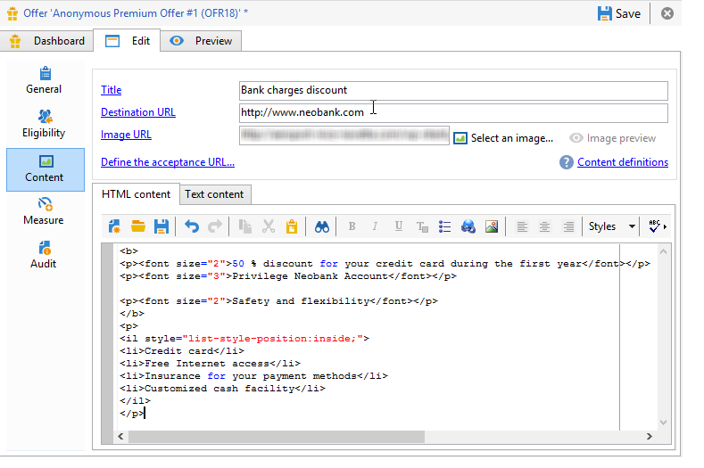
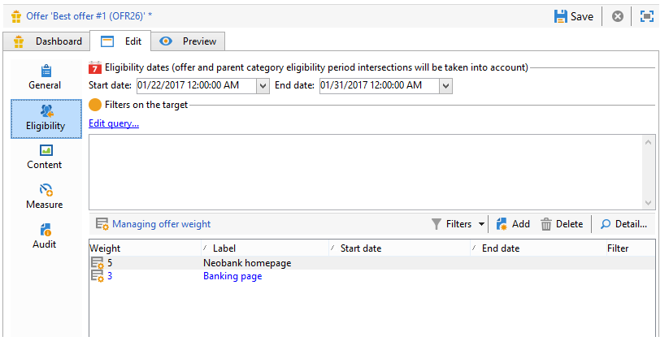

# Offerte su un canale in entrata{#offers-on-an-inbound-channel}

## Presentazione di un&#39;offerta a un visitatore anonimo {#presenting-an-offer-to-an-anonymous-visitor}

Il sito Neobank vuole visualizzare un&#39;offerta sul suo sito Web rivolta ai visitatori non identificati che navigano nella pagina.

Per impostare questa interazione, stiamo per:

1. [Creare un ambiente anonimo](#creating-an-anonymous-environment)
1. [Creare spazi di offerta anonimi](#creating-anonymous-offer-spaces)
1. [Creare una categoria di offerte e un tema](#creating-an-offer-category-and-a-theme)
1. [Creare offerte anonime.](#creating-anonymous-offers)
1. [Configurare gli spazi di offerta Web nel sito Web](#configure-the-web-offer-space-on-the-website)

### Creazione di un ambiente anonimo {#creating-an-anonymous-environment}

Seguite la procedura descritta in [Creazione di un ambiente di offerta](../../interaction/using/live-design-environments.md#creating-an-offer-environment) per creare un ambiente anonimo basato sulle dimensioni di **Visitatori**&#39;.

Verrà visualizzata una struttura ad albero contenente il nuovo ambiente:


### Creazione di spazi di offerta anonimi {#creating-anonymous-offer-spaces}

1. Nell&#39;ambiente anonimo (**Visitatori**) passare al nodo **[!UICONTROL Administration]** > **[!UICONTROL Spaces]**.
1. Fai clic su **[!UICONTROL New]** per creare canali di chiamata.

   

   >[!NOTE]
   >
   >Lo spazio viene collegato automaticamente all&#39;ambiente anonimo.

1. Modificare l&#39;etichetta e selezionare il canale **[!UICONTROL Inbound Web]**. È inoltre necessario selezionare la casella **[!UICONTROL Enable unitary mode]**.

   

1. Selezionate i campi di contenuto dell&#39;offerta utilizzati per lo spazio e specificateli come richiesto selezionando la casella corrispondente.

   In questo modo, eventuali offerte mancanti tra i seguenti elementi non saranno ammissibili per questo spazio:

   * Titolo
   * Contenuto HTML
   * URL immagine
   * URL di destinazione

   

1. Modificate la funzione di rendering HTML, ad esempio come segue:

   ```
   function (imageUrl, targetUrl, shortContent, htmlSource){
         var html = "<p><b>" + shortContent + "</b></p>";
         html += "<p>" + htmlSource + "</p>";
         html += "<a _urlType='11' href='" + targetUrl + "'></a>";
         return html;
       }   
   ```

   >[!IMPORTANT]
   >
   >La funzione di rendering deve denominare i campi utilizzati per lo spazio nell&#39;ordine in cui erano stati selezionati in precedenza, in modo che le offerte vengano visualizzate correttamente.

   

1. Salvate lo spazio dell’offerta.

### Creazione di una categoria di offerte e di un tema {#creating-an-offer-category-and-a-theme}

1. Andate al nodo **[!UICONTROL Offer catalog]** nell&#39;ambiente appena creato.
1. Fare clic con il pulsante destro del mouse sul nodo **[!UICONTROL Offer catalog]** e selezionare **[!UICONTROL Create a new 'Offer category' folder]**.

   Denominate la nuova categoria, ad esempio **Prodotti finanziari**.

1. Andate alla scheda **[!UICONTROL Eligibility]** della categoria e immettete **funding** come tema, quindi salvate le modifiche.

   

### Creazione di offerte anonime {#creating-anonymous-offers}

1. Passate alla categoria appena creata.
1. Fai clic su **[!UICONTROL New]**.

   

1. Selezionate il modello di offerta anonimo predefinito o un modello creato in precedenza.

   

1. Modificate l’etichetta e salvate l’offerta.

   

1. Passate alla scheda **[!UICONTROL Eligibility]** e specificate il peso delle offerte in base ai contesti delle applicazioni.

   In questo esempio, l&#39;offerta è configurata per essere visualizzata sulla home page del sito come priorità fino alla fine dell&#39;anno.

   

1. Passate alla scheda **[!UICONTROL Content]** e definite il contenuto dell&#39;offerta.

   >[!NOTE]
   >
   >È possibile selezionare **[!UICONTROL Content definitions]** per visualizzare l&#39;elenco degli elementi richiesti per lo spazio Web.

   

1. Create una seconda offerta.

   

1. Passate alla scheda **[!UICONTROL Eligibility]** e applicate lo stesso peso della prima offerta.
1. Eseguite il ciclo di approvazione per ogni offerta al fine di renderle disponibili nell&#39;ambiente online, così come i loro spazi di offerta approvati.

### Configurare lo spazio delle offerte Web sul sito Web {#configure-the-web-offer-space-on-the-website}

Per rendere le offerte configurate visibili sul sito Web, inserite un codice JavaScript nella pagina HTML del sito per richiamare il motore di interazione (per ulteriori informazioni, consultate [Informazioni sui canali in ingresso](../../interaction/using/about-inbound-channels.md)).

1. Passate alla pagina HTML e inserite un attributo @id con un valore corrispondente al nome interno dello spazio delle offerte anonimo creato in precedenza (consultate [Creazione di spazi di offerta anonimi](#creating-anonymous-offer-spaces)), preceduto da **i_**.

   

1. Inserite l’URL della chiamata.

   

   Le caselle blu dell&#39;URL sopra corrispondono al nome dell&#39;istanza, al nome interno dell&#39;ambiente (fare riferimento a [Creazione di un ambiente anonimo](#creating-an-anonymous-environment)) e al tema collegato alla categoria ([Creazione di una categoria di offerte e di un tema](#creating-an-offer-category-and-a-theme)). Il secondo è facoltativo.

Quando un visitatore accede alla home page del sito Web, le offerte con il tema **funding** vengono visualizzate come configurate sulla pagina HTML.


Un utente che visita più volte la pagina visualizzerà una o le altre offerte della categoria, in quanto a entrambe è stato assegnato lo stesso peso.

## Passaggio a un ambiente anonimo in caso di contatti non identificati {#switching-to-an-anonymous-environment-in-case-of-unidentified-contacts}

La società Neobank vorrebbe creare offerte di marketing per due target diversi. Vuole visualizzare offerte generiche per i suoi browser anonimi del sito web. Se uno di questi utenti risultasse essere un cliente con identificatori forniti da Neobank, l&#39;azienda vorrebbe che ricevessero offerte personalizzate non appena accedono.

Questo caso di studio si basa sul seguente scenario:

1. Un visitatore visita il sito Web di Neobank senza effettuare l’accesso.

   

   Sulla pagina vengono visualizzate tre offerte anonime: due offerte **Migliore offerta** per i prodotti Neobank e una offerta da un partner Neobank.

   

1. L&#39;utente, un cliente Neobank, accede con le sue credenziali.

   

   Vengono visualizzate tre offerte personalizzate.

   

Per implementare questo case study, è necessario disporre di due ambienti di offerta: uno per le interazioni anonime e uno con offerte configurate soprattutto per i contatti identificati. L&#39;ambiente delle offerte identificato sarà configurato per passare automaticamente all&#39;ambiente delle offerte anonimo se il contatto non è connesso e quindi non è identificato.

Effettuate le seguenti operazioni:

* Create un catalogo di offerte specifiche per le interazioni anonime in ingresso, utilizzando i seguenti passaggi:

   1. [Creazione di un ambiente per i contatti anonimi](#creating-an-environment-for-anonymous-contacts)
   1. [Configurazione degli spazi di offerta per l&#39;ambiente anonimo](#configuring-offer-spaces-for-the-anonymous-environment)
   1. [Creazione di categorie di offerte in un ambiente anonimo](#creating-offer-categories-in-an-anonymous-environment)
   1. [Creazione di offerte per i visitatori anonimi](#creating-offers-for-anonymous-visitors)

* Create un catalogo di offerte specifiche per le interazioni in entrata identificate utilizzando i seguenti passaggi:

   1. [Configurare gli spazi di offerta nell&#39;ambiente identificato](#configure-the-offer-spaces-in-the-identified-environment)
   1. [Creazione di categorie di offerte in un ambiente identificato](#creating-offer-categories-in-an-identified-environment)
   1. [Creazione di offerte personalizzate](#creating-personalized-offers)

* Configura la chiamata al motore di offerte:

   1. [Configurazione degli spazi di offerta sulla pagina Web](#configuring-offer-spaces-on-the-web-page)
   1. [Specifica delle impostazioni avanzate degli spazi di offerta identificati](#specifying-the-advanced-settings-of-the-identified-offer-spaces)

### Creazione di un ambiente per i contatti anonimi {#creating-an-environment-for-anonymous-contacts}

1. Crea un ambiente di offerte per interazioni anonime in ingresso tramite la procedura guidata di mappatura della consegna (**Visitor** mapping). Per ulteriori informazioni, vedere [Creazione di un ambiente di offerta](../../interaction/using/live-design-environments.md#creating-an-offer-environment).

   

### Configurazione degli spazi di offerta per l&#39;ambiente anonimo {#configuring-offer-spaces-for-the-anonymous-environment}

Le offerte che devono essere presentate sul sito web appartengono a due diverse categorie: **Migliore offerta** e **Partner**. In questo esempio, creeremo uno spazio di offerta specifico per ciascuna categoria.

Per creare uno spazio di offerta che corrisponda alla categoria **Migliore offerta**, eseguite il seguente processo:

1. Nella struttura  di Adobe Campaign, andate all’ambiente anonimo appena creato e aggiungete uno spazio per le offerte.

   

1. Create un nuovo spazio di tipo **[!UICONTROL Inbound web]**.

   

1. Immettete un’etichetta: **Web Best Anonymous Offer** ad esempio.
1. Aggiungete i campi del contenuto dell&#39;offerta utilizzati per questo spazio e configurate le funzioni di rendering.

   

   >[!IMPORTANT]
   >
   >La funzione di rendering deve denominare i campi utilizzati per lo spazio nell&#39;ordine in cui erano stati selezionati in precedenza, in modo che le offerte vengano visualizzate correttamente.

1. Utilizzate lo stesso processo per creare uno spazio di offerta per i canali Web in ingresso che corrisponda alla categoria **Partner**.

   

### Creazione di categorie di offerte in un ambiente anonimo {#creating-offer-categories-in-an-anonymous-environment}

Iniziate creando due categorie di offerte: la categoria **Migliore offerta** e la categoria **Partner**. Ogni categoria conterrà due offerte per contatti anonimi.

1. Andate alla cartella **[!UICONTROL Offer catalog]** nell&#39;ambiente anonimo appena creato.
1. Aggiungete una cartella **[!UICONTROL Offer category]** con l&#39;etichetta **Migliore offerta**.

   

1. Crea una seconda categoria con **Partner** come etichetta.

   

### Creazione di offerte per visitatori anonimi {#creating-offers-for-anonymous-visitors}

Ora creeremo due offerte in ciascuna delle categorie create sopra.

1. Passate alla categoria **Migliore offerta** e create un&#39;offerta anonima.

   

1. Passate alla scheda **[!UICONTROL Eligibility]** e specificate il peso delle offerte in base ai contesti delle applicazioni.

   

1. Passate alla scheda **[!UICONTROL Content]** e definite il contenuto dell&#39;offerta.

   

1. Create una seconda offerta nella categoria **Migliore offerta**.

   

1. Andate alla categoria **Partner** e create un&#39;offerta anonima.
1. Passate alla scheda **[!UICONTROL Content]** e definite il contenuto dell&#39;offerta.

   

1. Passate alla scheda **[!UICONTROL Eligibility]** e specificate il peso delle offerte in base ai contesti delle applicazioni.

   

1. Crea una seconda offerta per la categoria **Partner**.

   

1. Passate alla scheda **[!UICONTROL Eligibility]** e applicate lo stesso peso applicato alla prima offerta in questa categoria in modo che le offerte vengano visualizzate successivamente sul sito Web.

   

1. Eseguite il ciclo di approvazione per ogni offerta per iniziare a renderle attive. Quando si approva il contenuto, attivare lo spazio dell&#39;offerta **Partner** o **Migliore offerta** in base all&#39;offerta.

### Configurare gli spazi di offerta nell&#39;ambiente identificato {#configure-the-offer-spaces-in-the-identified-environment}

Le offerte che state per presentare sul sito web sono prese da due diverse categorie: **Migliore offerta** e **Partner**. In questo esempio, vogliamo creare uno spazio specifico per ciascuna categoria.

Per creare i due spazi di offerta, applicate la stessa procedura utilizzata per gli spazi di offerta anonimi. Fare riferimento alla sezione [Configurazione degli spazi di offerta per l&#39;ambiente anonimo](#configuring-offer-spaces-for-the-anonymous-environment).

1. Nella struttura  Adobe Campaign, andate all&#39;ambiente appena creato e aggiungete gli spazi di offerta **Migliore offerta** e **Partner**.
1. Applicate il processo descritto in [Configurazione degli spazi di offerta per l&#39;ambiente anonimo](#configuring-offer-spaces-for-the-anonymous-environment).

   

1. Selezionare l&#39;opzione **[!UICONTROL Fall back on an anonymous environment if no individuals were identified]**.

   

1. Utilizzando l&#39;elenco a discesa, selezionate lo spazio delle offerte Web anonimo creato in precedenza (consultate [Configuring offer space for the anonimo environment](#configuring-offer-spaces-for-the-anonymous-environment)).

   

### Specifica delle impostazioni avanzate degli spazi di offerta identificati {#specifying-the-advanced-settings-of-the-identified-offer-spaces}

In questo esempio, l&#39;identificazione dei contatti avviene grazie all&#39;indirizzo e-mail nel database Adobe Campaign . Per aggiungere l&#39;e-mail del destinatario allo spazio, eseguire la procedura seguente:

1. Nell’ambiente identificato, andate alla cartella dello spazio delle offerte.
1. Selezionare lo spazio **Migliore offerta** e fare clic su **[!UICONTROL Advanced parameters]**.

   

1. Nella scheda **[!UICONTROL Target identification]**, fai clic su **[!UICONTROL Add]**.

   

1. Fare clic su **[!UICONTROL Edit expression]**, passare alla tabella dei destinatari e selezionare il campo **[!UICONTROL Email]**.

   

1. Fare clic su **[!UICONTROL OK]** per chiudere la finestra **[!UICONTROL Advanced parameters]** e completare la configurazione dello spazio dell&#39;offerta **Migliore offerta**.
1. Applicate lo stesso processo allo spazio di offerta **Partner**.

   

### Creazione di categorie di offerte in un ambiente identificato {#creating-offer-categories-in-an-identified-environment}

Verranno create due categorie separate: la categoria **Migliore offerta** e la categoria **Partner**, ciascuna con due offerte personalizzate.

1. Passare al nodo **[!UICONTROL Offer catalogs]** nell&#39;ambiente identificato.
1. Come nell&#39;ambiente anonimo, aggiungete due cartelle **[!UICONTROL Offer category]** con **Migliore offerta** e **Partner** come etichette.

   

### Creazione di offerte personalizzate {#creating-personalized-offers}

Vogliamo creare due offerte personalizzate per ciascuna categoria, ossia quattro offerte.

1. Passate alla categoria **Migliore offerta** e create una prima offerta personalizzata.

   

1. Passate alla scheda **[!UICONTROL Eligibility]** e specificate il peso delle offerte in base ai contesti delle applicazioni.

   

1. Passate alla scheda **[!UICONTROL Content]** e definite il contenuto dell&#39;offerta.

   

1. Create una seconda offerta nella categoria **Migliore offerta**.

   

1. Andate alla categoria **Partner** e create un&#39;offerta personalizzata.

   

1. Passate alla scheda **[!UICONTROL Eligibility]** e specificate il peso delle offerte in base ai contesti delle applicazioni.

   

1. Crea una seconda offerta per la categoria **Partner**.

   

1. Passate alla scheda **[!UICONTROL Eligibility]** e applicate lo stesso peso applicato alla prima offerta in questa categoria in modo che le offerte vengano visualizzate successivamente sul sito Web.
1. Eseguite il ciclo di approvazione per ogni offerta per iniziare ad aggiornarli. Durante l&#39;approvazione del contenuto, attivare gli spazi di offerta **Partner** o **Migliore offerta**.

### Configurazione degli spazi di offerta sulla pagina Web {#configuring-offer-spaces-on-the-web-page}

Il sito web della società Neobank ha tre spazi per le offerte: due per le offerte relative alla banca dalla categoria **Migliore offerta** e uno per le offerte dalla categoria **Partner**.


Per configurare questi spazi di offerta sulla pagina HTML del sito Web, effettuate le seguenti operazioni:

1. Nel contenuto della pagina HTML, inseritene tre

   elementi con un attributo @id il cui valore ci consentirà di richiamare le offerte nei vari spazi di offerta del sito Web.

   

1. Inserire quindi lo script per la definizione dei valori degli attributi.

   

   In questo esempio, **ContBO1** e **ContBO2** ricevono il valore **OsWebBestOfferIdentified**, ovvero il nome interno dello spazio di offerta **Best Offer** creato in precedenza nell&#39;ambiente identificato. I valori **CatBestOffer** e **CatBestOfferAnonym** corrispondono al nome interno delle categorie **Best Offer** per gli ambienti anonimi e identificati.

   

   Analogamente, **ContPtn** riceve il valore **OSWebPartnerIdentified**, che corrisponde al nome interno dello spazio di offerta **Partner** creato nell&#39;ambiente identificato. **** CatPartner e  **** CatPartnerAnonymmatch corrispondono al nome interno delle categorie  **** Partner per ambienti anonimi e identificati.

   

1. Assegnate le informazioni che vi consentiranno di identificare la persona che accede al sito Neobank sulla variabile **interactiveTarget**.

   

   L&#39;identificazione della persona può essere basata su un cookie del browser, un parametro di lettura nell&#39;URL, nell&#39;e-mail o nell&#39;identificatore della persona. Se si utilizza un campo della tabella ricevente diverso dalla chiave primaria, è necessario definirlo nei parametri avanzati dello spazio (fare riferimento a [Specifica delle impostazioni avanzate degli spazi di offerta identificati](#specifying-the-advanced-settings-of-the-identified-offer-spaces)).

1. Inserite l’URL della chiamata.

   

   L&#39;URL contiene **EnvNeobankRecip**, il nome interno dell&#39;ambiente identificato.

Quando si apre la pagina Web; lo script consente di richiamare il motore di interazione per visualizzare il contenuto delle offerte negli spazi pertinenti della pagina Web. In una singola chiamata al server Adobe Campaign , il motore determina l&#39;ambiente, lo spazio di offerta e le categorie da selezionare.

In questo esempio, il motore riconosce l&#39;ambiente identificato (**EnvNeobankIdnRecip**). Identifica lo spazio di offerta (**OSWebBestOfferIdentified**) e la categoria **Migliore offerta** (**CatBestOffer**) per il primo e il secondo spazio di offerta sulla pagina Web, nonché per la categoria (**OSWebPartnerIdentified** ) e la categoria **Partner** (**CatPartner**) per il terzo spazio di offerta sul sito.

Se il motore non riesce a identificare il destinatario, passa agli spazi di offerta anonimi a cui fanno riferimento gli spazi di offerta identificati e verso le categorie anonime (**CatPartner** e **CatPartnerAnonym**) come specificato nello script.
