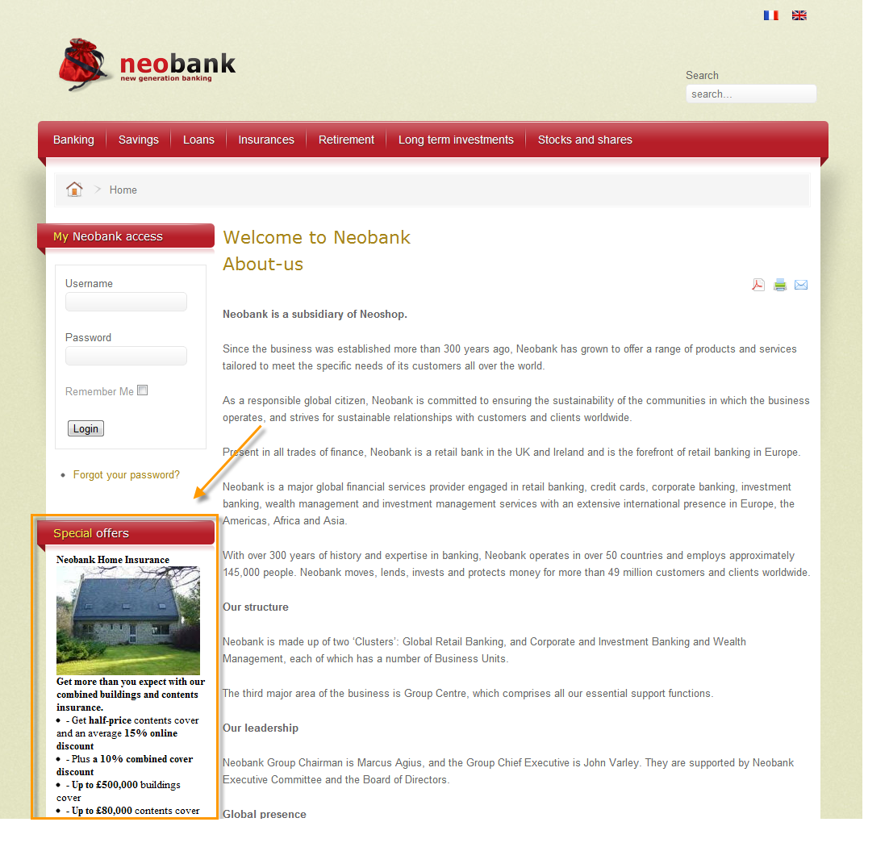
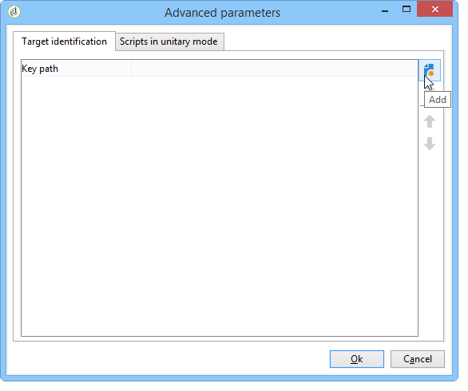

# Offerte su un canale in entrata{#offers-on-an-inbound-channel}


## Presentazione di un’offerta a un visitatore anonimo {#presenting-an-offer-to-an-anonymous-visitor}

Il sito di Neobank vuole presentare sul proprio sito web un’offerta rivolta a visitatori non identificati che navigano nella pagina.

Per impostare questa interazione:

1. [Creare un ambiente anonimo](#creating-an-anonymous-environment)
1. [Creare spazi di offerta anonimi](#creating-anonymous-offer-spaces)
1. [Creare una categoria di offerta e un tema](#creating-an-offer-category-and-a-theme)
1. [Creare offerte anonime.](#creating-anonymous-offers)
1. [Configurare gli spazi dell’offerta web sul sito web](#configure-the-web-offer-space-on-the-website)

### Creazione di un ambiente anonimo {#creating-an-anonymous-environment}

Segui la procedura descritta in [Creazione di un ambiente di offerta](../../interaction/using/live-design-environments.md#creating-an-offer-environment) per creare il tuo ambiente anonimo in base alle dimensioni di **Visitatori**&#39;.

Otterrai una struttura ad albero contenente il nuovo ambiente:


### Creazione di spazi di offerta anonimi {#creating-anonymous-offer-spaces}

1. Nell&#39;ambiente anonimo (**Visitatori**) passare al nodo **[!UICONTROL Administration]** > **[!UICONTROL Spaces]**.
1. Fare clic su **[!UICONTROL New]** per creare i canali di chiamata.

   

   >[!NOTE]
   >
   >Lo spazio viene collegato automaticamente all’ambiente anonimo.

1. Cambia l&#39;etichetta e seleziona il canale **[!UICONTROL Inbound Web]**. Selezionare anche la casella **[!UICONTROL Enable unitary mode]**.

   

1. Seleziona i campi di contenuto dell’offerta utilizzati per lo spazio e specificali come richiesto selezionando la casella pertinente.

   In questo modo, eventuali offerte a cui manca uno dei seguenti elementi non saranno idonee per questo spazio:

   * Titolo
   * Contenuto HTML
   * URL immagine
   * URL di destinazione

   

1. Modifica la funzione di rendering HTML, ad esempio come segue:

   ```
   function (imageUrl, targetUrl, shortContent, htmlSource){
         var html = "<p><b>" + shortContent + "</b></p>";
         html += "<p>" + htmlSource + "</p>";
         html += "<a _urlType='11' href='" + targetUrl + "'></a>";
         return html;
       }   
   ```

   >[!IMPORTANT]
   >
   >La funzione di rendering deve denominare i campi utilizzati per lo spazio nell’ordine in cui erano stati precedentemente selezionati in modo che le offerte vengano visualizzate correttamente.

   

1. Salva lo spazio dell’offerta.

### Creazione di una categoria di offerta e di un tema {#creating-an-offer-category-and-a-theme}

1. Passa al nodo **[!UICONTROL Offer catalog]** all&#39;interno dell&#39;ambiente appena creato.
1. Fare clic con il pulsante destro del mouse sul nodo **[!UICONTROL Offer catalog]** e selezionare **[!UICONTROL Create a new 'Offer category' folder]**.

   Denomina la nuova categoria, **Prodotti finanziari** ad esempio.

1. Vai alla scheda **[!UICONTROL Eligibility]** della categoria e immetti **finanziamento** come tema, quindi salva le modifiche.

   

### Creazione di offerte anonime {#creating-anonymous-offers}

1. Passa alla categoria appena creata.
1. Fai clic su **[!UICONTROL New]**.

   

1. Seleziona il modello di offerta anonimo predefinito o un modello creato in precedenza.

   

1. Modifica l’etichetta e salva l’offerta.

   

1. Passa alla scheda **[!UICONTROL Eligibility]** e specifica il peso delle offerte in base ai relativi contesti di applicazione.

   In questo esempio, l’offerta è configurata per essere visualizzata nella home page del sito come priorità fino alla fine dell’anno.

   

1. Passa alla scheda **[!UICONTROL Content]** e definisci il contenuto dell&#39;offerta.

   >[!NOTE]
   >
   >È possibile selezionare **[!UICONTROL Content definitions]** per visualizzare l&#39;elenco degli elementi necessari per lo spazio Web.

   

1. Crea una seconda offerta.

   

1. Passa alla scheda **[!UICONTROL Eligibility]** e applica lo stesso peso della prima offerta.
1. Esegui il ciclo di approvazione per ogni offerta per renderla disponibile nell’ambiente online, insieme ai relativi spazi dell’offerta approvati.

### Configurare lo spazio dell’offerta web sul sito web {#configure-the-web-offer-space-on-the-website}

Per rendere visibili sul sito Web le offerte appena configurate, inserisci un codice JavaScript nella pagina HTML del sito per richiamare il motore di interazione (per ulteriori informazioni, consulta [Informazioni sui canali in entrata](../../interaction/using/about-inbound-channels.md)).

1. Vai alla pagina HTML e inserisci un attributo @id con un valore corrispondente al nome interno dello spazio delle offerte anonimo creato in precedenza (fai riferimento a [Creazione di spazi delle offerte anonimi](#creating-anonymous-offer-spaces)), preceduto da **i_**.

   

1. Inserisci l’URL della chiamata.

   

   Le caselle URL blu sopra corrispondono al nome dell&#39;istanza, al nome interno dell&#39;ambiente (fare riferimento a [Creazione di un ambiente anonimo](#creating-an-anonymous-environment)) e al tema collegato alla categoria ([Creazione di una categoria di offerta e di un tema](#creating-an-offer-category-and-a-theme)). Quest&#39;ultimo è facoltativo.

Quando un visitatore accede alla home page del sito Web, le offerte con il tema **finanziamento** vengono visualizzate come configurate nella pagina di HTML.



Un utente che visita la pagina più volte visualizzerà una o più offerte della categoria, poiché a entrambe è stato assegnato lo stesso peso.

## Passaggio a un ambiente anonimo in caso di contatti non identificati {#switching-to-an-anonymous-environment-in-case-of-unidentified-contacts}

La società Neobank desidera creare offerte di marketing per due diversi target. Vuole mostrare offerte generiche per i suoi browser anonimi del sito web. Se uno di questi utenti risulta essere un cliente con gli identificatori forniti da Neobank, l’azienda desidera che ricevano offerte personalizzate non appena effettuano l’accesso.

Questo caso di studio si basa sullo scenario seguente:

1. Un visitatore naviga nel sito web di Neobank senza effettuare l’accesso.

   

   Nella pagina vengono visualizzate tre offerte anonime: due **offerte migliori** per i prodotti Neobank e un&#39;offerta da un partner Neobank.

   

1. L’utente, un cliente di Neobank, accede con le proprie credenziali.

   

   Vengono visualizzate tre offerte personalizzate.

   

Per implementare questo caso di studio, devi disporre di due ambienti di offerta: uno per le interazioni anonime e uno con le offerte configurate in modo specifico per i contatti identificati. L’ambiente dell’offerta identificato verrà configurato per passare automaticamente all’ambiente dell’offerta anonimo se il contatto non è connesso e quindi non è identificato.

Applica i seguenti passaggi:

* Crea un catalogo di offerte specifiche per le interazioni in entrata anonime seguendo i passaggi seguenti:

   1. [Creazione di un ambiente per i contatti anonimi](#creating-an-environment-for-anonymous-contacts)
   1. [Configurazione degli spazi di offerta per l’ambiente anonimo](#configuring-offer-spaces-for-the-anonymous-environment)
   1. [Creazione di categorie di offerta in un ambiente anonimo](#creating-offer-categories-in-an-anonymous-environment)
   1. [Creazione di offerte per visitatori anonimi](#creating-offers-for-anonymous-visitors)

* Crea un catalogo di offerte specifiche per le interazioni in entrata identificate seguendo la procedura riportata di seguito.

   1. [Configurare gli spazi dell’offerta nell’ambiente identificato](#configure-the-offer-spaces-in-the-identified-environment)
   1. [Creazione di categorie di offerta in un ambiente identificato](#creating-offer-categories-in-an-identified-environment)
   1. [Creazione di offerte personalizzate](#creating-personalized-offers)

* Configura la chiamata al motore di offerta:

   1. [Configurazione degli spazi dell’offerta sulla pagina web](#configuring-offer-spaces-on-the-web-page)
   1. [Specifica delle impostazioni avanzate degli spazi dell’offerta identificati](#specifying-the-advanced-settings-of-the-identified-offer-spaces)

### Creazione di un ambiente per i contatti anonimi {#creating-an-environment-for-anonymous-contacts}

1. Crea un ambiente di offerta per le interazioni in entrata anonime tramite l&#39;assistente per la mappatura della consegna (**Visitatore**). Per ulteriori informazioni, consulta [Creazione di un ambiente di offerta](../../interaction/using/live-design-environments.md#creating-an-offer-environment).

   

### Configurazione degli spazi di offerta per l’ambiente anonimo {#configuring-offer-spaces-for-the-anonymous-environment}

Le offerte che devono essere presentate sul sito Web appartengono a due diverse categorie: **Proposta d&#39;acquisto** e **Partner**. In questo esempio, creeremo uno spazio di offerta specifico per ogni categoria.

Per creare lo spazio dell&#39;offerta in modo che corrisponda alla categoria **Offerta migliore**, applica il seguente processo:

1. Nella struttura Adobe Campaign, vai all’ambiente anonimo appena creato e aggiungi uno spazio di offerta.

   

1. Crea un nuovo spazio di tipo **[!UICONTROL Inbound web]**.

   

1. Immetti un&#39;etichetta per l&#39;offerta: **Migliore offerta anonima per il Web** per esempio.
1. Aggiungi i campi di contenuto dell’offerta utilizzati per questo spazio dell’offerta e configura le funzioni di rendering.

   

   >[!IMPORTANT]
   >
   >La funzione di rendering deve denominare i campi utilizzati per lo spazio nell’ordine in cui erano stati precedentemente selezionati in modo che le offerte vengano visualizzate correttamente.

1. Utilizza lo stesso processo per creare uno spazio dell&#39;offerta del canale web in entrata corrispondente alla categoria **Partner**.

   

### Creazione di categorie di offerta in un ambiente anonimo {#creating-offer-categories-in-an-anonymous-environment}

Inizia creando due categorie di offerta: la categoria **Proposta d&#39;acquisto** e la categoria **Partner**. Ogni categoria conterrà due offerte per i contatti anonimi.

1. Vai a **[!UICONTROL Offer catalog]** nell&#39;ambiente anonimo appena creato.
1. Aggiungi una cartella **[!UICONTROL Offer category]** con **Proposta d&#39;acquisto** come etichetta.

   

1. Crea una seconda categoria con **Partner** come etichetta.

   

### Creazione di offerte per visitatori anonimi {#creating-offers-for-anonymous-visitors}

Ora creeremo due offerte in ciascuna delle categorie create in precedenza.

1. Vai alla categoria **Offerta migliore** e crea un&#39;offerta anonima.

   

1. Passa alla scheda **[!UICONTROL Eligibility]** e specifica il peso delle offerte in base ai relativi contesti di applicazione.

   

1. Passa alla scheda **[!UICONTROL Content]** e definisci il contenuto dell&#39;offerta.

   

1. Crea una seconda offerta nella categoria **Proposta d&#39;acquisto**.

   

1. Vai alla categoria **Partner** e crea un&#39;offerta anonima.
1. Passa alla scheda **[!UICONTROL Content]** e definisci il contenuto dell&#39;offerta.

   

1. Passa alla scheda **[!UICONTROL Eligibility]** e specifica il peso delle offerte in base ai relativi contesti di applicazione.

   

1. Crea una seconda offerta per la categoria **Partner**.

   

1. Passa alla scheda **[!UICONTROL Eligibility]** e applica lo stesso peso applicato alla prima offerta di questa categoria in modo che le offerte vengano visualizzate in successione sul sito Web.

   

1. Esegui il ciclo di approvazione per ogni offerta per iniziare a renderla live. Quando approvi il contenuto, attiva lo spazio dell&#39;offerta **Partner** o **Proposta d&#39;acquisto**, in base all&#39;offerta.

### Configurare gli spazi dell’offerta nell’ambiente identificato {#configure-the-offer-spaces-in-the-identified-environment}

Le offerte che presenterai sul sito Web provengono da due diverse categorie: **Proposta d&#39;acquisto** e **Partner**. In questo esempio, vogliamo creare uno spazio specifico per ogni categoria.

Per creare i due spazi dell’offerta, applica la stessa procedura applicata agli spazi dell’offerta anonimi. Consulta [Configurazione degli spazi dell&#39;offerta per l&#39;ambiente anonimo](#configuring-offer-spaces-for-the-anonymous-environment).

1. Nella struttura Adobe Campaign, vai all&#39;ambiente appena creato e aggiungi **spazi di offerta migliore** e **spazi di offerta partner**.
1. Applica il processo descritto in [Configurazione degli spazi di offerta per l&#39;ambiente anonimo](#configuring-offer-spaces-for-the-anonymous-environment).

   

1. Selezionare l&#39;opzione **[!UICONTROL Fall back on an anonymous environment if no individuals were identified]**.

   

1. Utilizzando l&#39;elenco a discesa, selezionare lo spazio delle offerte Web anonimo creato in precedenza (fare riferimento a [Configurazione degli spazi delle offerte per l&#39;ambiente anonimo](#configuring-offer-spaces-for-the-anonymous-environment)).

   

### Specifica delle impostazioni avanzate degli spazi dell’offerta identificati {#specifying-the-advanced-settings-of-the-identified-offer-spaces}

In questo esempio, l’identificazione dei contatti avviene tramite l’indirizzo e-mail nel database di Adobe Campaign. Per aggiungere l’e-mail del destinatario allo spazio, applica il seguente processo:

1. Nell’ambiente identificato, passa alla cartella dello spazio delle offerte.
1. Seleziona lo spazio dell&#39;offerta **Proposta d&#39;acquisto** e fai clic su **[!UICONTROL Advanced parameters]**.

   

1. Nella scheda **[!UICONTROL Target identification]**, fai clic su **[!UICONTROL Add]**.

   

1. Fare clic su **[!UICONTROL Edit expression]**, passare alla tabella dei destinatari e selezionare il campo **[!UICONTROL Email]**.

   

1. Fai clic su **[!UICONTROL OK]** per chiudere la finestra **[!UICONTROL Advanced parameters]** e completare la configurazione dello spazio dell&#39;offerta **Proposta d&#39;acquisto**.
1. Applica lo stesso processo per lo spazio dell&#39;offerta **Partner**.

   

### Creazione di categorie di offerta in un ambiente identificato {#creating-offer-categories-in-an-identified-environment}

Stiamo per creare due categorie separate: la categoria **Proposta d&#39;acquisto** e la categoria **Partner**, ciascuna con due offerte personalizzate.

1. Passare al nodo **[!UICONTROL Offer catalogs]** nell&#39;ambiente identificato.
1. Come nell&#39;ambiente anonimo, aggiungi due cartelle **[!UICONTROL Offer category]** con **Proposta d&#39;acquisto** e **Partner** come etichette.

   

### Creazione di offerte personalizzate {#creating-personalized-offers}

Vogliamo creare due offerte personalizzate per ogni categoria, ovvero quattro offerte.

1. Vai alla categoria **Offerta migliore** e crea una prima offerta personalizzata.

   

1. Passa alla scheda **[!UICONTROL Eligibility]** e specifica il peso delle offerte in base ai relativi contesti di applicazione.

   

1. Passa alla scheda **[!UICONTROL Content]** e definisci il contenuto dell&#39;offerta.

   

1. Crea una seconda offerta nella categoria **Proposta d&#39;acquisto**.

   

1. Vai alla categoria **Partner** e crea un&#39;offerta personalizzata.

   

1. Passa alla scheda **[!UICONTROL Eligibility]** e specifica il peso delle offerte in base ai relativi contesti di applicazione.

   

1. Crea una seconda offerta per la categoria **Partner**.

   

1. Passa alla scheda **[!UICONTROL Eligibility]** e applica lo stesso peso applicato alla prima offerta di questa categoria in modo che le offerte vengano visualizzate in successione sul sito Web.
1. Esegui il ciclo di approvazione per ogni offerta per iniziare ad aggiornarla. Durante l&#39;approvazione del contenuto, attiva gli spazi dell&#39;offerta **Partner** o **Proposta d&#39;acquisto**.

### Configurazione degli spazi dell’offerta sulla pagina web {#configuring-offer-spaces-on-the-web-page}

Il sito Web della società Neobank dispone di tre spazi per le offerte: due per le offerte relative alla banca della categoria **Proposta d&#39;acquisto** e uno per le offerte della categoria **Partner**.


Per configurare questi spazi di offerta sulla pagina HTML del sito web, procedi come segue:

1. Nel contenuto della pagina HTML, inserisci tre

   elementi con un attributo @id il cui valore ci consentirà di richiamare le offerte nei vari spazi di offerta del sito web.

   

1. Quindi inserisci lo script per la definizione dei valori degli attributi.

   

   In questo esempio, **ContBO1** e **ContBO2** ricevono il valore **OsWebBestOfferIdentified**, ovvero il nome interno dello spazio dell&#39;offerta **Migliore offerta** creato in precedenza nell&#39;ambiente identificato. I valori **CatBestOffer** e **CatBestOfferAnonym** corrispondono al nome interno delle categorie **Best Offer** per gli ambienti anonimi e identificati.

   

   Analogamente, **ContPtn** riceve il valore **OSWebPartnerIdentified**, che corrisponde al nome interno dello spazio dell&#39;offerta **Partner** creato nell&#39;ambiente identificato. **CatPartner** e **CatPartnerAnonym** corrispondono al nome interno delle categorie **Partner** per gli ambienti anonimi e identificati.

   

1. Assegna le informazioni che ti consentiranno di identificare la persona che accede al sito Neobank nella variabile **interfaceTarget**.

   

   L’identificazione della persona può essere basata su un cookie del browser, un parametro di lettura nell’URL, nell’e-mail o nell’identificatore della persona. Se viene utilizzato un campo della tabella dei destinatari diverso dalla chiave primaria, deve essere definito nei parametri avanzati dello spazio (fare riferimento a [Specifica delle impostazioni avanzate degli spazi dell&#39;offerta identificati](#specifying-the-advanced-settings-of-the-identified-offer-spaces)).

1. Inserisci l’URL della chiamata.

   

   L&#39;URL contiene **EnvNeobankRecip**, il nome interno dell&#39;ambiente identificato.

Quando apri la pagina web, lo script ti consente di richiamare il motore di interazione per visualizzare il contenuto delle offerte negli spazi pertinenti della pagina web. In una singola chiamata al server Adobe Campaign, il motore determina l’ambiente, lo spazio dell’offerta e le categorie da selezionare.

In questo esempio, il motore riconosce l&#39;ambiente identificato (**EnvNeobankIdnRecip**). Identifica lo spazio dell&#39;offerta (**OSWebBestOfferIdentified**) e la categoria **Proposta d&#39;acquisto** (**CatBestOffer**) per la prima e la seconda offerta sulla pagina Web, nonché lo spazio dell&#39;offerta (**OSWebPartnerIdentified**) e la categoria **Partner** (**CatPartner**) per la terza offerta sul sito.

Se il motore non è in grado di identificare il destinatario, passa agli spazi di offerta anonimi a cui si fa riferimento negli spazi di offerta identificati e alle categorie anonime (**CatPartner** e **CatPartnerAnonym**) come specificato nello script.
