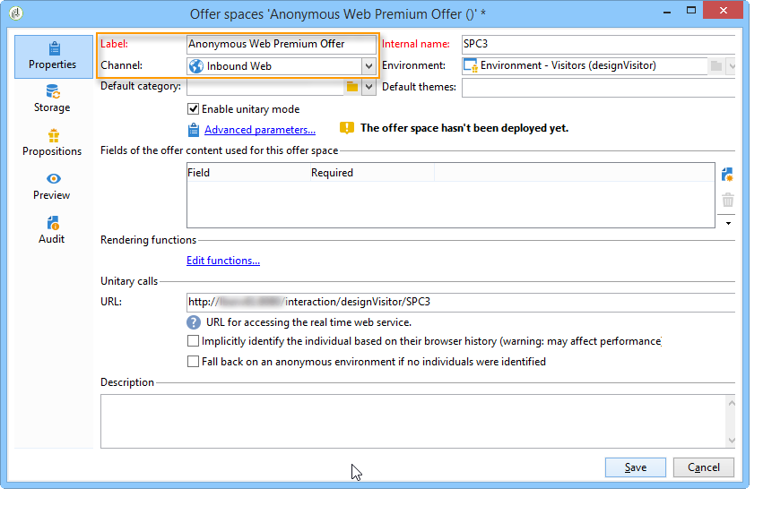
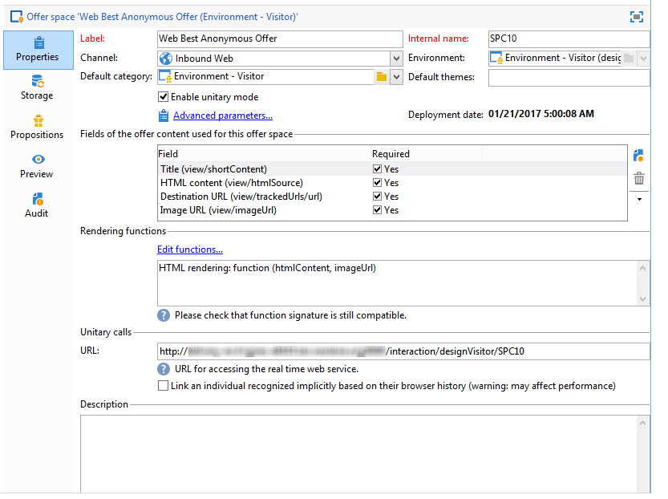
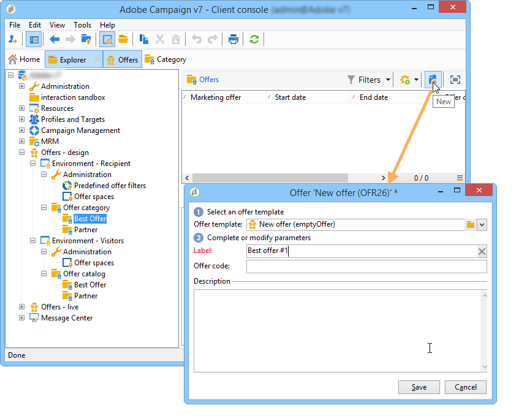

# Offerte su un canale in entrata{#offers-on-an-inbound-channel}


## Presentazione di un’offerta a un visitatore anonimo {#presenting-an-offer-to-an-anonymous-visitor}

Il sito di Neobank vuole presentare sul proprio sito web un’offerta rivolta a visitatori non identificati che navigano nella pagina.

Per impostare questa interazione:

1. [Creare un ambiente anonimo](#creating-an-anonymous-environment)
1. [Creare spazi di offerta anonimi](#creating-anonymous-offer-spaces)
1. [Creare una categoria di offerta e un tema](#creating-an-offer-category-and-a-theme)
1. [Creare offerte anonime.](#creating-anonymous-offers)
1. [Configurare gli spazi dell’offerta web sul sito web](#configure-the-web-offer-space-on-the-website)

### Creazione di un ambiente anonimo {#creating-an-anonymous-environment}

Segui la procedura descritta in [Creazione di un ambiente di offerta](../../interaction/using/live-design-environments.md#creating-an-offer-environment) per creare un ambiente anonimo basato su **Visitor**&#39; dimensioni.

Otterrai una struttura ad albero contenente il nuovo ambiente:


### Creazione di spazi di offerta anonimi {#creating-anonymous-offer-spaces}

1. Nell’ambiente anonimo (**Visitor**) passare al **[!UICONTROL Administration]** > **[!UICONTROL Spaces]** nodo.
1. Clic **[!UICONTROL New]** per creare canali di chiamata.

   

   >[!NOTE]
   >
   >Lo spazio viene collegato automaticamente all’ambiente anonimo.

1. Modifica l’etichetta e seleziona la **[!UICONTROL Inbound Web]** canale. È inoltre necessario controllare il **[!UICONTROL Enable unitary mode]** casella.

   

1. Seleziona i campi di contenuto dell’offerta utilizzati per lo spazio e specificali come richiesto selezionando la casella pertinente.

   In questo modo, eventuali offerte a cui manca uno dei seguenti elementi non saranno idonee per questo spazio:

   * Titolo
   * Contenuto HTML
   * URL immagine
   * URL di destinazione

   

1. Modifica la funzione di rendering HTML, ad esempio come segue:

   ```
   function (imageUrl, targetUrl, shortContent, htmlSource){
         var html = "<p><b>" + shortContent + "</b></p>";
         html += "<p>" + htmlSource + "</p>";
         html += "<a _urlType='11' href='" + targetUrl + "'></a>";
         return html;
       }   
   ```

   >[!IMPORTANT]
   >
   >La funzione di rendering deve denominare i campi utilizzati per lo spazio nell’ordine in cui erano stati precedentemente selezionati in modo che le offerte vengano visualizzate correttamente.

   

1. Salva lo spazio dell’offerta.

### Creazione di una categoria di offerta e di un tema {#creating-an-offer-category-and-a-theme}

1. Vai a **[!UICONTROL Offer catalog]** nell’ambiente appena creato.
1. Fare clic con il pulsante destro del mouse **[!UICONTROL Offer catalog]** e seleziona **[!UICONTROL Create a new 'Offer category' folder]**.

   Denomina la nuova categoria, **Prodotti finanziari** ad esempio.

1. Passa a **[!UICONTROL Eligibility]** e immetti **finanziamento** come tema, quindi salva le modifiche.

   

### Creazione di offerte anonime {#creating-anonymous-offers}

1. Passa alla categoria appena creata.
1. Fai clic su **[!UICONTROL New]**.

   

1. Seleziona il modello di offerta anonimo predefinito o un modello creato in precedenza.

   

1. Modifica l’etichetta e salva l’offerta.

   

1. Vai a **[!UICONTROL Eligibility]** e specificare il peso delle offerte in base ai relativi contesti applicativi.

   In questo esempio, l’offerta è configurata per essere visualizzata nella home page del sito come priorità fino alla fine dell’anno.

   

1. Vai a **[!UICONTROL Content]** e definiscono il contenuto dell’offerta.

   >[!NOTE]
   >
   >Puoi selezionare **[!UICONTROL Content definitions]** per visualizzare l&#39;elenco degli elementi necessari per lo spazio web.

   

1. Crea una seconda offerta.

   

1. Vai a **[!UICONTROL Eligibility]** e applica lo stesso peso della prima offerta.
1. Esegui il ciclo di approvazione per ogni offerta per renderla disponibile nell’ambiente online, insieme ai relativi spazi dell’offerta approvati.

### Configurare lo spazio dell’offerta web sul sito web {#configure-the-web-offer-space-on-the-website}

Per rendere visibili sul sito web le offerte appena configurate, inserisci un codice JavaScript nella pagina HTML del sito per richiamare il motore di interazione (per ulteriori informazioni, consulta [Informazioni sui canali in entrata](../../interaction/using/about-inbound-channels.md)).

1. Vai alla pagina HTML e inserisci un attributo @id con un valore corrispondente al nome interno dello spazio dell’offerta anonimo creato in precedenza (fai riferimento a [Creazione di spazi di offerta anonimi](#creating-anonymous-offer-spaces)), preceduto da **i_**.

   

1. Inserisci l’URL della chiamata.

   

   Le caselle URL blu sopra corrispondono al nome dell’istanza, al nome interno dell’ambiente (fai riferimento a [Creazione di un ambiente anonimo](#creating-an-anonymous-environment)) e il tema collegato alla categoria ([Creazione di una categoria di offerta e di un tema](#creating-an-offer-category-and-a-theme)). Quest&#39;ultimo è facoltativo.

Quando un visitatore accede alla home page del sito web, le offerte con **finanziamento** Il tema viene visualizzato come configurato nella pagina HTML.


Un utente che visita la pagina più volte visualizzerà una o più offerte della categoria, poiché a entrambe è stato assegnato lo stesso peso.

## Passaggio a un ambiente anonimo in caso di contatti non identificati {#switching-to-an-anonymous-environment-in-case-of-unidentified-contacts}

La società Neobank desidera creare offerte di marketing per due diversi target. Vuole mostrare offerte generiche per i suoi browser anonimi del sito web. Se uno di questi utenti risulta essere un cliente con gli identificatori forniti da Neobank, l’azienda desidera che ricevano offerte personalizzate non appena effettuano l’accesso.

Questo caso di studio si basa sullo scenario seguente:

1. Un visitatore naviga nel sito web di Neobank senza effettuare l’accesso.

   

   Sulla pagina vengono visualizzate tre offerte anonime: due **Proposta d&#39;acquisto** offerte per i prodotti Neobank e un’offerta da un partner Neobank.

   

1. L’utente, un cliente di Neobank, accede con le proprie credenziali.

   

   Vengono visualizzate tre offerte personalizzate.

   

Per implementare questo caso di studio, devi disporre di due ambienti di offerta: uno per le interazioni anonime e uno con le offerte configurate in modo specifico per i contatti identificati. L’ambiente dell’offerta identificato verrà configurato per passare automaticamente all’ambiente dell’offerta anonimo se il contatto non è connesso e quindi non è identificato.

Applica i seguenti passaggi:

* Crea un catalogo di offerte specifiche per le interazioni in entrata anonime seguendo i passaggi seguenti:

   1. [Creazione di un ambiente per i contatti anonimi](#creating-an-environment-for-anonymous-contacts)
   1. [Configurazione degli spazi di offerta per l’ambiente anonimo](#configuring-offer-spaces-for-the-anonymous-environment)
   1. [Creazione di categorie di offerta in un ambiente anonimo](#creating-offer-categories-in-an-anonymous-environment)
   1. [Creazione di offerte per visitatori anonimi](#creating-offers-for-anonymous-visitors)

* Crea un catalogo di offerte specifiche per le interazioni in entrata identificate seguendo la procedura riportata di seguito.

   1. [Configurare gli spazi dell’offerta nell’ambiente identificato](#configure-the-offer-spaces-in-the-identified-environment)
   1. [Creazione di categorie di offerta in un ambiente identificato](#creating-offer-categories-in-an-identified-environment)
   1. [Creazione di offerte personalizzate](#creating-personalized-offers)

* Configura la chiamata al motore di offerta:

   1. [Configurazione degli spazi dell’offerta sulla pagina web](#configuring-offer-spaces-on-the-web-page)
   1. [Specifica delle impostazioni avanzate degli spazi dell’offerta identificati](#specifying-the-advanced-settings-of-the-identified-offer-spaces)

### Creazione di un ambiente per i contatti anonimi {#creating-an-environment-for-anonymous-contacts}

1. Creare un ambiente di offerta per le interazioni in entrata anonime tramite la procedura guidata di mappatura della consegna (**Visitatore** mapping). Per ulteriori informazioni, consulta [Creazione di un ambiente di offerta](../../interaction/using/live-design-environments.md#creating-an-offer-environment).

   

### Configurazione degli spazi di offerta per l’ambiente anonimo {#configuring-offer-spaces-for-the-anonymous-environment}

Le offerte che devono essere presentate sul sito web appartengono a due diverse categorie: **Proposta d&#39;acquisto** e **Partner**. In questo esempio, creeremo uno spazio di offerta specifico per ogni categoria.

Per creare lo spazio dell’offerta in modo che corrisponda al **Proposta d&#39;acquisto** categoria, applica il seguente processo:

1. Nella struttura Adobe Campaign, vai all’ambiente anonimo appena creato e aggiungi uno spazio di offerta.

   

1. Crea un nuovo **[!UICONTROL Inbound web]** digitare spazio.

   

1. Immetti un’etichetta per esso: **Migliore offerta anonima per il Web** ad esempio.
1. Aggiungi i campi di contenuto dell’offerta utilizzati per questo spazio dell’offerta e configura le funzioni di rendering.

   

   >[!IMPORTANT]
   >
   >La funzione di rendering deve denominare i campi utilizzati per lo spazio nell’ordine in cui erano stati precedentemente selezionati in modo che le offerte vengano visualizzate correttamente.

1. Utilizza lo stesso processo per creare uno spazio dell’offerta in entrata per il canale web, in modo che corrisponda al **Partner** categoria.

   

### Creazione di categorie di offerta in un ambiente anonimo {#creating-offer-categories-in-an-anonymous-environment}

Per iniziare, crea due categorie di offerta: **Proposta d&#39;acquisto** categoria e **Partner** categoria. Ogni categoria conterrà due offerte per i contatti anonimi.

1. Vai a **[!UICONTROL Offer catalog]** nell’ambiente anonimo appena creato.
1. Aggiungi un **[!UICONTROL Offer category]** cartella con **Proposta d&#39;acquisto** come etichetta.

   

1. Creare una seconda categoria con **Partner** come etichetta.

   

### Creazione di offerte per visitatori anonimi {#creating-offers-for-anonymous-visitors}

Ora creeremo due offerte in ciascuna delle categorie create in precedenza.

1. Vai a **Proposta d&#39;acquisto** e creare un’offerta anonima.

   

1. Vai a **[!UICONTROL Eligibility]** e specificare il peso delle offerte in base ai relativi contesti applicativi.

   

1. Vai a **[!UICONTROL Content]** e definiscono il contenuto dell’offerta.

   

1. Creare una seconda offerta in **Proposta d&#39;acquisto** categoria.

   

1. Vai a **Partner** e creare un’offerta anonima.
1. Vai a **[!UICONTROL Content]** e definiscono il contenuto dell’offerta.

   

1. Vai a **[!UICONTROL Eligibility]** e specificare il peso delle offerte in base ai relativi contesti applicativi.

   

1. Crea una seconda offerta per **Partner** categoria.

   

1. Vai a **[!UICONTROL Eligibility]** e applica lo stesso peso applicato alla prima offerta di questa categoria in modo che le offerte vengano visualizzate in successione sul sito web.

   

1. Esegui il ciclo di approvazione per ogni offerta per iniziare a renderla live. Durante l&#39;approvazione del contenuto, attiva **Partner** o **Proposta d&#39;acquisto** spazio dell’offerta, in base all’offerta.

### Configurare gli spazi dell’offerta nell’ambiente identificato {#configure-the-offer-spaces-in-the-identified-environment}

Le offerte che state per presentare sul sito sono prese da due diverse categorie: **Proposta d&#39;acquisto** e **Partner**. In questo esempio, vogliamo creare uno spazio specifico per ogni categoria.

Per creare i due spazi dell’offerta, applica la stessa procedura applicata agli spazi dell’offerta anonimi. Fai riferimento a [Configurazione degli spazi di offerta per l’ambiente anonimo](#configuring-offer-spaces-for-the-anonymous-environment).

1. Nella struttura Adobe Campaign, vai all’ambiente appena creato e aggiungi **Proposta d&#39;acquisto** e **Partner** spazi dell’offerta.
1. Applicare il processo descritto in [Configurazione degli spazi di offerta per l’ambiente anonimo](#configuring-offer-spaces-for-the-anonymous-environment).

   

1. Seleziona la **[!UICONTROL Fall back on an anonymous environment if no individuals were identified]** opzione.

   

1. Dall’elenco a discesa, seleziona lo spazio anonimo dell’offerta Web creato in precedenza (consulta [Configurazione degli spazi di offerta per l’ambiente anonimo](#configuring-offer-spaces-for-the-anonymous-environment)).

   

### Specifica delle impostazioni avanzate degli spazi dell’offerta identificati {#specifying-the-advanced-settings-of-the-identified-offer-spaces}

In questo esempio, l’identificazione dei contatti avviene tramite l’indirizzo e-mail nel database di Adobe Campaign. Per aggiungere l’e-mail del destinatario allo spazio, applica il seguente processo:

1. Nell’ambiente identificato, passa alla cartella dello spazio delle offerte.
1. Seleziona la **Proposta d&#39;acquisto** spazio dell’offerta e clic **[!UICONTROL Advanced parameters]**.

   

1. Nella scheda **[!UICONTROL Target identification]**, fai clic su **[!UICONTROL Add]**.

   

1. Clic **[!UICONTROL Edit expression]**, vai alla tabella dei destinatari e seleziona la **[!UICONTROL Email]** campo.

   

1. Clic **[!UICONTROL OK]** per chiudere **[!UICONTROL Advanced parameters]** e terminare la configurazione della **Proposta d&#39;acquisto** spazio dell’offerta.
1. Applica lo stesso processo per **Partner** spazio dell’offerta.

   

### Creazione di categorie di offerta in un ambiente identificato {#creating-offer-categories-in-an-identified-environment}

Verranno create due categorie separate: **Proposta d&#39;acquisto** categoria e **Partner** categoria, ciascuna con due offerte personalizzate.

1. Vai a **[!UICONTROL Offer catalogs]** nell&#39;ambiente identificato.
1. Come nell’ambiente anonimo, aggiungi due **[!UICONTROL Offer category]** cartelle con **Proposta d&#39;acquisto** e **Partner** come etichette.

   

### Creazione di offerte personalizzate {#creating-personalized-offers}

Vogliamo creare due offerte personalizzate per ogni categoria, ovvero quattro offerte.

1. Vai a **Proposta d&#39;acquisto** e creare una prima offerta personalizzata.

   

1. Vai a **[!UICONTROL Eligibility]** e specificare il peso delle offerte in base ai relativi contesti applicativi.

   

1. Vai a **[!UICONTROL Content]** e definiscono il contenuto dell’offerta.

   

1. Creare una seconda offerta in **Proposta d&#39;acquisto** categoria.

   

1. Vai a **Partner** e creare un’offerta personalizzata.

   

1. Vai a **[!UICONTROL Eligibility]** e specificare il peso delle offerte in base ai relativi contesti applicativi.

   

1. Crea una seconda offerta per **Partner** categoria.

   

1. Vai a **[!UICONTROL Eligibility]** e applica lo stesso peso applicato alla prima offerta di questa categoria in modo che le offerte vengano visualizzate in successione sul sito web.
1. Esegui il ciclo di approvazione per ogni offerta per iniziare ad aggiornarla. Durante l&#39;approvazione del contenuto, attiva **Partner** o **Proposta d&#39;acquisto** spazi dell’offerta.

### Configurazione degli spazi dell’offerta sulla pagina web {#configuring-offer-spaces-on-the-web-page}

Il sito della società Neobank dispone di tre spazi per le offerte: due per le offerte relative alle banche provenienti dalla **Proposta d&#39;acquisto** e uno per le offerte della **Partner** categoria.


Per configurare questi spazi di offerta sulla pagina HTML del sito web, procedi come segue:

1. Nel contenuto della pagina HTML, inserisci tre

   elementi con un attributo @id il cui valore ci consentirà di richiamare le offerte nei vari spazi di offerta del sito web.

   

1. Quindi inserisci lo script per la definizione dei valori degli attributi.

   

   In questo esempio, **ContBO1** e **ContBO2** ricevere il valore **OsWebBestOfferIdentified**, ovvero il nome interno del **Proposta d&#39;acquisto** spazio dell’offerta creato in precedenza nell’ambiente identificato. Il **CatBestOffer** e **CatBestOfferAnonym** i valori corrispondono al nome interno del **Proposta d&#39;acquisto** categorie per ambienti anonimi e identificati.

   

   Analogamente, **PtnCont** riceve il **OSWebPartnerIdentified** , che corrisponde al nome interno del **Partner** spazio dell’offerta creato nell’ambiente identificato. **CatPartner** e **CatPartnerAnonym** corrisponde al nome interno del **Partner** categorie per ambienti anonimi e identificati.

   

1. Assegna le informazioni che ti consentiranno di identificare la persona che accede al sito Neobank a **interfaceTarget** variabile.

   

   L’identificazione della persona può essere basata su un cookie del browser, un parametro di lettura nell’URL, nell’e-mail o nell’identificatore della persona. Se viene utilizzato un campo della tabella dei destinatari diverso dalla chiave primaria, questo deve essere definito nei parametri avanzati dello spazio (fare riferimento a [Specifica delle impostazioni avanzate degli spazi dell’offerta identificati](#specifying-the-advanced-settings-of-the-identified-offer-spaces)).

1. Inserisci l’URL della chiamata.

   

   L’URL contiene **EnvNeobankRecip**, il nome interno dell’ambiente identificato.

Quando apri la pagina web, lo script ti consente di richiamare il motore di interazione per visualizzare il contenuto delle offerte negli spazi pertinenti della pagina web. In una singola chiamata al server Adobe Campaign, il motore determina l’ambiente, lo spazio dell’offerta e le categorie da selezionare.

In questo esempio, il motore riconosce l’ambiente identificato (**EnvNeobankIdnRecip**). Identifica lo spazio dell’offerta (**OSWebBestOfferIdentified**) e **Proposta d&#39;acquisto** categoria (**CatBestOffer**) per il primo e il secondo spazio dell’offerta sulla pagina web, nonché (**OSWebPartnerIdentified** a) spazio dell&#39;offerta e **Partner** categoria (**CatPartner**) per il terzo spazio di offerta sul sito.

Se il motore non è in grado di identificare il destinatario, passa agli spazi di offerta anonimi a cui si fa riferimento negli spazi di offerta identificati e verso le categorie anonime (**CatPartner** e **CatPartnerAnonym**) come specificato nello script.
