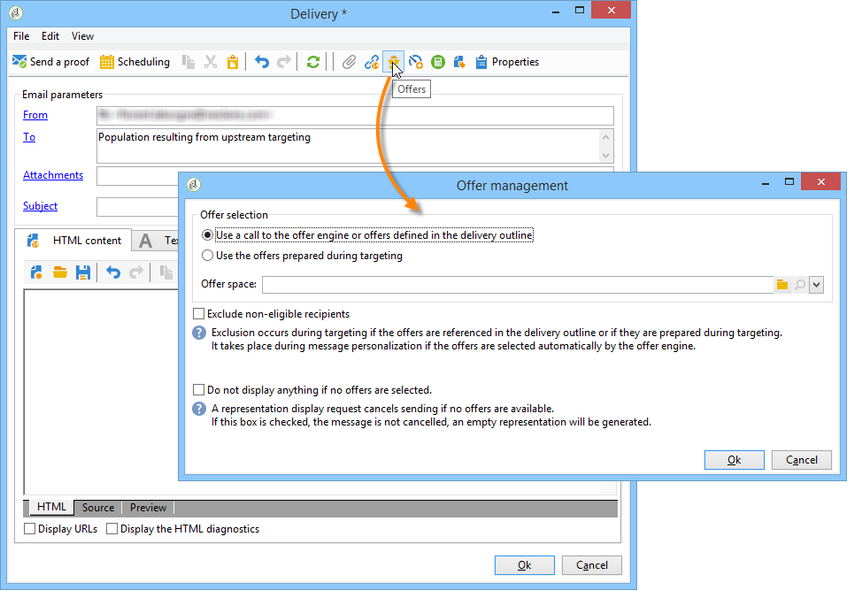

# Offerte su un canale in uscita{#offers-on-an-outbound-channel}

## Invio offerta e-mail {#email-offer-delivery}

Nel nostro database c&#39;è una categoria di offerte di viaggio per l&#39;Africa. L&#39;idoneità, i contesti e le rappresentazioni di ciascuna offerta sono stati configurati. Ora vogliamo creare una campagna per presentare le nostre offerte via e-mail.

1. Crea una campagna di marketing e un flusso di lavoro di targeting.

   

1. Modificate la consegna e fate clic sull&#39;icona **[!UICONTROL Offers]**.

   

1. Scegliete lo spazio e-mail per l’ambiente delle offerte che corrisponde alle festività.

   

1. Scegliete la categoria che contiene le offerte di viaggio africane.

   

1. Impostate il numero di offerte nella consegna su due.

   

1. Chiudete la finestra di gestione delle offerte e create il contenuto della distribuzione.

   

1. Usate i menu per inserire una prima proposta di offerta e scegliete la funzione di rendering HTML.

   

1. Inserite la seconda proposta di offerta.

   

1. Fate clic su **[!UICONTROL Preview]** per visualizzare l&#39;anteprima delle offerte, quindi selezionate un destinatario per visualizzare l&#39;anteprima delle offerte così come verranno ricevute.

   

1. Salvate la consegna e avviate il flusso di lavoro di targeting.
1. Aprite la consegna e fate clic sulla scheda **[!UICONTROL Audit]** della consegna: potete vedere che il motore delle offerte ha selezionato le proposte da creare dalle varie offerte del catalogo.

   

## Eseguire una simulazione di offerta {#perform-an-offer-simulation}

1. Nell&#39;universo **[!UICONTROL Profiles and Targets]** fare clic sul collegamento **[!UICONTROL Simulations]**, quindi fare clic sul pulsante **[!UICONTROL Create]**.

   

1. Scegliete un&#39;etichetta e specificate le impostazioni di esecuzione, se necessario.

   

1. Salvate la simulazione. Viene quindi aperta in una nuova scheda.

   

1. Fare clic sulla scheda **[!UICONTROL Edit]**, quindi **[!UICONTROL Scope]**.

   

1. Scegliete la categoria per la quale desiderate simulare le offerte.

   

1. Scegliete lo spazio dell’offerta da usare per la simulazione.

   

1. Immettere le date di validità. È necessario immettere almeno una data di inizio. Questo consente al filtro del motore delle offerte di scegliere le offerte valide in una data specificata.
1. Se necessario, specificate uno o più temi per limitare il numero di offerte a quelli che contengono questa parola chiave nelle relative impostazioni.

   Nel nostro esempio, la categoria **Travel** contiene due sottocategorie con due temi separati. Vogliamo eseguire una simulazione per le offerte con il tema **Customers>1 year**.

   

1. Scegliete i destinatari da destinare.

   

1. Configura il numero di offerte da inviare a ogni destinatario.

   Nel nostro esempio, il motore delle offerte sceglierà le 3 offerte con il peso più alto per ciascun destinatario.

   

1. Salvate le impostazioni, quindi fate clic su **[!UICONTROL Start]** nella scheda **[!UICONTROL Dashboard]** per eseguire la simulazione.

   

1. Una volta terminata la simulazione, consultate la sezione **[!UICONTROL Results]** per una descrizione dettagliata delle proposte per offerta.

   Nel nostro esempio, il motore delle offerte ha basato la suddivisione dell&#39;offerta su 3 proposte.

   

1. Visualizza la **[!UICONTROL Breakdown of offers by rank]** per visualizzare l&#39;elenco delle offerte selezionate dal motore delle offerte.

   

1. Se necessario, puoi modificare le impostazioni dell&#39;ambito ed eseguire di nuovo la simulazione facendo clic su **[!UICONTROL Start simulation]**.

   

1. Per salvare i dati di simulazione, usa la cronologia o le funzioni di esportazione disponibili nel rapporto.

   

